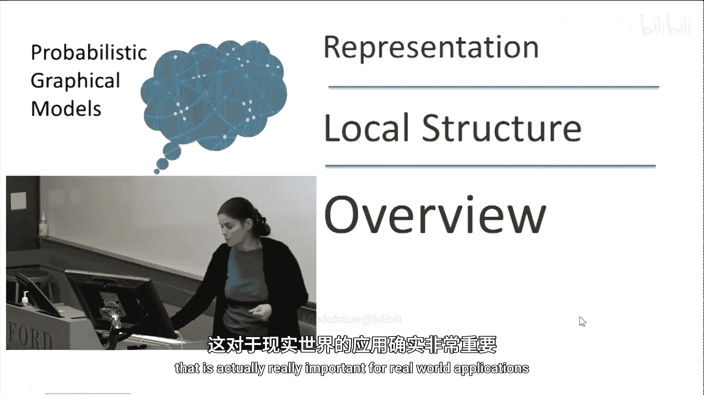
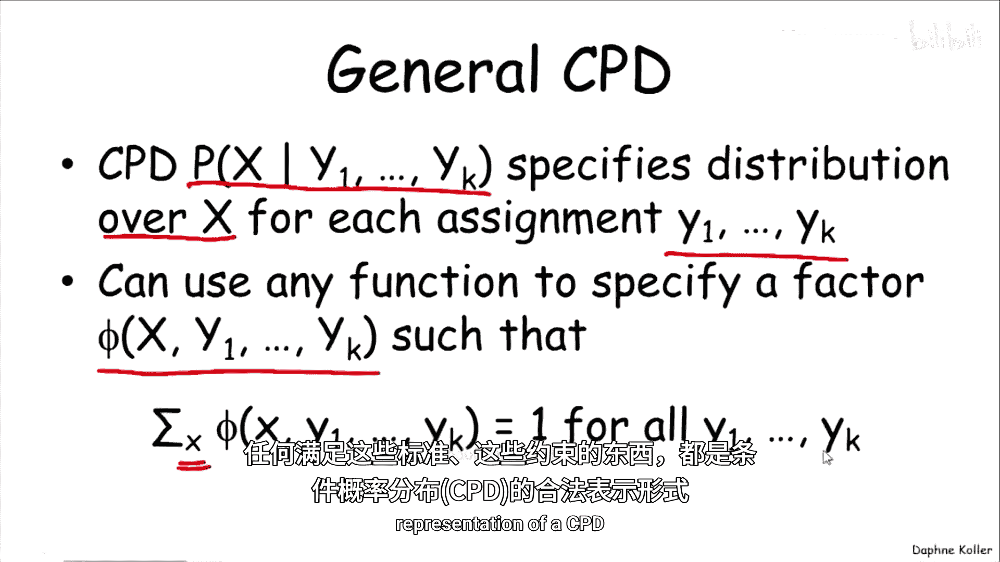
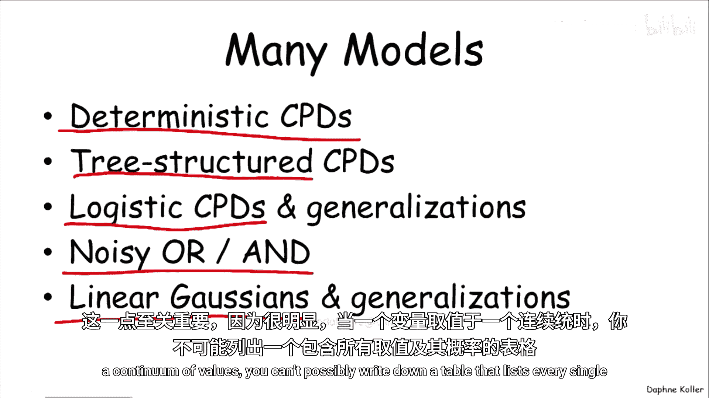
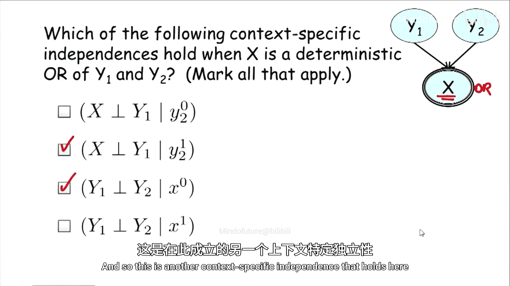
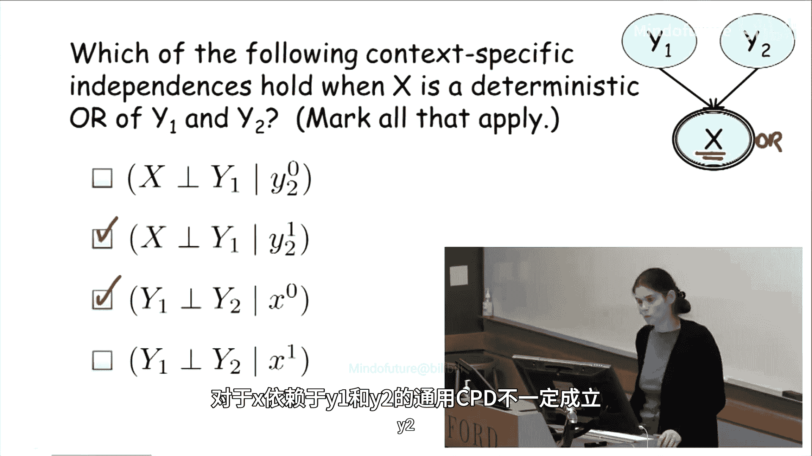

# 概率图模型：1.4：结构化条件概率分布概述 🧩

在本节课中，我们将要学习条件概率分布（CPD）的表示方法。之前我们主要关注了概率分布的全局结构，即如何将其分解为对应变量子集的因子乘积。然而，在实际应用中，我们还需要编码其他类型的结构，这对于现实世界的建模至关重要。

## 表格表示的局限性

上一节我们介绍了概率分布的因子分解，本节中我们来看看条件概率分布的具体表示方法。到目前为止，我们使用的例子都普遍采用了表格表示法。

表格表示法为父变量的每一种赋值组合都设置了一行，明确列出了对应子变量概率的所有条目。例如，对于一个变量 **G** 及其父变量 **I** 和 **D**，其 CPD 表格如下：

这种表示法清晰易懂。但当我们考虑更现实的例子时，问题就出现了。例如，在一个医疗应用中，一个表示“咳嗽”的变量可能有许多父变量，如肺炎、流感、肺结核、支气管炎或普通感冒等。当列举完所有可能导致咳嗽的因素后，这类变量通常可能有 10 到 20 个父变量。

如果我们有 **K** 个父变量，并且为简化起见假设它们都是二元的，那么 CPD 中的条目数量将随着 **2^K** 增长（具体取决于子变量取值的数量）。不幸的是，这种情况非常普遍，这意味着表格表示法对于许多实际应用来说并不适用。因此，我们必须思考超越表格的方法。

## 超越表格：CPD 的广义定义

幸运的是，贝叶斯网络的定义并未强制要求我们必须使用完全指定的表格作为条件概率分布的唯一表示。我们唯一需要的是，CPD **P(X | Y1, ..., Yk)** 必须能为 **Y1, ..., Yk** 的每一种赋值指定一个关于 **X** 的概率分布。

这个分布可以完全隐式地定义。例如，它可以是一段查看 **Y1** 到 **Yk** 的值并输出 **X** 分布的小代码。更正式地说，任何满足以下条件的函数（无论是参数化函数还是代码例程）都可以作为 CPD 的合法表示：
*   它是一个定义在作用域 **{X, Y1, ..., Yk}** 上的因子。
*   对于给定的 **Y1, ..., Yk** 的赋值，它对 **X** 的所有取值求和必须等于 1。

用公式表示，即对于所有 **y1, ..., yk**，需满足：
**∑_x P(x | y1, ..., yk) = 1**

## 结构化 CPD 的常见类型

幸运的是，我们通常不必诉诸于编写代码来指定 CPD。统计学框架已经为我们定义了多种在给定一组条件变量下表示条件概率分布的方法。

以下是几种常见的结构化 CPD 类型：
*   **确定性 CPD**：其中 **X** 是 **Y1, ..., Yk** 的确定性函数。我们之前已经见过几个例子。
*   **树形结构 CPD**：例如决策树或回归树框架，根据父变量的值通过一系列判断来决定子变量的分布。
*   **逻辑函数/对数线性模型**：例如使用逻辑斯蒂函数来建模概率。
*   **噪声函数**：例如“噪声或”、“噪声与”，它们是确定性函数的噪声版本。
*   **连续变量的 CPD**：对于连续变量及其连续或离散的父变量，我们有专门的框架（如线性高斯模型）来表示其概率分布，因为显然无法为连续变量的每一个可能值列一张表。

## 上下文特定独立性

与 CPD 内部结构紧密相关的一个有用概念是**上下文特定独立性**。这种独立性出现在我们将要讨论的一些 CPD 表示中。

上下文特定独立性指的是一种独立性，其中变量集 **X** 和 **Y** 在给定另一组变量 **Z** 和某个特定赋值 **c**（即上下文）的条件下是独立的。这与之前的标准条件独立性不同，标准独立性要求对条件变量 **Z** 的所有赋值都成立，而上下文特定独立性只对 **Z** 的特定取值 **c** 成立。

其定义形式与标准条件独立性类似，只是现在条件栏的右侧同时包含了变量集 **Z** 和具体的上下文赋值 **c**：
**(X ⊥ Y | Z, c)**

## 示例：确定性“或”门中的上下文特定独立性

让我们通过一个例子来看看，当 CPD 具有特定内部结构时，上下文特定独立性是如何产生的。

考虑一个案例，其中 **X** 是 **Y1** 和 **Y2** 的确定性“或”函数。即 **X = Y1 OR Y2**。

我们来分析以下几种陈述是否成立：

1.  **(Y1 ⊥ Y2 | X, Y2=False)**
    *   当 **Y2=False** 时，**X** 的值就等同于 **Y1** 的值。在这种情况下，**Y1** 显然依赖于 **X**（已知），因此它们不是独立的。此陈述**不成立**。

2.  **(Y1 ⊥ Y2 | X, Y2=True)**
    *   当 **Y2=True** 时，无论 **Y1** 取何值，**X** 都一定为 True。因此，在这个特定的上下文（**Y2=True**）下，已知 **X** 时，**Y1** 和 **Y2** 是独立的。这是一个**上下文特定独立性**。

3.  **(Y1 ⊥ Y2 | X, X=False)**
    *   当 **X=False** 时，根据“或”门的定义，**Y1** 和 **Y2** 必须同时为 False。如果你告诉我其中一个为 False，我已经能推断出另一个也为 False。因此，在这个上下文（**X=False**）下，它们是独立的。这是另一个**上下文特定独立性**。

4.  **(Y1 ⊥ Y2 | X, X=True)**
    *   当 **X=True** 时，我无法确定是 **Y1** 还是 **Y2**（或两者）使其为 True。因此，这个陈述**不成立**。

后两个例子说明，在确定性 CPD 的特定上下文（**X=False**）中成立的独立性，在另一个上下文（**X=True**）中可能就不成立。这些上下文特定独立性在通用的、非结构化的 CPD 中不一定成立。

## 总结

本节课中我们一起学习了条件概率分布的结构化表示。我们首先认识到，对于具有大量父变量的现实问题，传统的表格表示法会变得不可行。接着，我们探讨了贝叶斯网络中 CPD 的广义定义，它允许使用任何能为每种父变量赋值提供有效子变量分布的函数。然后，我们介绍了几种常见的结构化 CPD 类型，如确定性函数、树形模型和逻辑模型等。最后，我们引入了**上下文特定独立性**的概念，并通过确定性“或”门的例子展示了 CPD 的内部结构如何能够在特定条件下（上下文）产生额外的独立性关系，这些关系在通用的概率分布中是不存在的。理解这些结构化表示和上下文特定独立性，对于构建高效、紧凑且易于推断的概率图模型至关重要。