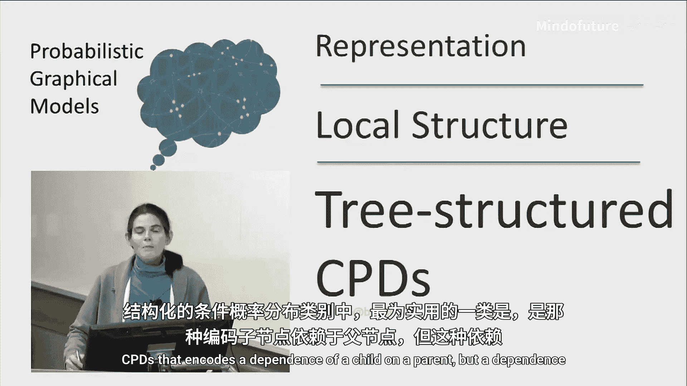
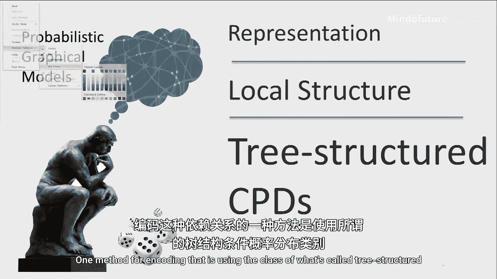
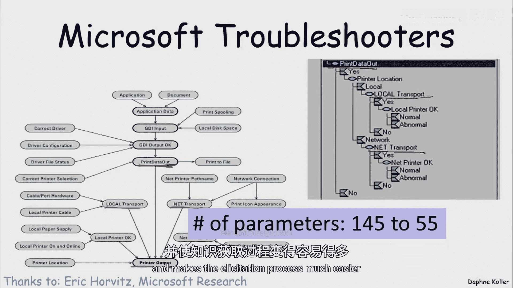

# 025：树结构条件概率分布

在本节中，我们将探讨一种重要的结构化条件概率分布——树结构条件概率分布。我们将了解它如何通过捕捉上下文特定的依赖关系，来避免表格CPD参数数量随父节点数指数级增长的问题。

## 概述

表格CPD因其参数数量随父节点数呈指数级增长而存在缺陷。树结构CPD是一种非常有用的结构化CPD类别，它编码了子节点对父节点的依赖关系，但这种依赖仅在特定上下文中发生。

## 树结构CPD示例：学生求职

为了理解树结构CPD，让我们看一个简单的例子。假设我们有一个学生正在申请工作，学生获得工作的前景取决于三个变量：他们从教员那里获得的推荐信质量、他们的SAT分数以及学生是否首先选择申请这份工作。

以下是一个可能的CPD模型。我们可以将其视为一个分支过程，其中“工作”的分布会查看某些变量，然后决定分布可能是什么样子。

首先，依赖关系取决于学生是否申请工作。如果学生不申请工作，情况如何？在硅谷鼎盛时期，例如互联网泡沫时期，学生即使不申请也可能获得工作机会。因此，在这种情况下，学生获得工作的概率可能非零。请注意，学生没有申请工作，也就没有提交推荐信或SAT成绩，这意味着在这种情况下，学生的工作前景不依赖于这两个变量。因此，在S和L变量的所有可能配置下，学生获得工作的概率都是0.2。

如果学生确实申请了工作呢？我们可以想象，招聘人员主要关注学生的SAT成绩，他们不太相信推荐信。因此，招聘人员首先查看学生的SAT分数。如果学生SAT成绩好，那么无论推荐信如何，招聘人员甚至不会去看，学生获得工作的概率为0.9。只有在学生SAT成绩不强的情况下，招聘人员才会回头查看推荐信，此时如果推荐信强，获得工作的概率为60%；如果推荐信弱，则为10%。

我们可以看到，这个CPD依赖于三个二元变量。原则上，我们需要表示J变量上的八种不同概率分布，但我们只表示了四种，因为在某些上下文中，某些变量无关紧要。

## 上下文特定独立性

变量无关紧要的概念与之前定义的上下文特定独立性概念相关。事实上，我们可以将其形式化为上下文特定独立性。

让我们看看这棵树，思考在这个树结构CPD中出现了哪些上下文特定独立性。

以下是几个需要判断的独立性陈述：
*   J在上下文 `A=1, S=1` 下是否独立于L？我们可以看到，在此上下文中，招聘人员从不看推荐信，因此J确实独立于L。答案为“是”。
*   J在仅给定 `A=1` 时是否独立于L？在这种情况下，我们有两种情景：`S=S1` 和 `S=S0`。在 `S=S0` 的情况下，招聘人员会看推荐信，因此这个陈述不成立。
*   J在给定 `A=0` 时是否独立于L和S？查看 `A=0` 的情况，确实不依赖于L或S。因此这个陈述成立。
*   J在上下文 `S=1` 下是否独立于L？这需要针对变量A的两个值进行案例分析。这归结为两个独立的陈述：`J` 独立于 `L` 给定 `S=1, A=1`（成立）和 `J` 独立于 `L` 给定 `S=1, A=0`（是 `A=0` 情况的特例，也成立）。由于两种情况都成立，因此这个陈述也成立。

## 多路复用器CPD示例

让我们看另一个例子，它代表了此类上下文中的一大类例子。这里，学生在申请工作时需要提交推荐信，但可以在两封信中选择一封提交：来自课程一的信或来自课程二的信。学生的工作前景取决于实际提交的那封信的质量，因为招聘人员无法访问未提交的信。

在树结构CPD的背景下，它看起来是这样的：顶部的第一个变量对应学生的选择，有两个分支C1和C2。在C1情况下，仅依赖于信1的质量；在C2情况下，仅依赖于信2的质量。这是一个与多路复用器CPD相关的例子，因为选择变量有效地决定了对一组情况或另一组情况的依赖。

这个例子有一些有趣的影响，因为不仅树结构导致了上下文特定独立性，它还暗示了非上下文特定的独立性，这在课程后面会很有用。

具体来说，我们有：`Letter1` 独立于 `Letter2` 给定 `J` 和 `C`。如果仅从图的有向分离结构（影响流动）的角度思考，工作实际上激活了信1和信2之间的结构，因此你不会期望信1和信2是条件独立的，因为存在因解释消除而产生的信息流。

但让我们更详细地思考一下。像之前一样进行案例分析。我们问：在给定 `J` 和 `C=C1` 的情况下，`Letter1` 是否独立于 `Letter2`？在上下文 `C=C1` 中，工作和信2之间不再有依赖关系，因为招聘人员从未获得第二封信。因此，在上下文 `C=C1` 中，图实际上看起来像这样，其中没有从L2到J的边。相反，看另一种情况 `C=C2`，在这种情况下，另一条边会消失，再次没有V型结构，因此变量L1和L2之间没有有效路径。因此，在这两种情况下，有效路径都消失了，这暗示了独立性假设。

## 多路复用器CPD的一般形式

如前所述，这个例子与更一般的模型类别——多路复用器CPD——有关。

在这种情况下，多路复用器CPD具有以下结构：我们有一组随机变量 `Z1` 到 `ZK`，它们都在某个特定空间中取值。变量 `Y` 是其中一个 `Z` 的副本。变量 `A` 是多路复用器或选择器变量。选择器变量在空间 `{1, ..., K}` 中取值，它选择 `Y` 复制哪个 `Zi`。请注意，这里的 `Y` 是确定性的。

那么，给定选择器 `A` 和父节点 `Z1` 到 `ZK`，变量 `Y` 的CPD是什么？我们可以这样考虑：我们需要指定概率分布 `P(Y | A, Z1, ..., ZK)`。这个概率分布是：如果 `Y` 等于 `Z_A`，则概率为1；否则为0。这意味着，如果 `A` 等于某个值 `a`，那么确定性地，`Y` 以概率1等于 `Z_a`。这只是 `A` 告诉我们 `Y` 需要复制哪个变量 `Z` 的一种形式化说法。

## 应用场景

这个概念在各种应用中都非常有用。

*   **感知不确定性**：例如，当我们有噪声传感器时，我们观察到多架飞机中某一架的位置，但我们不确定观察到的是哪架飞机。因此，观测值的位置代表了我们正在观测的飞机的位置，但这里的变量 `A` 告诉我们这是哪架飞机，我们对此也可能不确定。这产生了一系列被称为配准、对应或数据关联的问题，在许多应用中非常常见。
*   **物理硬件配置**：这是来自微软打印机故障诊断程序的一个实际例子。微软操作系统中的所有故障诊断程序都是基于贝叶斯网络技术构建的。这里的任务是找出打印机不打印的原因。我们有一个变量告诉我们打印机是否产生输出，这取决于多种因素，但它所依赖的因素之一是打印机输入的来源：是来自本地传输还是网络传输。

根据来源的不同，可能发生不同的故障集。这里充当选择器变量角色的变量是“打印数据输出”，它是此处使用的树的根。根据打印位置是本地还是网络，你依赖于本地传输的属性或网络传输的属性。事实证明，即使在这个非常简单的网络中，使用树结构CPD也将参数数量从145个减少到大约55个，并使知识获取过程容易得多。

## 总结

在本节中，我们一起学习了树结构条件概率分布。树结构CPD为我们提供了一种紧凑的表示形式，有效地捕捉了上下文特定方式的依赖关系。正如我们所提到的，它在广泛的应用中都具有相关性，我们只给出了一些例子：硬件配置、医疗环境（根据你所处的情况，你可能依赖于一组或另一组诱发因素）、对智能体行为的依赖（例如学生决定是否申请工作或提交哪封信），以及感知模糊性（特定感知观测值取决于该观测来自哪个真实世界对象）。

