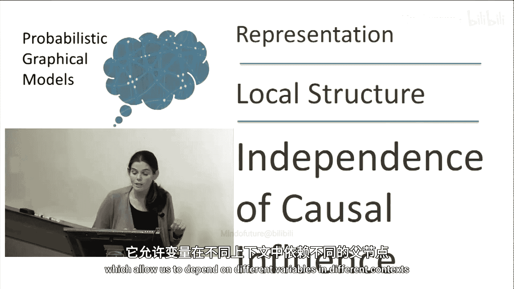
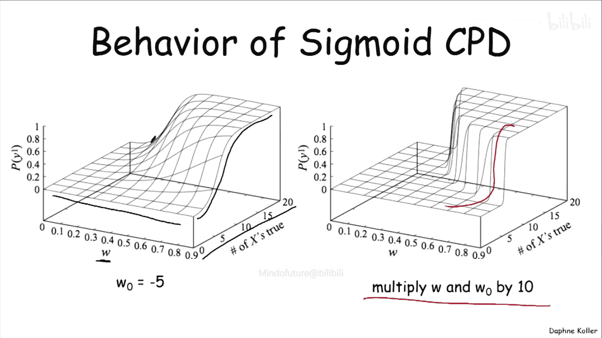

# 概率图模型：1.3：因果影响独立性

在本节中，我们将学习如何表示一个变量依赖于其多个父变量的复杂情况。我们将重点介绍两种重要的条件概率分布表示法：噪声或模型和Sigmoid模型。这些方法能够有效处理多个原因共同影响一个结果的情况，并大幅减少模型所需的参数数量。

## 从树状CPD到更复杂的依赖关系

上一节我们介绍了树状条件概率分布，它允许变量在不同的情境下依赖不同的父变量。然而，这种方法无法处理所有情况。

例如，考虑一个变量，如“咳嗽”，它可能同时依赖于多个不同的因素：肺炎、流感、肺结核、支气管炎等。这种情况不适合用树状CPD表示，因为“咳嗽”并非只在某些情境下依赖某个父变量，而在其他情境下不依赖。实际上，它同时依赖于所有这些因素，每个因素都以某种方式共同影响出现咳嗽的概率。

为了捕捉这种交互作用，我们需要引入新的模型。

## 噪声或模型

一种捕捉此类交互作用的模型称为“噪声或”条件概率分布。理解噪声或模型的最佳方式是将其视为一个更大的图模型。

在这个模型中，我们通过引入一系列中间变量来分解变量Y对其父变量X1到XK的依赖关系。以“咳嗽”变量和不同疾病为例，我们为每个疾病引入一个中间变量Zi，它捕获了“该疾病X_i（如果存在）本身会导致咳嗽”这一事件。

你可以将每个Zi视为一个“噪声发射器”：如果疾病X_i为真，那么Zi以一定的概率决定将Y变为真。最终，Y为真当且仅当至少有一个Zi为真。也就是说，Y是其父变量Z1到ZK的确定性“或”运算结果。

现在让我们更精确地定义它。给定父变量Xi，中间变量Zi为真的概率如下：
*   如果 `Xi = 0`，则 `P(Zi=1 | Xi=0) = 0`。因为Xi没有尝试去激活Zi。
*   如果 `Xi = 1`，则 `P(Zi=1 | Xi=1) = λ_i`。λ_i是一个在区间[0,1]内的参数，可以理解为Xi激活Y的“渗透力”或效率。

此外，模型中通常包含一个“泄漏”概率Z0，它表示Y在没有父变量激活的情况下自行变为真的概率，其参数为λ_0。

基于此，我们可以推导出Y的条件概率。Y为假的概率，即所有激活源都失败的概率，计算公式如下：
`P(Y=0 | X1...Xk) = (1 - λ_0) * ∏_{i: Xi=1} (1 - λ_i)`

相应地，Y为真的概率是其补集：
`P(Y=1 | X1...Xk) = 1 - P(Y=0 | X1...Xk)`

这就是噪声或CPD的公式。

## 因果影响独立性

噪声或模型可以推广到一个更广泛的概念：**因果影响独立性**。其核心假设是，一个变量有多个原因，每个原因都独立地影响该变量的真值，不同原因之间没有相互作用。它们各自拥有独立的机制，最终通过一个聚合函数（如“或”）汇总，决定Y的最终状态。

以下是符合此框架的其他模型示例：
*   **噪声与**：聚合函数是“与”运算。
*   **噪声最大**：适用于非二值情况，原因可能有不同的激活程度，Z取各个原因独立影响的最大值。

噪声或模型是其中最常用的，但其他模型也在特定场景下有所应用。

## Sigmoid CPD

一个初看可能不在此框架内，但实际上也属于因果影响独立性的模型是**Sigmoid条件概率分布**。

在Sigmoid CPD中，每个父变量Xi（假设是离散的）通过一个权重参数Wi施加一个连续的影响。Wi的大小表示Xi对促使Y为真施加的“力”：Wi为零表示无影响，Wi为正表示增加Y为真的可能性，Wi为负则表示降低其可能性。

所有这些影响，加上一个额外的偏置项W0，被汇总到一个连续变量Z中：
`Z = W0 + Σ_{i} (Wi * Xi)`

接下来，我们需要将这个介于负无穷到正无穷的连续值Z，转化为我们关心的变量Y的概率。这是通过一个**Sigmoid函数**实现的：

`σ(z) = e^z / (1 + e^z)`

由于e^z是正数，这个函数的值域总是在(0,1)之间。Sigmoid函数的形状像一个被压缩的“S”形曲线：当Z趋近负无穷时，概率趋近于0；当Z趋近正无穷时，概率趋近于1；在中间区域，概率平滑过渡。

因此，Y为真的最终概率为：
`P(Y=1 | X1...Xk) = σ(Z) = σ(W0 + Σ_{i} (Wi * Xi))`

## Sigmoid CPD的行为分析

让我们通过参数变化来理解Sigmoid CPD的行为。

假设所有父变量Xi共享相同的权重参数W。我们可以观察到：
*   **激活父变量数量的影响**：激活（为真）的父变量越多，Y为真的概率越高，因为更多的正向影响在推动Y。
*   **权重W大小的影响**：对于较小的权重W，需要非常多的父变量为真才能使Y很可能为真。随着W增大，仅需较少的正向影响就能使Y为真。
*   **尺度缩放的影响**：如果将所有权重W和偏置W0同时放大（例如乘以10），会导致Z值迅速达到极端值，从而使概率从0到1的转变区域变得非常陡峭。

## 实际应用案例

这种模型在实际中有重要应用。例如，斯坦福医学院开发的用于内科疾病诊断的CPCS网络。

该网络包含约500个变量，每个变量平均有4个取值。如果使用原始的联合分布表示，将需要约4^500个参数，这是一个天文数字。即使使用基本的贝叶斯网络因子化表示，参数也高达约1.34亿个，仍然难以处理。

通过在本网络中使用**噪声最大**这类因果影响独立性CPD，他们将总参数量减少到了约8000个。这使得模型变得可处理，并允许专家进行参数估计。

## 总结

在本节课中，我们一起学习了如何表示变量对多个父变量的复杂依赖。
*   我们首先指出了树状CPD的局限性，并引入了**噪声或模型**，它通过引入中间变量和“或”聚合来模拟多个独立原因的影响。
*   我们将此概念推广到**因果影响独立性**的框架，涵盖了噪声与、噪声最大等变体。
*   我们深入探讨了**Sigmoid CPD**，它使用加权和与Sigmoid函数将多个连续影响转化为概率，这实质上也属于因果影响独立性的思想。
*   最后，我们通过CPCS诊断网络的实际案例，看到了应用这类结构化CPD如何将参数数量从天文数字降至可管理的范围，从而使得复杂概率图模型的构建和应用成为可能。