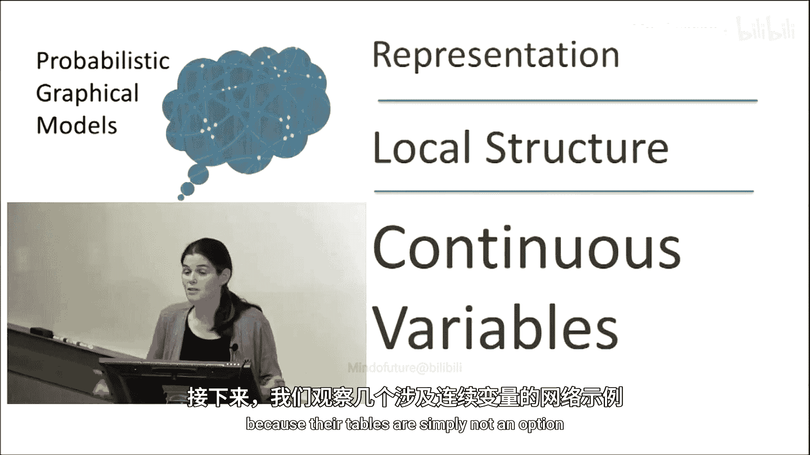
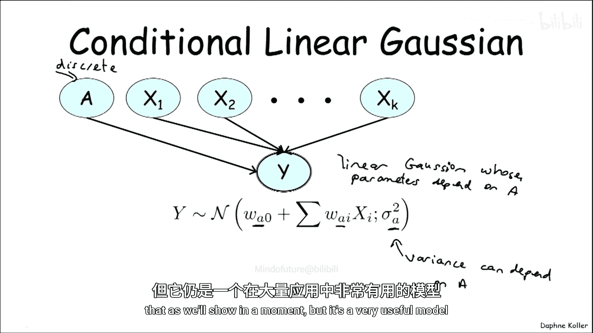
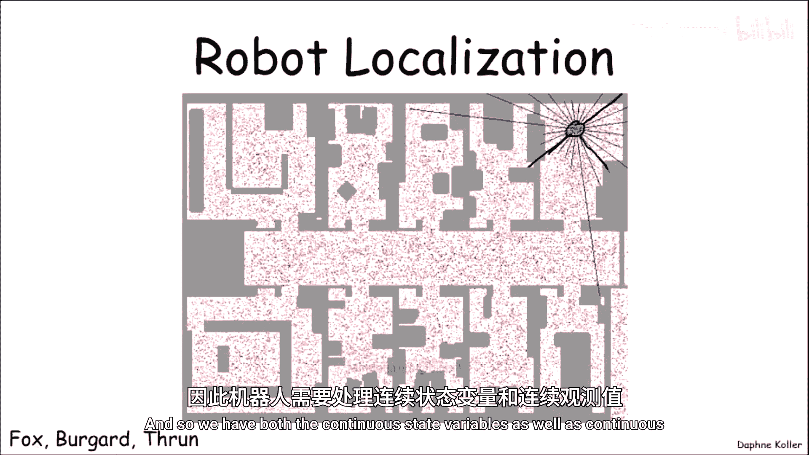
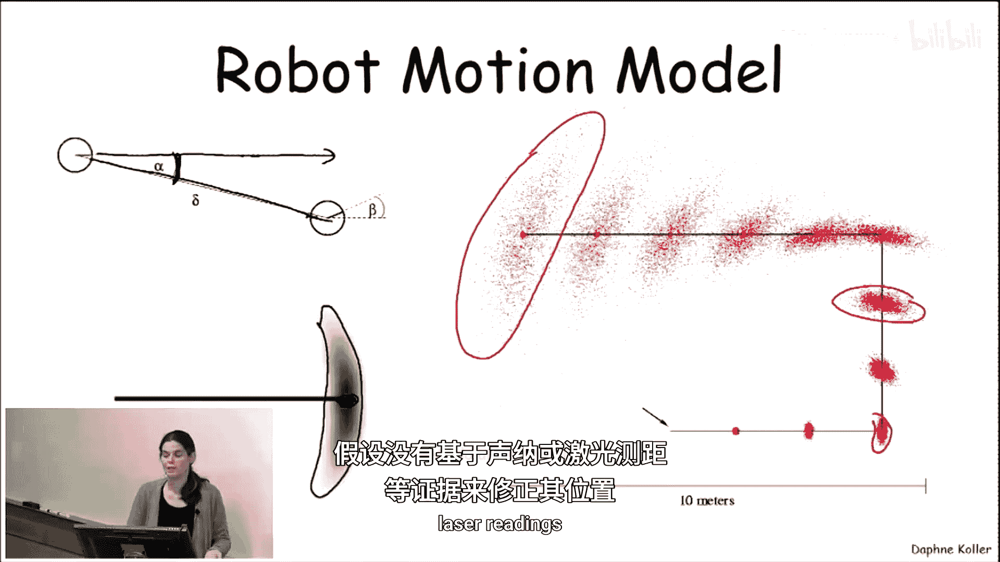

# 027：连续变量与局部结构表示法 🎯

在本节中，我们将探讨概率图模型中涉及连续变量的情况，并学习如何利用参数化形式来表示这些变量。我们将看到，对于连续变量，传统的条件概率表（CPT）不再适用，必须采用更紧凑的参数化模型。

上一节我们介绍了离散变量的表示方法，本节中我们来看看当变量是连续时，如何表示其概率分布。

## 连续变量网络的必要性

利用参数化形式等额外局部结构的概率分布（PPDs）在图模型的大背景下极具价值，因为它们允许我们提供更稀疏的表示。当网络涉及连续变量时，参数化形式不仅是高效的，而且是绝对必要的，因为条件概率表（CPT）在这种情况下根本不是一个可行的选项。

## 连续变量网络示例

让我们看一些涉及连续变量的网络示例，并了解我们可能希望在其中加入何种表示。

### 示例一：温度传感器模型

假设我们有一个连续的温度变量，例如房间的温度。我们还有一个传感器（温度计）来测量这个温度。温度计并不完美，因此我们预期传感器的读数接近真实温度，但并非完全准确。一种捕捉这种关系的方式是说传感器读数 **S** 服从一个正态分布。

具体来说，**S** 是一个以真实温度 **T** 为均值、标准差为 **σ_S** 的正态分布。这为每一个 **T** 的值定义了一个关于 **S** 的分布，其形式非常紧凑，仅需参数 **σ_S**。我们可以说 **S** 是围绕变量 **T** 值的高斯变量。

**公式表示：**
`S ~ N(T, σ_S²)`

### 示例二：带有扩散过程的温度模型

现在让情况变得更有趣一些。我们有两个变量：当前温度 **T** 和未来温度 **T‘**。未来温度 **T‘** 依赖于当前温度 **T** 以及室外温度 **O**，因为室内外温度会通过某种扩散过程达到平衡。

那么，我们如何为 **T‘** 建立关于其两个父节点（当前温度和室外温度）的模型呢？一种模型可能是某种扩散模型，它表示 **T‘** 的均值是其父节点的线性组合，并且由于过程中存在随机性和噪声，**T‘** 并非精确等于这个均值，而是围绕该均值的高斯分布。

**公式表示：**
`T‘ ~ N(α * T + β * O, σ_y²)`
其中，**σ_y** 是过程噪声的标准差，以区别于传感器方差 **σ_S**。

### 示例三：引入离散变量——门的状态

让情况变得更加复杂。假设房间里有一扇门，门可以是开着的或关着的，这是一个取两个值的离散变量 **D**。显然，扩散的程度将取决于门是否打开，我们预期在离散变量 **D** 的不同取值下，系统会有不同的参数。

因此，当我们现在写出模型时，未来温度 **T‘** 将是一个高斯分布，其参数 **α** 和 **σ** 依赖于门变量 **D** 的值。

**公式表示：**
如果 `D = 0`，则 `T‘ ~ N(α_0 * T + β_0 * O, σ_0²)`
如果 `D = 1`，则 `T‘ ~ N(α_1 * T + β_1 * O, σ_1²)`

## 模型定义与命名

以下是上述示例中引入的两种核心参数化模型。

### 线性高斯模型

我们之前看到的第一个模型（示例二）被称为**线性高斯模型**。它适用于一个连续子节点 **Y** 有多个连续父节点 **X₁, …, X_k** 的一般情况。

线性高斯模型具有以下形式：**Y** 是一个高斯分布（用 **N** 表示），其均值是父节点 **X_i** 的线性函数（因此得名“线性高斯”），并且其方差完全独立于父节点，是一个固定值。

**公式表示：**
`Y ~ N( w₀ + Σᵢ wᵢ * Xᵢ, σ² )`
其中，**wᵢ** 是权重参数，**σ²** 是固定方差。

### 条件线性高斯模型

第二个模型（示例三）被称为**条件线性高斯模型**。它在混合模型中引入了离散父节点的可能性。这本质上是一个线性高斯模型，但其参数可以依赖于一个或多个离散父节点 **A** 的值。

**公式表示：**
对于离散父节点 **A** 的每一个取值 **a**：
`Y | A=a ~ N( w₀(a) + Σᵢ wᵢ(a) * Xᵢ, σ²(a) )`
注意，方差 **σ²(a)** 可以依赖于离散父节点 **A**，但不能依赖于连续父节点 **X_i**。

这两种模型虽然有限制性，但在许多情况下是非常有用的第一近似，并被广泛应用于大量实际问题中。

## 实际应用：机器人定位

一个涉及连续变量的经典应用是**机器人定位**任务。在这个任务中，机器人的位置是一个连续量，其传感器（如声纳或激光雷达）提供的观测值也是连续的，这些观测值给出了机器人与各个方向障碍物距离的带噪声版本。

以下是该应用中连续分布的具体使用方式。

### 观测模型

假设一条线代表从机器人当前位置到某个方向障碍物的真实距离。传感器读数（如声纳或激光）被建模为围绕该真实距离的高斯分布。由于激光传感器通常更精确，其高斯分布的标准差会比声纳传感器更低。

然而，实际使用的传感器模型（图中红线）更为复杂，它聚合了三种信号：
1.  **障碍物周围的传感器模型**：围绕真实距离的高斯峰。
2.  **最大量程读数**：当该方向上一定距离内没有障碍物时，传感器会返回一个最大量程值，对应图中远处的峰值。
3.  **障碍物前的伪返回**：在到达真实障碍物之前，可能有其他瞬态物体（如走过的人）导致光束提前返回，因此障碍物前的概率密度略高。

实际测量数据（图中蓝线）表明，这个复杂的模型在相当程度上反映了现实。

### 运动模型

机器人的运动模型也涉及连续分布。当机器人认为自己以方向 **α** 移动了距离 **δ** 时，由于其方向角 **α** 和移动距离 **δ** 本身存在不确定性，其下一个位置的实际分布并非简单的高斯形，而是一个奇特的“香蕉形”分布。

这个香蕉形分布以机器人认为自己将到达的位置为中心，其形状由角轨迹的不确定性导致。如果机器人持续移动而没有传感器证据（如激光读数）来修正位置，这个香蕉形分布会变得越来越扩散。

---

本节课中我们一起学习了概率图模型中处理连续变量的核心方法。我们了解到，对于连续变量，必须使用参数化的局部结构，如**线性高斯模型**和**条件线性高斯模型**，来代替传统的条件概率表。通过温度预测和机器人定位的实例，我们看到了这些模型如何以紧凑的形式捕捉变量间的复杂依赖关系，并将连续与离散变量自然地融合在同一个图模型中。这些模型为在现实世界（如机器人学）中应用概率推理提供了坚实的基础。