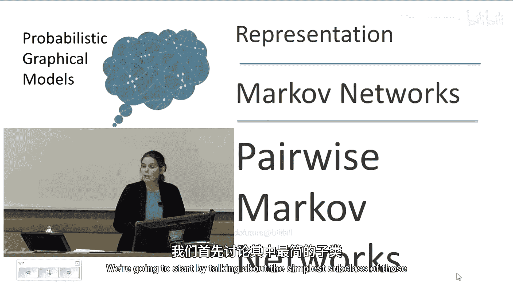
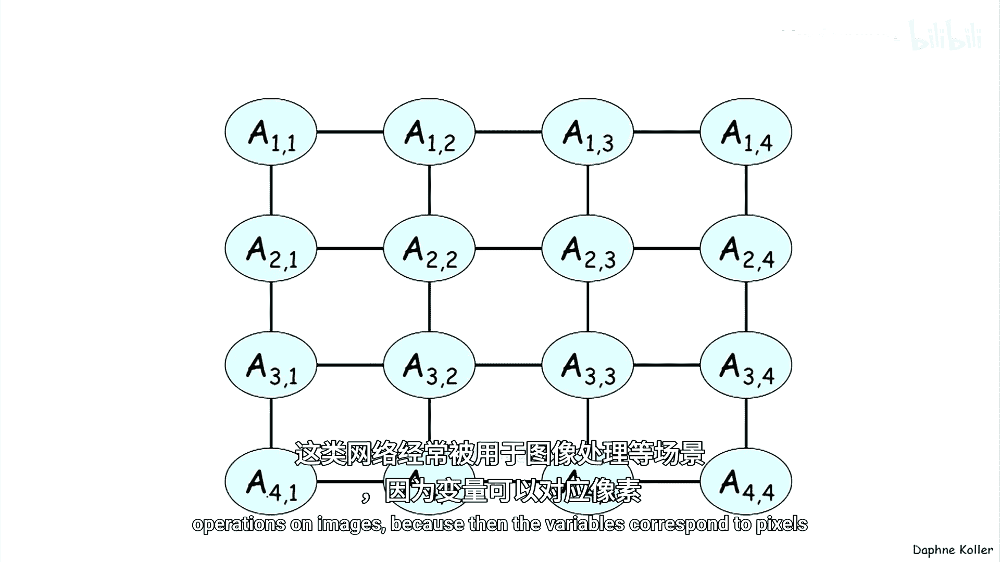
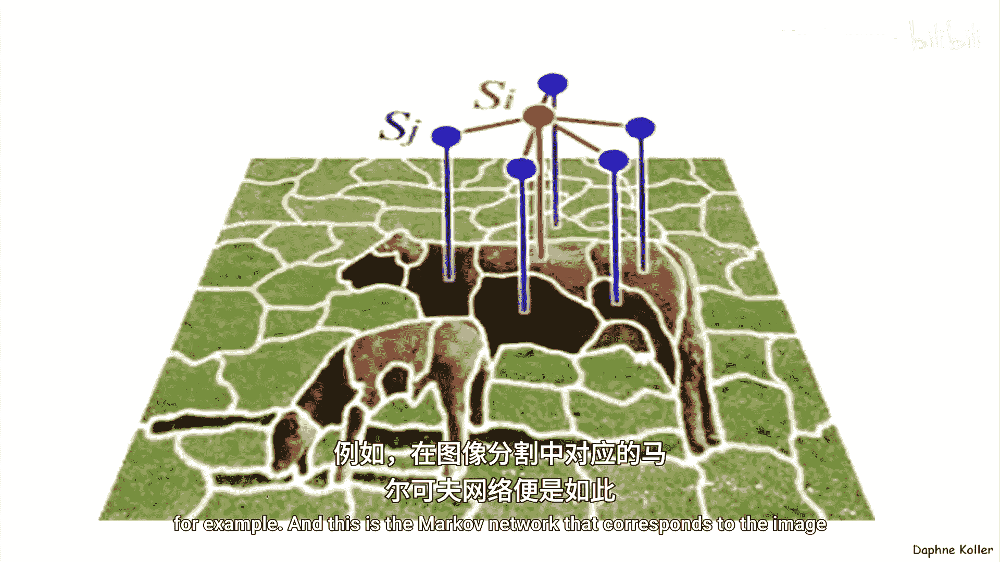

# 028：成对马尔可夫网络

在本节课中，我们将要学习概率图模型的另一个主要分支——基于无向图的模型，即马尔可夫网络。我们将从最简单的子类——成对马尔可夫网络开始，了解其基本概念、表示方法和参数化方式。



## 概述

概率图模型主要有两个家族：基于有向图的模型（如贝叶斯网络）和基于无向图的模型。无向图模型通常被称为马尔可夫网络或马尔可夫随机场。本节我们将重点介绍其中最简单的子类——成对马尔可夫网络，并探讨其核心思想。

## 从示例引入

上一节我们介绍了有向图模型，本节中我们来看看无向图模型。首先通过一个简单的例子来理解其应用场景。

假设有四名学生（Alice, Bob, Charles, Debbie）以结对的方式一起学习。他们之间的关系如图所示：Alice和Charles合不来，Bob和Debbie分手后也不再交谈。因此，只有图中用边连接的学生对才会一起学习。


我们关心学生是否对某个容易混淆的知识点存在误解。随机变量表示学生是否有该误解。直觉上，如果两个学生一起学习，他们会相互影响。例如，如果Alice和Bob一起学习，那么其中一人有误解，另一人也很可能有误解。

这种相互影响的关系不适合用有向图表示，因为影响是双向的，无法确定箭头的方向。因此，我们将使用无向图来建模这种情况。

## 参数化无向图

那么，如何参数化一个无向图呢？由于没有条件概率分布的概念（因为没有明确的“条件”变量），我们需要使用之前定义的更一般的概念——**因子**。

以下是用于描述学生关系的因子（也称为势函数）示例。请注意，这些数字甚至不一定在0到1的范围内。

```
φ₁(A, B):
A=0, B=0: 30
A=0, B=1: 5
A=1, B=0: 1
A=1, B=1: 10
```

这些因子有许多名称，如亲和函数、兼容性函数或软约束。它们的含义是变量A和B取特定联合赋值时的“局部满意度”。

例如，在上面的因子中：
*   最满意的赋值是 `A=0, B=0`（两个学生都没有误解）。
*   第二满意的是 `A=1, B=1`（两个学生都有误解，但他们意见一致）。
*   最不满意的是 `A=0, B=1` 和 `A=1, B=0`（两个学生意见相左）。

图中其他结对关系也有类似的“满意度”因子：
*   Bob和Charles非常倾向于意见一致。
*   Charles和Debbie则倾向于争论，即意见相左时更“满意”。
*   Alice和Debbie也倾向于意见一致。

## 构建联合概率分布

我们通过许多这样的小片段来描述整体状态。那么，如何将这些片段组合起来定义一个联合概率分布呢？我们将使用**因子乘积**的概念。

具体做法是，将所有因子相乘。然而，这样得到的结果并不是一个概率分布，因为这些数字不在[0,1]区间内，且总和不为1。因此，我们在符号P上加一个波浪号（`P̃`），表示这是一个**未归一化的度量**。

**未归一化的联合度量**定义如下：
`P̃(A, B, C, D) = φ₁(A, B) * φ₂(B, C) * φ₃(C, D) * φ₄(D, A)`

如何将这个未归一化的度量转化为概率分布呢？答案是**归一化**。归一化常数在历史上被称为**配分函数**，用Z表示。

**配分函数Z**是未归一化度量中所有可能赋值的总和：
`Z = Σ_{A,B,C,D} P̃(A, B, C, D)`

然后，通过除以Z得到归一化的**联合概率分布**：
`P(A, B, C, D) = (1/Z) * P̃(A, B, C, D)`

这个概率分布就是由这个无向图所定义的分布。

## 理解因子的含义

现在，让我们思考因子 `φ₁(A, B)` 的含义。它是否等于联合分布中A和B的边际概率 `P(A, B)`？或者是条件概率 `P(A|B)`、`P(B|A)`，或给定C和D时A和B的联合概率 `P(A, B | C, D)`？

**答案是否定的。** 因子 `φ₁(A, B)` 并不直接对应任何这些概率。

为了理解这一点，让我们比较一下由所有四个因子 `φ` 定义的联合分布计算出的实际边际概率 `P_φ(A, B)`，和原始的因子 `φ₁(A, B)`。

我们会发现，在 `φ₁` 中，A和B高度倾向于一致（30远大于其他值）。然而，在实际的边际分布 `P_φ(A, B)` 中，概率最高的赋值可能并不是两者一致的情况。

为什么会这样？因为概率分布是由所有四个因子相乘得到的。在这个网络中：
*   B和C强烈倾向于一致。
*   A和D也强烈倾向于一致。
*   C和D则强烈倾向于不一致。

这些因子的强度（不同赋值间的差异）甚至比 `φ₁(A, B)` 还要大。这就形成了一个“循环”：无法同时满足D与A一致、A与B一致、B与C一致，而C与D不一致。这个循环必须在某个环节被打破，而最弱的环节就是 `φ₁(A, B)`。因此，A和B的边际概率实际上是网络中所有不同因子相互作用的一个复杂聚合结果。

这是一个重要的观点：**在马尔可夫网络中，用于构建分布的因子与最终的概率分布之间没有直接的、自然的映射关系**。你不能仅仅观察概率分布就说“啊，这一部分就是 `φ₁` 应该有的样子”。这与贝叶斯网络形成直接对比，在贝叶斯网络中，因子就是条件概率，可以直接从分布中计算出来。这个区别也会影响我们如何从数据中学习这些因子，因为你无法直接从概率分布中提取它们。

## 成对马尔可夫网络的定义

基于上述直觉和定义，我们现在可以正式定义成对马尔可夫网络。由于这类网络应用广泛，值得为其单独定义。

一个**成对马尔可夫网络**包含以下部分：
*   一个无向图，其中节点是随机变量 `X₁, ..., Xₙ`。
*   图中的每条边 `(Xᵢ, Xⱼ)` 都关联一个**因子**（或称**势函数**）`φᵢⱼ(Xᵢ, Xⱼ)`。

其对应的未归一化度量定义为所有边因子的乘积：
`P̃(X₁, ..., Xₙ) = Π_{(i,j)∈E} φᵢⱼ(Xᵢ, Xⱼ)`

归一化的联合概率分布则为：
`P(X₁, ..., Xₙ) = (1/Z) * P̃(X₁, ..., Xₙ)`

## 应用示例

以下是另一个稍大一点的马尔可夫网络示例，其结构呈网格状。这种网络常用于图像处理任务，因为变量可以对应于像素。



下图展示了一个对应于图像分割任务的马尔可夫网络，其中使用了超像素，因此结构不再是规则的网格。




## 总结


本节课中我们一起学习了概率图模型中无向图分支的基础——成对马尔可夫网络。我们了解到：
1.  无向图适用于建模变量间双向的、对称的依赖关系。
2.  使用**因子**（势函数）来参数化网络，因子表示变量组取值的局部“兼容性”或“满意度”。
3.  通过将所有因子相乘得到**未归一化的度量**，再通过除以**配分函数Z**进行归一化，得到最终的联合概率分布。
4.  强调了因子与概率分布间没有直接映射，这是与贝叶斯网络的关键区别之一。
5.  正式定义了**成对马尔可夫网络**，并简要介绍了其在图像处理等领域的网格状应用。