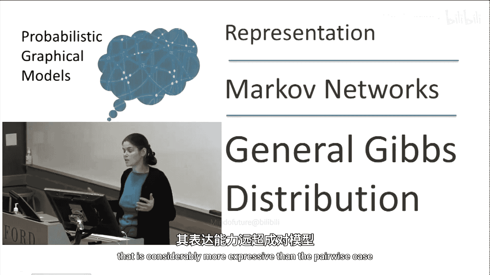
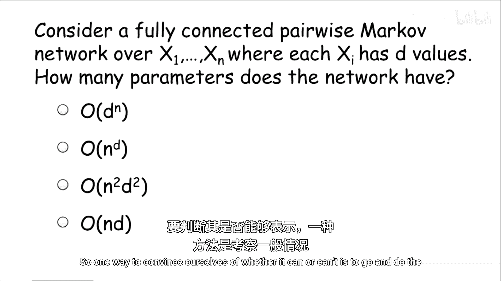
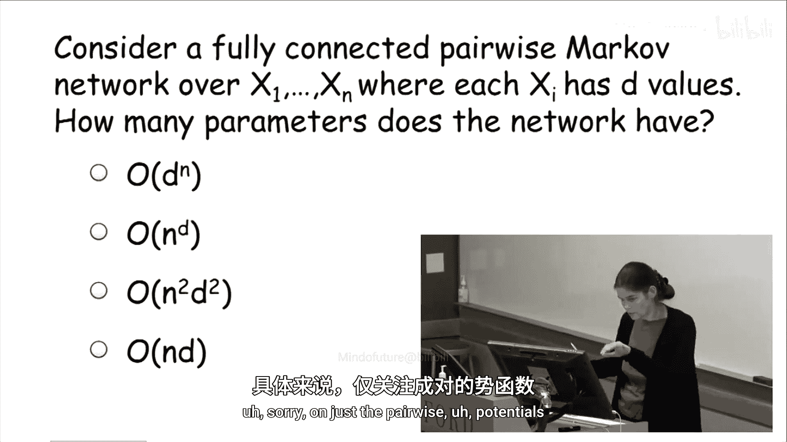
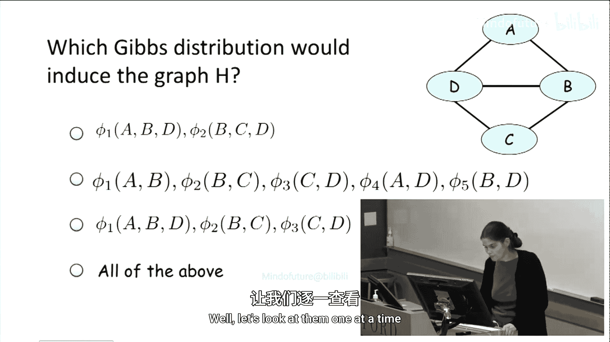
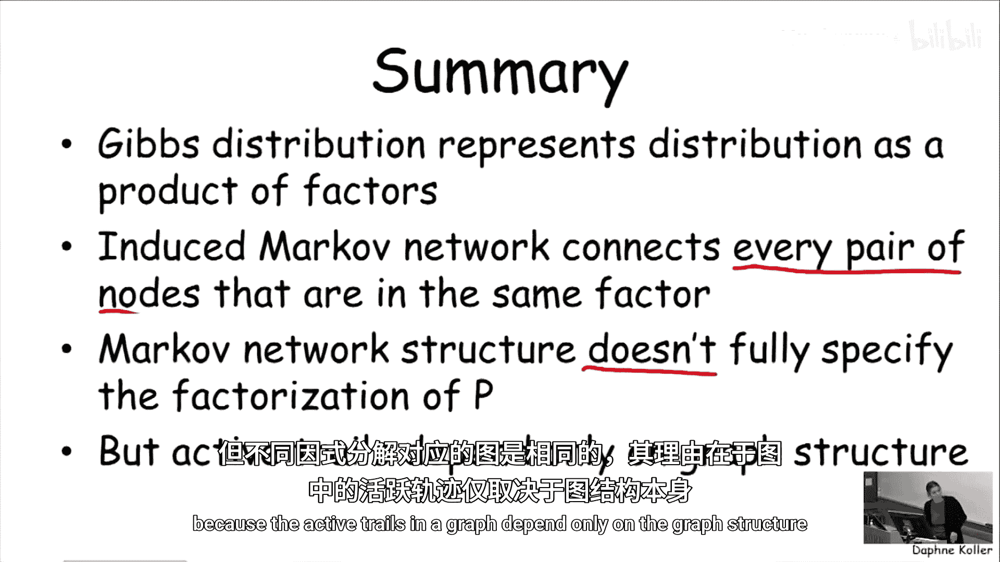

# 概率图模型：1.2：一般吉布斯分布



在本节课中，我们将学习一种比成对马尔可夫网络更具表达力的模型——吉布斯分布。我们将了解其定义、参数化方式，以及它如何与图结构相关联。

## 概述

之前我们介绍了成对马尔可夫网络的概念。本节中，我们将定义一个更一般、表达能力更强的概念，即吉布斯分布。我们将探讨其数学定义，并理解它如何通过一组因子来参数化一个概率分布，以及这些因子如何诱导出一个图结构。





## 从成对网络到一般分布

上一节我们介绍了成对马尔可夫网络。本节中我们来看看，仅使用成对交互的网络是否足以表示所有概率分布。

考虑一个包含四个随机变量 A、B、C、D 的网络，并引入所有可能的成对边。问题是：这个网络是否具有完全的表达能力？换句话说，它能表示任意定义在这四个变量上的概率分布吗？

我们可以通过分析参数数量来思考这个问题。假设一个包含 `n` 个变量的全连接成对马尔可夫网络，每个变量有 `d` 个可能取值。该网络中的参数数量是 **O(n²d²)**。

然而，一个定义在 `n` 个变量（每个有 `d` 个取值）上的一般概率分布，其自由参数的数量是 **dⁿ - 1**。这比 **O(n²d²)** 大得多。因此，直观上，成对马尔可夫网络不足以捕捉所有可能的概率分布。

为了扩展无向表示的表达能力，我们需要超越成对边。

## 定义吉布斯分布

为了参数化一个一般的吉布斯分布，我们将使用一般的因子。每个因子可以包含两个以上的变量。以前我们只有定义在变量对上的因子，现在我们可以有定义在三个、四个甚至所有变量上的因子。

形式上，一个吉布斯分布由一组因子 **Φ = {φ₁, …, φₖ}** 参数化。我们通过两个步骤来定义这个分布：

1.  **构建未归一化度量**：将所有因子相乘。这与我们之前见过的因子乘积操作相同。
    ```
    P̃(x₁, …, xₙ) = ∏_{i=1}^{k} φ_i(D_i)
    ```
    这里，`D_i` 是因子 `φ_i` 的作用域。`P̃` 上的波浪号表示这通常不是一个概率分布，而是一个未归一化的度量。

2.  **归一化为概率分布**：为了将未归一化度量转化为有效的概率分布，我们定义一个**配分函数 Z** 作为归一化常数：
    ```
    Z = ∑_{x₁, …, xₙ} P̃(x₁, …, xₙ)
    ```
    然后，用 Z 除以 `P̃` 中的所有项，得到概率分布：
    ```
    P_Φ(x₁, …, xₙ) = (1/Z) * P̃(x₁, …, xₙ)
    ```

这样，我们就通过一组因子定义了一个概率分布。

## 诱导的马尔可夫网络

上述定义给出了分布的参数。那么，与这个吉布斯分布对应的马尔可夫网络在哪里呢？

为了直观理解，考虑一个包含两个因子的分布：`φ₁(A, B, C)` 和 `φ₂(B, C, D)`。我们希望网络能编码 A、B、C 之间以及 B、C、D 之间可以相互作用的事实。因此，网络应该包含边 (A, B), (A, C), (B, C)（来自第一个因子）以及边 (B, C), (B, D), (C, D)（来自第二个因子）。合并后，诱导出的图包含所有这五条边。

更一般地，给定一组因子 **Φ**，其诱导的马尔可夫网络 **H_Φ** 定义如下：
- 对于每一对变量 **X_i** 和 **X_j**，如果**存在**一个因子 **φ ∈ Φ**，使得 **X_i** 和 **X_j** 都出现在该因子的作用域中，那么在 **H_Φ** 中，**X_i** 和 **X_j** 之间就有一条边。

换句话说，只要两个变量出现在同一个因子中，它们在图里就是相连的。

## 因子分解与图结构

我们可以反过来定义概率分布 **P** 在某个图 **H** 上因子化的概念。这与贝叶斯网络中的定义类似。

我们说概率分布 **P** 在马尔可夫网络 **H** 上因子化，如果**存在**一组因子 **Φ**，使得：
1.  **P** 可以由 **Φ** 通过上述吉布斯分布过程表示（即 `P = P_Φ`）。
2.  图 **H** 正是这组因子 **Φ** 诱导出的图（即 `H = H_Φ`）。



这回答了“何时可以用图 H 编码分布 P”的问题。

## 图不能唯一确定因子分解

现在让我们思考一个重要问题：给定一个图 **H**，我们能唯一确定分布 **P** 在它上面的因子分解形式吗？答案是否定的。

考虑同一个图结构（例如一个包含四个节点的全连接图或特定子图），不同的因子集合可以诱导出完全相同的图。例如：
- 因子集 `{φ₁(A,B,D), φ₂(B,C,D)}` 诱导出包含边 (A,B), (A,D), (B,C), (B,D), (C,D) 的图。
- 因子集 `{φ₃(A,B), φ₄(B,C), φ₅(C,D), φ₆(A,D)}` 也诱导出完全相同的图。
- 因子集 `{φ₇(A,B,C,D)}`（一个定义在所有四个变量上的单一因子）同样诱导出完全相同的全连接图。

这些因子化在表达能力上差异巨大（参数数量从 `O(d²)` 到 `O(d⁴)` 不等），但它们诱导出的图却是一样的。

**关键结论是：我们无法从图结构中读出唯一的因子分解形式。** 图结构是因子分解的一种更“粗糙”的表示。

## 图结构的意义：影响流

既然图不能唯一确定因子分解，那么图结构的意义是什么？它到底告诉我们什么信息？

图结构刻画了**影响（或信息）在变量之间可能传播的路径**。尽管不同的因子化（参数化）方式在细节上不同，但变量间相互影响的可能性——即图中哪些路径是“活跃”的——只取决于图结构本身。

在马尔可夫网络中，我们定义**活跃迹**的概念。一条从 `X₁` 到 `Xₙ` 的迹，在给定观测变量集 **Z** 的条件下是活跃的，当且仅当：
- 迹上的**所有**中间变量 `X_i` 都**不在**观测集 **Z** 中。

其原理是：影响只能通过未被观测的变量流动。一旦一个变量被观测到（即其值已知），它就“阻断”了通过它的影响流，因为它不再能被其父节点或邻居所影响。

例如，在之前的图中，迹 `B -> A -> D` 在 **Z** 为空集时是活跃的。但如果变量 A 被观测到（`A ∈ Z`），那么这条迹就不再活跃，因为 B 无法再通过已被固定的 A 来影响 D。

因此，**图 H 编码了分布 P 中的条件独立性**，它告诉我们，在给定某些变量被观测到时，其他变量之间何时可能（或不可能）相互影响。这正是图模型的核心价值所在。

## 总结



本节课中我们一起学习了吉布斯分布的核心内容：
1.  **吉布斯分布**是一种通过一组因子（可作用于多个变量）参数化的概率分布，表示为这些因子乘积的归一化形式：`P = (1/Z) ∏ φ_i`。
2.  一组因子会**诱导出一个马尔可夫网络**，其中边的存在条件是变量共同出现在某个因子作用域内。
3.  一个概率分布 **P** 在某个图 **H** 上**因子化**，意味着存在一组因子能表示 P 并诱导出图 H。
4.  **重要洞见**：图结构**不能唯一确定**具体的因子分解形式。不同的参数化可以对应同一个图。
5.  **图结构的意义**在于它刻画了**变量间的影响流（活跃迹）**，从而编码了分布中的条件独立性关系。影响流是否通畅仅取决于图的结构，而非因子分解的具体细节。