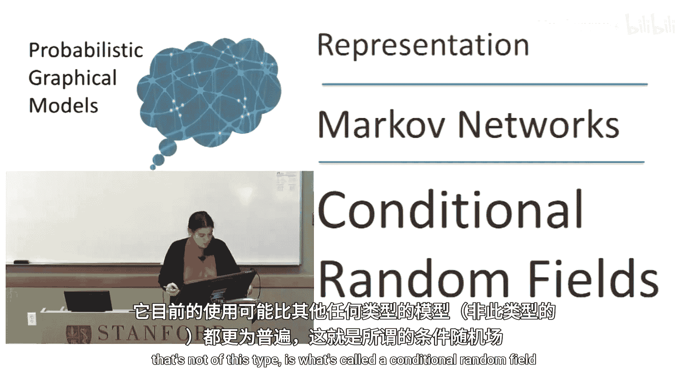
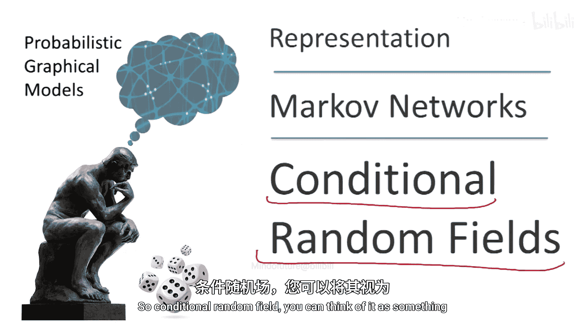
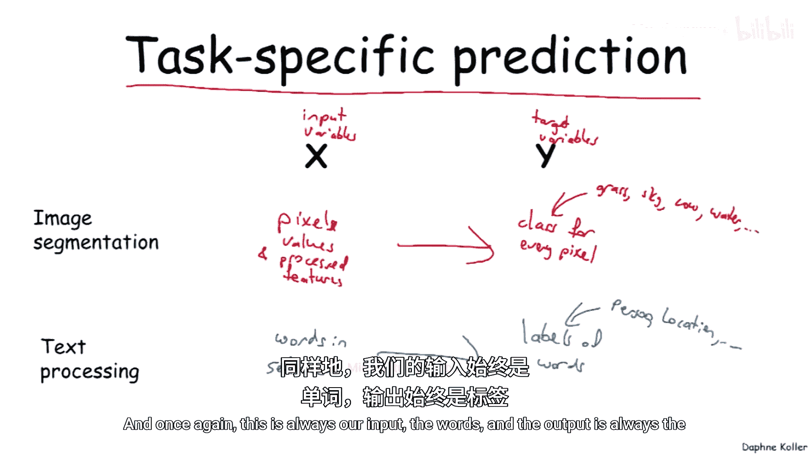
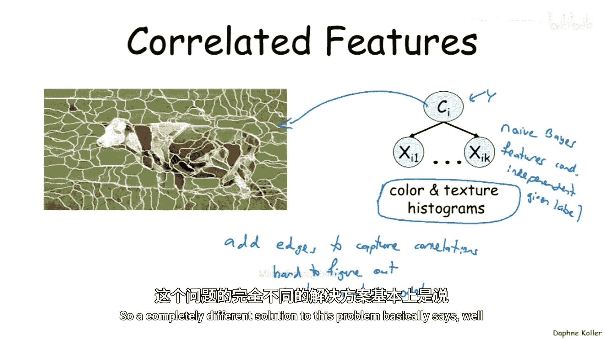
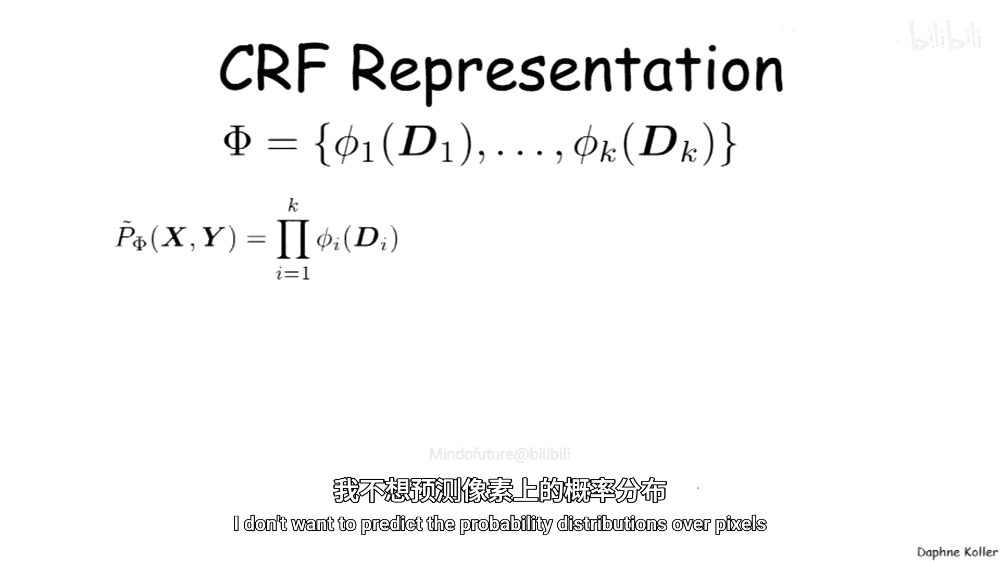
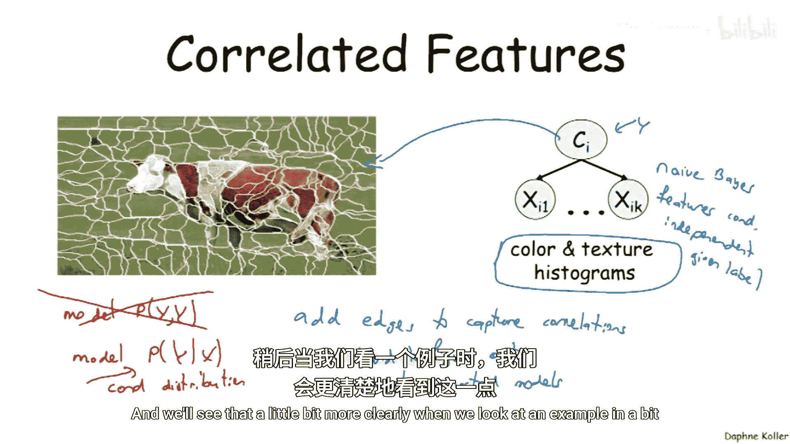
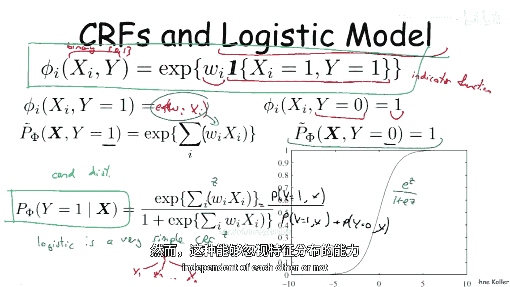
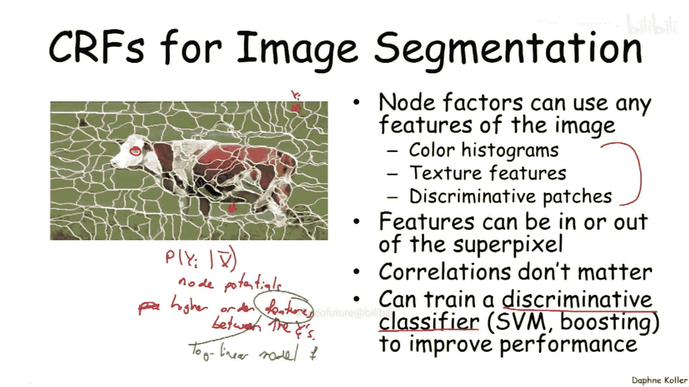
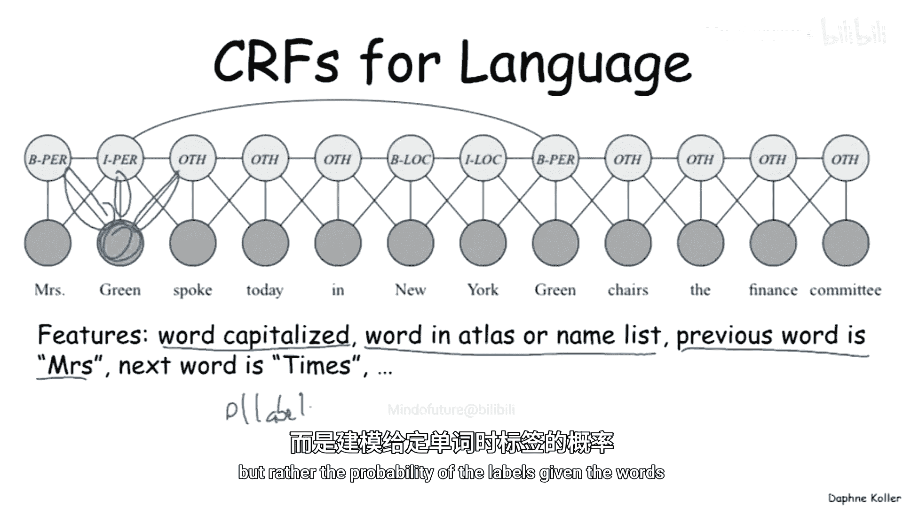
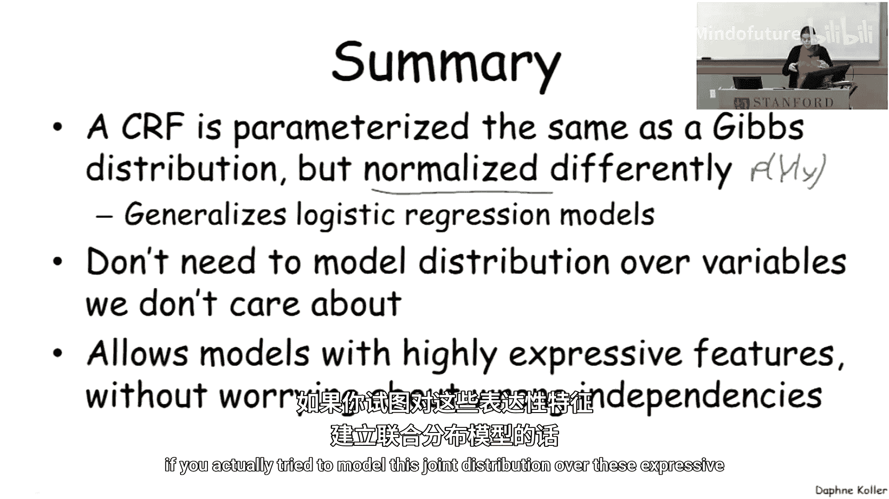

# 概率图模型：1.3：条件随机场 (CRF) 🧩

在本节中，我们将学习一种非常重要的马尔可夫网络变体——条件随机场。它如今的应用非常广泛，其核心思想与标准马尔可夫网络相似，但设计目的有所不同。

## 概述：任务特定的预测问题

条件随机场这类模型旨在处理“任务特定的预测”问题。在这类问题中，我们总有一组输入（或观测）变量 **X**，以及一组我们试图预测的目标变量 **Y**。模型的设计前提是，我们总是面对相同类型的输入和输出变量，并试图解决本质上相同的问题。

为了更清晰地理解，让我们看两个例子。

以下是两个典型的应用场景：

*   **图像分割**：输入 **X** 是像素值及其处理后的特征（如颜色和纹理直方图）。目标变量 **Y** 是每个像素的类别标签（例如，草地、天空、牛、水等）。模型的目标是从 **X** 预测 **Y**。
*   **自然语言处理 (NLP)**：输入 **X** 是一个句子中的单词序列。输出 **Y** 是我们试图推导的单词标签（例如，人名、地点、机构名等）。同样，输入始终是单词，输出始终是标签。

## 为何需要条件随机场？

既然要解决这类预测问题，为什么不直接使用我们之前学过的标准概率图模型呢？让我们思考一下这样做可能存在的问题。

想象一下，在图像分割任务中，我们试图预测一个超像素的类别标签 **Y_i**。我们会处理该超像素的特征，生成一系列代表其外观的颜色和纹理直方图。根据上一节的符号，**Y_i** 是我们的目标变量 **Y**，而下面的这些特征就是我们的输入 **X**。

问题在于，这些通常对像素类别信息量很大的特征之间，往往存在高度的相关性。例如，测量线条方向的纹理直方图，在测量的纹理结构类型上可能包含大量冗余信息。

如果我们用一个朴素的模型（例如朴素贝叶斯模型）来表示，假设特征在给定标签的条件下相互独立，那么我们实际上忽略了这种相关性结构。这会导致严重的问题：如果我有五个高度相关、测量同一事物的特征，模型会将其计数五次。这会使模型因为这一个事实而变得过度自信，从而产生严重偏斜的概率分布，不能真实反映我们的信念，因为它做出了错误的独立性假设。

那么，为什么不建立正确的独立性假设，添加一堆边来捕捉特征间的相关性呢？事实证明这非常困难。首先，理清这些平凡特征之间的相关性本身就很难。其次，尝试加入这些相关性会导致模型变得高度稠密连接。如果我们开始在所有特征之间添加边，模型会变得异常复杂。

## 条件随机场的核心思想

条件随机场提供了一个完全不同的解决方案。其核心思想是：**我们并不关心输入特征 X 本身的概率分布**。我们不想预测像素的概率分布（例如，一个绿色像素旁边是另一个绿色像素再旁边是一个棕色像素的概率）。我们面对的是一个已经给定的输入 **X**，我们真正关心的只是**在给定 X 的条件下，目标变量 Y 的条件概率分布**。

因此，我们重新定义了问题：不再对 **X** 和 **Y** 的联合分布进行建模，而是直接对给定 **X** 时 **Y** 的条件分布进行建模。既然我们不试图捕捉 **X** 的分布，那么我们也就无需关心 **X** 内部特征之间的相关性了。这一点在我们看具体例子时会更加清晰。

## 条件随机场的正式定义

在深入例子之前，让我们先给出条件随机场（CRF）的正式定义。CRF 乍看之下很像吉布斯分布。

与吉布斯分布类似，我们有一组定义在作用域上的因子。与吉布斯分布类似，我们将这些因子相乘，得到一个未归一化的度量。到目前为止完全一样，只是现在这个未归一化度量的参数是 **X** 和 **Y**，而不仅仅是一组随机变量。

关键区别在于归一化。为了对给定 **X** 时 **Y** 的条件分布进行建模，我们需要将 **X** 放在条件概率的右侧。这意味着我们将有一个依赖于 **X** 的、单独的归一化常数（或称配分函数）。

其数学形式如下：

**P(Y | X) = (1 / Z(X)) * ∏ φⱼ(Dⱼ)**

其中，**Z(X) = ∑_Y ∏ φⱼ(Dⱼ)** 是依赖于 **X** 的配分函数。

这意味着，对于任何一个给定的 **X**，我们对所有可能的 **Y** 取值进行求和。然后，通过除以这个与 **X** 相关的配分函数 **Z(X)**，我们为这个特定的 **X** 构造了一个在 **Y** 上的条件概率分布。这样就定义了一个随 **X** 变化的条件分布族。

## 与逻辑回归的联系

有趣的是，条件随机场与我们在许多机器学习课程中见过的逻辑回归模型高度相关，后者在贝叶斯网络中也可以作为一种条件概率分布表示。为了理解这种联系，让我们看一个非常简单的例子。

假设 **X** 和 **Y** 都是二元随机变量（取值为 0 或 1）。在我们的对数线性模型中，使用一个简单的特征表示：一个指示函数。我们有一个特征，当 **X=1** 且 **Y=1** 时其值为 1，否则为 0，并带有一个参数 **w**。

将这个特征代入 CRF 表示并进行推导后，我们可以得到给定 **X** 时 **Y=1** 的概率为：

**P(Y=1 | X) = sigmoid(w * X) = e^{wX} / (1 + e^{wX})**

这正是我们熟悉的 **Sigmoid 函数**。由此我们得出结论：**逻辑回归模型是一个极其简单的条件随机场**。

## 从朴素贝叶斯到逻辑回归的视角

从这个数学推导出发进行更广泛的思考：如果我们不是进行这种条件归一化，而是使用相同的成对特征（连接 **Y** 和每个 **X_i**）来对 **X** 和 **Y** 的联合分布进行建模，那么我们会得到一个类似朴素贝叶斯的模型。因为特征 **X** 之间没有连接边，所以模型会假设给定 **Y** 时，所有 **X** 相互独立。

但是，当我们将其建模为条件分布 **P(Y|X)** 时，我们有效地从分析中移除了 **X** 之间相关性的任何概念，而只专注于 **X** 如何共同影响 **Y** 的概率。**这就是朴素贝叶斯模型和逻辑回归模型之间的本质区别**。

同样的直觉可以扩展到更丰富的模型类别，其中 **Y** 和 **X** 不再是简单的二元变量。这种**忽略输入特征分布、只关注目标变量**的能力，使我们能够利用丰富的特征，而无需担心它们是否彼此独立。

## 在复杂任务中的应用优势

让我们回到图像分割的例子。在 CRF 中，我们通常使用非常丰富的特征。例如，在定义与类别标签 **Y_i** 相关的单个节点势能时，我们无需担心特征之间的相关性。我们可以使用颜色直方图、纹理特征，甚至像“寻找牛的眼睛”这样的判别性特征。所有这些特征可能高度相关，但这没有关系，因为我们不关心它们的联合分布。

你甚至可以查看超像素之外的特征，例如：“如果下面完全不同的超像素是绿色的，那么它更可能是一头牛或一只羊，因为它们倾向于在草地上。”这些特征肯定是相关的，因为你同时在为当前超像素和另一个超像素计算类似的特征。但这没关系，因为我们不担心超像素之间的相关性。

同样的思想也适用于语言处理的 CRF。我们通常拥有高度相关的特征，例如：单词是否大写、是否出现在某个名称列表中、前一个单词是否是“Mr.”或“Mrs.”等。这些特征经常彼此相关，甚至同一个词可能作为多个单词的特征出现。这都没有问题，因为我们不试图对句子中单词的分布建模，而是对给定单词时的标签概率建模。

需要指出的一点是，在这个框架中，“特征”一词是重载的，可能会造成混淆。它既指上下文中的具体特征（如图像特征、单词特征），也指定义对数线性模型时使用的“特征函数” **f**。这确实容易混淆，但通常可以从上下文中分辨其含义。

## 总结

在本节中，我们一起学习了条件随机场。我们来总结一下要点：

*   **定义**：条件随机场形式上很像吉布斯分布，但有一个微妙而关键的区别——它的归一化方式不同。它通过一个依赖于输入 **X** 的配分函数进行归一化，从而直接构造了给定 **X** 时 **Y** 的条件概率分布。
*   **与经典模型的关系**：作为一个特例，它包含了标准的逻辑回归模型，但拥有更强大的表达能力。
*   **核心优势**：我们**无需**对那些我们不关心的变量（即输入 **X**）的分布进行建模，而只专注于我们真正想要预测的变量（即目标 **Y**）。
*   **关键效用**：这使得我们可以设计非常强大、表达能力丰富的预测器（例如，用于模型各部分），而无需担心不同变量之间不正确的依赖性。如果我们试图对这些丰富特征的联合分布进行建模，这种不正确的依赖将是不可避免的。

条件随机场通过直接对条件分布建模，巧妙地规避了复杂特征间相关性建模的难题，使其在图像分割、自然语言处理等需要丰富特征的任务中表现出色。