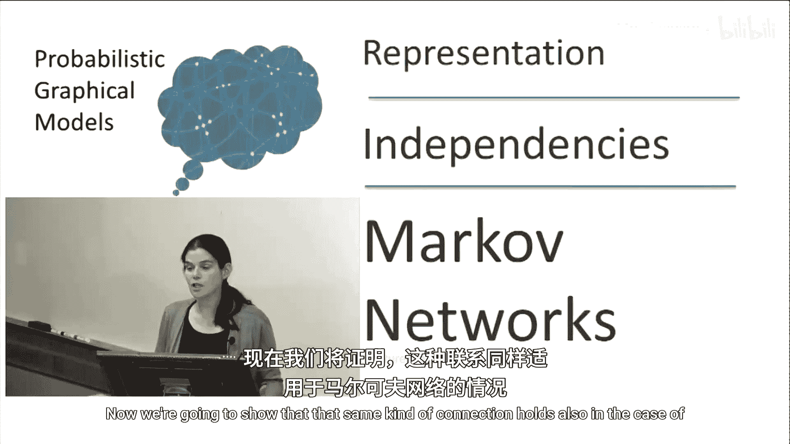
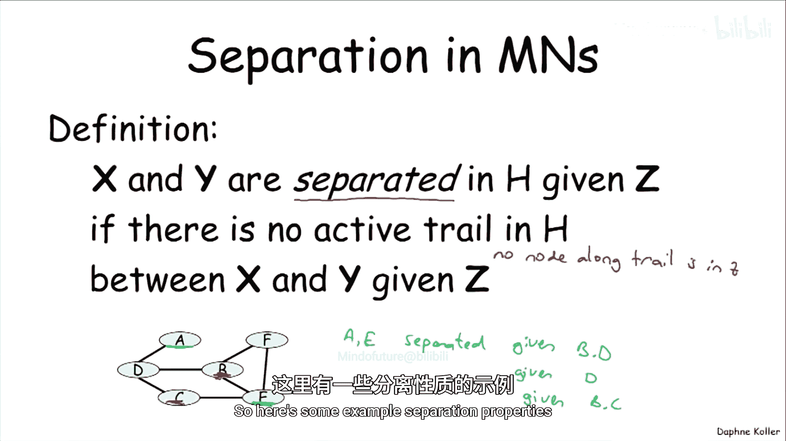
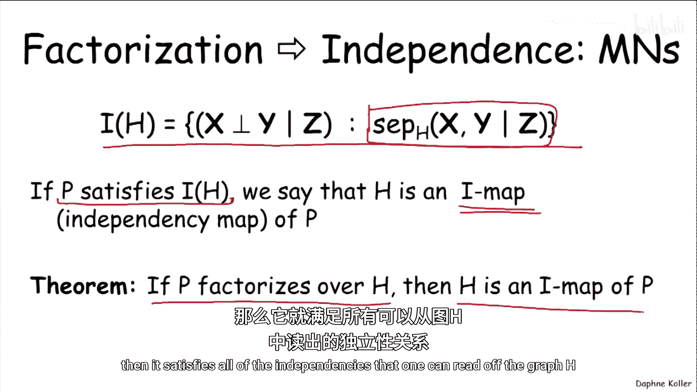
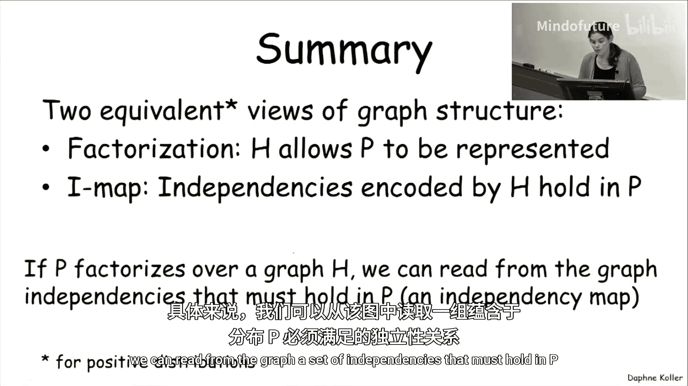

# 031：马尔可夫网络中的独立性

在本节课中，我们将要学习马尔可夫网络中独立性与概率分布因子分解之间的关系。我们将看到，这种关系与我们在贝叶斯网络中建立的非常相似，但存在一些重要的区别。

上一节我们介绍了贝叶斯网络中独立性与因子分解的对应关系，本节中我们来看看这种关系在马尔可夫网络中是如何体现的。

## 马尔可夫网络中的分离概念

首先，我们需要一个类似于贝叶斯网络“d-分离”的概念，用于从图结构本身解读独立性。在马尔可夫网络中，这个概念称为“分离”。

**分离** 的定义是：在无向图H中，给定节点集Z，节点集X与Y被分离，当且仅当在H中，连接X和Y的每条路径都被Z中的节点所“阻塞”。

这里的“路径”是指一系列相邻节点构成的序列。“阻塞”的概念很简单：如果路径上的某个节点在观测集Z中，那么这条路径就被阻塞了。换句话说，**分离** 意味着在给定Z的条件下，X和Y之间没有“活跃路径”。

## 分离性质示例

以下是几个分离性质的例子，可以帮助我们理解这个概念。

考虑上图，我们来看如何分离节点A和E。

*   给定节点集 {B, D}，A和E被分离。因为B和D同时阻塞了A到E的两条可能路径。
*   给定节点集 {C}，A和E也被分离。因为C阻塞了其中一条路径（A-B-C-E），而另一条路径（A-B-D-E）上的B未被观测，但D未被观测，然而，由于路径A-B-D-E上的B未被观测，这条路径本身不活跃？等一下，我们需要澄清：在无向图中，只要路径上**任何一个**节点在Z中，该路径就被阻塞。在A-B-D-E路径中，B和D都不在Z={C}中，所以这条路径没有被阻塞。因此，仅给定C，A和E**并不**分离。原视频描述可能有误或简略。更准确的例子可能是：
*   给定节点集 {B, C}，A和E被分离。因为B阻塞了路径A-B-D-E，C阻塞了路径A-B-C-E。

## 从分离到独立性：IMap 定理

现在我们可以证明一个与贝叶斯网络几乎相同的定理。

**定理（分解蕴含独立）**：如果概率分布P可以因子分解为马尔可夫网络H（即 `P(X) ∝ ∏ φ_c(X_c)`，其中c是H中的团），并且在该图中，X和Y在给定Z的条件下被分离，那么P必定满足条件独立关系：`(X ⊥ Y | Z)`。

这个定理的意义在于，我们可以将从图H中读出的所有分离性质，定义为图H所**蕴含**的独立性集合，记作 `I(H)`。

类似于贝叶斯网络，我们引入 **IMap（独立映射）** 的概念：

> 如果概率分布P满足图H所蕴含的所有独立性（即 `I(P) ⊇ I(H)`），则称H是P的一个IMap。

我们刚刚证明的定理可以重述为：**如果P因子分解于H，那么H是P的一个IMap**。因为因子分解保证了P满足从H中读出的所有独立性。

## 从独立性到分解：逆定理

在贝叶斯网络中，我们有一个完美的逆定理：如果H是P的IMap（且P是“与图相容”的分布），那么P可以因子分解为H的结构。

在马尔可夫网络中，逆定理**几乎**成立，但需要一个关键的前提条件。

**定理（独立蕴含分解，Hammersley-Clifford）**：如果概率分布P是**正分布**（即对于所有可能的变量赋值x，都有 `P(x) > 0`），并且无向图H是P的一个IMap，那么P可以因子分解为H的结构（即，P是定义在H的团上的因子的乘积）。

“正分布”的假设至关重要。如果分布P包含确定性的关系（即某些赋值的概率为0），那么这个逆定理可能不成立。

## 两种视角的等价性

因此，我们再次得到了描述图结构的两种几乎等价的视角：

1.  **因子分解视角**：图H允许概率分布P以一种紧凑的方式（基于团的因子乘积）表示。
2.  **独立性（IMap）视角**：从图H中，我们可以读出一组必须存在于P中的条件独立性关系。

这两种视角通过上述两个定理紧密相连。简单来说，如果P能按H因子分解，那么H中编码的独立性在P中都成立。反之，如果P是正分布且满足H中编码的所有独立性，那么P一定能按H因子分解。

## 总结

本节课中我们一起学习了马尔可夫网络中独立性与因子分解的核心关系。

*   我们引入了**分离**的概念，作为从无向图结构中解读独立性的标准。
*   我们证明了关键定理：**因子分解性意味着图结构所蕴含的独立性**（即因子分解 → IMap）。
*   我们探讨了逆定理（Hammersley-Clifford定理），它指出对于**正分布**，**独立性同样意味着因子分解性**（即IMap → 因子分解）。
*   这确立了马尔可夫网络中因子分解视角与独立性视角在正分布条件下的基本等价性，这与贝叶斯网络中的结论相似，但增加了对分布正定性的要求。