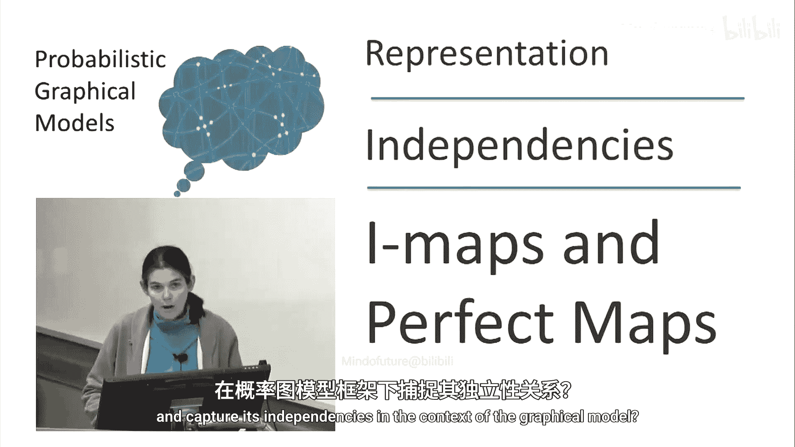
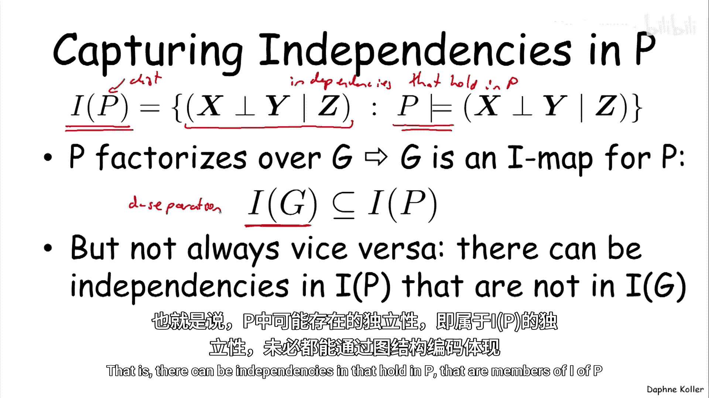
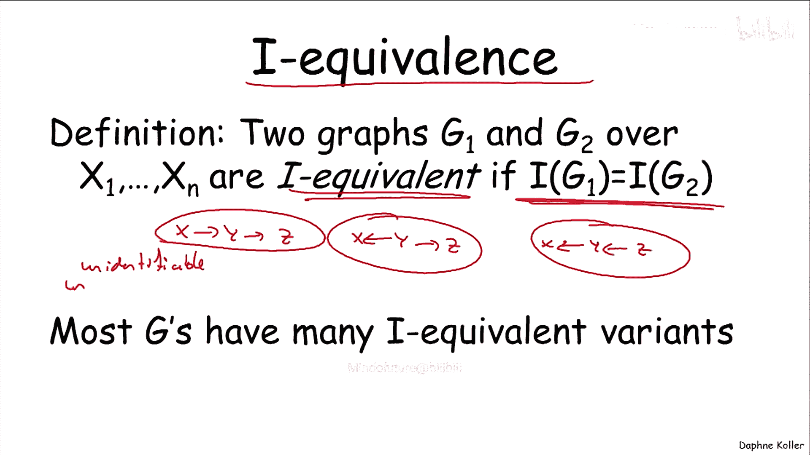
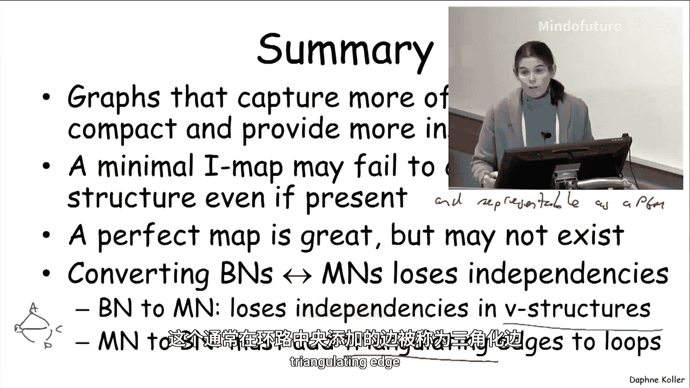

# 概率图模型：第32讲：I-映射与完美映射

在本节课中，我们将探讨如何将一个满足特定独立性集合的概率分布，编码到图结构中。我们将学习I-映射、完美映射等核心概念，并理解图模型在捕捉分布独立性方面的能力与局限。



## 概述

之前我们已经证明，图结构编码了一组独立性，并且这组独立性必然适用于所有可以编码为该图结构上贝叶斯网络的分布。

现在我们要讨论的问题是：如何将一个满足特定独立性集合的分布，编码到一个图结构中。我们能在多大程度上，在图模型的框架下捕捉该分布的独立性？

## 分布中的独立性

首先，让我们理解一个分布的独立性是什么。



我们将为分布 **P** 定义 **I(P)** 这个概念。**I(P)** 是分布 **P** 中成立的所有独立性语句的集合。这些语句的形式是：在给定 **Z** 的条件下，**X** 独立于 **Y**。

我们可以写出一个可能指数级庞大的独立性语句集合，其中每个语句在给定分布 **P** 中要么为真，要么为假。我们将 **I(P)** 定义为在该分布中为真的那些语句。

这些就是在分布 **P** 中成立的独立性。

我们已经知道，如果 **P** 在特定图 **G** 上可因子分解，那么 **G** 是 **P** 的一个 **I-映射**。这意味着图 **G** 通过 **d-分离** 性质所蕴含的每一个独立性，在分布 **P** 中也成立。

但这并不意味着反过来也成立。也就是说，在 **P** 中成立的、属于 **I(P)** 的独立性，可能并未被图结构编码。

## 为什么捕捉独立性很重要？

如果一个图没有捕捉到 **P** 中的某些独立性，那么它就“不必要地复杂”。相反，图越稀疏，它编码的独立性就越多。

更稀疏的图意味着我们需要指定或学习的参数更少，推理效率也更高。同时，图本身也更能反映 **P** 的内在特性。因此，我们希望图能尽可能多地捕捉 **P** 的独立性特性。

## 最小 I-映射

在稀疏性方面，一个基本要求是所谓的 **最小 I-映射**。我们希望得到一个分布 **P** 的 I-映射，它至少没有冗余的边。

例如，如果我们有一个图 **X → Y**，但 **Y** 实际上并不依赖于 **X**（即条件概率分布 **P(Y|X=0) = P(Y|X=1)**），那么我们可以移除这条边，得到的图仍然是该分布的一个 I-映射。因此，这条边是冗余的。

根据定义，这意味着这个 I-映射不是最小的，因为你可以从中移除边而仍然保持 I-映射的性质。

这似乎是一个合理的策略，但事实证明，仅凭这一点不足以确保我们的图达到可能的最稀疏状态。

为了理解原因，让我们看一个分布的例子，它对应于我们之前见过的学生成绩场景。学生的成绩 **G** 依赖于两个变量：课程难度 **D** 和智力 **I**。

下图是一个最小 I-映射，其中 **D** 和 **I** 独立，而 **G** 依赖于两者。

```
D   I
 \ /
  G
```

但事实证明，这不是该分布唯一的**最小 I-映射**。另一个不同的最小 I-映射如下所示：

```
D → I
↓   ↓
G ← ?
```

让我们验证这确实是一个最小 I-映射。尝试移除其中任何一条边，看看是否仍然得到原始分布的一个 I-映射。

*   如果尝试移除边 **D → I**，这将对应 **D** 独立于 **I** 的陈述，这显然在原始分布中不成立。
*   如果尝试移除边 **G → I**，这将对应在给定 **D** 的条件下 **G** 独立于 **I** 的陈述，这在原始分布中也不成立。
*   如果尝试移除最后一条边 **D → G**（这条边在原网络中不存在），这似乎最有希望。移除它对应在给定 **G** 的条件下 **D** 独立于 **I** 的假设。而这正是我们之前见过的“解释消除”推理所诱导出的**依赖**关系。因此，这条边也不能移除。

所以，这确实是一个最小 I-映射。虽然存在更好的最小 I-映射，但这个也是。因此，最小 I-映射不一定是捕捉分布结构的最佳工具。

## 完美映射

我们真正想要的是 **完美映射**。一个完美映射是指图 **G** 中编码的独立性与分布 **P** 中的独立性**完全对应**。图 **G** 完美地捕捉了 **P** 中的独立性。如果能实现这一点，那将是理想的。

不幸的是，完美映射通常很难获得。

以下是一个不存在完美映射的场景示例。分布 **P** 实际上由我们之前见过的这个成对马尔可夫网络表示：

```
A — B
| \ |
D — C
```

我们知道，由于马尔可夫网络的性质，这个分布满足某些独立性。具体来说，我们知道在给定 **B** 和 **D** 的条件下，**A** 独立于 **C**，因为 **B** 和 **D** 在图中间隔开了 **A** 和 **C**。同时，我们知道在给定 **A** 和 **C** 的条件下，**B** 独立于 **D**。

现在，假设我们有一个分布 **P** 满足这些独立性。让我们尝试使用贝叶斯网络作为完美映射来编码这些独立性。

**尝试一**：简单地给边定向，比如这样：
```
A → B → C
↑       ↓
D ←-----←
```
这是该分布的一个 I-映射吗？这个图蕴含的独立性之一是在给定 **A** 的条件下，**B** 独立于 **D**。这显然不被原始分布支持。因此，这不是一个 I-映射。

**尝试二**：以另一种方式组织边，例如：
```
A → B
↓   ↓
D → C
```
这个图正确地蕴含了在给定 **A** 和 **C** 的条件下 **B** 独立于 **D**，这是我们之前的一个独立性。但它也做出了其他在原始分布中不成立的独立性假设，例如 **A** 和 **C** 是边缘独立的。因此，这也不是一个 I-映射。

那么，作为有向图，什么是该分布的一个 I-映射呢？一个可能的 I-映射如下：
```
A → B → C
↑       ↑
D —-----→
```
你可以确认，这个图蕴含在给定 **B** 和 **D** 的条件下 **A** 独立于 **C**，并且仅此而已。因此，这确实是该分布的一个 I-映射，因为在这种情况下，**I(G)** 是 **I(P)** 的子集。但它没有捕捉到所有的独立性，只捕捉了两个中的一个。

所以，这是一个**不存在**贝叶斯网络完美映射的分布。

## 另一个不完美映射的例子

让我们提供另一个不完美映射的例子。实际上，这是一个既没有贝叶斯网络完美映射，也没有马尔可夫网络完美映射的分布。这就是著名的 **“异或”** 例子，它将是许多情况的反例。

这里有两个随机变量 **X1** 和 **X2**，我们假设它们是二值的，每个变量以 50/50 的概率取 0 或 1。另一方面，**Y** 是 **X1** 和 **X2** 的异或，这意味着当且仅当 **X1** 或 **X2** 中**恰好有一个**等于 1 时，**Y** 等于 1。

让我们看看这个概率分布 **P** 是什么样子。它有四种非零概率的配置，每种概率均为 0.25。**X1** 和 **X2** 可以各自以 50/50 的概率为 0 或 1，**Y** 的值如上定义。

现在，让我们思考在这个分布中成立的独立性语句。最明显的是，**X1** 与 **X2** 是边缘独立的。但仔细观察结构，你会发现 **X1**、**X2** 和 **Y** 在结构上是对称的。不难验证，我们还有 **X1** 独立于 **Y**，以及 **X2** 独立于 **Y**。所有这三个两两独立性都在这个分布中成立。

因此，左边的图（任何试图连接它们的图）并不是这个分布的完美映射，因为存在图中不可见的、但在分布中成立的独立性。事实上，无论你以何种方式组织图中的节点，都无法同时捕捉所有这三个独立性，因为要做到这一点，唯一的方法是让 **X1**、**X2** 和 **Y** 成为完全分离的变量，而这显然不会是原分布的一个 I-映射。

## 马尔可夫网络作为完美映射

我们讨论了贝叶斯网络作为完美映射。那么马尔可夫网络呢？这里的定义是相同的，只是将 **G** 替换为 **H**：如果一个马尔可夫网络 **H** 编码的独立性与 **P** 中的独立性**完全对应**，那么它就是完美映射。

我们能否用马尔可夫网络作为完美映射来捕捉所有可能的分布呢？我确信你们此刻都预期答案是否定的，事实也确实如此。以下是一个分布的例子，它存在完美映射（在这种情况下是贝叶斯网络），但不存在马尔可夫网络完美映射。

这就是著名的 **V-结构** 例子（难度 **D**，智力 **I**，成绩 **G**）。让我们思考一下，为了成为该分布的一个 I-映射，我们需要编码哪些边。

显然，我们需要在 **D** 和 **G** 之间，以及 **I** 和 **G** 之间引入边，因为我们肯定无法在给定 **I** 的条件下使 **D** 和 **G** 独立（反之亦然）。因此，这将是该分布一个明显的 I-映射候选。

但是，如果我们选择这个作为候选 I-映射，它将蕴含其他一些独立性，例如在给定 **G** 的条件下 **D** 独立于 **I**。而这当然是错误的，因为我们知道当我们以 **G** 为条件时，**D** 和 **I** 会变得**依赖**。

因此，该分布唯一的 I-映射是包含所有三条边的完全连接图，而这失去了我们原本拥有的边缘独立性（**D** 和 **I** 独立）。所以，这个分布同样没有马尔可夫网络完美映射。

## I-等价与表示的唯一性

我们可能问自己的最后一个问题是：一个分布的表示在多大程度上是唯一的？假设我们可以用某个图（例如作为完美映射）来表示一个分布，这种表示是唯一的吗？

为了理解这一点，让我们先看一个最简单的例子，其中有两个变量 **X** 和 **Y**。这里有一个图 **G1: X → Y**，它没有编码任何独立性假设，所以 **I(G1)** 是空集。另一个图 **G2: X ← Y** 看起来相同，只是边的方向相反，它同样具有完全相同的（空）独立性集合。

因此，我们看到这里有两个不同的图，具有完全相同的独立性假设集合。正因为如此，它们可以表示完全相同的分布集合（在这种情况下，是所有关于变量 **X** 和 **Y** 的分布）。

有人可能认为这是一个退化例子，因为它是一个全连接图。但事实并非如此，在许多其他情况下，边方向不同的两个不同图可以表示完全相同的独立性假设集合。

例如，当我们观察三个随机变量的图时，以下四种场景中有三种代表了相同的独立性假设集合，只有一种是不同的。

以下是四个图的结构：
1.  **链**: X → Y → Z
2.  **叉**: X ← Y → Z
3.  **对撞**: X → Y ← Z (V-结构)
4.  **反链**: X ← Y ← Z

我相信大多数人都意识到，这里的答案是 **V-结构**（对撞结构）。这个图具有边缘独立性假设：**X** 独立于 **Z**。而其他三个图具有条件独立性假设：在给定 **Y** 的条件下，**X** 独立于 **Z**。

因此，这三个图再次代表了相同的独立性假设集合。因此，任何可以被其中一个图表示的概率分布，也可以被另一个图表示。

这个概念的形式化术语称为 **I-等价**。如果两个定义在相同变量集上的图 **G1** 和 **G2** 做出完全相同的独立性假设，则称它们是 I-等价的。



在前面的例子中，我们看到 **X → Y → Z** 与 **Y** 同时是 **X** 和 **Z** 的父节点（即 **X ← Y → Z**）是 I-等价的，而 V-结构则不等价。

为什么 I-等价是一个重要的概念？因为它告诉我们，图模型的某些方面是**不可识别的**。这意味着，如果我们出于某种原因认为某个图代表了我们的概率分布，那么它也很可能是另一个等价的图。因此，如果没有某种先验知识（例如，我们更倾向于 **X** 是 **Y** 的父节点），我们无法在这些不同的选择中进行选择。

事实证明，这不是例外，而是普遍规则。大多数图都有大量等价的变体，这成为一个复杂因素，尤其是当我们从数据中学习模型时。

## 总结

在本节课中，我们一起学习了以下内容：

1.  **目标**：我们倾向于使用能尽可能多地捕捉 **I(P)** 中结构的图，因为它们更紧凑、更容易学习、更容易进行推理，并且能为我们提供关于分布的更多洞察。
2.  **最小 I-映射**：我们讨论了最小 I-映射作为一种稀疏图的选择，并展示了它并不是一个特别好的选择，因为它可能无法捕捉分布中存在的、甚至可以用图模型表示的结构。
3.  **完美映射**：一个更好的概念是完美映射，它非常理想，但在许多情况下可能不存在。
4.  **模型间的转换**：我们已经看到，当我们尝试将一个自然表示为贝叶斯网络的分布表示为马尔可夫网络时，通常无法得到完美映射，我们会丢失独立性（反之亦然）。具体来说：
    *   从贝叶斯网络到马尔可夫网络时，我们会丢失 **V-结构** 中的独立性。
    *   从马尔可夫网络到贝叶斯网络时，我们需要在环内添加边（例如在 ABCD 环中，我们必须在中间添加一条边），这种边通常称为**三角化边**，因为它将环变成一对三角形。
5.  **I-等价**：我们还介绍了 I-等价的概念，它表明图表示可能不是唯一的，许多不同的图结构可以编码完全相同的独立性集合，这在模型学习中是需要注意的一个重要方面。



通过理解 I-映射、完美映射和 I-等价，我们能够更深入地评估和选择适合特定概率分布的图模型表示，并认识到其固有的能力和限制。