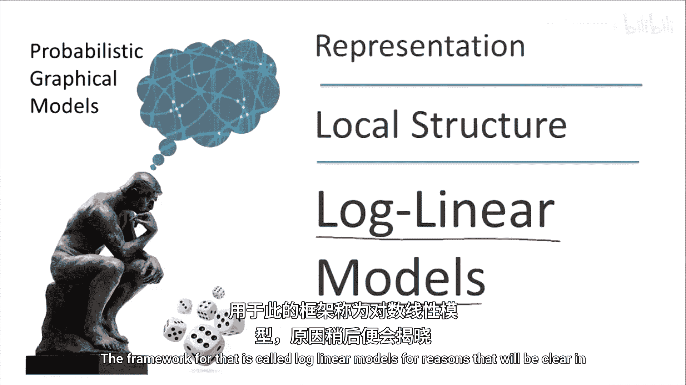
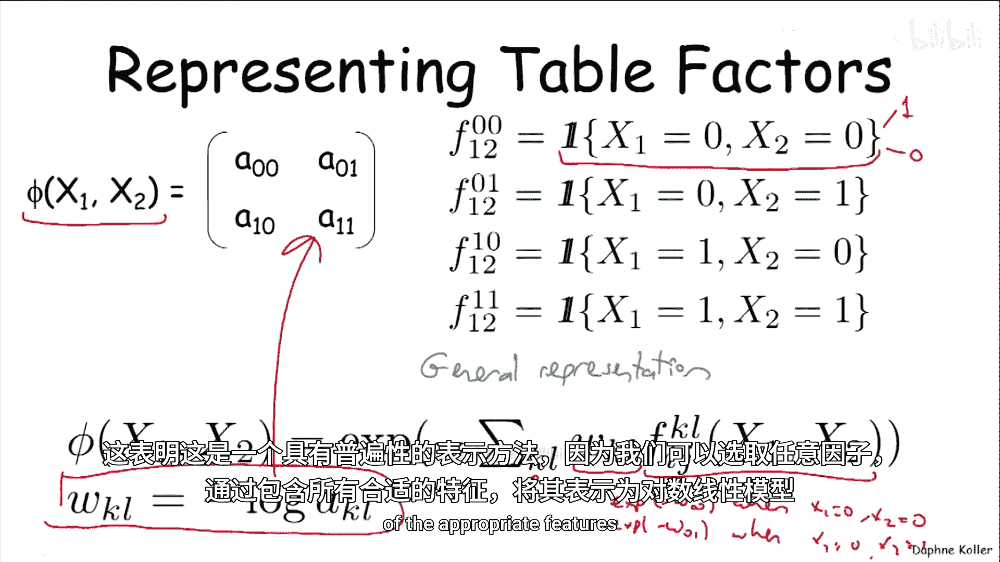
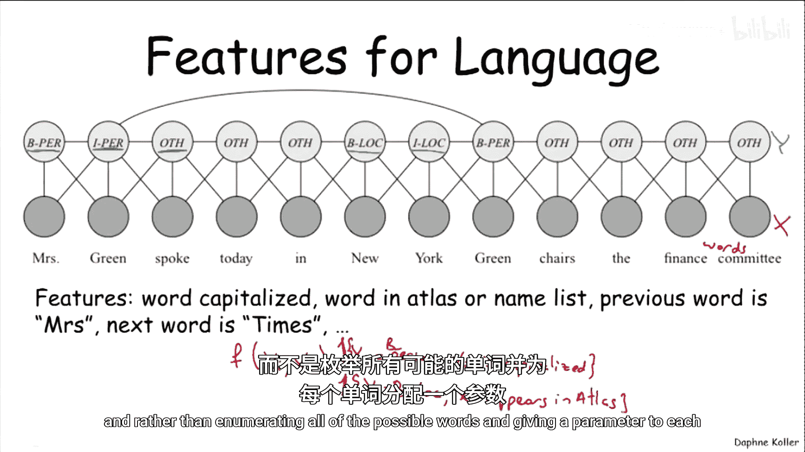
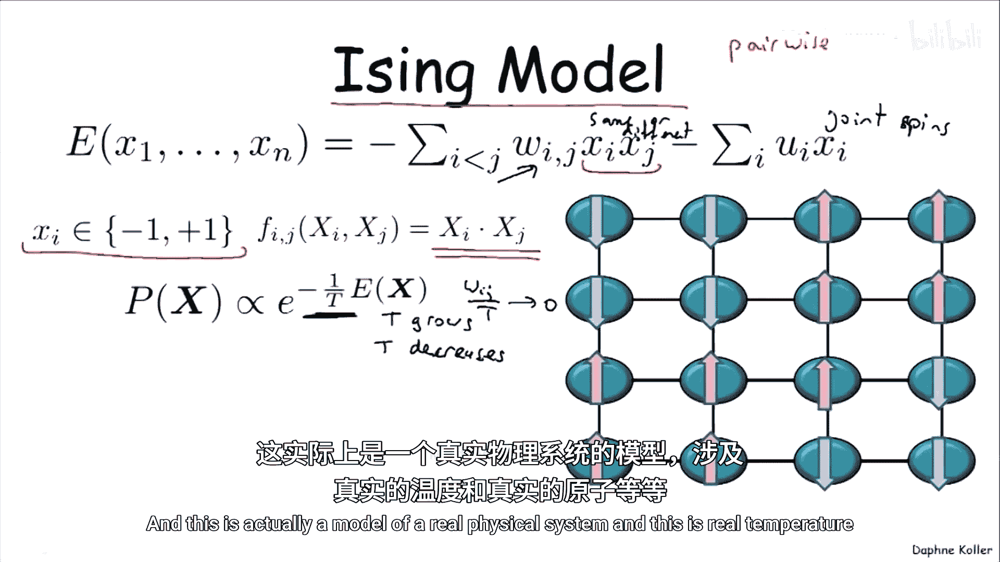
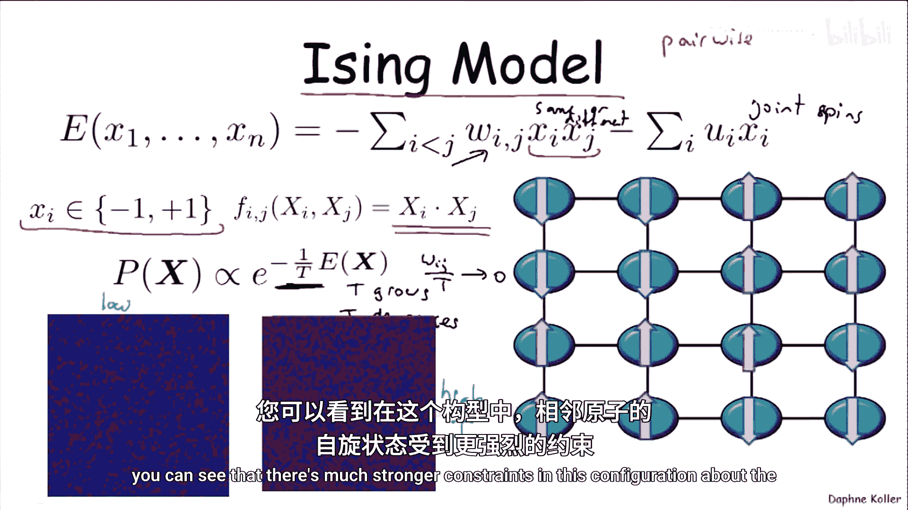
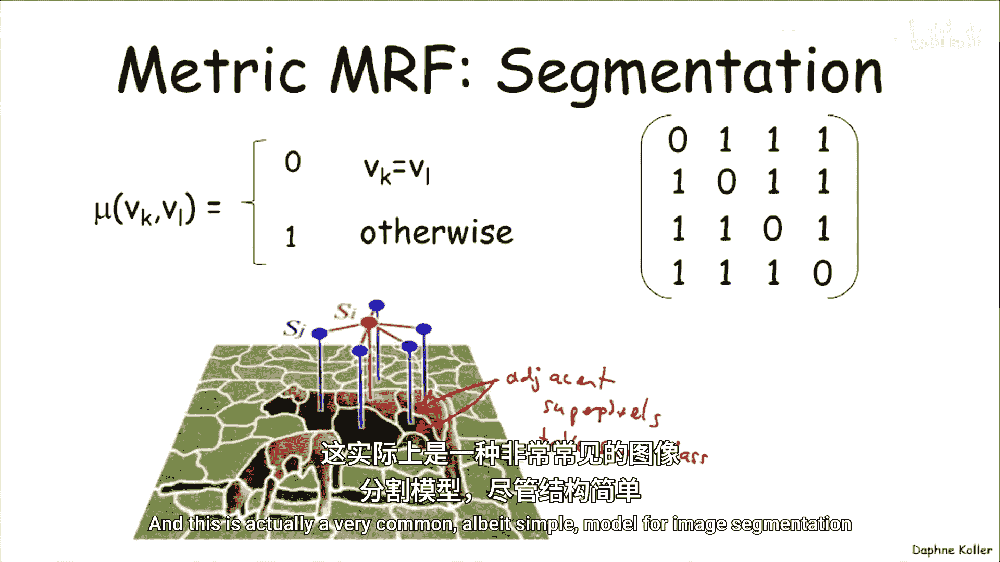
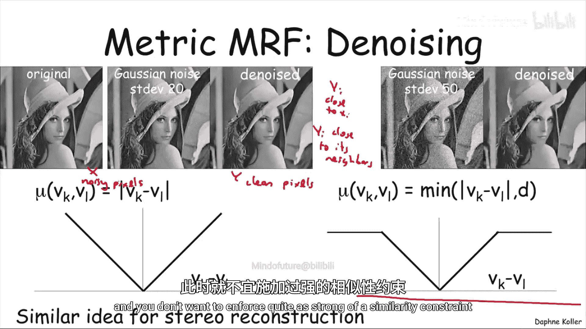

# 概率图模型：1.5.3：对数线性模型

在本节课中，我们将学习如何在无向模型中引入局部结构，其核心框架被称为**对数线性模型**。我们将了解其基本形式、如何表示因子，以及它在实际应用中的几个例子。

---

## 引入对数线性模型

在上一节中，我们讨论了有向和无向模型中局部结构的重要性。本节中，我们来看看如何在无向模型中具体地融入局部结构。

其核心框架被称为**对数线性模型**，原因稍后会变得清晰。

在原始的未归一化密度表示中，我们定义 **P̃** 为一系列因子 **φᵢ(Dᵢ)** 的乘积，每个因子可能是一个完整的参数表。

现在，我们将把这种表示转换为一种使用线性形式的方法。其形式如下：

**P̃(x) = exp( Σⱼ wⱼ fⱼ(Dⱼ) )**

这被称为“对数线性”模型，因为取对数后，**log P̃(x) = Σⱼ wⱼ fⱼ(Dⱼ)**，是一个关于特征的线性函数。

在这个形式中：
*   **wⱼ** 被称为**系数**或**权重**。
*   **fⱼ(Dⱼ)** 被称为**特征**。每个特征，类似于因子，都有一个作用域 **Dⱼ**，即它所依赖的变量集合。
*   不同的特征可以拥有相同的作用域，即可以对同一组变量定义多个特征。

将指数函数移入求和内部，我们得到：

**P̃(x) = Πⱼ exp( wⱼ fⱼ(Dⱼ) )**

我们可以将每个 **exp( wⱼ fⱼ(Dⱼ) )** 视为一个小的因子，但这个因子只有一个参数 **wⱼ**。

---

## 用对数线性模型表示因子

这个概念有些抽象，让我们看一个具体的例子：如何将一个简单的表格因子表示为对数线性模型。

假设有一个因子 **φ** 作用于两个二元随机变量 **X₁** 和 **X₂**。一个完整的表格因子会有四个参数：**a₀₀, a₀₁, a₁₀, a₁₁**。

我们可以使用一组**指示函数**特征来捕获这个因子。指示函数的形式为 **1{条件}**，当条件满足时值为1，否则为0。

为了表示这个因子，我们可以定义四个特征，每个对应表格中的一个条目：

**fₖₗ(x₁, x₂) = 1{x₁=k, x₂=l}**，其中 **k, l ∈ {0, 1}**

然后，将对数线性模型定义为：

**P̃(x₁, x₂) = exp( Σₖ Σₗ wₖₗ * 1{x₁=k, x₂=l} )**

如果我们定义权重 **wₖₗ = -log(aₖₗ)**，那么通过计算可以验证，这个对数线性模型正好还原出原始的因子 **φ**。

这表明，对数线性模型是一种通用的表示方法。我们可以通过包含所有可能的细粒度特征来表示任何因子。但在实践中，我们通常希望使用更精简、更有意义的特征集。

---

## 实践中的特征示例

以下是实际应用中常用的几种特征类型。

### 语言模型中的特征

考虑一个命名实体识别任务中的语言模型。我们有两组变量：
*   **Y**：序列中每个词的标签（如人名、地名、机构名的开始或延续部分）。
*   **X**：句子中实际的词。

使用完整的表格来关联每个 **Yᵢ** 和所有可能的 **Xᵢ** 会非常低效。相反，我们可以定义更智能的特征：

*   **特征1**：**f₁(yᵢ, xᵢ) = 1{yᵢ = “人名-B” 且 xᵢ 首字母大写}**
    *   这个特征不关心具体是哪个词，只关心该词是否大写，并用一个权重参数来量化“大写”对识别“人名”的重要性。
*   **特征2**：**f₂(yᵢ, xᵢ) = 1{yᵢ = “地名-B” 且 xᵢ 出现在地图册中}**
    *   这个特征利用外部知识（地图册），赋予出现在其中的词更高的概率被标记为地名。

通过组合大量此类有意义的特征，我们可以构建一个强大而高效的模型。

### 伊辛模型（统计物理学）

伊辛模型是一个成对马尔可夫网络，变量是二元取值 **{-1, +1}**，代表电子的自旋方向。它关注相邻变量对。

其核心特征是相邻变量值的乘积：

**fᵢⱼ(xᵢ, xⱼ) = xᵢ * xⱼ**

由于 **1 * 1 = (-1) * (-1) = 1**，而 **1 * (-1) = -1**，因此这个特征本质上衡量相邻原子是**同向自旋**（值高）还是**反向自旋**（值低）。权重 **wᵢⱼ** 的正负决定了模型是倾向于铁磁性（同向）还是反铁磁性（反向）。

模型中还引入了**温度 T** 的概念：

**P̃(x) = exp( Σ_{(i,j)} (wᵢⱼ / T) * (xᵢ * xⱼ) )**

*   高温时（**T** 很大），权重项趋近于0，相邻原子几乎独立。
*   低温时（**T** 很小），相互作用项的影响变得显著，系统倾向于形成一致的自旋区域。

### 度量马尔可夫随机场

这种模型常用于变量取值于同一个标签空间 **V**（例如，所有变量都是类别标签）的情况。我们希望相邻变量 **Xᵢ** 和 **Xⱼ** 的取值相似。

为此，我们引入一个**距离函数 μ**，它衡量两个标签 **vₖ** 和 **vₗ** 之间的差异。距离函数通常满足：
1.  **非负性**：**μ(vₖ, vₗ) ≥ 0**
2.  **同一性**：**μ(vₖ, vₗ) = 0** 当且仅当 **vₖ = vₗ**
3.  **对称性**：**μ(vₖ, vₗ) = μ(vₗ, vₖ)**
4.  **三角不等式**：**μ(vₖ, vₗ) ≤ μ(vₖ, vₘ) + μ(vₘ, vₗ)** （满足前三条称为半度量，满足全部四条称为度量）。

在MRF中，我们定义特征为：

**fᵢⱼ(xᵢ, xⱼ) = μ(xᵢ, xⱼ)**

并配合一个**负的**权重 **wᵢⱼ < 0**。这样，模型的对数概率为：

**log P̃ ∝ Σ_{(i,j)} wᵢⱼ * μ(xᵢ, xⱼ)**

由于 **wᵢⱼ** 为负，**μ(xᵢ, xⱼ)** 越小（即标签越相似），该项的贡献越大，整个配置的概率也就越高。反之，标签差异越大，概率越低。

以下是几种常见的度量函数：
*   **简单度量**：**μ(vₖ, vₗ) = 0** 如果 **vₖ = vₗ**，否则为 **1**。这鼓励相邻变量取相同标签，但不关心具体是哪个标签。
*   **绝对差度量**：**μ(vₖ, vₗ) = |vₖ - vₗ|**。适用于数值型标签，惩罚与差值成线性关系。
*   **截断线性度量**：**μ(vₖ, vₗ) = min( c, |vₖ - vₗ| )**。当差值超过阈值 **c** 后，惩罚不再增加。这允许在证据足够强时，相邻变量可以取截然不同的值。

度量MRF的一个典型应用是**图像分割**，我们希望相邻的超像素块倾向于被分配相同的类别标签。

---

## 应用案例：图像去噪与立体视觉

让我们看两个基于度量MRF思想的具体计算机视觉应用。

### 图像去噪

我们有一个含噪声的图像（观测变量 **X**）和希望恢复的干净图像（隐变量 **Y**）。我们建立模型关联 **X** 和 **Y**，并施加两种约束：
1.  **数据保真项**：每个干净像素 **Yᵢ** 应接近其观测到的噪声像素 **Xᵢ**。
2.  **空间平滑项**：相邻的干净像素 **Yᵢ** 和 **Yⱼ** 应具有相似的值（这是一个度量MRF）。

如果仅使用线性惩罚（如绝对差），模型会过于脆弱，可能将整个图像平滑成一片灰色。因此，**截断线性度量**在这里非常有效：它允许在颜色或纹理发生显著变化的边界处，相邻像素可以拥有不同的强度值，从而在去噪的同时保留边缘。

### 立体视觉重建

在立体视觉中，我们希望根据左右图像的匹配，推断出每个像素的**视差**（深度，变量 **Y**）。同样，我们利用空间连续性先验：相邻像素的深度应该相似。

这里也经常使用**截断线性度量**模型，因为场景中存在深度不连续的物体边界。模型还可以进行增强，例如，根据相邻像素的颜色和纹理相似性来动态调整平滑强度：颜色纹理越相似，平滑约束越强；差异越大，约束越弱，允许深度在此处发生跳变。

---

## 总结

在本节课中，我们一起学习了**对数线性模型**，这是在无向图中引入局部结构的重要框架。

*   我们首先看到了如何将传统的因子乘积形式，转化为基于特征加权求和的指数形式。
*   通过例子，我们理解了任何因子都可以用对数线性模型表示，但实践中我们使用更精简、更有意义的特征。
*   接着，我们探讨了语言模型中的二值特征、统计物理中的伊辛模型特征，以及广泛使用的度量特征。
*   最后，我们看到了度量MRF，特别是截断线性度量，在图像去噪和立体视觉等实际问题中的强大应用。

对数线性模型通过定义灵活的特征，使我们能够构建参数更少、表达力更强、更适合特定问题领域的概率图模型。