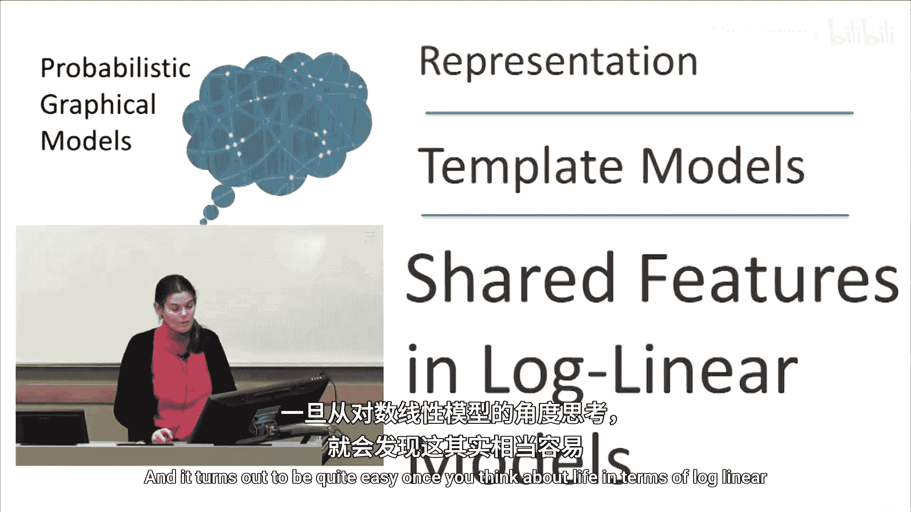
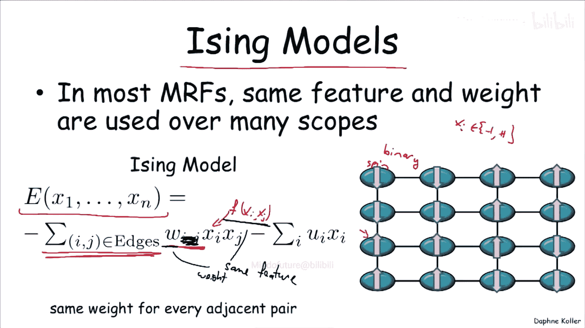
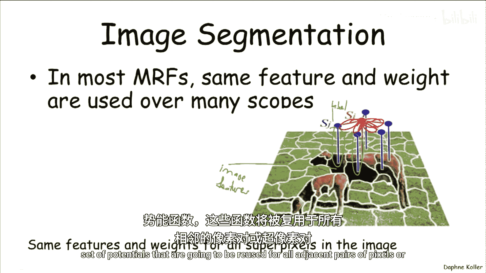
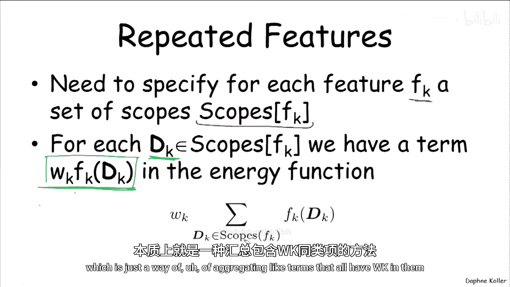
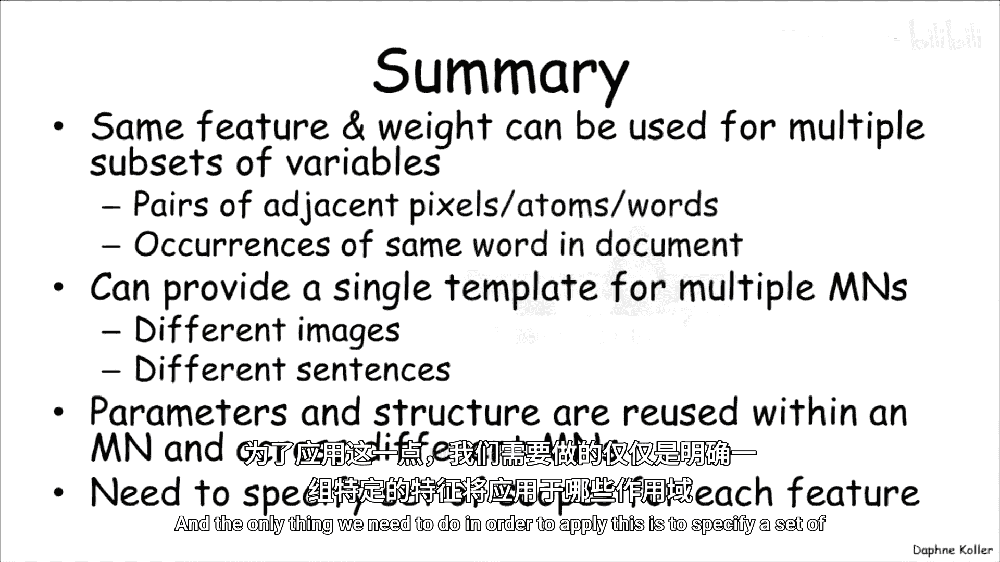

# 034：对数线性模型中的共享特征 🧩

在本节中，我们将学习无向图模型，特别是对数线性模型中，如何实现结构和参数的共享。共享机制在无向模型中尤为重要，因为与有向模型不同，无向模型的参数（通常表示为能量函数中的权重）不直接代表条件概率或概率，因此将它们设计为可复用的“模板”或“构建块”会更为简便。

上一节我们讨论了有向模型中的参数共享，本节中我们来看看无向模型中的情况。

## 共享参数的必要性

在无向模型中，指定参数通常更为困难。因此，将模型表示为由更小组件构成的模板是一种更自然的方法。对数线性模型为此提供了一种简洁的框架。

## 伊辛模型示例

让我们从一个简单的例子开始：伊辛模型。该模型最初用于统计物理学，描述网格中原子的自旋。

在伊辛模型中，每个随机变量 \( X_i \) 代表一个原子的自旋，取值为 +1 或 -1。模型的能量函数是所有边上能量项的总和。

最初，我们可能为每对相邻原子 \((i, j)\) 设置一个独立的权重参数 \( W_{ij} \) 和一个特征函数 \( f(X_i, X_j) \)。特征函数通常是两者取值的乘积：\( f(X_i, X_j) = X_i \times X_j \)。当两个自旋方向相同时，乘积为 +1；相反时，乘积为 -1。

然而，我们通常不会为材料中的每一对原子都设置一个不同的模型。更常见的做法是，使用一个**共享的权重参数 \( W \)** 来表示所有相邻原子对之间的相互影响程度。这样，我们就有了一个在模型的不同随机变量对之间**复用相同特征和相同权重**的模型。

**公式表示**：
原始的每边独立参数模型：\( \text{Energy} = \sum_{(i,j) \in \text{Edges}} W_{ij} \cdot (X_i \times X_j) \)
共享参数后：\( \text{Energy} = W \cdot \sum_{(i,j) \in \text{Edges}} (X_i \times X_j) \)

## 自然语言处理示例

在诸如命名实体识别的自然语言处理任务中，参数共享同样普遍。

以下是模型中常见的特征类型：
*   **词本身特征**：例如，如果单词 \( X_i \) 是大写的，那么其标签 \( Y_i \) 更可能是“人名”。这个特征（标签是“人名”且单词大写）会在序列的**每一个位置** \( i \) 上出现，并且我们希望对所有位置使用相同的权重参数。
*   **上下文特征**：例如，如果前一个词是“Ms.”，那么当前词更可能是人名。这种描述相邻标签 \( Y_{i-1} \) 和 \( Y_i \) 关系的特征，也会在序列的**每一对相邻位置**上重复使用。

我们不会为序列中不同位置上的相同语言学现象设置不同的参数。因此，相同的特征及其关联的权重会在整个序列中重复应用。

## 图像分割示例

在图像分割任务中，我们需要为每个像素或超像素分配一个标签（如“前景”、“背景”）。

模型中包含两种主要的势函数（即特征）：
*   **节点势**：连接图像特征（如颜色、纹理）和像素标签的特征。对于图像中的所有像素，我们会使用**完全相同的节点势函数和权重**。
*   **边势**：鼓励相邻像素具有相同标签的特征。对于图像中所有相邻的像素对，我们会复用**相同的边势函数和权重**。

## 实现方法：特征与作用域

那么，我们如何在对数线性模型中形式化地实现这种共享呢？方法其实非常简单。

我们需要为每一个希望复用的特征 \( f_k \) 指定一个**作用域集合**。这个集合定义了该特征将被应用到模型中的哪些变量子集上。

**公式表示**：
共享特征后的能量函数形式为：
\[
\text{Energy}(\mathbf{x}) = \sum_{k} \left[ w_k \cdot \sum_{\mathbf{d} \in \text{Scopes}(f_k)} f_k(\mathbf{x}_{\mathbf{d}}) \right]
\]
其中：
*   \( w_k \) 是第 \( k \) 个特征的**共享权重**（仅依赖于特征索引 \( k \)）。
*   \( \text{Scopes}(f_k) \) 是特征 \( f_k \) 应用的**作用域集合**。每个作用域 \( \mathbf{d} \) 是模型变量的一个子集（如一对相邻像素的索引）。
*   \( f_k(\mathbf{x}_{\mathbf{d}}) \) 是特征函数在具体作用域变量取值上的计算结果。

例如，在图像分割中，一个边特征 \( f_{\text{edge}} \) 的作用域集合可以是所有相邻超像素对 \((Y_i, Y_j)\) 的集合。这样，该特征及其权重 \( w_{\text{edge}} \) 就被应用到了模型中所有满足“相邻”关系的变量对上。

这实质上就是将模型中所有具有相同权重 \( w_k \) 的项（因为它们对应同一个特征）聚合起来。

## 本节总结

在本节课中，我们一起学习了在对数线性模型中实现参数共享的核心机制。

*   共享相同的**特征**和**权重**在无向模型中非常常见，伊辛模型、自然语言处理和图像分割都是典型例子。
*   这种机制允许我们为多个马尔可夫网络（如不同的句子或不同的图像）提供一个统一的模板，从而在**网络内部**和**不同网络之间**复用结构和参数。
*   实现的关键在于为每个特征指定一个**作用域集合**，该集合定义了特征在模型变量上的所有应用实例。

通过这种方式，我们可以用有限的参数构建出表达能力强且可扩展的概率图模型。