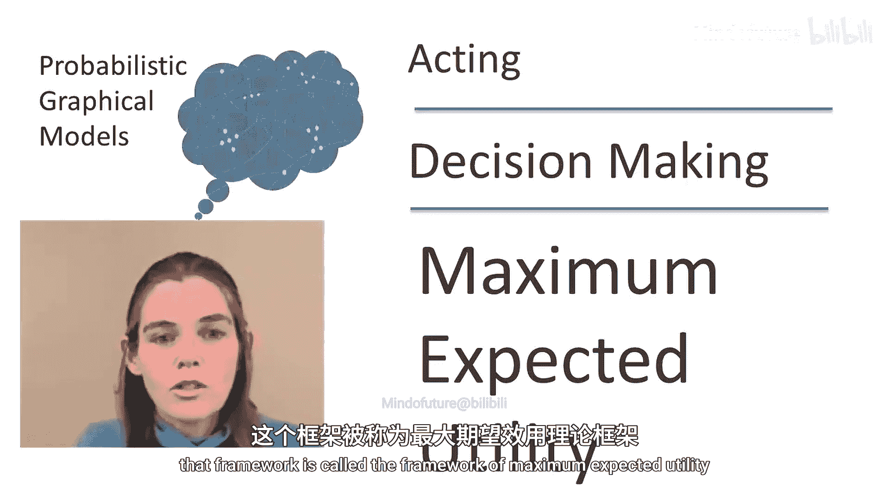
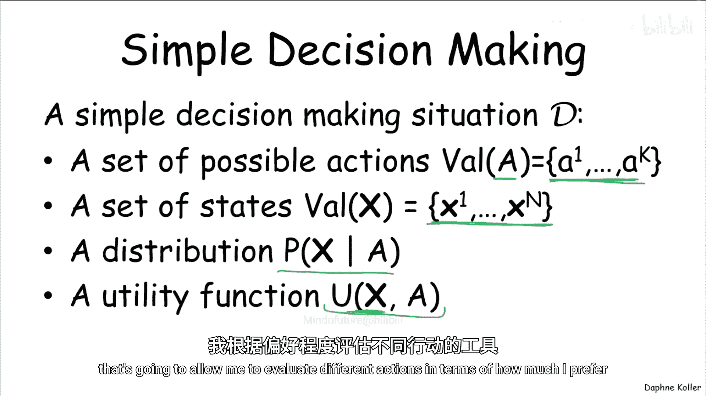
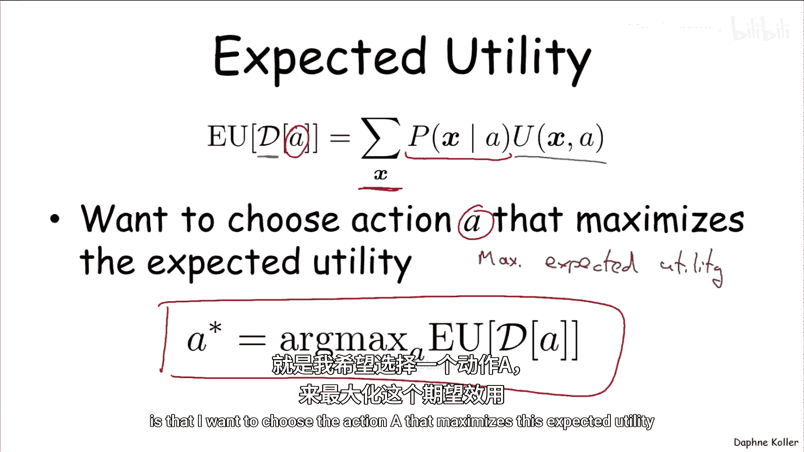
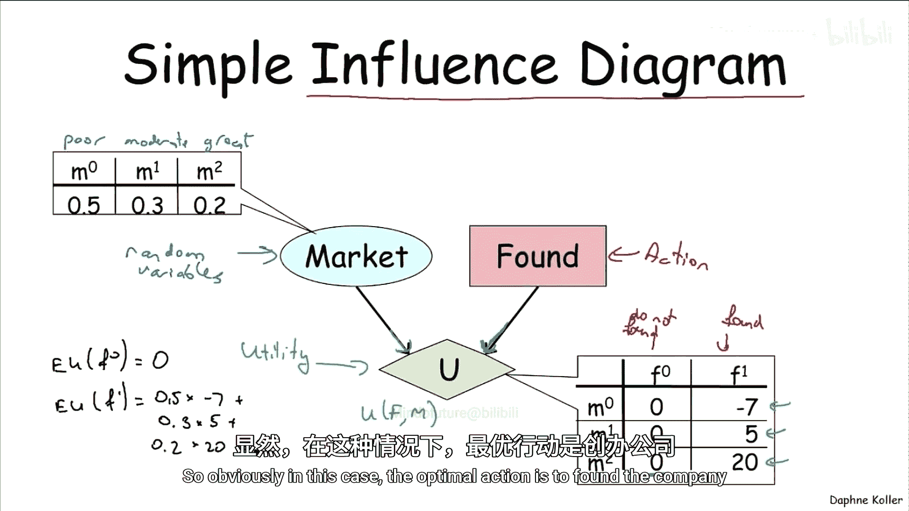
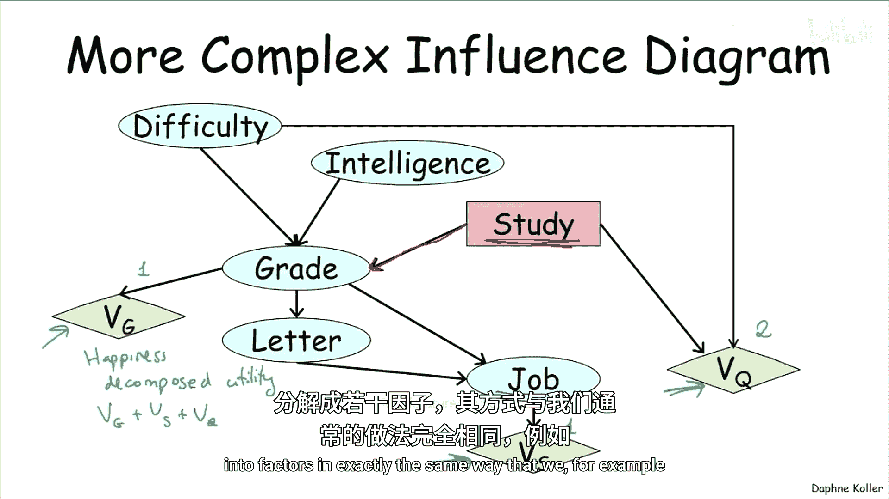
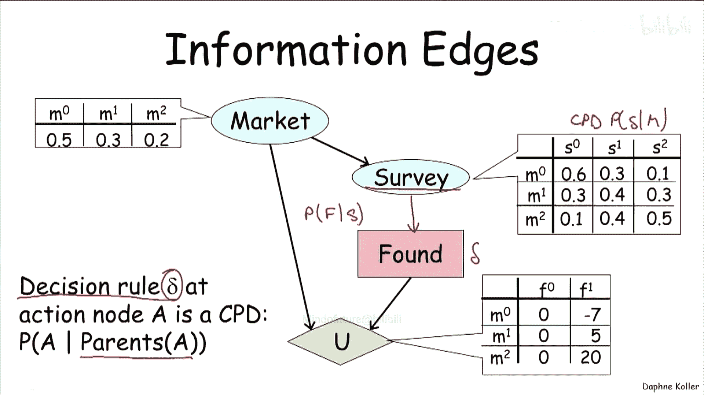
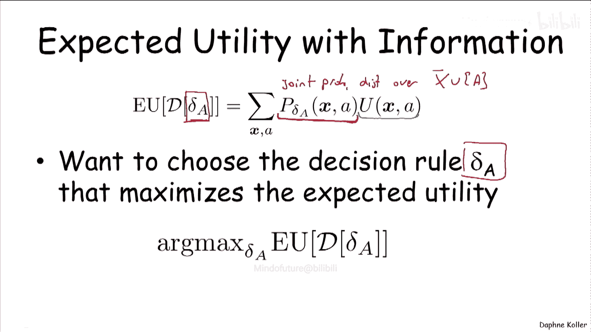
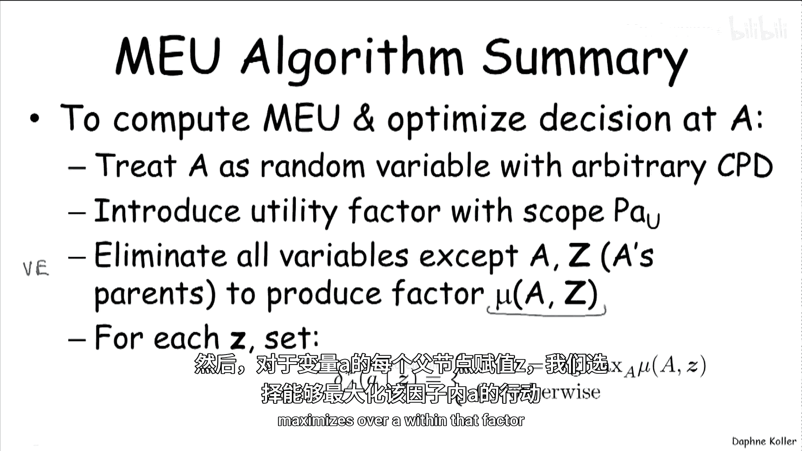
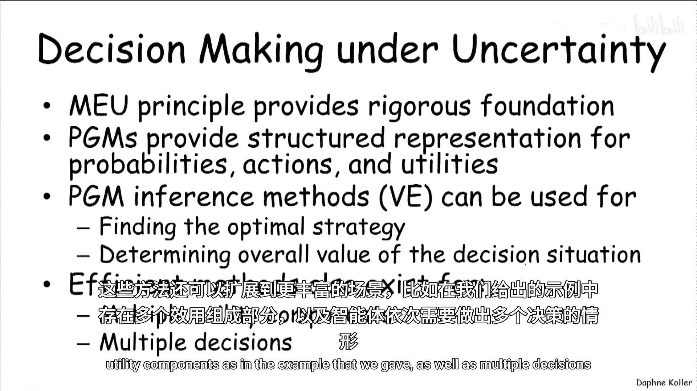

# 概率图模型：第35讲：最大期望效用

在本节课中，我们将学习如何利用概率图模型进行决策。我们将介绍最大期望效用原则，并学习如何使用影响图来形式化决策问题，以及如何通过变量消除算法找到最优决策策略。

---

## 概述：从推理到决策

上一节我们介绍了如何使用概率图模型进行各种推理任务，例如计算条件概率或寻找最大后验概率分配。然而，在实际应用中，我们通常需要基于概率分布做出决策。例如，医生诊断病人后，最终需要决定采取何种治疗方案。

那么，如何利用概率分布，特别是概率图模型，来做出好的决策呢？解决这类推理任务的理论基础早在概率图模型兴起之前就已建立，这个框架被称为**最大期望效用**框架。

---

## 决策问题的构成要素

一个简单的决策情境包含以下要素：

*   **行动 A**：决策者可以采取的一系列选择。例如，医生可以给病人使用的不同药物。
*   **世界状态 X**：一组变量 `X1, ..., Xn`，描述了世界的状态。行动可以影响其中某些状态的发生。这些状态可能包括决策者无法影响的因素（如病人的先天疾病或检测结果），也可能包括可以影响的因素（如给药后病人的结果）。
*   **效用函数 U**：用于定义决策者偏好的数值函数。它量化了在特定世界状态下采取特定行动能给决策者带来的“满意度”或“幸福感”。

以下是决策问题的构成要素示意图：

---

## 最大期望效用原则

现在，我们可以为决策问题 `D` 中的某个行动 `A` 定义**期望效用**。其计算方式是一个简单的期望值：

**公式：EU(A) = Σ_x P(x | A) * U(x, A)**

其中，我们对所有可能的世界状态 `x` 求和。`P(x | A)` 是在采取行动 `A` 的情况下达到状态 `x` 的概率，`U(x, A)` 是在该状态下采取该行动的效用。

显然，我们希望最大化整体的平均“幸福感”。因此，**最大期望效用**原则就是：选择能够最大化上述期望效用的行动 `A`。

**公式：A* = argmax_A EU(A)**

---

## 影响图：决策的图模型表示

我们可以利用图模型的思想，以一种易于解释的方式来表示决策情境。这种结构被称为**影响图**，它是贝叶斯网络的扩展，增加了两种节点：

*   **随机变量**：用椭圆形表示，代表世界状态 `X` 的一部分。
*   **行动变量**：用矩形表示，代表由决策者（而非自然）选择其值的变量。
*   **效用节点**：用绿色菱形表示，代表效用函数。

让我们看一个简单的例子：一位刚毕业的企业家决定是否创办一家公司。

*   **行动 F**：`F0`（不创办，找传统工作）或 `F1`（创办公司）。
*   **随机变量 M**：小部件市场状况，可能为 `Poor`（差）、`Moderate`（中等）或 `Great`（好），有其概率分布。
*   **效用节点 V**：依赖于行动 `F` 和市场 `M`。其父节点表示效用函数所依赖的变量。

效用值示例如下：
*   `U(F0, M) = 0` （无论市场如何，不创办则效用为0）
*   `U(F1, Poor) = -7`
*   `U(F1, Moderate) = 5`
*   `U(F1, Great) = 20`

现在我们可以计算两个行动的期望效用：
*   `EU(F0) = 0`
*   `EU(F1) = P(Poor) * (-7) + P(Moderate) * 5 + P(Great) * 20 = 0.5*(-7) + 0.3*5 + 0.2*20 = 2`

因此，最优行动是创办公司 (`F1`)。

---

## 更复杂的影响图与效用分解

让我们看一个更复杂的影响图，它基于学生网络，并引入了**效用分解**的概念。

此图包含：
*   **随机变量**：课程难度(`D`)、学生智力(`I`)、成绩(`G`)、推荐信质量(`L`)、工作前景(`J`)。
*   **行动变量**：是否学习(`S`)。
*   **多个效用节点**：
    *   `V_G`：对成绩本身的满意度。
    *   `V_J`：对工作前景的满意度。
    *   `V_Q`：学习期间的生活质量（依赖于学习行动 `S` 和课程难度 `D`）。

我们假设智能体的**总效用是这些分量的和**：`U_total = V_G + V_J + V_Q`。这被称为**分解的效用函数**。

为什么要分解效用函数？因为总效用依赖于许多因素。如果用一个单一的、庞大的效用函数来表示，它会有很多参数（例如，依赖于`G`, `J`, `S`, `D`），导致需要评估的组合数量呈指数级增长，难以确定。分解效用函数就像我们将联合概率分布分解为因子乘积一样，可以简化表示和计算。

---

## 决策时的可用信息

影响图还能表示决策者在做决定时可用的**信息**。让我们扩展企业家的例子。

现在，企业家在决定是否创办公司前，有机会进行一次市场调查(`Survey`)。调查结果不完全可靠，因此有一个条件概率分布(`CPD`) `P(Survey | Market)`。

关键点在于，进行**调查后**，代理人可以**基于调查结果**做出决定。图中从 `Survey` 节点指向行动节点 `F` 的边就表示了这一点。这意味着，代理人可以选择一个**决策规则** `δ`。

**决策规则 `δ(A | Parents(A))`** 本质上是一个条件概率分布(`CPD`)，它告诉代理人，在观察到其父节点（即做决定前能看到的变量，此处是 `Survey`）的取值后，应以何种概率分布来选择行动 `A` 的值。

在单智能体决策中，最优决策规则通常是确定性的（即概率为0或1），但将其形式化为`CPD`在更一般的设定中是有用的。

---

## 形式化决策问题与优化

给定一个决策规则 `δ_A`，将其注入决策网络后，网络中所有变量（包括行动 `A` 和机会变量 `X`）都有了相关的`CPD`。这样，我们就定义了一个所有变量上的**联合概率分布** `P(X, A)`。

此时，智能体在选定规则 `δ_A` 后的期望效用为：

**公式：EU(δ_A) = Σ_{x, a} P(x, a) * U(x, a)**

我们对所有可能的世界状态 `x` 和行动 `a` 进行求和，计算效用的期望值。

显然，智能体希望选择能使该期望效用最大化的决策规则 `δ_A`。这就是智能体需要解决的优化问题。

---

## 寻找最优决策规则：变量消除法

我们如何找到最大化期望效用的决策规则呢？让我们从一个简单例子开始，然后推广到一般情况。

再次以企业家调查为例。期望效用表达式为：
`EU(δ_F) = Σ_{m, s, f} P(m) * P(s|m) * δ_F(f|s) * U(f, m)`

这看起来非常熟悉：它是一系列因子的乘积。其中一些是概率因子(`P(m)`, `P(s|m)`)，另一个是效用因子(`U(f, m)`)，而 `δ_F(f|s)` 是待优化的决策规则因子。

我们可以应用**变量消除算法**。目标是优化关于 `δ_F(f|s)` 的表达式。我们将不直接依赖于 `f` 和 `s` 的变量（即 `m`）求和消除掉：

1.  **求和消除 M**：对 `m` 求和，计算因子 `μ(f, s) = Σ_m P(m) * P(s|m) * U(f, m)`。这个因子 `μ` 综合了市场概率、调查可靠性和最终效用。
2.  **简化表达式**：期望效用简化为 `EU(δ_F) = Σ_{s, f} δ_F(f|s) * μ(f, s)`。
3.  **优化决策规则**：为了最大化这个和，对于每个可能的调查结果 `s`，决策规则 `δ_F` 应该将所有概率质量（即概率1）分配给能使 `μ(f, s)` 最大的那个行动 `f`。其他行动的概率为0。

**数值示例**：
假设给定概率和效用值，我们计算出因子 `μ(f, s)` 如下：
*   当调查结果 `S=差` 时：`μ(F0, 差)=0`, `μ(F1, 差)=-3.5` => 最优选择 `F0`（不创办）。
*   当调查结果 `S=中` 时：`μ(F0, 中)=0`, `μ(F1, 中)=1.5` => 最优选择 `F1`（创办）。
*   当调查结果 `S=好` 时：`μ(F0, 好)=0`, `μ(F1, 好)=4.0` => 最优选择 `F1`（创办）。

因此，最优决策规则是确定性的：见差则止，见好则进。计算此策略下的总期望效用为 `0 + 1.5 + 4.0 = 5.5`。如果**没有调查**，之前算得的最佳期望效用是2.0。因此，进行调查带来了 `5.5 - 2.0 = 3.5` 的效用增益，体现了信息的价值。

---

## 一般算法总结

对于具有单个效用节点和单个行动节点的影响图，计算最大期望效用并找到最优决策规则的步骤如下：

1.  **形式化**：将行动节点 `A` 视为一个具有未知`CPD` `δ(A | Z)` 的随机变量，其中 `Z` 是 `A` 的父节点（即决策时可观察到的信息）。
2.  **构建因子**：除了网络中原有的概率因子 `P(X_i | Parents(X_i))`，引入效用因子 `U(Scope(U))`。
3.  **变量消除**：使用变量消除算法，**消除所有除 `A` 及其父节点 `Z` 以外的变量**。这将产生一个综合因子 `μ(A, Z)`。
    *   **公式：μ(a, z) = Σ_{其他变量} [ Π_{概率因子} * U ]**
4.  **确定最优规则**：对于 `Z` 的每一种可能取值 `z`，选择使 `μ(a, z)` 最大化的行动 `a*`。
    *   **最优决策规则**：`δ*(a | z) = 1` 如果 `a = argmax_a μ(a, z)`，否则为 `0`。

---

## 总结

本节课中，我们一起学习了如何将概率图模型用于决策制定。

*   **最大期望效用原则**为我们提供了在不确定性下进行决策的严谨理论基础。
*   **影响图**框架扩展了贝叶斯网络，使我们能够紧凑地表示包含多个机会变量、多个行动以及依赖于多变量的效用的复杂高维决策场景。
*   我们可以基于概率图模型中的推理方法，特别是**变量消除算法**，来找到最优决策策略，并计算特定决策情境对智能体的总体价值。
*   这些方法还可以扩展到更丰富的场景，例如我们例子中提到的具有多个效用分量以及智能体序贯做出多个决策的情况。

通过结合概率推理与效用理论，概率图模型成为了一个强大的工具，不仅能告诉我们世界可能如何，还能指导我们如何采取行动以达到最佳预期结果。

