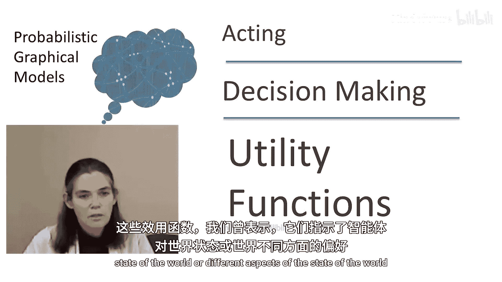
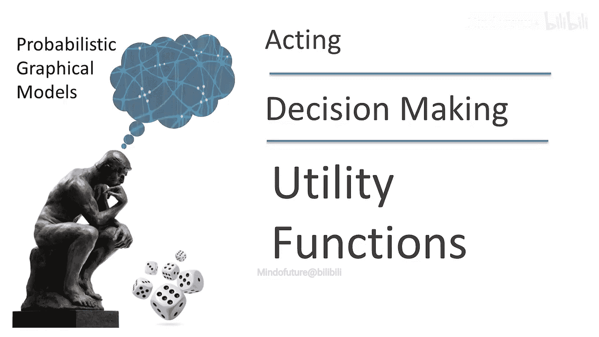
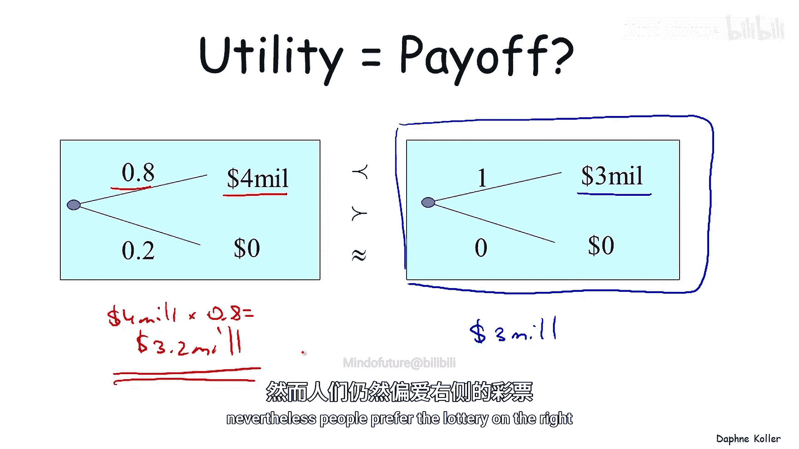
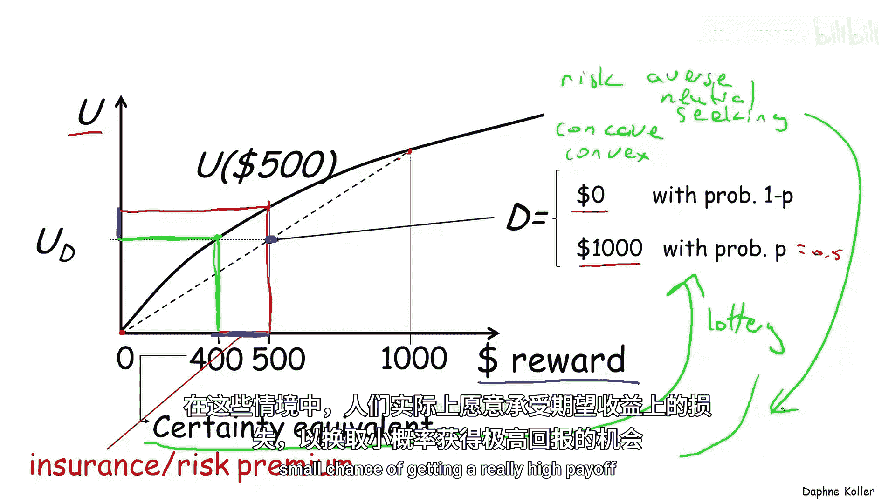
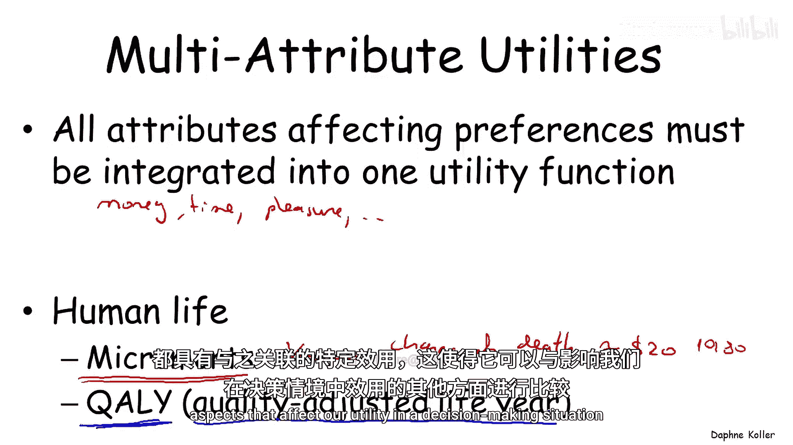
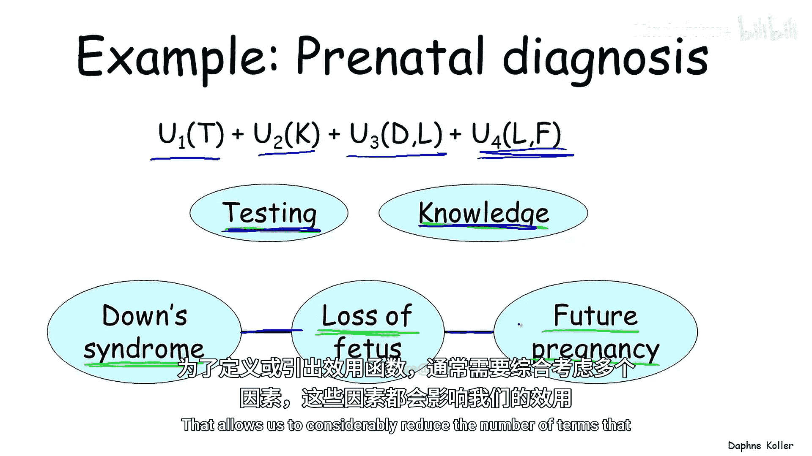
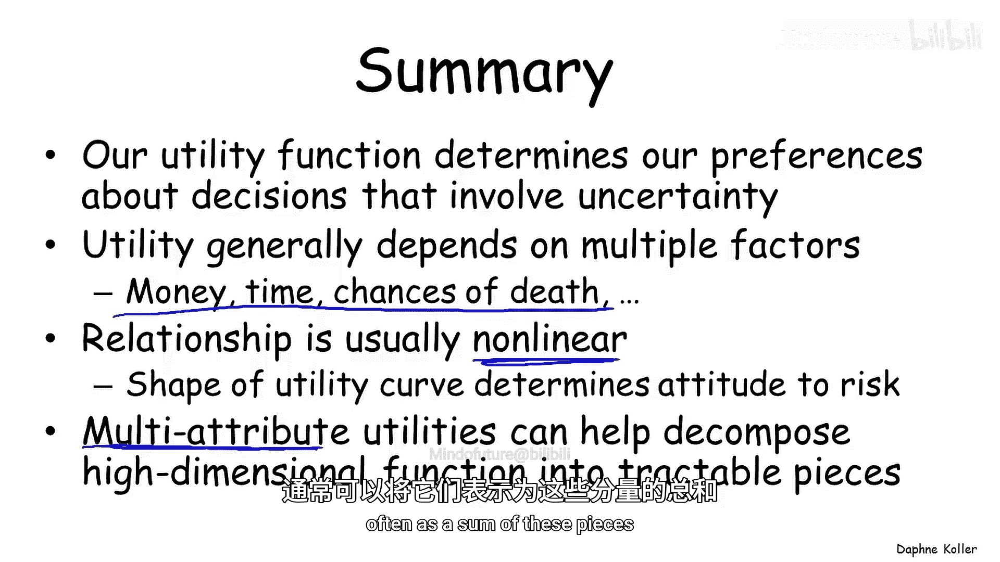
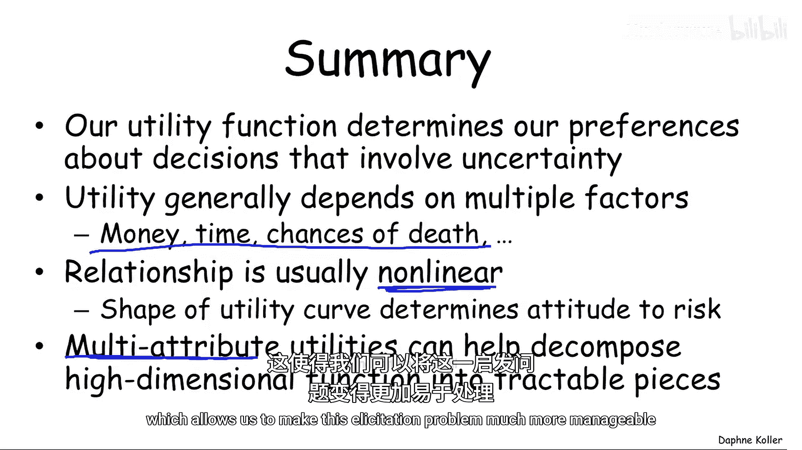

# 036：效用函数

在本节课中，我们将要学习效用函数的概念。效用函数是影响图中用于表示智能体偏好的关键组成部分。它允许我们在涉及不确定性和风险的复杂决策场景中，对不同的结果进行比较和排序。

## 效用函数的作用与来源

上一节我们介绍了影响图的基本结构，其中包含了代表智能体效用函数的节点。这些效用函数表明了智能体对于世界状态或其不同方面的偏好。

那么，这些效用函数具体是什么？它们又是如何产生的呢？

效用函数对于我们比较涉及不确定性或风险的复杂场景是必要的。一个人很容易说出他更偏好获得400万美元的结果，而不是300万美元。但要编码一个更复杂的偏好，让我们能够比较这两种所谓的“彩票”的效用，就不那么简单了。

*   左边的彩票：智能体有0.2的概率获得400万美元。
*   右边的彩票：智能体有0.25的概率获得300万美元。

如果必须做出决定，我们更偏好哪一种彩票？

事实证明，在这种场景下形式化智能体决策过程的方法，是为这些不同的结果（获得400万、300万和0美元的结果）赋予一个数值化的效用。然后，我们可以使用**最大期望效用原则**在这两种不同的彩票之间做出决定。

具体来说，我们可以比较：
*   第一种彩票的期望效用：`0.2 * U($4M) + 0.8 * U($0)`
*   第二种彩票的期望效用：`0.25 * U($3M) + 0.75 * U($0)`

通过比较这两个表达式，我们可以决定是更偏好左边、右边，还是认为它们同样好。

## 效用与回报的非线性关系

人们很自然地会假设效用应该与获得的回报金额呈线性关系，例如5美元的效用大约是10美元的一半。但事实证明，对大多数人来说情况并非如此。

以下是说明这一点的决策情境：
*   左边选项：以0.8的概率获得400万美元。
*   右边选项：确定性地获得300万美元。

大多数人倾向于选择右边的彩票。然而，如果我们计算这两种彩票的期望回报：
*   左边的期望回报：`$4M * 0.8 = $3.2M`
*   右边的期望回报：`$3M`

左边的期望回报更高，但人们仍然偏好右边的彩票。

另一个著名的例子是“圣彼得堡悖论”。这是一个假想的游戏：反复抛掷一枚公平的硬币，直到第一次出现正面。如果第一次出现正面是在第`n`次抛掷，你将获得`2^n`美元。

这个游戏的期望回报是无限的。理论上，人们可能愿意支付任意金额来玩这个游戏，因为他们的期望回报大于任何支付金额。但事实上，对大多数人来说，玩这个游戏的价值大约只有2美元。这强烈表明，他们的偏好与所赚取的金钱数额并非线性关系。

## 效用曲线与风险态度

我们可以尝试使用“效用曲线”的概念来量化这种关系。效用曲线的x轴代表你获得的美元金额，y轴代表智能体赋予该金额的效用。

让我们比较几种不同的场景。首先，看看获得500美元的效用。从500美元向上对应到效用曲线，我们可以找到该结果的效用值。

现在，考虑一个涉及风险的决策情境：一组彩票，以概率`1-P`获得0美元，以概率`P`获得1000美元。由于期望效用的线性性质，所有这些彩票都将落在这条连接`U($0)`和`U($1000)`的直线上，具体位置取决于`P`值。

如果我们看概率`P=0.5`的情况，对应的点会落在这条线上。重要的是，在这个例子中，以50%概率获得1000美元和50%概率获得0美元的彩票，其效用值明显低于确定获得500美元的效用。因此，我更喜欢确定性地获得500美元，这也是大多数人的选择。

如果我们看这个风险彩票的“价值”，即它的确定性等价物，它可能对应着确定性地获得400美元。这个400美元被称为该彩票的**确定性等价**，即你愿意用这个彩票交换的确定性金额。

期望回报与该彩票效用值之间的差值，被称为**保险溢价**或**风险溢价**。保险公司正是利用这一点来盈利，因为人们愿意接受更少的确定性金额，而不是更具风险的选择。

我们可以看到，这种具有凹形形状的曲线代表了一种**风险厌恶**的风险态度。即人们愿意为降低风险而支付费用。

效用曲线的其他形状代表不同的行为：
*   如果效用与回报呈线性关系，则称为**风险中性**。
*   如果曲线是凸函数形状，则称为**风险寻求**。风险寻求行为发生在例如拉斯维加斯或其他赌博情境中，人们愿意在期望回报上承受损失，以换取获得极高回报的小概率机会。

## 多属性效用函数

关于效用函数最后一个重要的观察是，一个人的效用通常取决于许多事物，而不仅仅是货币收益。所有影响偏好的属性都必须整合到一个单一的效用函数中。

许多人觉得这很痛苦，因为它迫使我们做一些事情，比如将人的生命或生命的损失与货币收益放在同一个尺度上衡量。关键在于，即使我们不明确地这样做，即使我们拒绝将人的生命与货币收益等同，我们做出的决策本身就表明了我们在进行这种权衡。

例如，当航空公司选择不在每次飞机着陆后都进行维护时，这是一个财务决策，因为每次维护成本太高。但同时，这无疑也增加了因事故导致生命损失的风险。不仅大公司做这些决策，我们自己也在做。我们不会每个月或每周更换汽车轮胎，因为那样成本太高，但显然，更好的轮胎可能会增加我们在事故或打滑中幸存的机会。这些权衡我们无时无刻不在进行，无论我们是否意识到。

因此，在思考决策情境时，重要的是为我们自己列出所有可能影响决策的不同事物：金钱、时间、愉悦以及许多其他属性，并思考如何将它们整合到一个单一的效用函数中。

具体到人的生命语境，人们花了大量时间思考如何将人的生命纳入效用函数。事实证明，反映人们偏好的错误策略是为“某人死亡”这个单一事件设定一个效用值，这非常难以考量。

一个普遍更好的策略是使用“微死亡”的概念，即百万分之一的死亡概率。这样就将风险明确地放入了效用函数。那么，一个微死亡价值多少？早在1980年，人们做过研究，发现一个微死亡大约值20美元（1980年价值）。当然，你可以考虑通货膨胀，但这并不是一笔巨款。事实证明，与询问死亡的效用相比，这是对涉及生命风险的结果进行效用排序的更好方法。

在医疗决策情境中，人们用于考量生命的第二种方法是“质量调整生命年”的概念。每个质量调整生命年（根据生活质量调整的一年）都有与之相关的特定效用，这使其能够与影响我们效用的其他方面进行比较。

## 效用函数的分解：一个实例

一个来自现实世界的例子是产前诊断领域。研究人员进行了大量工作，来引出涉及产前检测的效用函数。

在这个场景中，相关变量包括：
1.  婴儿是否最终会患有某种遗传疾病（他们重点关注的是唐氏综合征）。
2.  检测唐氏综合征带来的痛苦。
3.  了解未来情况的“知情安心”感。
4.  产前检测导致胎儿流失的风险。
5.  未来再次怀孕的可能性。

效用函数以复杂的方式依赖于这五个变量，这是一个相当高维的空间，难以直接引出效用值。

幸运的是，事实证明许多人的效用函数具有很多结构。具体来说，他们可以将效用函数分解为子效用的和，就像我们在影响图上下文中看到的那样。对许多人来说，这种分解看起来如下：

`U(总) = U_测试 + U_知情安心 + U_配对1(唐氏综合征， 胎儿流失) + U_配对2(胎儿流失， 未来怀孕可能性)`

人们的效用函数（对许多人而言）以这种方式分解，这实际上可以看作一个图形模型，包含单点项以及这些配对项。这使我们能够显著减少为获得可用效用函数而需要列出的项数。

## 总结

本节课中我们一起学习了效用函数的核心概念。

效用函数是我们用来确定涉及风险或不确定性的决策偏好的工具。为了定义或引出效用函数，我们通常需要考虑影响我们效用的多个因素。在大多数情况下，这些不同因素（例如金钱与效用，或微死亡与效用）之间的关系通常是非线性的，效用曲线的形状决定了一个人对风险的态度。

最后，实际的效用函数通常是一个整合了所有这些不同因素的**多属性效用函数**。将这种效用函数分解为可处理的片段（通常是这些片段的和）通常很有帮助，这可以使引出问题变得更容易管理。