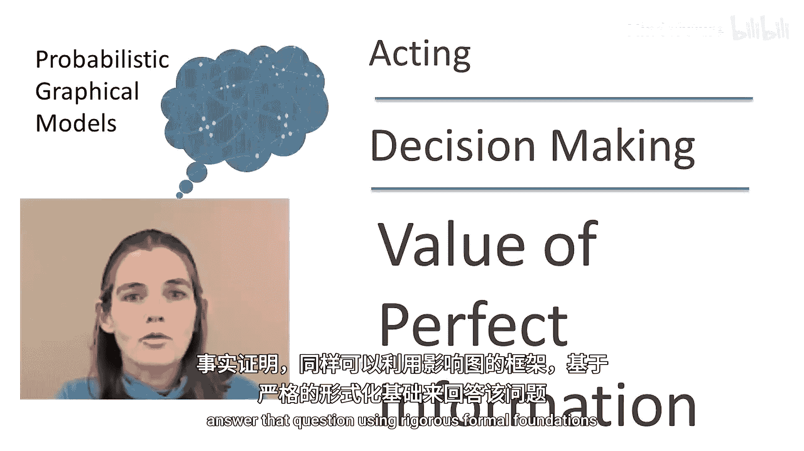
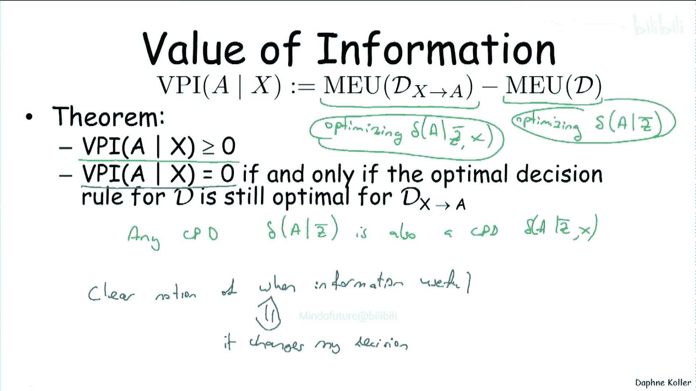
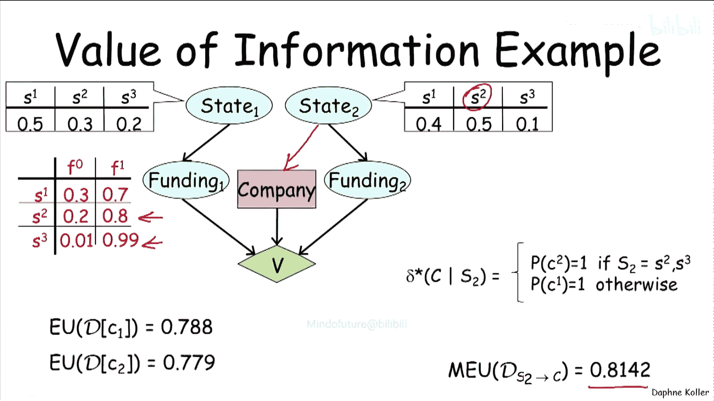
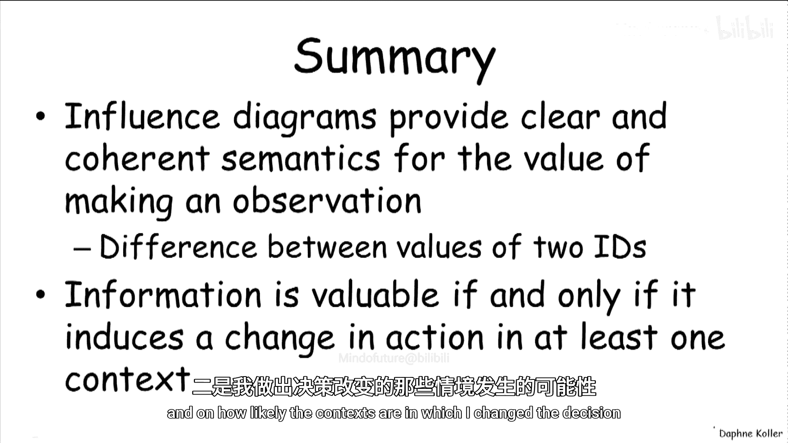

# 斯坦福概率图模型1：表示法：P37：完美信息价值

在本节课中，我们将学习如何利用影响图来评估获取信息的价值。具体来说，我们将探讨“完美信息价值”这一概念，它量化了在做出决策前，完美地观测某个变量所能带来的预期效用提升。我们将通过定义、性质分析和具体案例，来理解信息何时有价值以及其价值大小如何决定。

## 完美信息价值的定义

上一节我们介绍了影响图如何帮助智能体在给定观测下选择行动。本节中，我们来看看一个不同的问题：在做出决策前，究竟应该进行哪些观测？例如，医生需要决定为病人做哪些检查，而检查并非免费，它们可能带来痛苦、风险和经济成本。同样，在传感器网络中，我们需要决定激活哪个传感器，因为信息传输需要消耗能量。

事实证明，影响图框架同样可以为这类问题提供严谨的形式化基础。那么，我们如何为“获取信息的价值”或“进行观测的价值”这一概念提供形式化语义呢？

其形式化定义是**完美信息价值**。关于变量 **X** 的完美信息价值，是指在选择行动 **A** 之前观测 **X** 所能带来的价值，其中“完美”意味着观测 **X** 时没有任何噪声。

如何赋予这个价值一个形式化的数值呢？假设 **D** 是我们最初的影响图，那时我们还没有机会观测 **X**。我们可以将 **D** 的价值与另一个不同的影响图的价值进行比较。这个新的影响图在 **D** 的基础上增加了一条从 **X** 指向决策节点 **A** 的边，因为这代表了如果我们有能力进行该观测，所处情境的价值。

因此，我们可以将完美信息价值定义为：在拥有此观测的情况下，我能获得的最大期望效用，减去在没有此观测的原始情境下，智能体能获得的期望效用。用公式表示如下：

**VPI(X) = MEU(D‘) - MEU(D)**

其中，**D‘** 是增加了边 **X → A** 的影响图。

在我们之前展示的例子中，我们比较了两种决策情境：一种是智能体在没有任何关于市场价值的额外信息的情况下决定是否创立公司；另一种是智能体在决定是否创立公司前，可以先观测调查变量 **S**。我们计算了增加边 **S → F** 后的决策情境价值（3.25）与原始决策情境 **D** 的价值（2）之差。因此，完美信息价值为 **1.25**。这意味着，为了进行这项调查，智能体愿意支付最多 **1.25** 个效用点，因为这样做会增加他的期望效用。

## 完美信息价值的性质

现在，让我们来看看完美信息价值的一些重要性质。

### 性质一：非负性

第一个重要性质是，假设信息本身没有成本（例如，不考虑进行调查可能花费的代价），那么完美信息价值总是**大于或等于零**。

让我们先来理解为什么这是正确的。观察上面的表达式，它比较了两个不同影响图的最大期望效用。请记住，每个值都是通过优化决策规则得到的。原始影响图 **D** 的 **MEU** 是优化决策规则 **δ(A | Pa(A))** 得到的，其中 **Pa(A)** 是 **A** 当前的父节点集 **Z**。而新的影响图 **D‘** 则是优化决策规则 **δ(A | Pa(A), X)** 得到的，其中 **A** 的父节点集是原来的 **Z** 加上额外父节点 **X**。

从这个角度看，一个显而易见的关键点是：后一类决策规则（**δ(A | Z, X)**）是前一类决策规则（**δ(A | Z)**）的一个**严格更大的集合**。也就是说，任何形式为 **δ(A | Z)** 的决策规则，也都可以表示为形式 **δ(A | Z, X)**。这意味着，任何我可以在原始影响图中实现的决策规则，同样可以在新的、更丰富的影响图中实现。如果该规则在原始图中有某个期望效用值，那么在新图中它仍然具有完全相同的期望效用值。

回到我们的例子，如果智能体有一个决策规则是“无论调查结果如何都创立公司”，那么即使在他能够观测调查结果之后，这仍然是一个合法的决策规则，并且会具有完全相同的期望效用。因此，在更丰富的影响图背景下，我可以考虑的决策集合只是变得更大了，所以通过在一个更大的空间上进行优化，我不可能遭受损失。

### 性质二：零价值的条件

现在让我们思考第二个性质：完美信息价值**何时等于零**。这源于与我们刚才讨论的非常相似的原因。如果对于我的原始影响图 **D** 的最优决策规则，在扩展后的影响图 **D‘** 中仍然是最优的，那么我从信息中一无所获。因为任何我之前可以应用的决策规则，我现在仍然可以应用，因此这个额外的观测没有带来任何增益。

这为我们提供了一个非常清晰的概念，关于**信息何时是有用的**。信息有用，**当且仅当**它至少在一种情况下改变了我的决策。从另一个角度思考，如果一个观测没有能力改变我的决策，那么进行这个观测就真的没有意义。

## 案例分析：信息价值如何体现

让我们看看这个直觉如何在真实的决策场景中体现。假设我们的创业者决定不创立自己的公司，现在他试图在两家公司中选择一家加入。

对于每家公司，都有一个描述公司状态的变量。**S1** 表示公司管理不善，情况不佳；**S2** 表示中等；**S3** 表示公司运营良好。这个状态变量对两家公司都适用。

我们假设公司的创始人可以获取关于公司状态的某些信息（例如通过深入的尽职调查），因此公司获得融资的机会取决于其状态。你可以看到，如果公司状态是 **S1**（差），获得融资的概率是 **0.1**；而如果公司状态是 **S3**（好），概率则是 **0.9**。我们假设智能体的效用是：如果他加入的公司获得融资，则效用为 **1**，否则为 **0**。

以下是三种不同的公司状态概率分布和融资条件概率的设定，我们将逐一分析。

### 案例一：一家公司明显更优

首先，考虑智能体在没有任何额外信息时可以采取的两种策略。
*   如果智能体选择加入公司一，其期望效用是 **0.72**。
*   如果选择加入公司二，其期望效用仅为 **0.33**。

显然，在没有信息时，智能体会选择公司一。

现在，如果智能体可以进行一次观测呢？具体来说，我们允许智能体观测关于公司二状态 **S2** 的信息（例如在公司内部有一个线人）。那么会发生什么？

我们可以计算在不同观测结果下，选择公司二的期望效用：
*   如果观测到 **S1**（概率 0.4），选择公司二的期望效用为 **0.1**。
*   如果观测到 **S2**（概率 0.5），期望效用为 **0.4**。
*   如果观测到 **S3**（概率 0.1），期望效用为 **0.9**。

前两种情况（**S1** 和 **S2**）下的期望效用都低于智能体坚持选择公司一所能保证的 **0.72**。因此，在这两种情况下，智能体将**坚持**原来的选择，即公司一。只有在观测到 **S3** 这一种情况下，他才会改变主意选择公司二。但这种情况发生的概率很低（仅 **0.1**）。

因此，这里的信息价值会非常低。确实，计算增加观测边后的影响图的期望效用，它仅从 **0.72** 上升到 **0.743**。这意味着智能体不应该为了获取关于公司二的这个信息而付给他的线人太多钱。

### 案例二：两家公司势均力敌

现在考虑一个略有不同的情况：两家公司都不那么出色。公司一也是一家管理结构不佳、商业模式不明的初创公司。

同样，我们计算两个行动的期望效用：
*   选择公司一的期望效用是 **0.35**。
*   选择公司二的期望效用是 **0.33**。

现在，两个决策之间的平衡要精细得多。因此，你会认为获取信息的价值会高得多，因为智能体改变主意的可能性大大增加了。

让我们来分析一下。再次考虑增加从公司二状态 **S2** 到决策的边。现在，智能体在观测到 **S2** 或 **S3** 时都会想要改变主意，因为 **0.4** 和 **0.9** 都高于坚持选择公司一所能得到的期望效用（**0.35**）。

确实，在这个新影响图中，期望效用上升到了 **0.43**，相对于之前的 **0.35** 是一个显著得多的提升。因为现在信息更有价值：智能体在三种情况中的两种（总概率为 **0.6**）改变了决策。

### 案例三：融资概率普遍很高

最后，让我们看第三种情况：我们改变了公司获得融资的概率。假设回到了互联网泡沫时期，基本上每家公司都有很高的概率获得融资，即使其商业模式完全可疑。

计算期望效用：
*   选择公司一的期望效用是 **0.788**。
*   选择公司二的期望效用是 **0.779**。

这两个期望效用值再次非常接近。直观上，这意味着即使智能体改变了主意，对其期望效用的影响也微乎其微。

具体来看，当观测到 **S2** 时，选择公司二的期望效用是 **0.8**，高于 **0.788**，因此他会改变主意从公司一转向公司二。观测到 **S3** 时也是如此。但实际获得的效用增益在这种情况下相当小。计算得到，在智能体可以观测变量后再做决策的场景下，期望效用是 **0.8142**，这仅比他不做观测就能保证的 **0.788** 有很小的提升。因此，这又是一个信息价值不大的案例，公司二的那位可怜线人还是赚不到多少钱。

## 总结

本节课中，我们一起学习了如何利用影响图来形式化地评估信息的价值。

*   我们首先定义了**完美信息价值**，它是在决策前完美观测某个变量所带来的最大期望效用增量，计算公式为 **VPI(X) = MEU(D‘) - MEU(D)**。
*   接着，我们分析了其两个关键性质：**非负性**（信息无成本时，价值总不小于零）和**零价值条件**（当信息不改变最优决策时，其价值为零）。
*   最后，通过三个详细的决策案例，我们深入探讨了信息价值如何具体体现。我们发现，信息的价值取决于两个关键因素：
    1.  **改变决策的可能性**：在多少种可能的观测结果下，智能体会改变其原本的最优行动。
    2.  **改变决策带来的效用提升幅度**：在新的决策下，期望效用提高了多少。

总而言之，影响图为“进行观测”这一概念提供了一个非常清晰和优雅的解释，即两个影响图之间最大期望效用的差值。这使我们能够具体地理解信息何时有价值：**当且仅当它至少在一种情境下能引致行动的改变**。定量来看，信息的价值大小，既取决于基于该改变我的效用提升了多少，也取决于我改变决策的那些情境发生的可能性有多大。