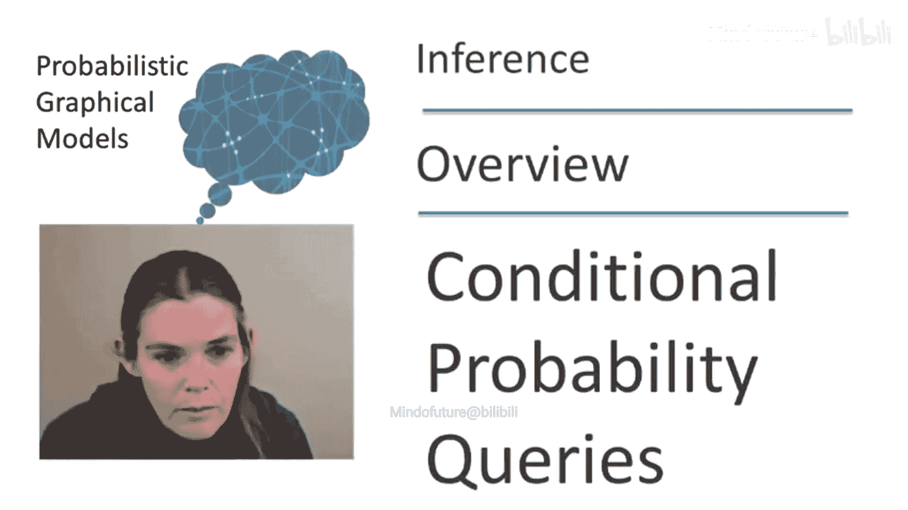
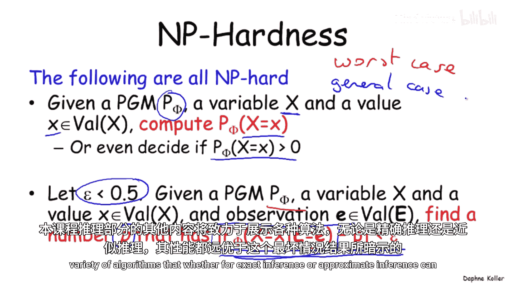
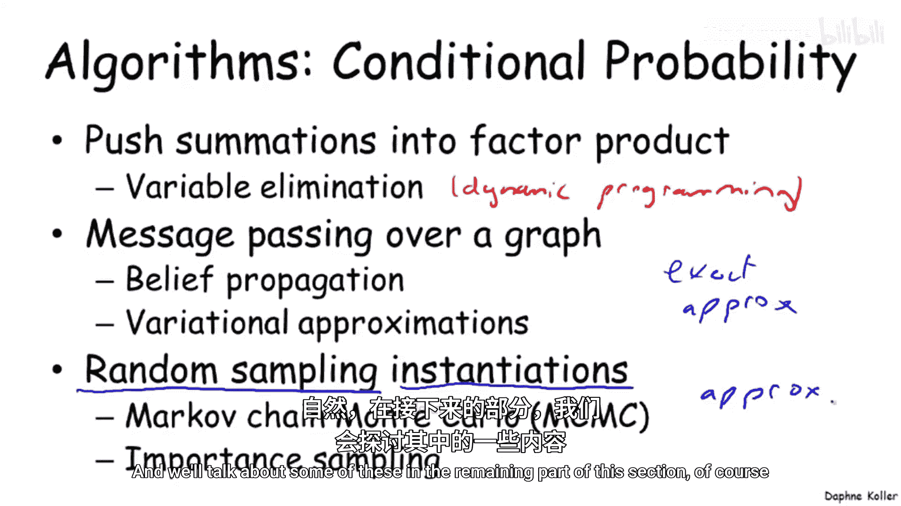

# 概率图模型：2.1：条件概率查询概述

在本节课中，我们将要学习概率图模型推理的核心任务之一：条件概率查询。我们将了解其定义、应用场景、计算复杂性，并初步探讨其计算框架。

## 条件概率查询的定义

到目前为止，我们已经详细讨论了概率图模型的表示方法。我们定义了不同类型的概率图模型，如贝叶斯网络和马尔可夫网络，并讨论了它们的独立性假设。现在，我们将探讨如何利用这种声明式的表示来回答实际的查询。

在众多查询类型中，最常用的一种是条件概率查询。让我们来定义它。

在条件概率查询中，我们有一组关于变量集 **E** 的观测值 **e**，这些是我们恰好观察到的变量。我们还有一个特定的查询变量集 **Y**。我们的目标是计算在给定证据 **E = e** 的条件下，变量 **Y** 的条件概率分布。

**公式**：`P(Y | E = e)`

这种查询在许多应用中非常有用。例如，在我们讨论过的医疗或故障诊断领域，我们可能观察到某些症状或测试结果，并希望预测不同故障模式或疾病的概率。在家谱分析示例中，我们可能观察到家族中某些个体的表型甚至基因型，并希望推断其他个体的信息。

## 推理问题的计算复杂性

不幸的是，与许多有趣的问题一样，概率图模型中的推理问题是NP难的。在深入讨论之前，我们先简要回顾一下NP难的含义。在本课程中，我们不进行正式定义，但一个粗略的直觉是：如果一个问题被证明是NP难的，那么它极不可能存在高效的解决方案。更正式地说，人们为该问题以及一系列同等难度问题设计的所有算法，其时间复杂度至少是问题表示大小的指数级。这意味着，对于任何规模稍大（例如，在我们的语境中，变量数量稍多）的问题，它都难以求解。

那么，在PGM推理的背景下，哪些具体问题是NP难的呢？

首先，PGM中的精确推理基本问题就是NP难的。给定一个由因子集 **Φ** 定义的PGM **P_Φ**，一个目标变量 **X** 及其取值 **x**，计算事件 **X = x** 的概率是NP难的。事实上，即使是一个更简单的特例——我们只想判断这个概率是否为正——也是NP难的。

有人可能会说，精确推理难以处理，但如果我们在准确性上稍作妥协呢？如果我们只寻求一个近似答案呢？毕竟，我们不一定关心概率的每一位有效数字。这会让问题变得更容易吗？不幸的是，答案是否定的。对于近似推理，存在许多不同版本的NP难结果。这里仅举一例：同样给定一个PGM、事件 **X = x** 和一些观测值，寻找一个近似答案 **P'**，并保证该近似答案与真实值的误差在 **ε** 以内，这个问题也是NP难的。这对于任何小于0.5的 **ε** 都成立。请注意，**ε** 等于0.5的近似可以通过随机猜测或直接猜测概率为0来获得。

因此，对于这类条件概率查询，任何非平凡的近似计算同样是难以处理的。

这是一个相当令人沮丧的观察结果，可能让我们想放弃使用PGM进行推理。但重要的是，这是一个最坏情况下的结果。这意味着我们可以构造一些离奇的PGM，使得指数时间是我们能做到的最好情况，但这并不意味着在一般情况下我们不能做得更好。本课程推理部分的其余内容将致力于展示一系列算法，无论是精确推理还是近似推理，其表现都可以比这个最坏情况结果所暗示的要好得多。

## 推理的计算框架：和积形式

首先，为了理解这些算法可能从何处获得其效力，让我们更深入地探讨一下推理问题。

这里有一个略微详细的学生网络版本，我们现在有了额外的变量。例如，课程的连贯性会影响其难度，以及其他一些我们暂不讨论的变量。

在这个模型以及一般情况下，概率图模型的推理使用了我们之前讨论过的因子概念。事实证明，使用因子非常方便，因为它意味着算法同样适用于贝叶斯网络和马尔可夫网络，这是一个非常有用的抽象。

让我们在因子集的背景下思考这个贝叶斯网络。例如，我们最初有变量 **C** 的先验概率 **P(C)**，它转化为一个定义域为 **{C}** 的因子。我们还有 **P(G | I, D)**，它转化为一个定义域为 **{G, I, D}** 的因子。通常，网络中的每个条件概率分布都转化为一个定义域为其家族（即变量及其父变量）的因子。

现在，假设我们的目标是计算变量 **J** 的概率 **P(J)**。我们在这里看到的是联合分布，这是我们使用贝叶斯网络的链式法则定义的。

为了计算 **P(J)**，我们需要做的是消除或边缘化除 **J** 之外的所有变量。因此，我们最终得到一个如下形式的求和式。

**公式**：`P(J) = Σ_{C,D,I,G,S,L,H} P(C, D, I, G, S, L, H, J)`

这正是为什么这种条件概率推理问题通常被称为“和积”问题，因为我们是对因子乘积进行求和。

马尔可夫网络的推理问题具有完全相同的形式。这里我们再次得到因子的乘积，在这种情况下，因子是网络最初定义的形式。如果我们对计算概率 **P(D)** 感兴趣，那么我们同样需要计算这些因子的乘积，然后进行边缘化。

**公式**：`P(D) = (1/Z) * Σ_{A,B,C} [φ1(A,B) * φ2(B,C) * φ3(C,D) * φ4(A,D)]`

这里我写的内容并不完全正确，因为因子的乘积在马尔可夫网络中实际上是未归一化的度量 **P̃(ABCD)**。为了得到归一化的度量，我们需要除以配分函数 **Z** 进行归一化。

如果我们目标是计算 **P(D)**，如何处理呢？关键在于，如果我们计算了忽略配分函数的 **P̃(D)**，我们可以推断出 **P(D)** 实际上等于 **(1/Z) * P̃(D)**。因为归一化常数是一个常数，所以如果我们计算了 **P̃(D)**，我们可以通过简单的重新归一化过程得到 **P(D)**。

那么证据呢？事实证明，证据可以通过一个简单的因子约简预处理步骤来处理。如果我们试图计算给定证据 **E = e** 时变量集 **Y** 的概率，根据定义，它等于 **Y** 和证据的联合概率除以证据的概率。

**公式**：`P(Y | E=e) = P(Y, E=e) / P(E=e)`

如果我们观察这个表达式的分子，并定义一个变量集 **W**，它包含所有既不是查询变量也不是证据变量的变量，那么我们可以再次将其视为一个和积表达式。概率 **P(Y, E=e)** 是通过边缘化 **W** 变量得到的这个概率的和。

现在，如果我们重写这个表达式，可以将其视为因子的乘积。无论是贝叶斯网络还是马尔可夫网络，都是如此。并且这个因子乘积只包含那些与我们的证据 **E = e** 一致的因子成分，这意味着我们需要根据证据来约简因子。

为了理解这意味着什么，让我们看一个例子。假设我们有一个观测，例如 **A = a0**，我们想要计算在这个观测条件下的分布概率。这意味着我们将从每一个涉及 **A** 的因子中，移除那些对应于 **A = a1** 的条目，因为它们与我们的观测 **A = a0** 不一致。

一旦我们将这些因子约简为与证据一致，我们仍然得到一个因子乘积，并且可以像之前一样进行处理。现在我们有了需要对需要被消除的变量 **W** 求和的、约简后因子的乘积。同样，我们可以通过计算这个未归一化的概率，然后在最后进行重新归一化来忽略配分函数。

这同样适用于贝叶斯网络的上下文。例如，我们可能有观测 **I = i** 和 **H = h**。现在，这不再是一个等式，因为我们还没有对证据进行条件化。所以，如果我们想使其相等，我们必须根据证据约简每一个涉及 **I** 和 **H** 的因子。例如，**φ_I(I)** 变成了 **φ_I(i)**，这恰好是一个常数（其定义域中没有其他变量），对于 **H** 也是如此。现在它又变回了等式。如果我们想计算给定 **I=i** 和 **H=h** 时 **J** 的概率，我们进行这个求和，并像之前一样重新归一化。

## 算法总结与分类

总结一下，和积算法可以按如下步骤进行：将条件概率转化为一个比值。这个比值的分子是约简后因子的乘积，并对剩余变量求和。分母则只是这个分子对查询变量 **Y** 求和的结果。如果将这两者相除，我们会发现，我们可以通过简单地计算这个约简后因子的乘积并在最后进行归一化来得到答案。

有许多算法可用于计算条件概率查询。

*   **变量消除算法**：其中一种涉及将求和运算推入因子乘积中，这产生了称为变量消除的算法。它是一类称为动态规划算法的特例，是一种精确推理形式。
*   **消息传递算法**：这种算法的一个推广是在图上执行消息传递，它也能有效地处理求和、因子乘积和因子求和。这种算法有许多变体，其中一些是精确的，另一些是近似的。
*   **基于随机采样的算法**：还有一类非常不同的算法，使用随机采样作为关键技术。它以各种方式对完整的实例或赋值进行采样，并使用这些赋值来近似特定查询的概率。这是一种近似方法。

在本节剩余部分，我们当然会讨论其中的一些算法。

## 本节课总结

在本节课中，我们一起学习了概率图模型推理的核心——条件概率查询。我们明确了其数学定义 `P(Y | E=e)` 及其在诊断、预测等场景的应用价值。我们认识到，无论是精确计算还是近似求解该问题，在最坏情况下都是NP难的，这构成了推理任务的根本挑战。然而，这并未关闭所有大门，因为最坏情况复杂度不代表一般情况下的表现。接着，我们深入探讨了推理问题的计算本质，即将其转化为对因子乘积进行求和（边缘化）的“和积”形式。通过引入证据约简和归一化步骤，我们建立了一个统一的计算框架，该框架同时适用于贝叶斯网络和马尔可夫网络。最后，我们概要性地介绍了后续将深入学习的几类主要推理算法：精确的变量消除法、基于图的消息传递法（包括精确和近似变体）以及基于随机采样的近似方法，为后续课程内容奠定了基础。