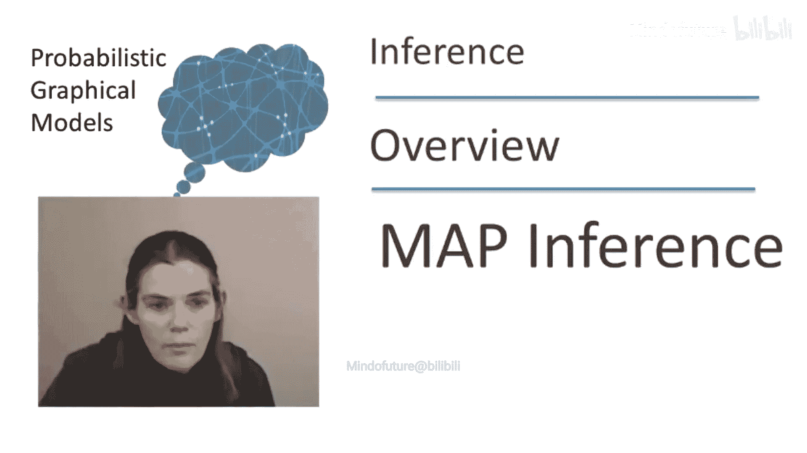
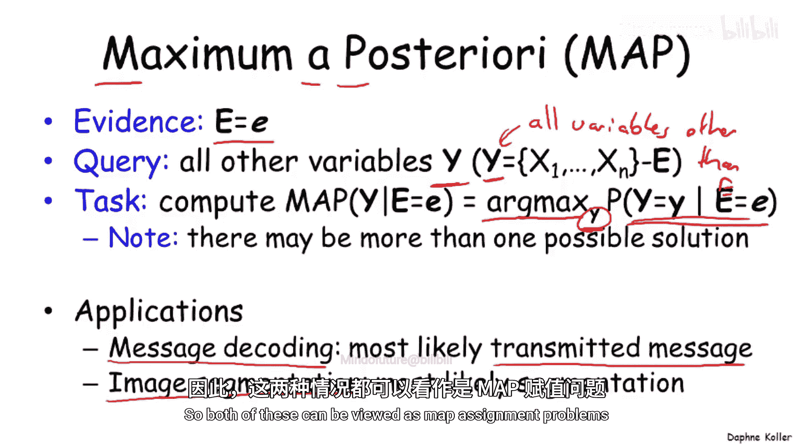
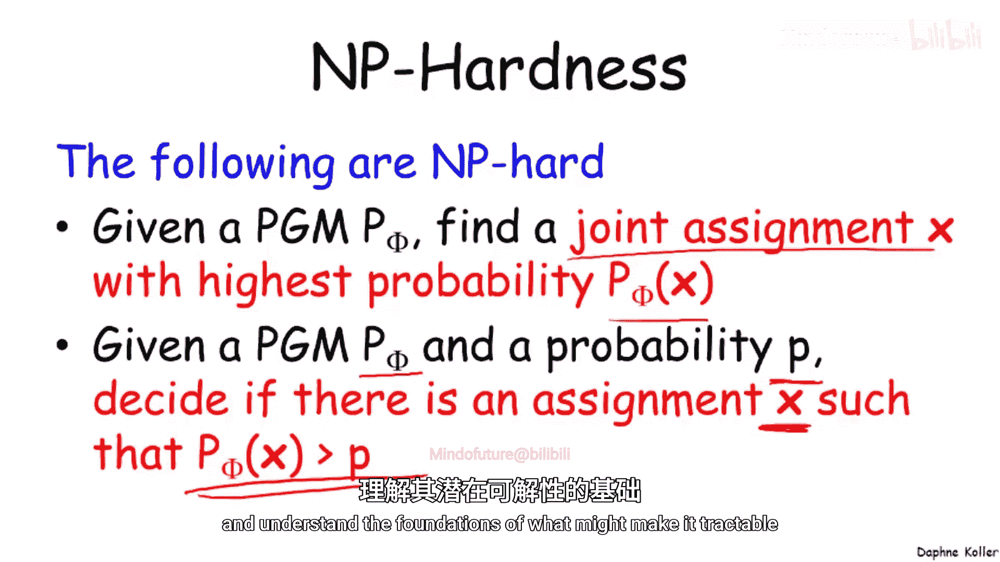
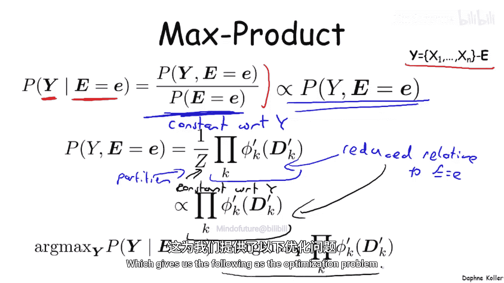
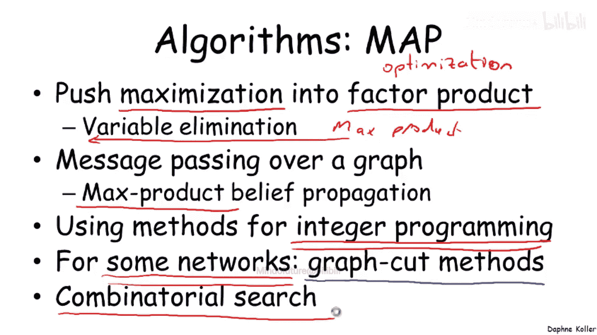
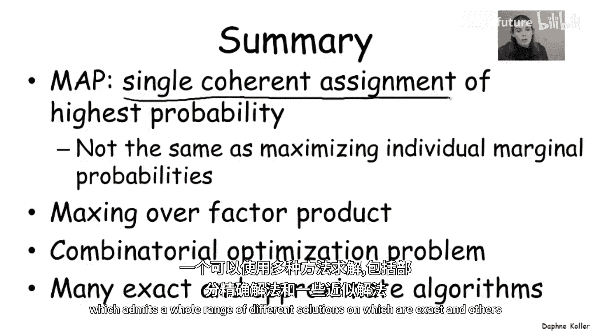

# 002：最大后验概率推断概述

在本节课中，我们将要学习概率图模型中另一种重要的推断类型——最大后验概率推断。我们将了解它的定义、应用场景、与条件概率查询的区别，以及解决该问题的基本思路和算法类别。

## 什么是最大后验概率推断？

正如之前所说，我们可以使用图模型回答多种不同类型的查询。条件概率查询非常常用，但另一种常用的推断类型被称为最大后验概率推断。

那么，什么是最大后验概率推断？

MAP 是“最大后验概率”的缩写。其定义如下。

我们有一组关于变量 **E** 的证据或观测值 **e**。我们还有一个查询变量集 **Y**。出于我们暂不讨论的计算原因，**Y** 包含除 **E** 之外的所有其他变量，这一点很重要。

我们的任务是计算所谓的 **MAP 赋值**，即找到能使给定证据下变量 **Y** 的条件概率最大化的赋值 **y**。

**arg max** 表示能为此表达式提供最大值的 **y**。

需要注意的是，在某些情况下，这个最大值可能不是唯一的。也就是说，可能存在多个不同的赋值（例如 **y1** 和 **y2**）给出完全相同的概率。因此，MAP 赋值不一定是一个唯一的赋值。

## 最大后验概率推断的应用

最大后验概率推断有许多应用，其中一些我们之前讨论过。

以下是几个应用示例：
*   在**消息解码**的背景下，我们有一组通过噪声信道传输的噪声比特。我们通常希望得到最可能被传输的消息，即给定证据下，最可能的传输比特赋值。
*   在**图像分割**的背景下，我们希望根据像素点，找出像素点最可能属于的语义类别。

这两个问题都可以视为 MAP 赋值问题。

## 与条件概率查询的区别

理解 MAP 推断与条件概率查询是不同的问题非常重要。为了理解这一点，让我们看一个仅包含两个随机变量的简单例子。

这里我们有一个关于变量 **A** 和 **B** 的贝叶斯网络。将两个条件概率分布相乘，我们得到此处所示的联合分布。可以立即看出，MAP 赋值是 **a0, b1**，因为它具有最高的概率。

我们能否通过分别查看变量 **A** 和变量 **B** 来得到 MAP 赋值呢？

如果我们分别查看变量 **A**，我们会发现变量 **A** 最可能的赋值是 **a1**，而不是 MAP 赋值中的 **a0**。因此，我们不能分别查看 **A** 和 **B** 的边缘分布，并用它们来推断 MAP 赋值。原因在于，我们寻找的是在所有变量上具有最高概率的**单一联合赋值**。

## 问题的计算复杂性

不幸的是，就像条件概率推断一样，MAP 推断问题也是 NP 难的。

以下是 MAP 背景下 NP 难问题的例子：
*   找到具有最高概率的联合赋值是 NP 难的。
*   对于给定的概率图模型和某个阈值 **p**，判断是否存在一个赋值 **x** 其概率大于 **p**，这个问题也是 NP 难的。

那么，我们应该放弃吗？答案是否定的。就像在条件概率查询的背景下一样，存在可以非常高效地解决这个问题的算法。事实上，这些算法能处理的问题范围甚至比条件概率查询更广。

接下来，让我们更深入地研究这个问题，理解可能使其易于处理的基础。

## 最大后验概率推断的优化问题形式

再次回到贝叶斯网络的例子，我们将再次把条件概率分布视为因子。这里，**P(C|A, B)** 转换成一个关于 **C, A, B** 的因子。

与条件概率查询中我们希望对某些变量求和（边缘化）不同，现在我们要找到所有变量的赋值，使得这些因子的乘积最大化。因此，我们这里有一个**最大化乘积**的问题，这也常被称为 **最大乘积问题**。

让我们分解这个最大乘积问题。想象在更一般的情况下，我们有 **P(Y | E = e)**。提醒一下，**Y** 是除 **E** 中变量之外的所有变量的集合。根据条件概率的定义，我们有这个比率，我们试图找到最大化这个比率的 **y**。

请注意，分母相对于 **y** 是常数。这意味着，为了找到最大化的 **y**，我们实际上不关心分母，只关心分子，即 **P(Y, E = e)**，这是一个未归一化的度量。

这个分子在一般情况下是多个因子的乘积，并由配分函数归一化。这里的因子是相对于证据简化后的因子。

我们再次注意到，配分函数相对于 **y** 是常数，这意味着我们可以忽略它。因此，我们再次得到这个表达式正比于相同简化因子的乘积。所以，我们试图做的就是在更一般的情况下最大化一组因子的乘积。

这为我们带来了以下优化问题：

## 解决最大后验概率推断的算法

有许多算法可以解决 MAP 问题。

第一类算法类似于求和乘积算法。这些算法将最大化操作推入因子乘积中，从而产生了 **最大乘积变量消除算法**。

我们也有消息传递算法，它同样是求和乘积算法的直接类比，产生了一类称为 **最大乘积信念传播** 的算法。

然而，由于 MAP 问题本质上是一个优化问题，我们也可以调用专门用于优化的技术。

这类方法包括基于**整数规划**的方法，这是一种在离散空间上进行优化的通用技术。事实证明，基于整数规划的这类方法是过去几年中最流行的方法之一，并催生了一系列全新的 MAP 算法，这些算法比之前开发的许多算法（尤其是在近似推断情况下）要好得多。

此外，对于某些特定类型的网络（其中一些我们会讨论），存在针对该类图模型非常高效的特殊算法。其中最常用（但不是唯一）的一类是基于 **图割** 算法的方法。

最后，因为它是一个优化问题，我们也可以使用在组合搜索空间上的标准搜索技术。对于某些问题，这也是一个非常有用和成功的解决方案。

## 总结

本节课中，我们一起学习了最大后验概率推断。

总结来说，MAP 问题的目标是找到具有最高概率的单一、一致的联合赋值。这意味着它不同于最大化单个边缘概率，正如我们在例子中看到的那样。

我们可以将这个问题重新表述为寻找因子乘积的最大值，这是一个组合优化问题，它允许使用一系列不同的解决方案，其中一些是精确的，另一些是近似的。

