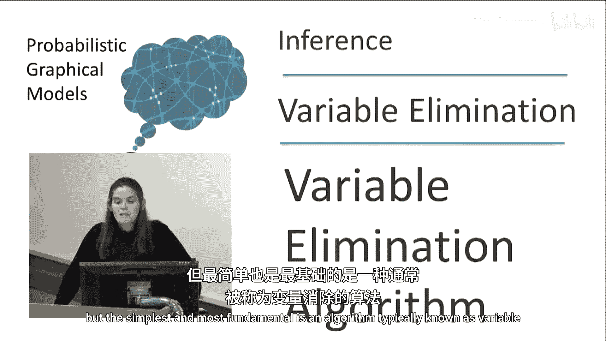
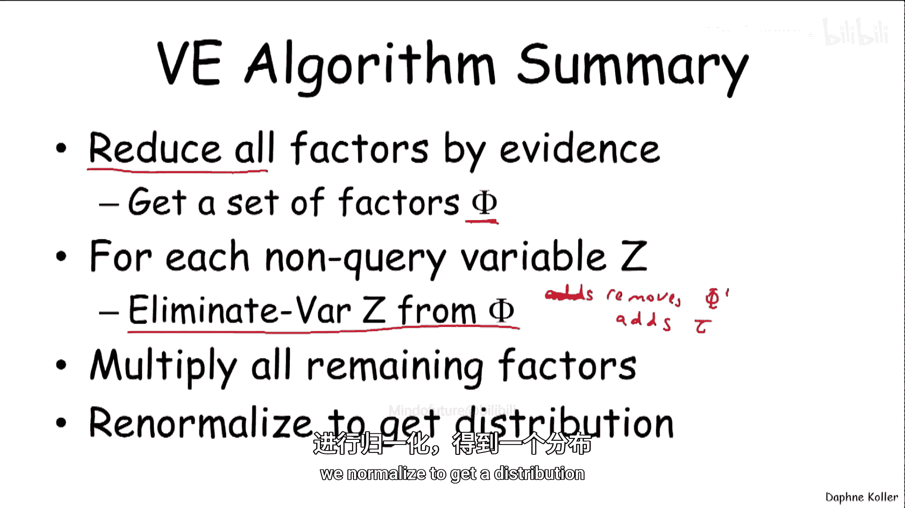
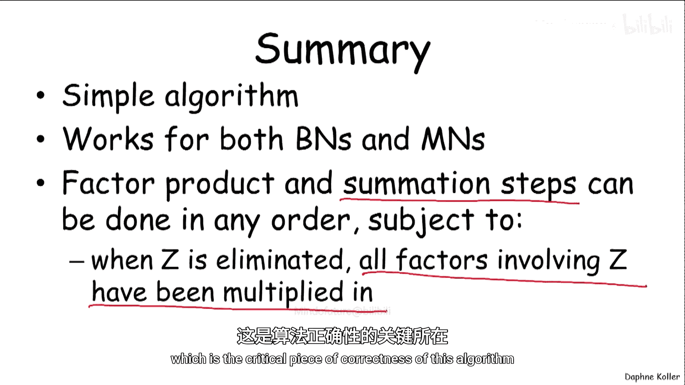

# 003：变量消元算法



在本节课中，我们将学习概率图模型推理中最基础、最核心的算法之一：变量消元算法。我们将通过简单的链式结构和更复杂的“学生网络”例子，一步步展示该算法如何高效地计算变量的边缘概率分布。

## 概述

我们已经知道，存在多种用于概率图模型推理的算法，但最简单、最基础的一种算法通常被称为变量消元法。该算法的核心思想是通过逐步求和（消元）非查询变量，避免直接计算庞大的联合概率分布，从而高效地计算出目标变量的边缘概率。

## 简单示例：链式结构

首先，我们通过一个简单的链式图模型来理解变量消元的基本步骤。假设我们有一个包含变量A、B、C、D、E的链，目标是计算变量E的概率分布 **P(E)**。

我们知道，这个概率与对除E外所有变量求和的未归一化度量 **P̃(A, B, C, D, E)** 成比例。公式如下：

**P(E) ∝ Σ_{A,B,C,D} P̃(A, B, C, D, E)**

与其先构造完整的联合分布再求和，我们可以更高效地计算。首先，将未归一化度量写成各因子的乘积。假设图中只有成对因子（对应图中的边），我们得到：

**P̃(A, B, C, D, E) = φ₁(A,B) * φ₂(B,C) * φ₃(C,D) * φ₄(D,E)**

现在，我们需要对A、B、C、D求和。关键观察是：如果一个因子的作用域中不包含某个求和变量，我们可以将该因子移到求和符号之外。因此，在首先对A求和时：

**Σ_{A,B,C,D} [φ₁(A,B) * φ₂(B,C) * φ₃(C,D) * φ₄(D,E)]**
**= φ₂(B,C) * φ₃(C,D) * φ₄(D,E) * [Σ_A φ₁(A,B)]**

对A求和的结果是一个只关于变量B的新因子，我们称之为 **τ₁(B)**：

**τ₁(B) = Σ_A φ₁(A,B)**

于是，表达式简化为：

**= φ₂(B,C) * φ₃(C,D) * φ₄(D,E) * τ₁(B)**

此时，变量A已从模型中“消除”。

接下来，我们继续这个过程，消除变量B。现在对B求和，涉及B的因子是 **φ₂(B,C)** 和 **τ₁(B)**：

**Σ_B [φ₂(B,C) * τ₁(B)] * φ₃(C,D) * φ₄(D,E)**

对B求和的结果是一个关于C的新因子 **τ₂(C)**。表达式进一步简化为：

**= φ₃(C,D) * φ₄(D,E) * τ₂(C)**

如此继续，依次消除C和D。最终，我们将得到一个仅关于变量E的表达式 **τ₄(E)**，它与 **P(E)** 成比例。通过归一化 **τ₄(E)**，即可得到 **P(E)**。

这个逐步求和的过程，就是变量消元算法的本质：通过改变求和顺序，将大范围的求和分解为一系列小范围的局部计算，从而避免处理高维的联合分布。

## 复杂示例：学生网络

现在，让我们在一个更复杂的模型——“学生网络”中应用变量消元算法。我们的目标是计算变量J的概率 **P(J)**。为此，我们需要从联合分布中消除除J之外的所有变量。

以下是学生网络的联合分布（已表示为因子乘积形式）：

**P̃(C, D, I, G, S, L, J, H) = φ_C(C) * φ_D(D|C) * φ_I(I) * φ_G(G|I,D) * φ_S(S|I) * φ_L(L|G) * φ_J(J|L,S) * φ_H(H|G,J)**

我们需要消除变量：C, D, I, H, G, S, L。

以下是逐步消元过程：

**第一步：消除变量C**
涉及C的因子是 **φ_C(C)** 和 **φ_D(D|C)**。将它们相乘并对C求和，得到新因子 **τ₁(D)**：
**τ₁(D) = Σ_C [φ_C(C) * φ_D(D|C)]**

**第二步：消除变量D**
涉及D的因子是上一步得到的 **τ₁(D)** 和 **φ_G(G|I,D)**。将它们相乘并对D求和，得到新因子 **τ₂(G, I)**：
**τ₂(G, I) = Σ_D [τ₁(D) * φ_G(G|I,D)]**

**第三步：消除变量I**
涉及I的因子是 **τ₂(G, I)**、**φ_I(I)** 和 **φ_S(S|I)**。将它们相乘并对I求和，得到新因子 **τ₃(G, S)**：
**τ₃(G, S) = Σ_I [τ₂(G, I) * φ_I(I) * φ_S(S|I)]**

**第四步：消除变量H**
涉及H的因子只有 **φ_H(H|G,J)**。对其求和：
**τ₄(G, J) = Σ_H φ_H(H|G,J)**
注意，**φ_H(H|G,J)** 本身是一个条件概率分布，对H求和结果应为1。但为了演示算法流程，我们仍将其表示为一个因子。

**第五步：消除变量G**
涉及G的因子是 **τ₃(G, S)**、**φ_L(L|G)** 和 **τ₄(G, J)**。这是目前遇到的作用域最大的因子（涉及L, G, S, J）。将它们相乘并对G求和，得到新因子 **τ₅(L, S, J)**：
**τ₅(L, S, J) = Σ_G [τ₃(G, S) * φ_L(L|G) * τ₄(G, J)]**

**第六步：消除变量S和L**
现在剩下因子 **τ₅(L, S, J)** 和 **φ_J(J|L,S)**。实际上，**φ_J(J|L,S)** 已包含在之前因子的推导中，但最终我们需要将所有剩余因子相乘。为得到 **P̃(J)**，我们对S和L求和：
**P̃(J) = Σ_{L, S} [τ₅(L, S, J)]**
最后，归一化 **P̃(J)** 即可得到 **P(J)**。

通过这个例子，我们看到即使对于复杂的网络，变量消元法也能通过局部计算，系统地消除非查询变量，最终得到目标变量的（未归一化）概率。

## 处理证据（观测值）

变量消元法同样可以处理包含证据（即某些变量被观测到特定值）的查询。例如，我们想计算 **P(J | I=i, H=h)**。

处理方法是：
1.  **减少因子**：将所有涉及被观测变量I和H的因子进行“实例化”。即，将因子中对应变量固定为观测值。
    *   例如，**φ_I(I)** 变为常数 **φ_I(i)**。
    *   **φ_G(G|I,D)** 变为 **φ_G(G|i, D)**，不再依赖I。
    *   **φ_H(H|G,J)** 变为 **φ_H(h|G,J)**。
2.  **执行消元**：得到一组减少后的因子集合。然后，像之前一样，对除查询变量J和已被观测的变量（I, H）之外的所有变量执行消元算法。注意，已被观测的变量不需要被消除（求和），因为它们已固定为单一值。
3.  **归一化**：消元最终得到一个与 **P(J, I=i, H=h)** 成比例的因子。将其归一化，即可得到条件概率 **P(J | I=i, H=h)**。

这种方法为处理带证据和不带证据的查询提供了一个统一的框架。

## 算法的一般形式与总结

变量消元算法的核心是一个称为“消除变量”的例程。其伪代码如下：

```
函数 消除变量(因子集合 Φ, 待消元变量 Z):
    Φ‘ ← 从Φ中提取所有作用域包含Z的因子
    ψ ← 将Φ‘中所有因子相乘
    τ ← 对ψ中的变量Z求和（消元）
    Φ ← (Φ - Φ‘) ∪ {τ} // 移除已使用的因子，加入新因子
    返回 Φ
```

整个变量消元算法的流程如下：
1.  **证据约简**：若有证据，首先减少所有相关因子。
2.  **初始化**：获得初始因子集合 Φ。
3.  **循环消元**：对每一个非查询变量（且未被观测），按某个顺序调用“消除变量”函数，更新因子集合 Φ。
4.  **最终处理**：当所有需要消除的变量都被处理后，将剩余因子相乘，得到关于查询变量的未归一化因子。
5.  **归一化**：将该因子归一化，即得所求的概率分布。

该算法简单而强大，对贝叶斯网络和马尔可夫网络同样适用。它基于两个基本操作：**因子乘积** 和 **因子求和（消元）**。其正确性的关键在于，在对某个变量Z求和之前，必须将所有包含Z的因子乘在一起，这样才能确保求和操作是完整的。

## 总结



本节课中，我们一起学习了概率图模型推理的基础算法——变量消元法。
*   我们首先通过一个链式结构的例子，直观理解了算法如何通过逐步求和来高效计算边缘概率。
*   接着，我们在更复杂的学生网络上一步步演练了算法过程。
*   我们还学习了如何将算法扩展到处理带证据的查询，即通过先约简因子再消元的方式。
*   最后，我们总结了算法的一般形式，其核心是重复应用“因子乘积”和“变量求和”两个步骤，直到只剩下查询变量。



变量消元法是许多更高级推理算法（如信念传播）的基础。理解其原理，是掌握概率图模型推理的关键一步。