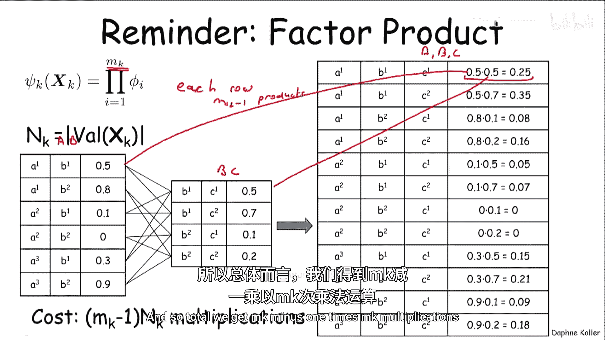
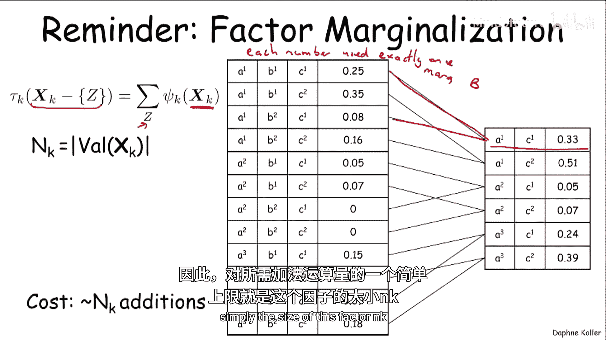
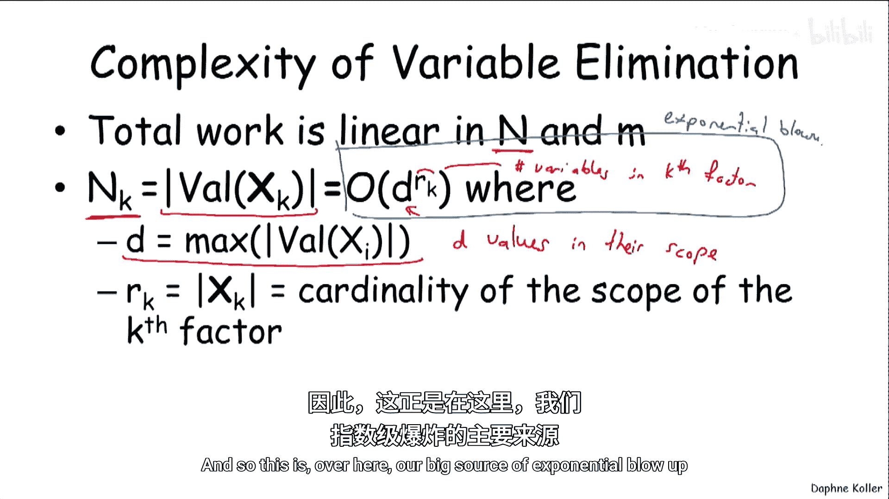
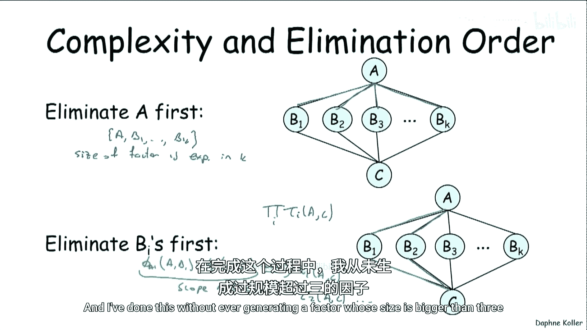
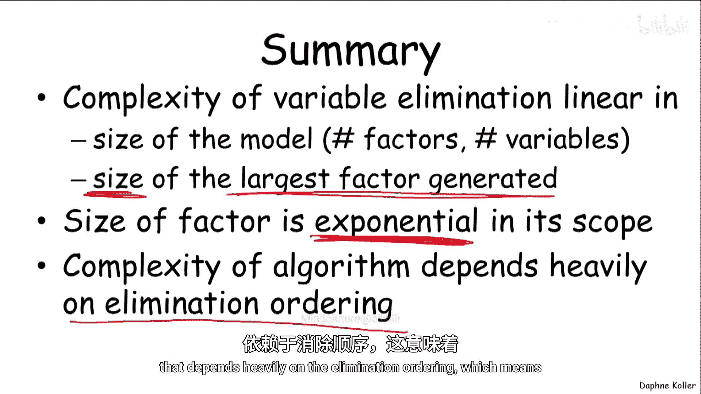

# 概率图模型：2：变量消元算法复杂度分析

在本节课中，我们将深入分析变量消元算法的计算复杂度。我们将探讨算法中的基本操作，理解复杂度如何随模型规模增长，并揭示消元顺序对计算效率的关键影响。

## 变量消元中的基本操作

上一节我们介绍了变量消元算法，本节中我们来看看其计算复杂度。首先，我们需要理解算法执行过程中涉及的两类基本操作：**因子乘积**和**边缘化**。接下来，我们将分别计算这两类操作所需的计算量。

### 因子乘积操作

因子乘积操作将多个因子合并为一个新因子。例如，将作用域为 `AB` 和 `BC` 的两个因子相乘，得到作用域为 `ABC` 的新因子。

以下是计算新因子中每个数值的过程：
*   新因子中的每一行数值，都是通过将原因子中对应行的数值相乘得到的。
*   假设生成新因子需要合并 `Mk` 个因子，那么生成新因子的每一行需要进行 `Mk - 1` 次乘法运算。
*   因此，总的乘法运算次数为 `(Mk - 1) * Nk`，其中 `Nk` 是新因子中的行数（即取值组合数）。

### 边缘化操作

边缘化操作通过对一个变量求和来缩小因子的作用域。例如，对作用域为 `ABC` 的因子关于变量 `B` 求和，得到作用域为 `AC` 的新因子。

以下是边缘化操作的计算特点：
*   输出因子中的每一行数值，是通过对输入因子中多行数值求和得到的。
*   从另一个角度看，输入因子中的每个数值，恰好会被加到输出因子的某一行中一次。
*   因此，所需的加法运算次数的一个简单上界就是输入因子的大小 `Nk`。

## 变量消元的总复杂度

理解了基本操作后，现在我们来汇总变量消元算法的总计算复杂度。我们假设模型初始时有 `M` 个因子。

以下是关于算法中因子数量的分析：
*   在贝叶斯网络中，`M` 通常等于变量数 `N`（每个变量对应一个条件概率分布）。证据观测可能会减少初始因子数量，因此 `M ≤ N`。
*   在马尔可夫网络中，因子数量可能多于变量数（例如全连接的成对马尔可夫网络），因此我们用 `M` 而非 `N` 来描述复杂度。
*   每个消元步骤会生成一个新因子。由于最多消元 `N` 个变量，因此最多生成 `N` 个新因子。
*   算法过程中处理过的因子总数 `M*` 满足：`M* ≤ M + N`。

现在，我们来分析算法的运算量。设 `N_max` 为算法过程中生成的最大因子的大小。

以下是各类运算量的上界分析：
*   **乘法运算**：每个因子最多被乘入一次，因此总的乘法运算次数 ≤ `M* * N_max`。
*   **加法运算**：每个消元步骤的边缘化操作最多需要 `N_max` 次加法，共有 `N` 个步骤，因此总的加法运算次数 ≤ `N * N_max`。

综合来看，算法的总计算量是 `O(N * M* * N_max)`。虽然这个表达式在因子数量和变量数量上是线性的，但关键在于 `N_max`。

`N_max` 是最大因子的大小。如果所有变量有 `d` 个取值，那么一个包含 `k` 个变量的因子大小是 `d^k`。因此，**复杂度实际上由算法过程中产生的最大因子的作用域大小（变量数）决定，并随该作用域大小呈指数级增长**。

## 复杂度实例与消元顺序的影响

为了直观理解复杂度，让我们回顾之前课程中的一个变量消元实例。算法生成了多个中间因子，其作用域大小分别为2、3、3、3、4、3。其中最大的因子包含4个变量，这决定了该算例的计算复杂度。

变量可以按任意顺序消元，但消元顺序会极大影响生成的最大因子的大小，从而影响计算效率。

以下是一个不合理的消元顺序示例：
*   在之前的网络例子中，如果首先消元变量 `G`，需要乘入三个因子（φ_L(L,G), φ_G(G,I,D), φ_H(H,G,J)），生成的作用域为 {L, I, D, H, J, G} 的因子包含6个变量，比最优顺序下的最大因子（4个变量）更大。

以下是一个更能说明问题的极端示例：
*   考虑一个简单的成对马尔可夫网络：变量 `A` 和 `C` 通过一系列中间变量 `B1, B2, ..., Bk` 相连。
*   **糟糕的顺序（先消元A）**：消元 `A` 需要乘入 `k` 个因子 (A-B1, A-B2, ..., A-Bk)，生成的作用域为 {A, B1, ..., Bk} 的因子，其大小随 `k` 指数增长。
*   **好的顺序（先消元B_i）**：首先消元 `B1`，只需乘入两个因子 (A-B1, C-B1)，生成一个作用域为 {A, C} 的小因子 τ1。依次消元所有 `B_i` 都会生成类似的二元因子 {A, C}。最后再将所有 τ_i 相乘。整个过程生成的最大因子只包含3个变量，复杂度大大降低。

## 总结

本节课中我们一起学习了变量消元算法的复杂度分析。

总结如下：
*   变量消元的计算复杂度在模型规模（因子数 `M*` 和变量数 `N`）上是线性的。
*   **然而，真正的计算瓶颈在于算法过程中生成的`最大因子的大小`**，该大小随因子作用域中的变量数量呈指数级增长。
*   消元顺序的选择直接影响生成的中间因子的大小，因此**选择一个明智的消元顺序对于控制计算复杂度至关重要**。

理解复杂度有助于我们认识变量消元算法的优势与局限，并为后续学习更高效的推理算法奠定基础。