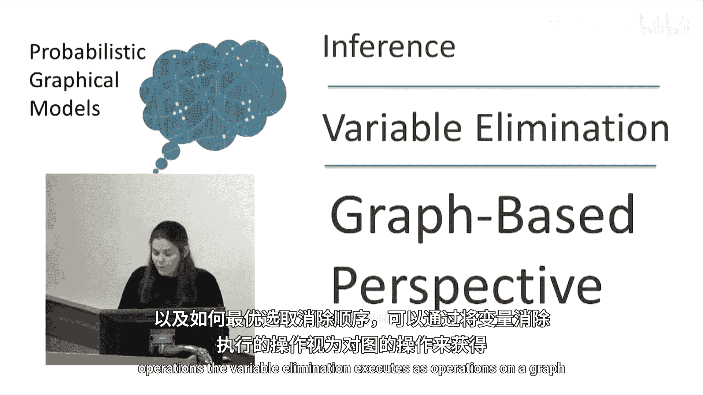
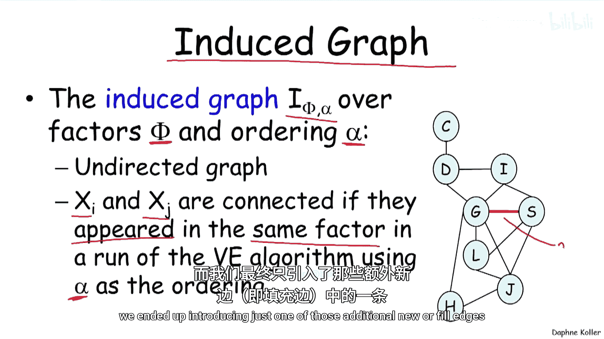
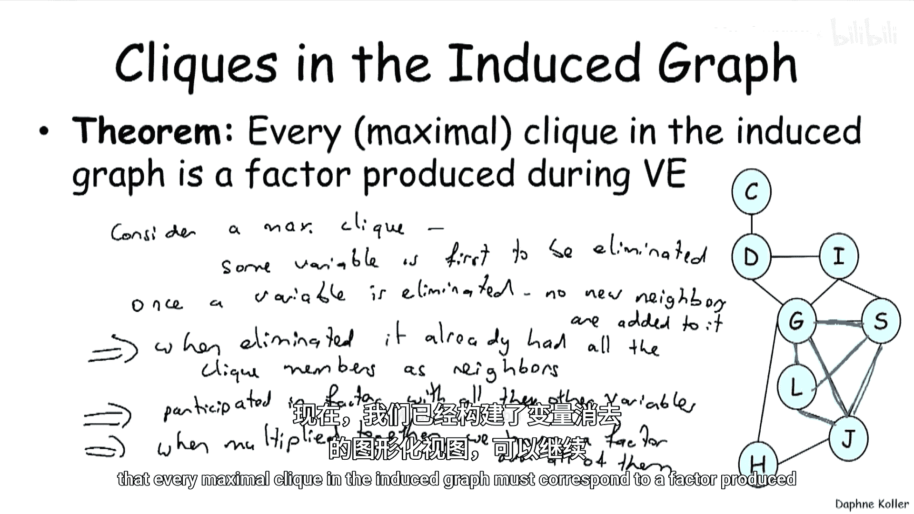
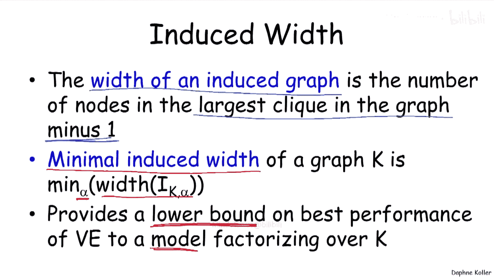
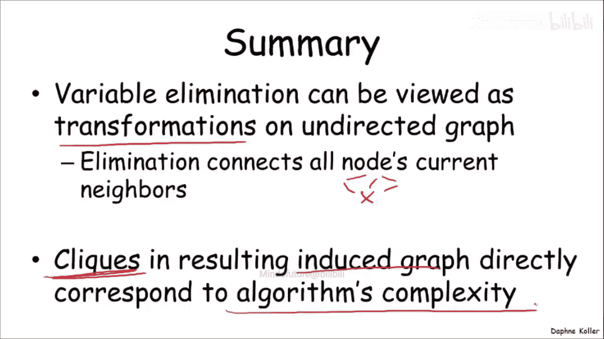

# 005：基于图的变量消元视角

在本节课中，我们将学习如何从图的角度来理解变量消元算法。通过将变量消元操作视为对图的操作，我们可以获得关于如何选择最优消元顺序的重要见解。

## 图视角下的变量消元

上一节我们介绍了变量消元的基本操作。本节中，我们来看看如何将这些操作映射到一个图上。

首先，考虑一个包含多个变量的初始概率图模型。为了从图的角度分析变量消元，我们需要将模型中的因子集合表示为一个无向图。这个过程的第一步称为“道德化”。

以下是道德化的步骤：
1.  将图中所有有向边转换为无向边。
2.  对于每个具有多个父节点的变量（即V型结构），在其所有父节点之间添加无向边，使它们“联姻”。

道德化后得到的图，称为该因子集合的“诱导马尔可夫网络”。它反映了所有变量之间通过因子产生的直接关联。

## 消元步骤的图操作

现在，让我们思考一次变量消元步骤对图做了什么。

当消除一个变量时，我们需要将所有包含该变量的因子相乘，然后对该变量求和以生成一个新的因子。在图上的对应操作是：
1.  移除待消除的变量节点。
2.  在移除之前，将该节点的所有邻居节点两两连接起来。

这个过程可以形象地理解为：一个变量在“离开世界”前举办了一场告别派对，邀请它所有的邻居朋友参加。在派对上，所有邻居互相认识并成为朋友。因此，在变量被消除后，它的所有邻居在图中的连接变得更加紧密。

如果某些邻居在消元前已经相连，则无需额外操作。如果某些邻居在消元前没有直接连接，那么消元步骤就会在它们之间引入一条新的边，这条边被称为“填充边”。

## 诱导图与团

通过按特定顺序执行一系列消元步骤，我们最终会得到一个图，它被称为在给定消元顺序 `α` 下的**诱导图**，记作 `I(Φ, α)`。

诱导图具有以下重要性质：
*   它是一个无向图。
*   图中的节点是原始变量。
*   如果两个变量在变量消元过程的**任何阶段**出现在同一个因子中，那么它们在诱导图中就有一条边相连。

诱导图中的“团”是一个非常重要的概念。一个团是指图中一个**完全连通**的子图（即子图中任意两个节点都有边直接相连）。一个**极大团**是指一个无法通过添加任何其他节点而继续保持完全连通性质的团。

以下是关于诱导图中团的关键结论：
*   在变量消元过程中产生的**每一个因子**，都对应诱导图中的一个团。
*   诱导图中的**每一个极大团**，都对应变量消元过程中产生的某个因子。

这个对应关系意味着，诱导图中最大团的大小直接决定了变量消元算法的计算复杂度。因为消元过程中产生的最大的因子，其作用域就是诱导图中最大的团。

## 诱导宽度与复杂度

基于诱导图，我们可以定义一个衡量变量消元复杂度的度量标准——**诱导宽度**。

*   **诱导图的宽度**：定义为图中最大团所包含的节点数减1。公式表示为：
    `宽度(I) = |最大团| - 1`
*   **图的最小诱导宽度**：定义为在所有可能的消元顺序 `α` 中，所能达到的最小宽度。公式表示为：
    `最小诱导宽度(G) = min_α 宽度(I(Φ, α))`

最小诱导宽度代表了对于该图结构，变量消元算法所能达到的最佳（最低）计算复杂度。它是一个理论下界，意味着无论我们如何优化消元顺序，算法的复杂度至少与最小诱导宽度所指示的级别相当。

## 总结

本节课中，我们一起学习了如何从图论的视角来审视变量消元算法。

我们了解到，变量消元的每一步都可以视为对图的一次变换：消除一个变量会将其所有邻居连接起来。整个过程产生了一个**诱导图**，该图可能因为引入了**填充边**而比原图连接更紧密。

诱导图中的**极大团**与消元过程中产生的**最大因子**直接对应，而最大团的大小（即**诱导宽度**）决定了算法的计算复杂度。**最小诱导宽度**则为我们提供了评估和选择最优消元顺序的理论工具。

通过这种基于图的视角，我们能够更直观地理解变量消元的计算代价，并为后续学习更高效的推理算法奠定基础。😊