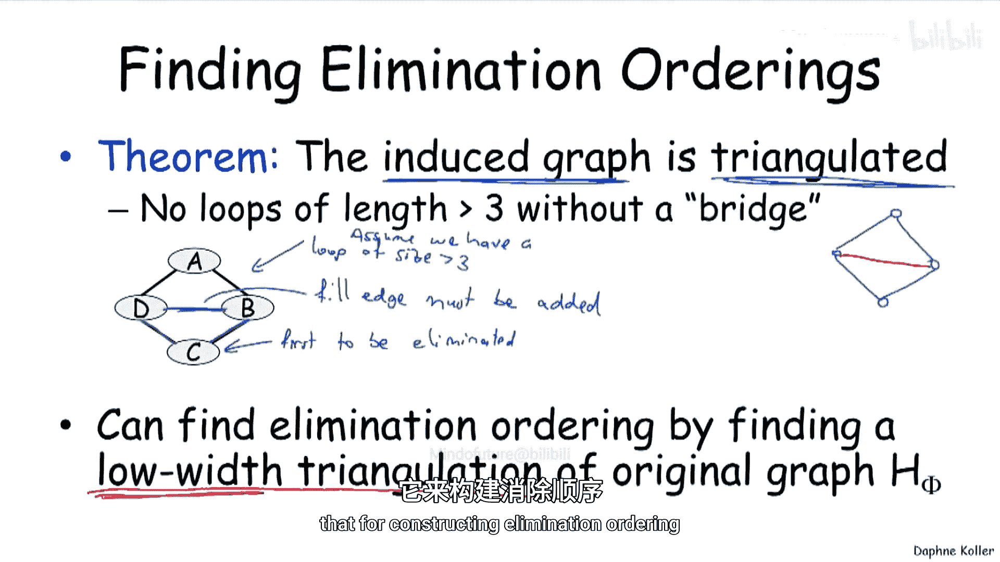
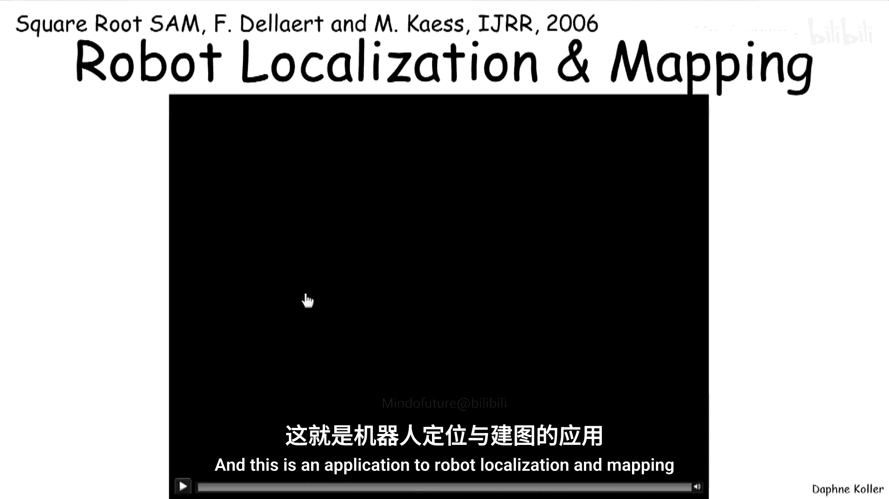
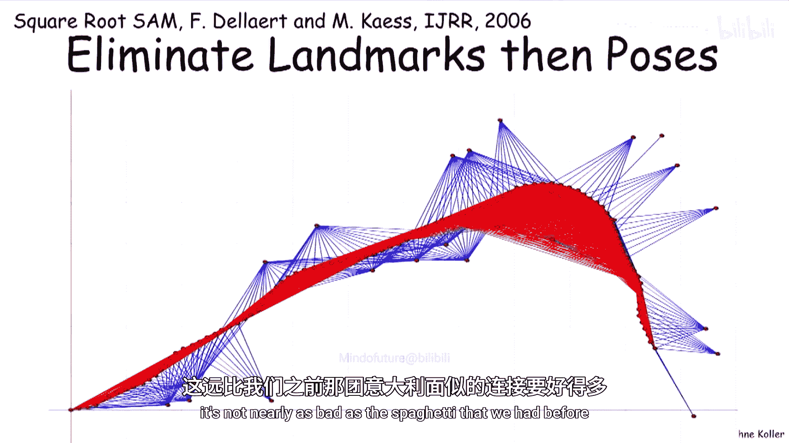
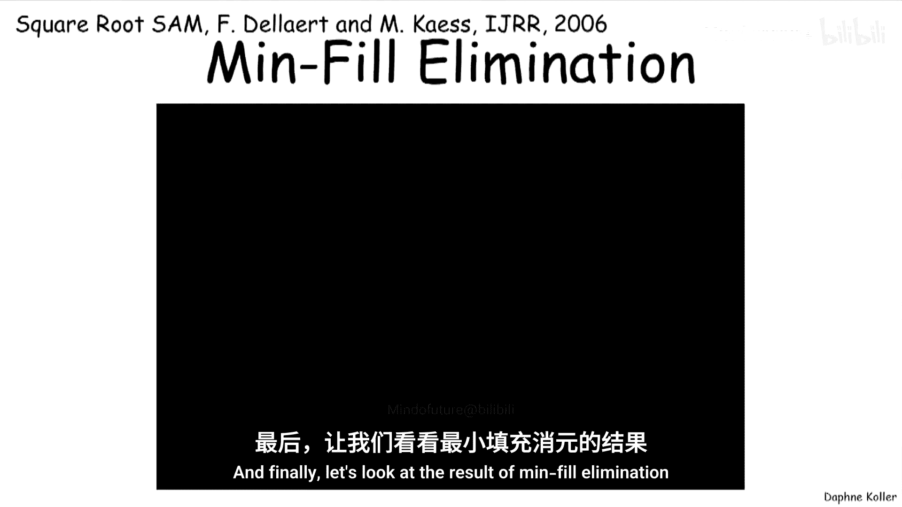

# 006：寻找消元顺序

在本节课中，我们将要学习如何为变量消元算法寻找一个好的消元顺序。我们将看到，虽然寻找最优顺序本身是一个困难问题，但存在一些简单有效的启发式方法。

## 概述

上一节我们介绍了变量消元算法的计算复杂度与消元顺序密切相关。本节中，我们来看看如何系统地寻找一个好的消元顺序，以降低计算成本。

## 寻找消元顺序的重要性

当我们讨论变量消元时，我们说无论使用何种消元顺序，变量消元算法都是正确的。但我们也展示了消元顺序会对算法的计算复杂度产生非常显著的影响。这就引出了一个问题：我们如何找到一个好的消元顺序？

幸运的是，我们最近基于图的计算分析为我们提供了如何寻找好的消元顺序的直觉。因为事实证明，诱导图的概念以及它指示变量消元复杂度的方式，可以让我们构建出具有良好计算特性的消元顺序的优良方法。

## 最优顺序的复杂性

我们能构造出多好的消元顺序呢？这里再次证明了任何有趣的问题都是NP难的。对于图H，确定是否存在任何消元顺序α，使得其诱导宽度小于或等于某个固定值K，这个问题是NP完全的。

你可能会对自己说，这并不奇怪，概率推断是NP完全的，所以显然找到一个非常好的消元顺序也将是NP完全的。但事实证明，这是一个独立的NP难问题。也就是说，即使你能解决这个问题，即使有人给了你最好的消元顺序，你仍然会遇到一些图，其宽度足够大，以至于你实际上无法在多项式时间内解决问题。因此，找到能给出最佳诱导宽度的消元顺序，通常并不能保证多项式时间的性能。所以这是两个独立的NP难问题。

## 启发式方法

那么，如何找到一个好的消元顺序呢？幸运的是，简单的启发式方法实际上效果很好。寻找好的消元顺序的一个标准方法是简单地执行贪婪搜索，一次消除一个变量。在消元的每个阶段，你使用某种启发式成本函数来决定接下来要消除哪个变量。

有一些明显的成本函数可以使用，而且事实证明它们效果出奇地好。

以下是几种常用的启发式成本函数：

*   **最小邻居**：选择在当前图中邻居数量最少的节点。这对应于产生最小的因子。
*   **最小权重**：计算因子中变量值域大小的乘积总和。这考虑了不同变量可能具有不同数量的取值。
*   **最小填充**：计算如果消除此节点，有多少对之前不是朋友的节点会因此次消除步骤而成为朋友。这衡量了超出先前已生成边的额外复杂度。
*   **加权最小填充**：这是最小填充的加权版本，不仅考虑新增边的数量，还考虑它们所连接变量的值域大小。

事实证明，在实践中经常使用的**最小填充**是一个相当好的启发式方法。

## 消元顺序与三角化

理解寻找消元顺序问题的一个重要方法是看以下结果。这个结果告诉我们，无论消元顺序如何，变量消元产生的诱导图都是**三角化**的。

三角化意味着图中不能存在长度大于3且没有“桥”（即连接环中非相邻顶点的弦）的环。

让我们来理解为什么这是真的。这里有一个简单的证明。考虑一组变量，并假设存在一个长度大于3的环。这些变量中必须有一个是第一个被消除的。假设C是第一个被消除的。当我们消除C时，我们最终会在B和D之间引入一条边。因为当C被消除时，C和B、C和D之间的边必须存在（根据我们之前的观察，在消除C时，你不会给C添加任何新邻居），所以在那一刻必须添加一条填充边。

因此，寻找消元顺序的另一种方法（除了前面提到的启发式方法）是找到原始图的一个**低宽度三角剖分**。图论文献中有大量关于三角剖分图的工作，我们在此不深入讨论，但你可以利用所有这些文献来寻找良好的低宽度三角剖分，然后用于构建消元顺序。

## 实际应用示例

现在让我们通过一个实际应用来证明消元顺序可以产生巨大差异。这个应用是**机器人定位与建图**。

在这个场景中，一个机器人在环境中移动。在每个时间点，它看到几个地标（它可以识别它们），并感知到最近地标的近似距离。

我们可以将其写成一个图模型。模型包含：
*   每个时间点的机器人位姿（随时间变化的随机变量）。
*   一组地标位置（固定的，不是随时间变化的随机变量）。
*   观测值（灰色部分），表示在特定时间机器人对特定地标的观测距离，它是机器人位姿和地标位置的函数。

如果我们为之前看到的机器人轨迹写出表示因子的马尔可夫网络，我们会看到：
*   浅蓝色的点代表每个时间点的机器人位姿。
*   时间持续性边连接相邻时间的位姿。
*   深蓝色的地标位置变量，连接到机器人曾观测到它的所有位姿（这是一个由V型结构诱导产生的边）。

那么，消元顺序重要吗？非常重要。

*   **先消除位姿，后消除地标**：产生的诱导图像一团巨大的“意大利面”，大多数地标都连接到所有其他地标。
*   **先消除地标，后消除位姿**：产生的诱导图在机器人位姿之间仍然连接相当密集，但远没有之前那么糟糕。
*   **使用最小填充启发式**：产生的诱导图非常稀疏，在整个轨迹过程中实际添加的填充边非常少。

由此可见，消元顺序确实会产生非常大的差异。

## 总结

本节课中我们一起学习了为变量消元寻找消元顺序。我们了解到，寻找最优消元顺序本身是一个NP难问题，并且这个难度与图模型推断的内在难度是不同的。

然而，我们也展示了基于图的变量消元视角为我们提供了一套非常简单直观的启发式方法，允许我们构建出良好的消元顺序。这些方法通过在变量消元过程中观察构建的诱导图，并试图保持其小而稀疏来实现。

这些启发式方法虽然简单，并且在最坏情况下可能无法提供最优性能，但在实践中通常相当合理，并且被广泛使用。