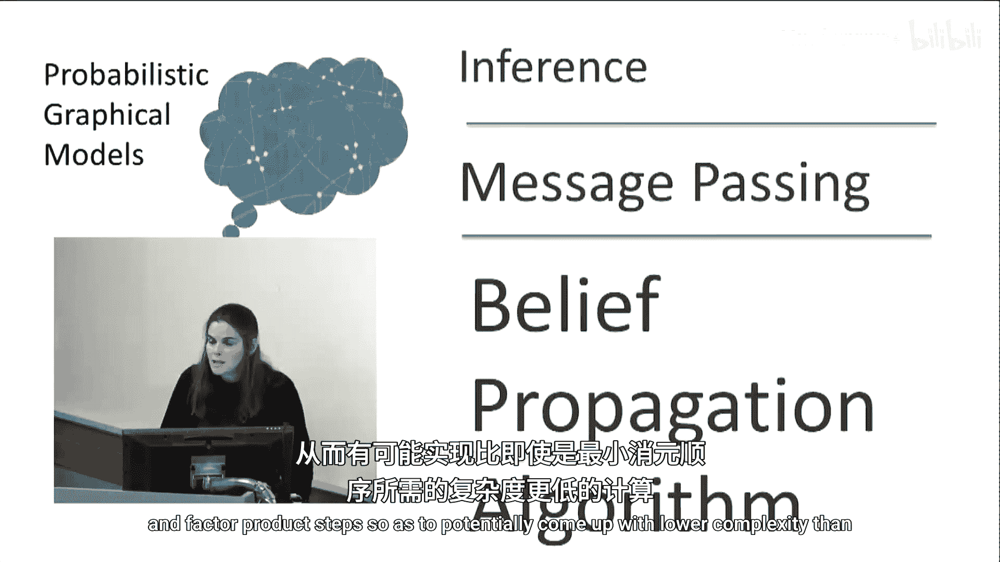
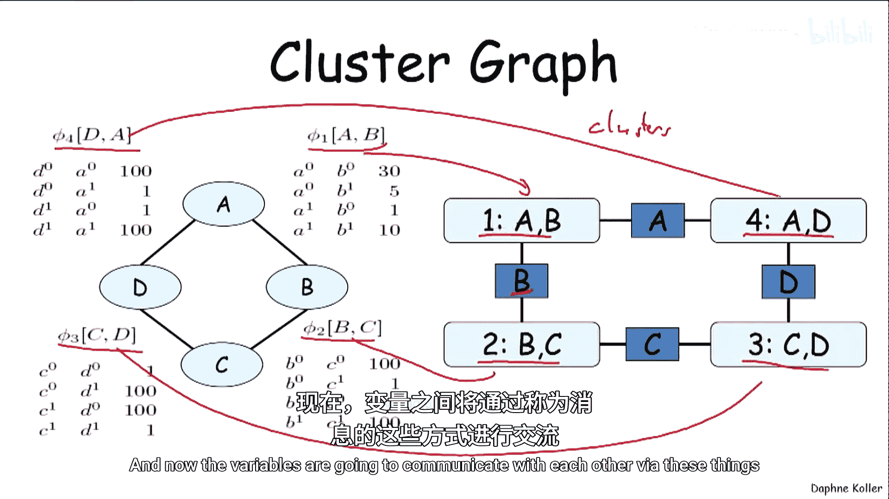
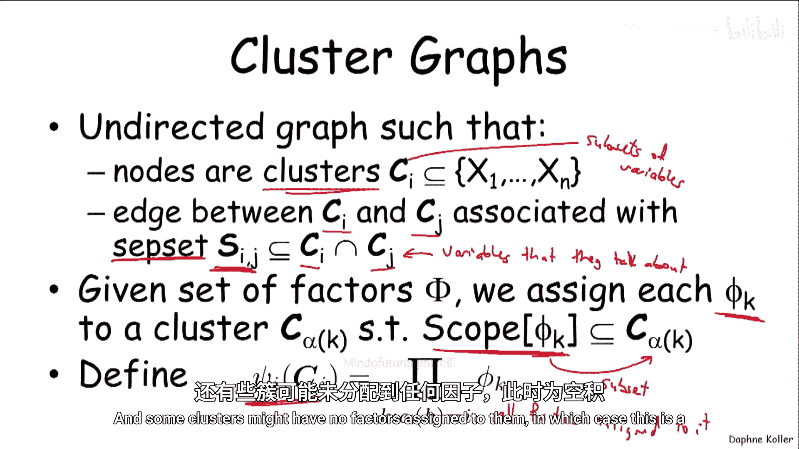
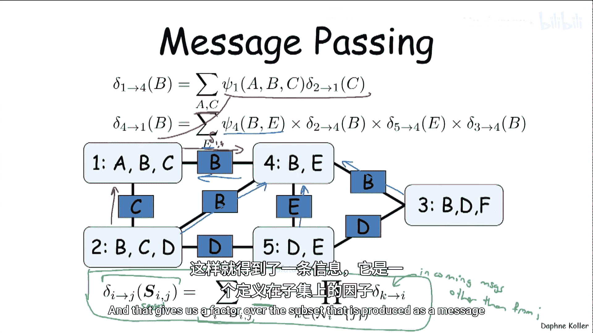
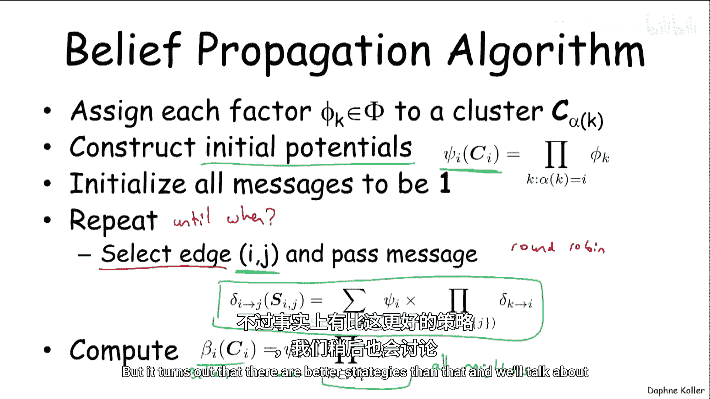
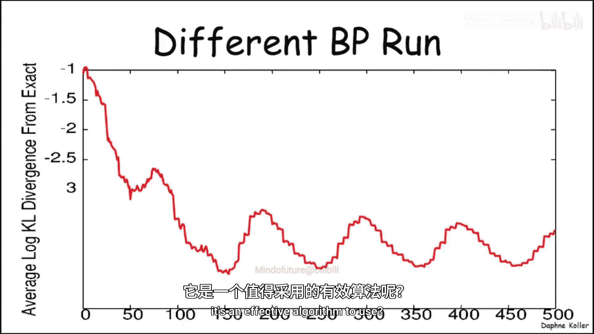
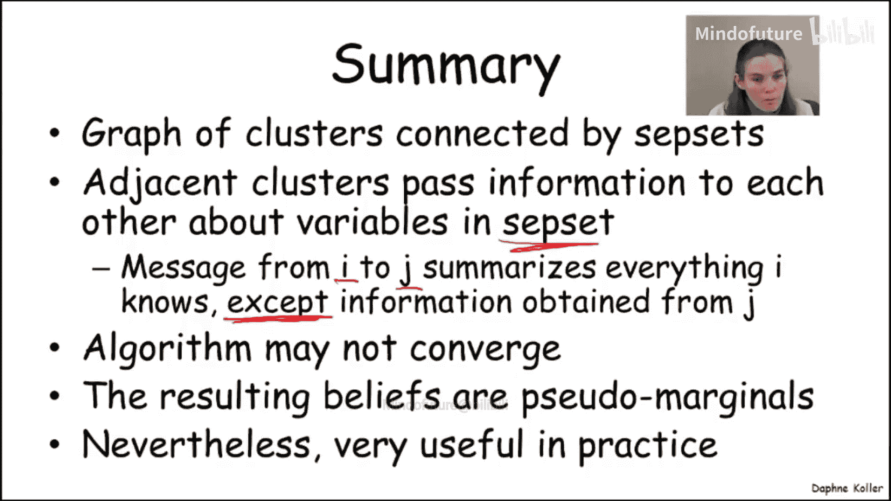

# 概率图模型：2.7：置信传播算法

在本节课中，我们将学习变量消元算法之外的另一类算法——消息传递算法。我们将看到，这类算法在某种程度上与变量消元密切相关，但它为我们执行求和与因子乘积步骤提供了额外的灵活性，从而有可能获得比最小消元序更低的计算复杂度。

## 从变量消元到消息传递

上一节我们介绍了变量消元算法。本节中，我们来看看一种替代方案：消息传递算法。其核心思想是将计算任务分解到多个“簇”中，让它们通过交换“消息”来协同工作，最终得到近似解。

考虑一个简单的马尔可夫网络。与其直接进行变量消元（尽管这个网络计算成本不高），我们不如构建一个**簇图**。簇图是一种数据结构，我们将从图模型中提取的小块知识（因子）放置到称为“簇”的节点中。

例如，我们可能有四个簇：
*   簇1：管辖变量 A 和 B。
*   簇2：管辖变量 B 和 C。
*   簇3：管辖变量 C 和 D。
*   簇4：管辖变量 A 和 D。

这些簇会相互“交谈”，试图说服对方，让它们对共同管辖的变量的看法达成一致。例如，簇1会与簇2讨论变量 B，告诉簇2它对 B 的看法，从而使簇2能更准确地了解 B 的分布。

## 簇图与初始化

首先，每个簇会获得自己的初始信息（因子）。我们将这些初始信念或证据称为 **ψ**。在简单例子中，ψ 就是原始模型中的因子 φ。

以下是簇图初始化的步骤：
1.  **构建簇图**：它是一个无向图，节点是代表变量子集的簇，边连接相邻的簇。
2.  **分配因子**：每个初始因子 φ_k 必须且只能被分配给**一个**簇。这个簇的管辖范围必须包含该因子的所有变量（即因子的作用域是簇变量集的子集）。这是为了避免证据被重复计算。
3.  **计算初始势函数**：每个簇的初始信念 ψ_i 是其被分配的所有因子的乘积。如果某个簇没有被分配任何因子，则其 ψ_i = 1。

用公式表示，对于簇 i：
`ψ_i = ∏_{φ 被分配给簇 i} φ`

## 消息传递机制

初始化后，簇之间开始通过**消息**进行通信。最初，所有消息都被初始化为 1（即无信息状态）。

当一个簇（例如簇 i）想要发送消息给其邻居簇 j 时，它会执行以下操作：
1.  收集它当前掌握的所有信息：包括它自己的初始信念 ψ_i，以及从**除 j 以外**的所有邻居簇那里收到的消息。
2.  将这些信息相乘，得到一个关于其管辖变量的联合信念。
3.  **边缘化**掉簇 j 不关心的变量（即那些在簇 i 的变量集中但不在簇 j 变量集中的变量）。
4.  将结果作为消息 δ_{i→j} 发送给簇 j，这个消息的作用域是两簇共有的变量子集 S_{ij}。

消息传递的核心公式如下：
`δ_{i→j}(S_{ij}) = ∑_{C_i \ S_{ij}} ( ψ_i × ∏_{k∈N(i)\{j\}} δ_{k→i} )`
其中：
*   `C_i` 是簇 i 的变量集。
*   `S_{ij}` 是簇 i 和 j 共有的变量子集。
*   `N(i)` 是簇 i 的邻居集合。
*   `∑_{C_i \ S_{ij}}` 表示对属于 `C_i` 但不属于 `S_{ij}` 的变量求和（边缘化）。

**关键点**：消息 δ_{i→j} 的计算**不包含**从目标簇 j 发来的消息 δ_{j→i}。这是为了防止信息在两者间循环强化，导致信念无限放大。

## 算法流程与信念计算

基于上述机制，置信传播算法可以概括如下：

1.  **初始化**：
    *   将每个因子 φ 分配给一个合适的簇。
    *   计算每个簇的初始势函数 ψ。
    *   将所有消息 δ 初始化为 1。
2.  **迭代消息传递**：
    *   重复选择图中的一条边 (i, j)。
    *   根据上述公式，沿该边传递消息 δ_{i→j} 和 δ_{j→i}（通常异步进行）。
3.  **计算最终信念**：
    *   当满足某种停止条件（如消息变化很小或达到固定迭代次数）后，计算每个簇的最终信念。簇 i 的信念 β_i 是其自身初始势函数与所有传入消息的乘积：
        `β_i = ψ_i × ∏_{k∈N(i)} δ_{k→i}`

这些 β_i 被称为**伪边缘分布**，它们近似表示了对应变量子集的联合分布。

## 算法的特性与表现

置信传播算法有几个重要的未定义方面：
*   **停止条件**：何时结束迭代？常见策略是检查消息的变化是否小于某个阈值，或设置最大迭代次数。
*   **消息调度策略**：按什么顺序选择边来传递消息？简单的轮询顺序是可行的，但存在更高效的调度策略。

那么，这个算法有效吗？答案是：既有效又需要谨慎。

*   **近似性**：在一般的带环图中，该算法可能不收敛，或者收敛到一个近似解，而非精确的边缘概率。从理论上讲，它得到的信念是伪边缘分布。
*   **实际效果**：尽管是近似算法，但在许多实际应用中（如图像处理、医疗诊断网络），其计算结果与精确边缘分布非常接近，表现出色。研究表明，在许多存在大量环路的网络中，置信传播算法能给出高质量的近似。

## 总结

本节课中我们一起学习了置信传播算法。它是一种在簇图上通过传递消息进行推理的近似算法。每个簇汇总来自其他邻居（除接收方外）的信息，经过边缘化后，将关于共享变量的摘要信息发送给邻居。这种设计避免了信息的直接重复计算。虽然该算法在带环图上可能不保证收敛或精确性，但其产生的伪边缘分布在众多实际问题上非常接近真实结果，因此被广泛使用。