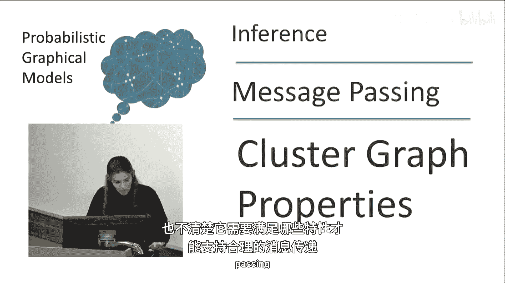
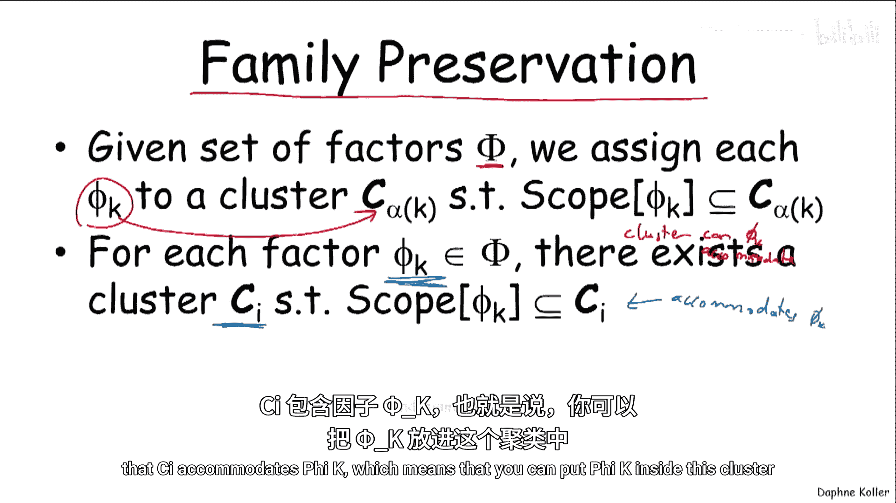
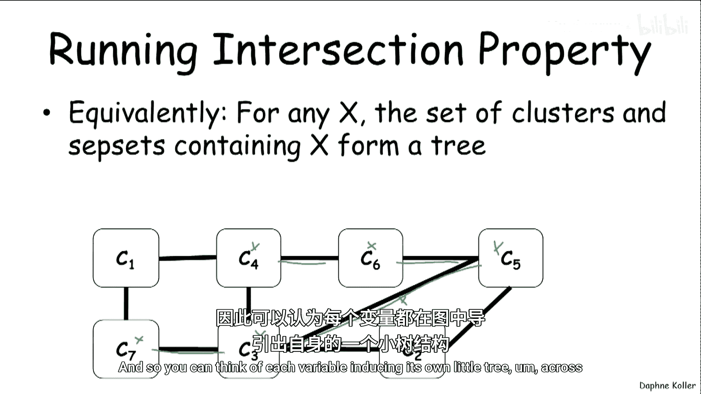
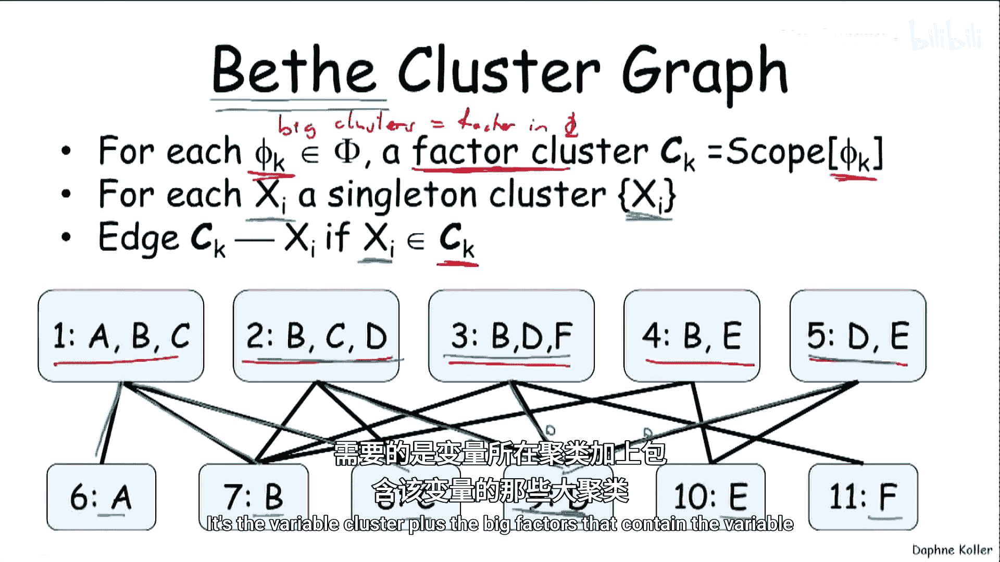
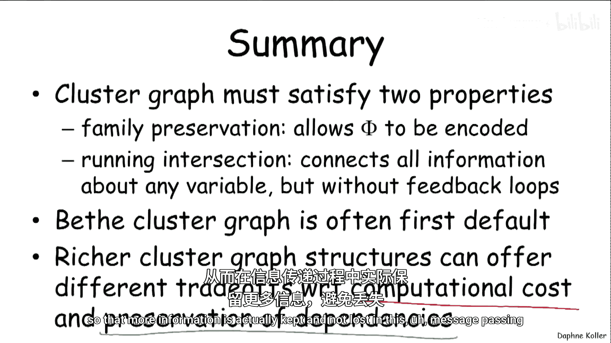

# 008：团图的性质 📊

在本节课中，我们将学习信念传播算法所依赖的**团图**需要满足的关键性质。我们将详细探讨**族保持性**和**运行相交性**这两个核心属性，并介绍一种简单且常用的团图构造方法——**贝塔团图**。

## 团图回顾

上一节我们介绍了信念传播算法是在**团图**上传递消息的。但当时并未具体说明如何构造这个团图，以及它需要满足哪些性质才能支持有效的消息传递。

首先，让我们回顾一下团图的定义。团图是一个无向图，其节点是包含变量子集的**团**，边则关联一个子集 **S_IJ**，该子集是连接两个端点的两个团的交集。

## 团图的关键性质

为了确保信念传播算法能正确工作，团图必须满足两个关键性质。

### 性质一：族保持性

第一个性质称为**族保持性**。这个性质非常直观。给定一个因子集合 **Φ**，我们需要能够将每个因子 **φ_K** 分配到某个团 **C_α(K)** 中，使得该团能够容纳该因子的作用域。

为了使团图能够实现这一点，它必须满足一个约束：对于因子集合 **Φ** 中的每一个因子 **φ_K**，都存在一个团 **C**，使得 **C** 能够容纳 **φ_K** 的作用域 **Scope[φ_K]**。这意味着你可以将这个因子“放入”这个团中。

这就是族保持性。它确保了原始模型中的所有信息都能在团图中得到表示。

### 性质二：运行相交性

第二个性质理解起来稍微复杂一些，它叫做**运行相交性**。我们先看定义，再理解其含义。

定义如下：假设我们有一对团 **C_I** 和 **C_J**，以及一个同时属于这两个团的变量 **X**。运行相交性要求，在 **C_I** 和 **C_J** 之间存在一条**唯一**的路径，使得该路径上的所有团及其边上的子集都包含变量 **X**。

这意味着什么？举个例子，如果变量 **X** 同时出现在团 **C_7** 和团 **C_5** 中，那么必须存在一条连接 **C_7** 和 **C_5** 的路径，并且路径上的每个节点（团）和边（子集）都包含 **X**。这条路径必须是唯一的。

现在，我们来理解这个定义中“存在性”和“唯一性”两方面的直觉。

*   **存在性**：想象一下，如果出于某种原因，**C_7** 和 **C_5** 之间没有这样一条包含 **X** 的路径。那么，这两个各自拥有关于 **X** 信息的“社区”就永远无法就 **X** 进行交流，信息无法传递和整合。这显然不是我们想要的，因此我们需要这条路径存在。
*   **唯一性**：这部分理解起来更微妙一些。假设存在两条不同的路径都包含 **X**。现在考虑消息传递算法：**C_3** 可以向 **C_5** 发送关于 **X** 的信息（例如，“我认为 **X** 取值为1”）。**C_5** 整合这个信息后，可能通过另一条路径将信息传回 **C_3**。这会在图中形成一个**反馈环**，导致关于 **X** 的信念被不断自我强化，从而产生非常极端和有偏差的概率估计。为了避免（或至少减少）这种风险，我们需要防止这种环路，因此要求路径是唯一的。

需要指出的是，防止这种环路只能**减少**问题，而非完全**消除**。例如，如果图中存在强相关的变量 **X** 和 **Y**，信息可能会通过 **Y** 间接地形成反馈，这仍然是信念传播算法在处理强相关性模型时表现不佳的原因之一。这一点我们将在后续课程中深入探讨。

现在，让我们回到运行相交性，并给出一个等价的定义以加深理解：运行相交性等价于说，对于**任何变量 X**，包含 **X** 的所有团和边子集构成一棵**树**。

这棵树必须是连通的（因为路径必须存在），且不能是带环的图（因为路径必须唯一）。你可以这样理解：每个变量都在团图中诱导出自己的一棵小树，关于该变量的信息就在这棵树上流动。

## 性质检验与非法图例

理解了定义后，让我们用之前的例子来检验一些团图是否满足运行相交性。我们已经讨论过族保持性，现在重点关注运行相交性。

考虑变量 **B**。在有效的团图中，包含 **B** 的团和边子集形成了一棵树。然而，并非所有结构都合法。

以下是违反运行相交性的非法团图示例：

1.  **违反存在性**：如果团 **C_2** 包含 **B**，但无法通过一条包含 **B** 的路径连接到其他包含 **B** 的团，这就违反了存在性。
2.  **违反唯一性**：如果包含 **B** 的团和边子集形成了一个环（例如，在团1和团4之间有两条不同的路径都包含 **B**），这就违反了唯一性。

如果我们希望团图既能允许 **B** 和 **C** 之间的相关性信息传递（这是上图中缺失的），又能满足运行相交性，我们可以调整边的连接方式，确保对于 **B**（以及其他所有变量），包含它的部分构成一棵树。

## 构造团图：贝塔团图

那么，我们如何构造一个满足这些性质的团图呢？一个非常简单（虽然在某些方面是退化的）、因其简洁而常用的结构叫做**贝塔团图**。这个术语来源于统计物理学。

在贝塔团图中，有两种类型的团：

1.  **大团（因子团）**：对应原始因子集合 **Φ** 中的每一个因子 **φ_K**。每个大团的作用域就是该因子 **φ_K** 的作用域。
    `C_K 的作用域 = Scope(φ_K)`
2.  **小团（变量团）**：对应每一个单独的变量 **X**。每个小团的作用域只包含该变量本身。
    `C_X 的作用域 = {X}`

连接规则是：当一个变量 **X** 属于一个大团 **C_K** 的作用域时，我们就在大团 **C_K** 和变量团 **C_X** 之间添加一条边。

根据之前例子的因子集合，我们可以构造出如下贝塔团图：

你可以看到，这个图是“退化”的，因为消息只能在因子团和单变量团之间传递，每一步都会丢失变量之间的相关性信息。然而，它构造简单，并且**保证满足运行相交性**。为什么呢？以变量 **D** 为例，包含 **D** 的部分（变量团 **D** 以及所有包含 **D** 的大团）天然形成了一棵以 **D** 为中心的星形树，这符合运行相交性的要求。

## 总结

本节课中，我们一起学习了团图必须满足的两个核心性质：

1.  **族保持性**：确保原始概率图模型中的所有因子都能被分配到团图中合适的团内，从而完成模型的编码。
2.  **运行相交性**：具有双重目的。首先，它连接了关于任一变量的所有信息，使得这些信息能在图中传递和整合；其次，它通过防止紧密的反馈环路，避免了消息在传递过程中自我强化而导致的计算结果严重偏差。

我们还介绍了一种基础的团图构造方法——**贝塔团图**。它因其定义简单且性质有保证，常被作为默认选择。然而，更丰富的团图结构（如我们之前讨论过的类型）能够在**计算成本**和**信息保存度**之间提供非常不同、有时是显著更优的权衡。增大团的规模虽然会增加消息传递的计算开销，但同时也能更好地在消息传递过程中保持变量间的依赖关系，减少信息损失。