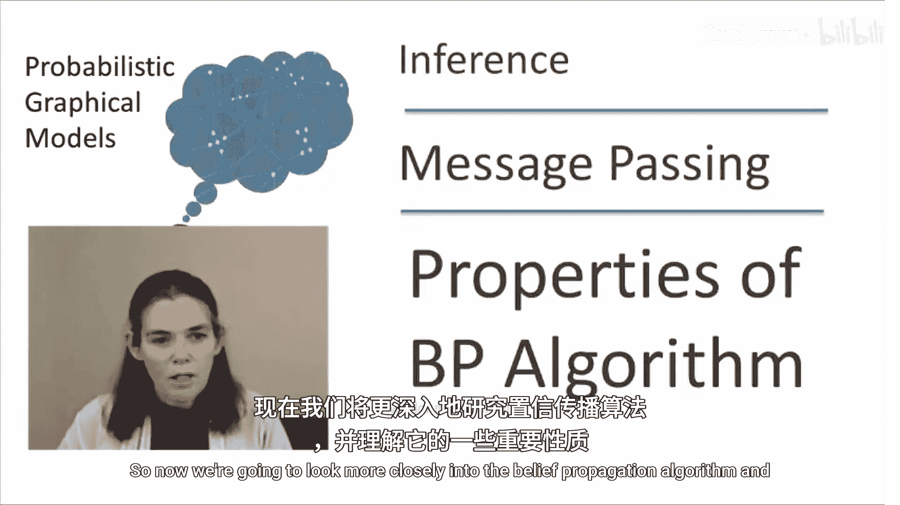
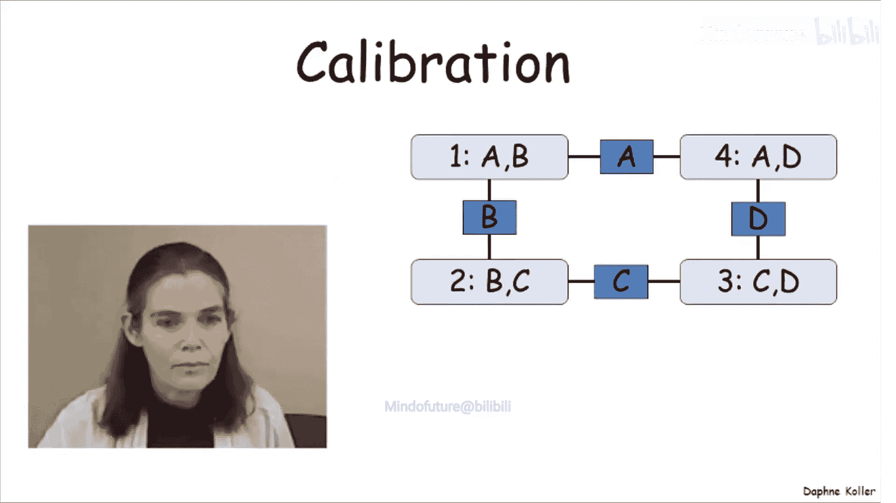
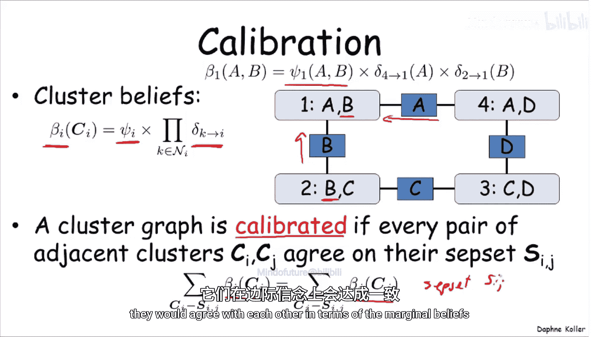
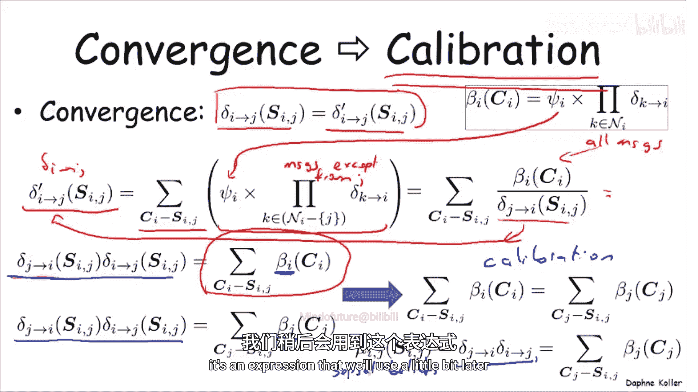
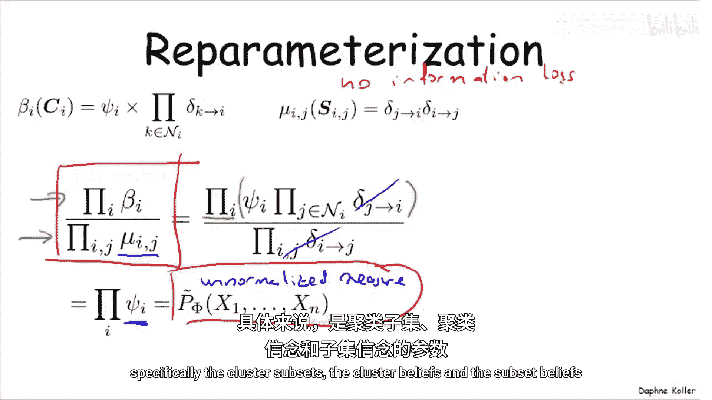
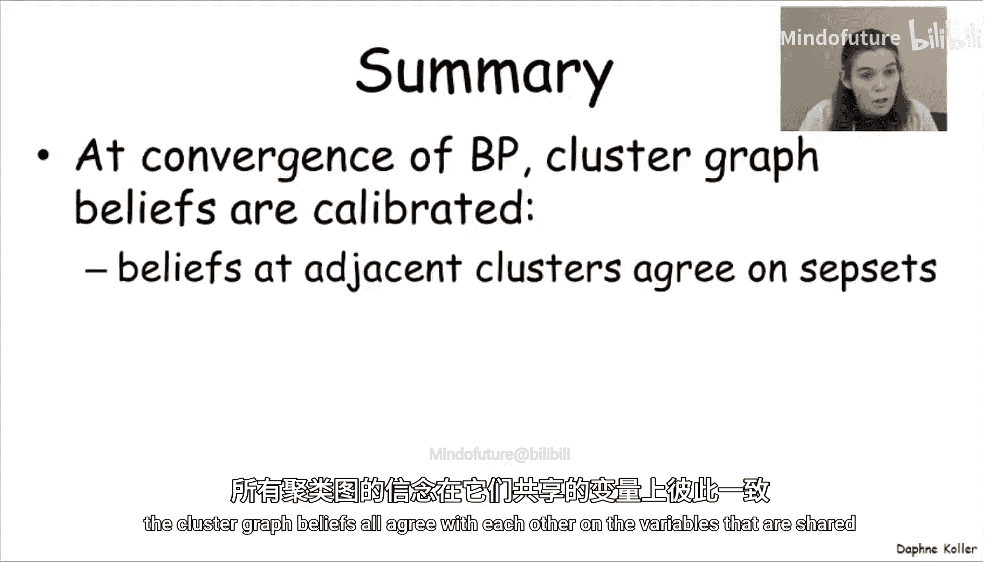
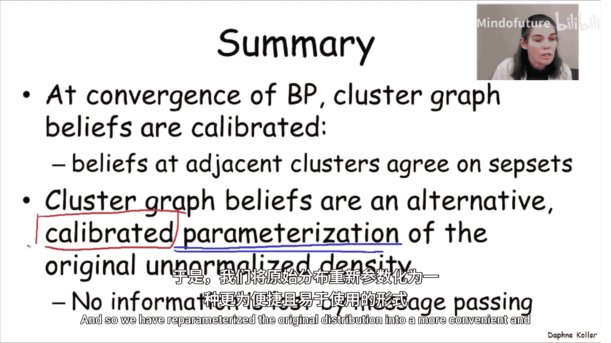

# 概率图形模型2：推理：P09：置信传播的性质





在本节课中，我们将深入探讨置信传播算法，并理解它所具有的一些重要性质。

## 校准与收敛

上一节我们介绍了置信传播的基本流程，本节中我们来看看算法收敛时的一个重要性质：校准。



一个聚类图被称为**校准**的，如果图中不同聚类关于它们共享变量的信念是一致的。具体来说，对于任意两个相邻的聚类 `i` 和 `j`，它们关于共享变量子集 `S_ij` 的边际信念应该相等。用公式表示如下：

```
sum_{C_i \ S_ij} beta_i(C_i) = sum_{C_j \ S_ij} beta_j(C_j)
```

其中，`beta_i` 和 `beta_j` 分别是聚类 `i` 和 `j` 的信念。

置信传播算法的一个重要性质是：**算法的收敛意味着校准**。

为了理解这一点，让我们进行一个简单的推导。当置信传播收敛时，相邻聚类间传递的消息在下一步与上一步相等。这意味着对于任意边 `(i, j)`，有 `delta_{i->j}^{new} = delta_{i->j}^{old}`。

根据信念的定义和消息更新规则，我们可以推导出，在收敛状态下，聚类 `i` 和 `j` 关于共享子集 `S_ij` 的边际信念都等于同一条边上两个方向消息的乘积：

```
mu_{ij}(S_ij) = delta_{i->j} * delta_{j->i}
```

由于 `mu_{ij}` 对两个聚类是相同的，这就证明了校准性质。这个共享的边际信念 `mu_{ij}` 被称为**子集信念**。



## 重参数化

基于校准性质，我们可以得到另一个关键性质：**重参数化**。

在算法收敛后，我们得到一组聚类信念 `{beta_i}` 和子集信念 `{mu_{ij}}`。这些信念共同构成了一种新的参数化方式，但它仍然完整地编码了原始的未归一化概率分布。

以下是重参数化的核心关系：

```
P-tilde(X) = (∏_i beta_i(C_i)) / (∏_{(i,j)∈E} mu_{ij}(S_ij))
```

其中，`P-tilde(X)` 是原始的未归一化联合分布（即所有初始势函数 `Psi_i` 的乘积）。这个公式表明：

*   **分子**是所有聚类信念的乘积。
*   **分母**是所有子集信念的乘积。
*   两者相除后，所有消息因子（`delta`）相互抵消，最终结果就是所有初始势函数的乘积。

因此，置信传播算法并没有丢失原始分布的任何信息，它只是将信息重新分配到了各个聚类的局部信念和它们之间的共享信念中，形成了一种更方便计算边际概率的参数化形式。

## 总结



本节课中我们一起学习了置信传播算法的两个核心性质：



1.  **收敛意味着校准**：当算法收敛时，图中所有相邻聚类关于共享变量的边际信念会达成一致。
2.  **重参数化**：收敛后得到的聚类信念和子集信念，共同构成原始联合分布的一个等价表示。这种表示具有校准性，使得我们可以从包含某个变量的任意聚类中直接读取关于该变量的信息，为后续的概率查询提供了便利。



通过理解这些性质，我们能够更好地把握置信传播算法的内在机理及其结果的可靠性。