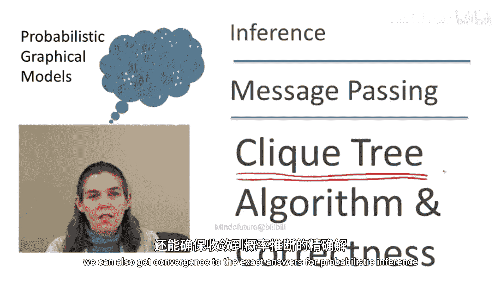
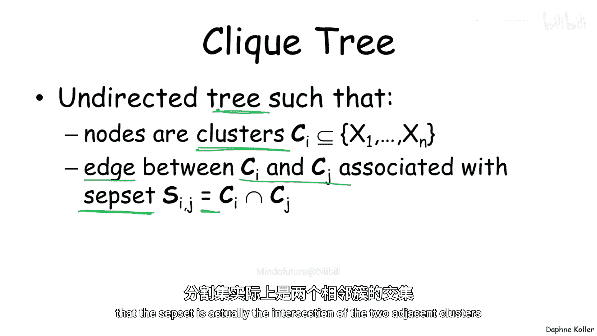
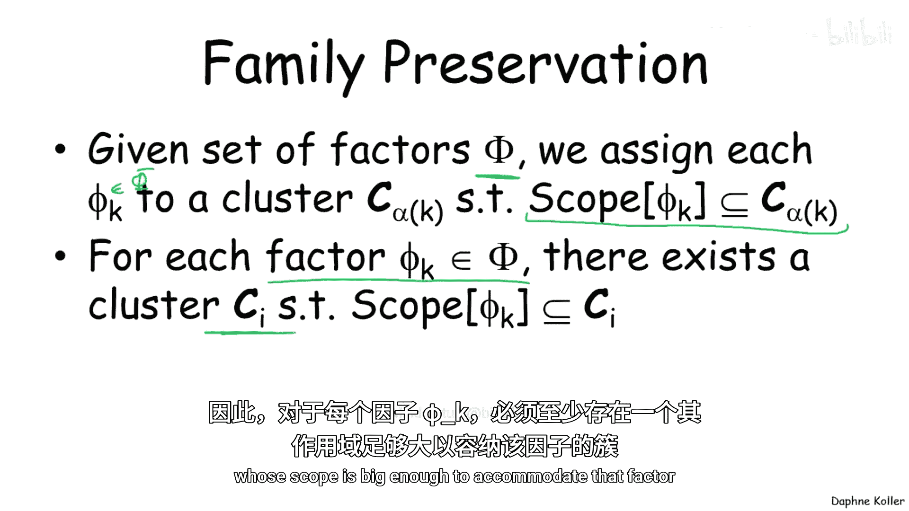
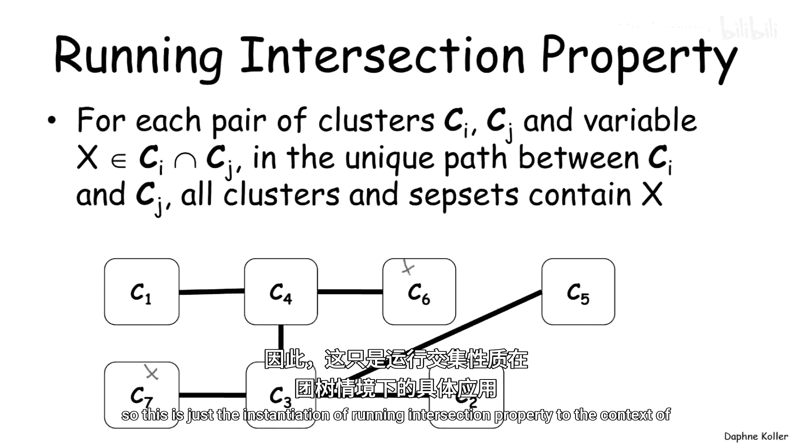
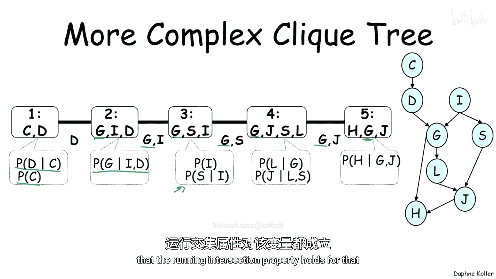
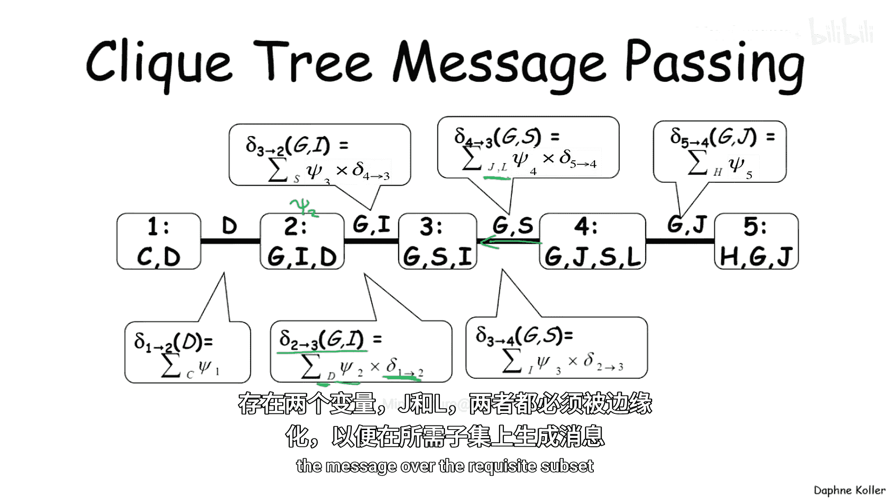
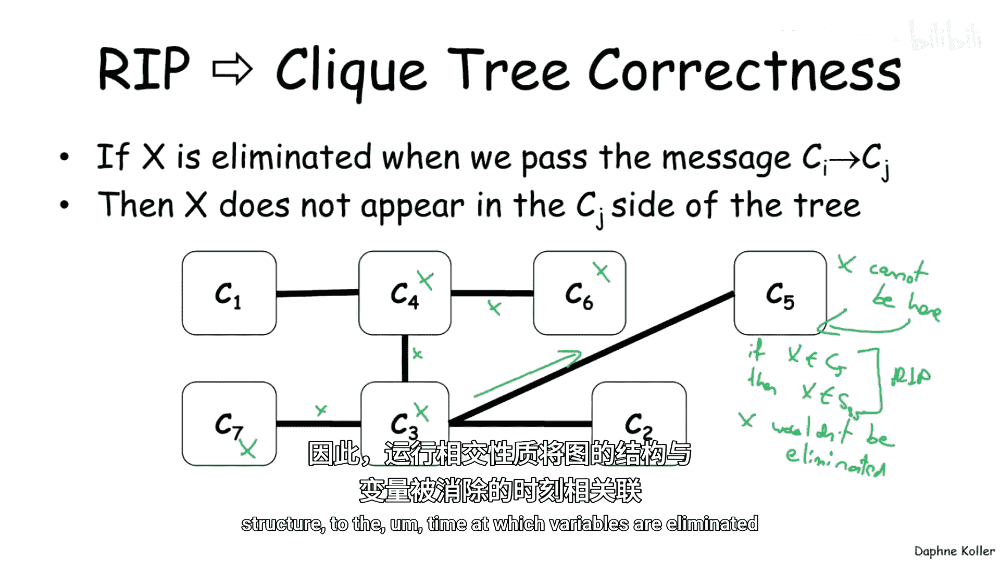
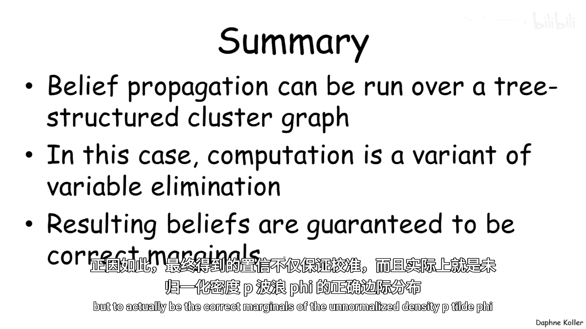

# 概率图模型：2：团树算法正确性

在本节课中，我们将学习信念传播算法的一个特例——团树算法。我们将看到，当算法运行在一种称为“团树”的特殊数据结构上时，不仅能保证收敛，还能保证收敛到概率推理的精确解。

## 从链式结构到团树

上一节我们介绍了在一般聚类图上运行的信念传播算法。本节中，我们来看看一个更特殊的场景：在“团树”这种数据结构上传递消息。团树是聚类图的一个特例，但正是在这种结构上，信念传播算法能获得更强的性能保证，即快速收敛到精确答案。

### 链式结构上的消息传递

让我们从最简单的树结构——一条链开始。考虑一个链式无向马尔可夫随机场或条件随机场，为简化起见，我们只考虑成对势函数。

以下是消息传递的过程：
1.  从最左边的团开始，团1向团2发送消息。由于此时没有其他传入消息，该消息就是团1势函数对变量A的求和，得到一个关于变量B的消息。
2.  团2接收消息后，将其与自身的势函数相乘，并对变量B求和，得到一个关于变量C的消息，发送给团3。
3.  此过程持续进行，直到消息传递到链的末端。反向的消息传递遵循相同的规则，但每个团在向外发送消息时，不会乘入从目标团接收到的消息。

这种消息传递方式有一个重要特性：最终计算得到的信念是精确的。让我们以团3为例进行验证。

团3的信念是自身势函数与来自团2和团4的传入消息的乘积。通过展开这些消息的定义，我们发现最终表达式是所有初始势函数的乘积，并对不在团3内的所有变量进行了求和。这非常类似于变量消除算法。

### 变量消除的正确性保证

变量消除算法正确的关键在于，在求和消除一个变量之前，必须乘入所有包含该变量的因子。在上述链式例子中，我们可以验证这一点：
*   消除变量E时，只乘入了包含E的因子ψ4。
*   消除变量A时，只乘入了包含A的因子ψ1。
*   消除变量B时，乘入了包含B的因子ψ2，以及从消除ψ1后留下的、也包含B的因子。

因此，消息传递过程遵循了合法的变量消除顺序，从而保证了结果的正确性。

## 团树的定义与性质

现在，让我们将这个概念扩展到更一般的“团树”。团树是一种无向树，其节点是变量的集合（称为“团”），边连接着这些团。

与一般聚类图的关键区别在于，团树要求连接两个团的边上的“分离集”必须恰好等于这两个团的交集。

### 团树作为聚类图的特例

团树是聚类图的一个特例，因此它也必须满足聚类图的两个核心性质：族保持性和运行交集性。

**族保持性**要求网络中的每个因子都必须能被分配到至少一个范围足以容纳其所有变量的团中。

**运行交集性**在树结构下可以简化为：对于任意两个包含同一变量X的团，变量X必须出现在连接这两个团的唯一路径上的每一个团和分离集中。

### 复杂团树示例

让我们看一个更复杂的团树示例，它对应我们之前用于演示变量消除的学生网络。

以下是该网络中的因子分配：
*   团 `{C, D}` 分配了因子 `P(C)` 和 `P(D|C)`。
*   团 `{G, I, D}` 分配了因子 `P(G|I,D)`。
*   团 `{G, S, I}` 分配了因子 `P(I)` 和 `P(S|I)`。
*   以此类推。

可以验证，此团树满足运行交集性。例如，变量G出现在多个团中，并且确实出现在连接这些团的路径的所有团和分离集上。

在此团树上的消息传递过程与链式类似，只是分离集可能包含多个变量，在传递消息时需要对这些变量全部求和。

## 运行交集性与算法正确性

运行交集性（连同族保持性）是保证团树上消息传递算法正确的关键。其核心思想在于，它确保了变量消除的顺序是合法的。

考虑一个变量X，它出现在团Ci和Cj中。根据运行交集性，X必须出现在连接Ci和Cj的路径上的所有团中。现在，假设在从团Ck向团Cl传递消息的过程中，变量X被求和消除（即不出现在输出消息的范围内）。那么，根据运行交集性，X不可能出现在团Cl中（否则它也会出现在分离集Skl中，从而不会被消除）。这意味着，在消除X的那一刻，所有包含X的因子都已经被乘入到了当前的消息计算中，因为任何其他包含X的团要想与当前团联系，其路径必须经过当前团，而它们的消息尚未传入。

让我们在学生网络的团树示例中验证这一点。考察团 `{G, S, I}` 的信念计算，它最终是网络中所有势函数的乘积，并对变量 `C, D, J, L, H` 进行了求和。我们可以验证，在消除其中任何一个变量时（例如D），所有包含该变量的因子（如 `P(G|I,D)` 和 `P(D|C)`）都已在计算中被乘入。

## 总结

本节课中我们一起学习了团树算法。我们了解到，信念传播算法可以运行在一种树状的特殊聚类图——团树上。团树必须满足族保持性和运行交集性。当算法在团树上运行时，其计算过程本质上是变量消除算法的一种并行化实现。正因如此，算法不仅能使信念达到校准状态，更能保证计算出的就是未归一化联合分布的精确边缘概率。