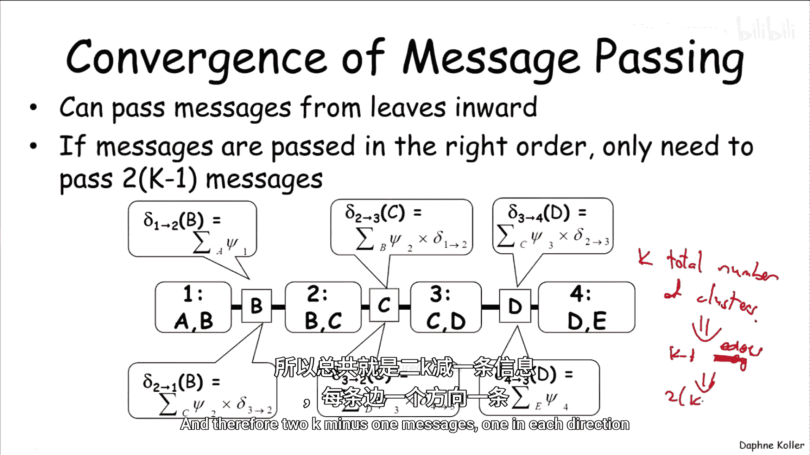
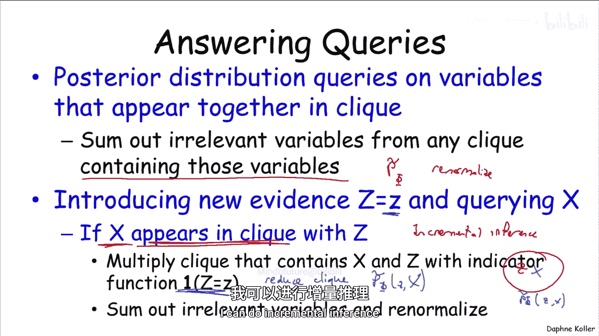
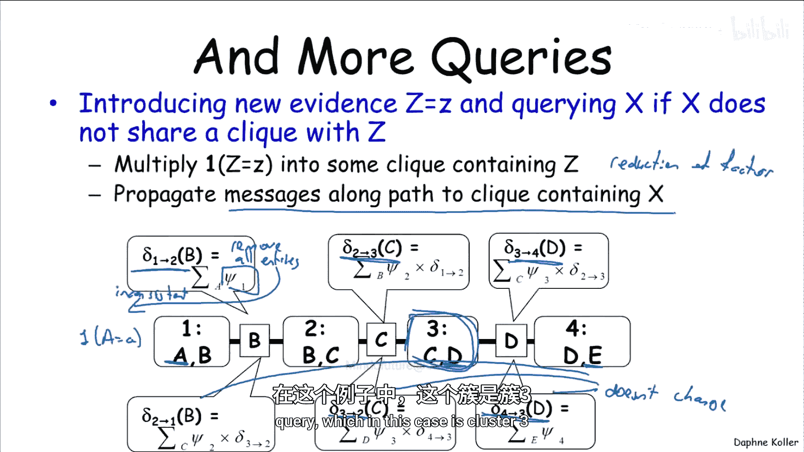
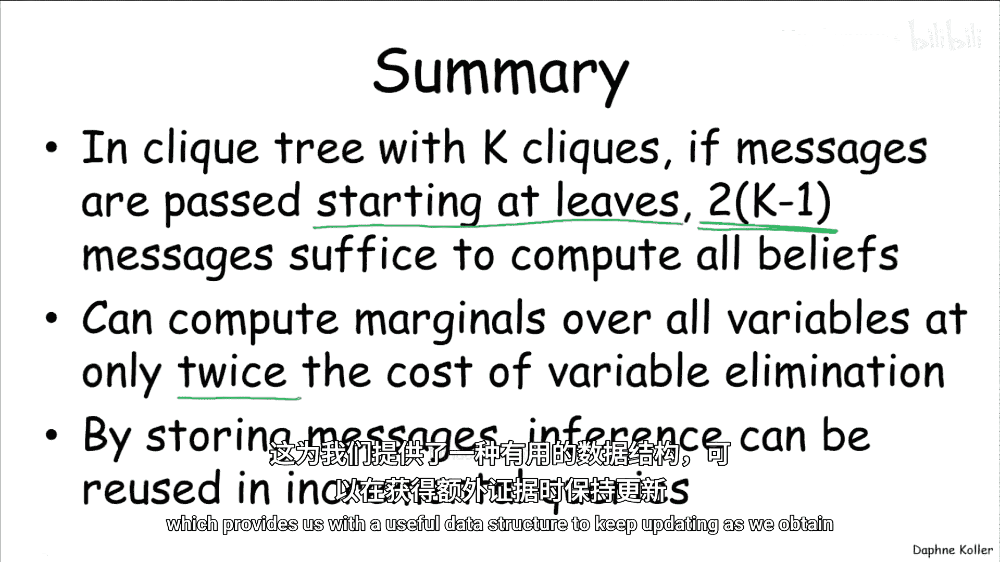

# 011：团树算法计算 🧮

在本节课中，我们将学习团树算法的高效计算策略。我们将看到，通过利用树结构的特性并精心安排消息传递的顺序，可以极大地提升算法的计算效率，而不仅仅是保证其正确性。

## 从消息传递到高效计算

上一节我们定义了团树算法，它本质上就是在树状图上运行的置信传播算法。事实证明，我们可以利用树结构的特性，显著改善该算法的计算行为。

让我们回到一个非常简单的树结构中的消息传递过程，这个树只有四个团：C1(AB)， C2(BC)， C3(CD)， C4(DE)。我们来观察消息的行为。

这里有消息 Delta_12（在边1-2上传递的消息）、Delta_23 等，总共六条消息。现在我们可以注意到一个非常重要的特性：**Delta_12 一旦计算完成，就永远不会改变**。因此，Delta_12 在第一次计算后立即收敛。

那么 Delta_23 呢？这取决于 Delta_23 何时被传递。如果它在团2收到来自团1的消息之前就被传递了，那么当团2收到消息后，情况可能会改变。但如果团2足够“聪明”，它会等待。一旦它等到那条消息（因为那条消息不会再变），那么 Delta_23 也就不会再改变了。同理，Delta_34 需要等待更久，它需要等待 Delta_23。但如果它等到 Delta_12 传递给团2，并且 Delta_23 传递给团3之后，再发送 Delta_34，那么 Delta_34 也不会再改变。

因此，如果消息传递按照正确的顺序等待，那么整个树的消息可以在一次正向传递中收敛。从左到右并非唯一方向，从右到左也会得到完全相同的行为。所以，我们可以通过**一次从左到右的传递和一次从右到左的传递**，计算出整个树的所有消息。

对于像这样的链式结构，这种方法实际上有自己的名字，称为**前向-后向算法**，常用于隐马尔可夫模型等链式结构表示中。

关键在于，计算所有这些消息的总工作量，只是每个方向上一次消息传递的步骤：一次从左到右，一次从右到左。一旦所有消息传递完毕，我们就得到了正确的置信度，它们代表了因子乘积 P_tilde(Φ) 的边际分布。因此，我们通过在这个团树上进行两次“扫描”，计算出了图中所有团的边际分布。

## 通用策略与消息传递顺序

更一般地说，如果一个团 CI 在发送消息给邻居 CJ 之前，等待并接收了来自**所有其他邻居**的最终消息，那么它发送给 CJ 的消息 Delta_IJ 也将是最终的。那么，我们总能找到一个能达到此目标的消息传递顺序吗？会不会出现大家互相等待，最终卡住、永远不发送消息的情况？

关键在于，我们可以从叶子节点开始。**来自叶子节点的消息总是立即成为最终的**。一旦叶子节点的消息被确定，我们就可以发送其父节点的消息，依此类推。因为这是一个树结构，所以**保证**你能找到一个合法的消息传递顺序。

如果我们以正确的顺序传递消息，那么我们只需要传递 **2(K-1)** 条消息，其中 K 是团的总数。为什么？因为一个有 K 个节点的树有 K-1 条边，而每条边有两个方向的消息，所以总共有 2(K-1) 条消息。

## 合法与非法的消息传递顺序示例

让我们看几个消息传递顺序的例子，看看哪些可行，哪些不可行。

我们可以从任意叶子节点开始，比如 C2。C2 传递消息后，哪个团可以传递下一个消息？C3 还不行，因为它还在等待其他团的消息。所以我们必须去另一个叶子节点，例如 C1。C1 现在可以传递消息了。C3 和 C4 仍然不是候选，因为它们各自还在等待另一条消息，但 C6 可以传递消息。现在我们可以激活 C4，C4 现在可以向 C3 发送消息，因为它已经收到了除 C3 之外的所有消息。C7 可以向 C3 传递消息。注意，在这个过程中，我如何排序有很多任意的决定，我本可以接下来用 C5。现在 C3 可以选择传递消息了，然后是 C5。

此时，每个团都收到了除一个邻居外的所有消息。所以现在我们可以开始向另一个方向传递消息了：C5 可以向 C3 传递消息，C3 可以向 C2、C7 或 C4 中的任何一个传递消息。此时，C4 可以向 C6 和 C1 传递消息。

那么，什么是非法的消息传递顺序呢？例如，如果 C1 向 C4 传递了消息，而 C4 急于求成，紧接着就向 C3 发送消息，这就是一个非法的顺序。因为 C4 还没有获得传递消息给 C3 所需的全部信息，它仍在等待来自 C6 的消息，所以这不是一个好的排序。

## 团树作为高效查询的数据结构

团树还具有其他非常优雅的计算特性，使其成为一个有用的数据结构。让我们思考一下可以使用团树回答的查询类型。

以下是一些可能的查询：

*   **团内变量查询**：如果我们想查询出现在同一个团中的单个变量或一组变量的后验分布，我们可以取任何包含所有这些变量的团，并对该团中我们不关心的变量进行求和，从而得到仅关于这些变量的后验。注意，这个后验是未归一化的度量 P_tilde，为了得到归一化的度量，你需要重新归一化。
*   **引入新证据的增量推理**：你可能想针对某个变量引入新证据，并查询另一个变量。这是一种增量推理形式：你已经校准了团树，现在你说：“等等，我有了另一个观察结果，让我们看看现在会发生什么。”事实证明，团树非常擅长处理这种情况。

我们将这种情况分为两种：简单情况和稍复杂的情况。

**情况一：证据变量 Z 和查询变量 X 在同一个团中**

这实际上非常简单。假设我们有一个包含 Z 和 X 的团（如果还有其他变量也没关系，我们总是可以去掉它们）。我们现在可以通过**限制注意力到与我的证据 Z 一致的条目**来“约减”这个团。这称为**团约减**。然后我们得到 P_tilde(Z, X)，为了得到后验，我们可以对相关变量求和并归一化。这样就能进行增量推理。

**情况二：证据变量和查询变量不在同一个团中**

让我们用一个例子来想象，我想在 A 上观察证据，并查询 B。

在这种情况下，我可以这样做：我可以将这个指示函数（或我们称之为因子的约减）**乘入**一个包含证据的团中。在这个例子中，我们将把指示函数 δ(A=a) 乘入团1的因子 Ψ1 中，这相当于从团1的置信度中移除所有与该证据不一致的条目。

现在，当我们改变 Ψ1 时会发生什么？想象一下我们从头开始进行整个计算：忘记之前所做的一切，思考一下，如果我们用新的 Ψ1 而不是旧的 Ψ1 传递消息，这个模型会发生什么。一些消息会改变，哪些消息会改变？Delta_12 会改变，因为 Ψ1 变了。Delta_23 会改变，因为 Delta_12 变了。Delta_34 会改变，但如果我们关心的是这边团3的置信度，我们就不关心 Delta_34。其他消息呢？Delta_43 不会改变，Delta_32 也不会改变，Delta_21 也不会改变。

因此，**只有团树中消息的一个子集**会因为这个改变而改变。这意味着在计算我们关于团3的置信度时，我们至少可以重用一半（甚至更多）的消息。我们唯一需要重新计算的消息，是沿着通往包含我们想查询的变量 X（本例中是团3）的团的**路径上的消息**。

## 总结

本节课中我们一起学习了团树算法的高效计算策略。

总结来说，如果我们有一个包含 K 个团的团树，并且我们以谨慎的顺序传递消息（即从叶子节点开始并向内传播），那么我们可以构建一个顺序，使得 **2(K-1) 条消息**就足以计算团树中的所有置信度。这意味着我们得到了模型中每个单一变量的后验分布。

将此与运行变量消除并计算 n 个不同变量的后验所需的计算成本进行对比，这里我们获得了相当可观的计算节省，实际上是变量数量的量级。因此，我们能以**仅两倍于变量消除的成本**计算所有边际分布，而不是 n 倍于变量消除的成本。

我们还展示了，通过缓存或存储消息，我们可以重用推理结果，例如在增量查询的上下文中，这为我们提供了一个有用的数据结构，可以在获得额外证据时不断更新。