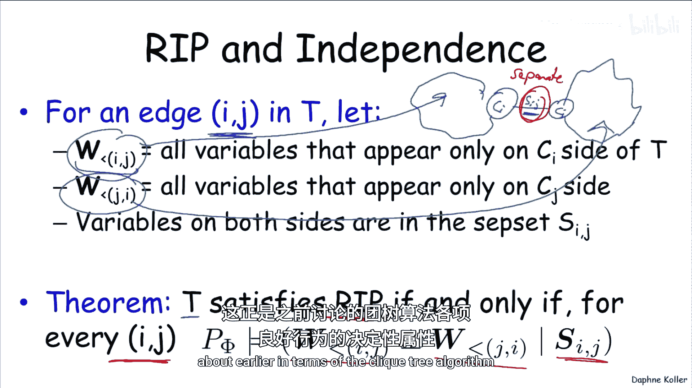
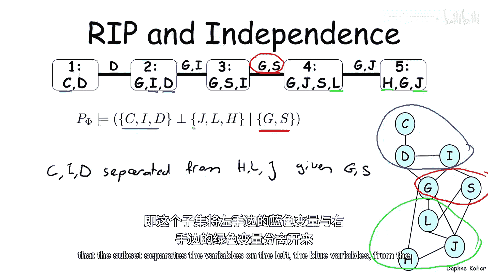
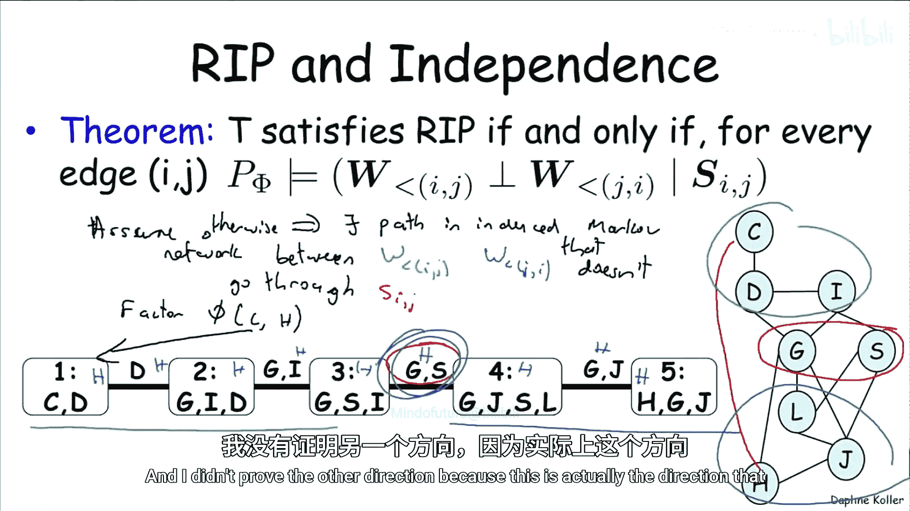
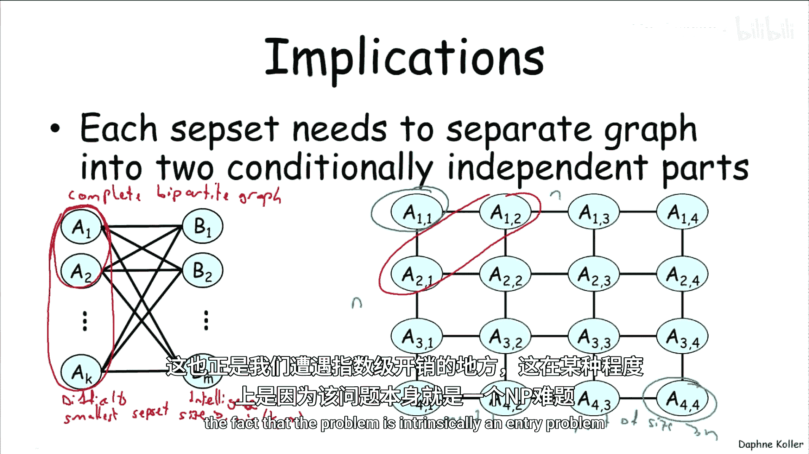
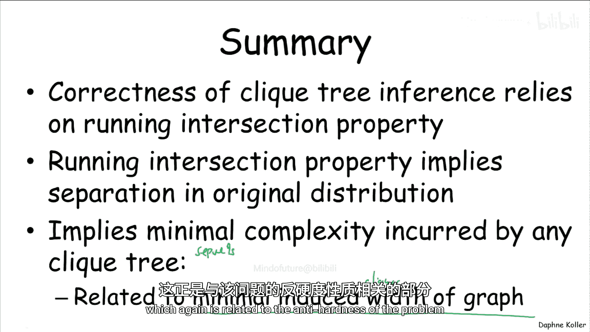

# 012：团树与独立性 🧠

在本节中，我们将深入探讨团树算法的计算复杂性。我们已经知道团树算法具有高效且正确的特性，但推理问题本质上是NP难的，因此必然存在某些情况下计算成本会显著增加。本节将分析这种隐藏成本的具体来源。

---

## 团树算法的性质回顾

我们已证明团树算法具有以下重要性质：
- 它保证在每个团上都能得到正确的边缘概率。
- 这些边缘概率彼此一致。
- 计算可通过团树上的一次向上传递和一次向下传递完成，效率较高。

然而，概率图模型中的推理问题是NP难问题，这意味着在某些情况下运行团树算法时必然存在计算成本。接下来我们将尝试理解这种隐藏成本可能出现在何处。

---

## 团树计算复杂性分析

为了分析团树的计算复杂性，我们首先定义一些符号。考虑团树 `T` 中的一条边 `IJ`，我们将变量分为三组：

1. **W<I**：位于 `IJ` 边 `I` 侧的变量（不包含子集 `SIJ` 中的变量）。
2. **W>J**：位于 `IJ` 边 `J` 侧的变量（不包含子集 `SIJ` 中的变量）。
3. **SIJ**：位于中间的子集变量。

这三组变量互斥且完备，覆盖了树中的所有变量。

现在，我们提出一个关键定理：**团树 `T` 满足运行交集性质（Running Intersection Property）当且仅当对于每条边 `IJ`，给定中间子集变量 `SIJ`，左侧变量 `W<I` 与右侧变量 `W>J` 条件独立**。即子集 `SIJ` 分隔了左侧与右侧的变量。

运行交集性质是证明团树算法正确性的关键，因此这一条件至关重要，它定义了团树算法所有优良行为的根本属性。

---

## 具体示例分析

让我们通过一个具体例子来理解这一定理。考虑以下团树结构，并关注子集 `{G, S}`：
- 左侧变量（蓝色）：`C, I, D`
- 右侧变量（绿色）：`H, J, L`
- 子集变量（红色）：`G, S`

在对应的马尔可夫网络（由贝叶斯网络的因子导出）中：
- 红色变量 `G, S` 位于中间。
- 蓝色变量 `C, I, D` 位于左侧。
- 绿色变量 `H, J, L` 位于右侧。

通过简单观察可发现，蓝色变量与绿色变量之间所有路径都必须经过红色变量。因此，给定 `G, S`，蓝色变量与绿色变量条件独立。这正好验证了定理：子集分隔了左侧与右侧的变量。

---

## 一般性论证

现在，我们尝试给出更一般性的论证。假设在诱导的马尔可夫网络中，存在一条从左侧变量到右侧变量的路径，且该路径不经过子集 `SIJ`。这意味着存在一条边连接了左侧的某个变量和右侧的某个变量，例如 `D` 和 `H`。

由于因子保持性质，涉及 `D` 和 `H` 的因子必须位于团树的某个团中。假设该团位于绿色侧。但 `H` 同时是蓝色侧的变量，根据运行交集性质，`H` 必须出现在从该团到蓝色侧团路径上的所有团中，特别是必须出现在子集 `SIJ` 中。这与 `H` 不在子集中的假设矛盾。因此，这样的路径不可能存在，从而证明了条件独立性。

---

## 计算复杂性的含义

我们最初提出这些性质具有计算含义，那么具体体现在哪里？从子集需要分隔图成为条件独立部分这一事实，我们可以得出什么结论？

在许多图结构中，这暗示了某种最小复杂度，有时可能相当大。让我们通过两个简单但常见的例子来观察这一点。

### 示例一：完全二分图

考虑一个完全二分图，其中两组变量之间没有内部边，但所有交叉边都存在。例如，在课程难度与学生智力的模型中，难度变量与智力变量之间没有边，但每对难度-智力变量之间因观测到的学生成绩而存在边。

那么，我们能为这个图构造的最小子集是什么？例如，仅包含两个 `A` 变量能否将图分隔为两个条件独立的部分？答案是否定的，因为例如两个 `B` 变量可以通过未包含在子集中的其他 `A` 变量连接。

经过进一步思考，不难发现，能够将图分解为有意义部分的最小子集必须包含某一侧的所有变量。因此，任何有意义的团树中，子集的最小尺寸必须大于或等于 `min(k, m)`，其中 `k` 和 `m` 分别是两侧变量的数量。

### 示例二：网格图

另一个例子是网格图，例如伊辛模型或图像分析中的像素网格。考虑如何将这样的图分解为条件独立的部分。

我们可以构造具有较小子集的团树，例如一个子集仅分离 `A11` 与其他部分。但这样剩下的部分仍然很大。如果我们尝试构造一个团树，使得 `A11` 在一侧，`A44` 在另一侧，那么任何这样的团树都必须有一个尺寸至少为 `n` 的子集（对于 `n × n` 的网格）。这意味着，如果试图将网格的一个角与对角分离，子集的大小至少是网格的维度。其他分解方式也不会更好。

---

## 总结

本节课中，我们一起学习了以下内容：

1. **团树算法的性质**：我们回顾了团树算法能保证正确边缘概率且计算高效的特点。
2. **运行交集性质与条件独立性**：我们证明了运行交集性质等价于团树中每条边的子集分隔了左侧与右侧变量，使其条件独立。
3. **计算复杂性分析**：通过完全二分图和网格图两个例子，我们展示了运行交集性质如何导致子集的最小尺寸必须足够大，从而在某些图结构中引发指数级计算成本。
4. **NP难问题的体现**：这种最小复杂度要求正是推理问题本质为NP难的具体表现，即使使用最优的团树也无法避免。

这些分析帮助我们理解了团树算法在保持正确性和高效性的同时，其计算成本的根本来源，以及为何在某些复杂图结构中精确推理会变得非常困难。