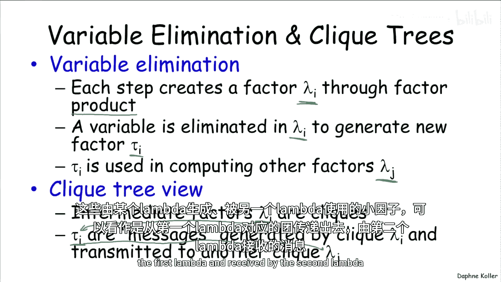
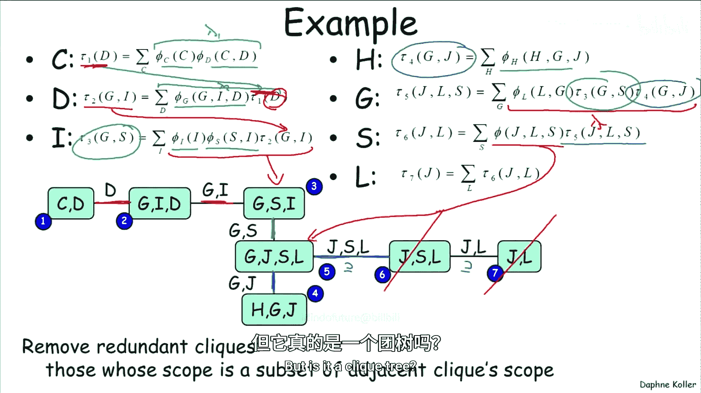
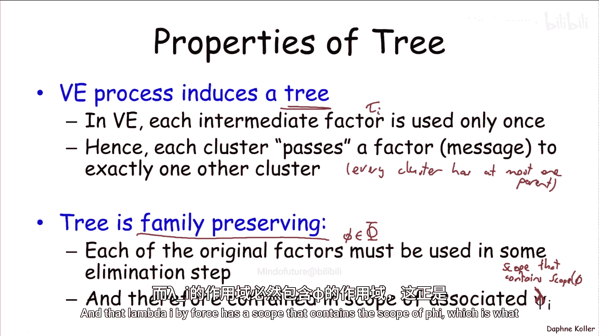
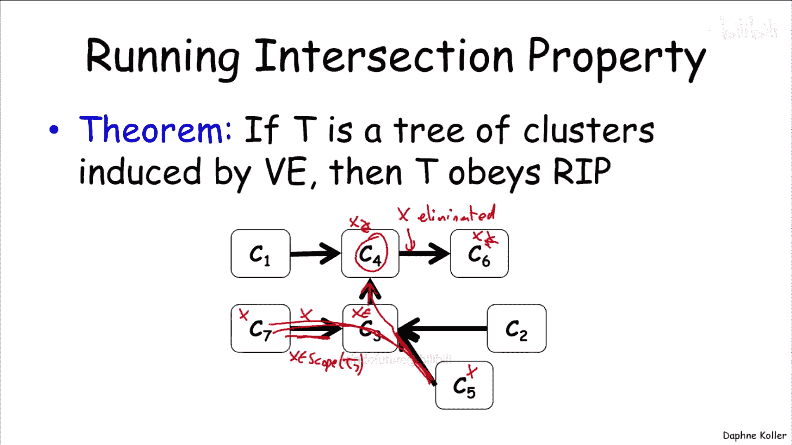
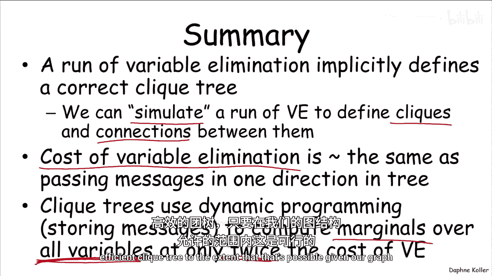

# 013：团树与变量消元

在本节课中，我们将学习变量消元算法与团树算法之间的深刻联系。我们将看到，一次变量消元的运行过程，可以自然地解释并构造出一个正确的团树结构。这回答了“团树从何而来”以及“如何构建一个好的团树”这两个基本问题。

## 从变量消元到团树

上一节我们介绍了变量消元算法。本节中，我们来看看如何将一次变量消元的运行过程，重新解释为在团树上传递消息的过程。

变量消元算法包含一系列步骤。在每一步中，它会将一组因子相乘，生成一个范围较大的中间因子，我们称之为 **λᵢ**。然后，算法从 λᵢ 中消去一个变量，得到一个范围较小的新因子，我们称之为 **τᵢ**。τᵢ 会被放回可用因子池中，在后续计算另一个大因子 λⱼ 时被使用。

我们可以将这个过程视为计算实体之间的消息传递。每个中间因子 λᵢ 可以看作团树中的一个团。而由某个 λᵢ 产生、并被另一个 λⱼ 使用的因子 τᵢ，则可以视为从一个团（对应 λᵢ）传递给另一个团（对应 λⱼ）的**消息**。

总结来说，变量消元算法定义了一个图结构：
*   为每个因子 λᵢ 创建一个团 Cᵢ。
*   如果在计算 λⱼ 时使用了由 λᵢ 产生的因子 τᵢ，则在 Cᵢ 和 Cⱼ 之间连一条边。
*   这条边代表的消息就是 τᵢ。

## 实例分析

让我们通过之前用过的“增强版学生网络”例子，具体看看这个过程。

第一步变量消元将因子 φ_C 和 φ_{C,D} 相乘，得到 λ₁，其作用域是 {C, D}。这对应图中的第一个团。

第二步消去变量 D。它使用上一步产生的 τ₁ 与原始因子 φ_G 相乘，得到 λ₂，其作用域是 {G, I, D}。由于 λ₂ 的计算使用了 τ₁，因此在团 {C, D} 和团 {G, I, D} 之间有一条边，传递的消息就是 τ₁，其作用域是 {D}。

后续步骤以此类推。最终，我们得到了一个由变量消元过程诱导出的图结构。

观察这个图，你会发现它比我们最初为这个网络构建的团树要大。原因在于，我们得到了三个相邻的团，且一个团是另一个团的子集（例如 {J, L} ⊆ {J, S, L} ⊆ {G, J, S, L}）。实际上，将一个计算拆分成多个子集团并没有额外好处，完全可以在最大的那个团中完成所有计算。因此，一个典型的后处理步骤是**移除冗余的团**，将它们合并到包含它们的最大的团中。

## 验证团树性质

我们已经看到如何通过变量消元过程得到一个类似团树的结构。但它是一个合格的团树吗？我们需要验证它是否满足团树的三个关键性质。

以下是我们可以证明的性质：

1.  **树结构**：变量消元产生的图是一棵树。因为每个中间因子 τ 一旦产生，只会被**恰好消耗一次**。消耗后，它就从因子集中移除。这形成了一个有向树结构（每个节点最多有一个父节点），忽略边的方向后就是一棵无向树。

2.  **族保持性**：该树满足族保持性。因为原始因子集 Φ 中的每一个因子 φ，都必然在变量消元过程的某一步中被使用（最终所有因子都会被乘在一起）。因此，每个原始因子 φ 的作用域，必然被包含在某个中间因子 λᵢ 的作用域中，而 λᵢ 对应一个团。这正是族保持性所要求的。

3.  **运行相交性**：该树满足运行相交性。这个性质是指：如果变量 X 同时出现在两个团 Cᵢ 和 Cⱼ 中，那么 X 也必须出现在连接 Cᵢ 和 Cⱼ 的路径上的每一个团中。
    *   证明思路：在变量消元过程中，每个变量只被消去一次。假设变量 X 在团 Cₓ 中被消去（这是最后一个包含 X 的团）。现在考虑任意另一个包含 X 的团 Cᵧ。由于 X 没有被消去在连接 Cᵧ 和 Cₓ 的路径上，那么 X 必须存在于 Cᵧ 传递给其父团的消息 τ 的作用域中。而消息 τ 的作用域是其产生团作用域的子集，因此 X 也必然在 Cᵧ 的父团中。通过归纳论证，可以得出 X 必须出现在从 Cᵧ 到 Cₓ 的整条路径上的每一个团中。对于任意两个包含 X 的团，此论证同样成立。

因此，**一次变量消元的运行过程，隐式地定义了一个正确的团树**。

## 构建与计算意义

这个发现具有重要的实践意义：

*   **构建团树**：要获得一个满足族保持性和运行相交性的团树，我们可以简单地**模拟**一次变量消元过程。这并不意味着真正执行昂贵的消元计算，而是通过分析“哪些因子会被乘在一起”以及“产生的因子会被谁使用”，来确定团的构成和团之间的连接。这正是我们在前面例子中所做的。
*   **计算成本**：这样构建出的团树，其计算成本本质上与运行变量消元算法相当。因为产生的团的大小，正好对应变量消元中产生的中间因子的大小。
*   **计算边际**：然而，如之前所述，团树算法通过动态编程缓存消息，避免了重复计算。这使得我们能够以大约两倍于单次变量消元的成本，计算出网络中**所有变量**的边际概率。
*   **启发式方法**：我们讨论过用于寻找好的变量消元顺序（以产生较小的中间因子）的启发式方法。这同一套启发式方法，同样可用于构建一个尽可能小且高效的团树。

本节课中我们一起学习了变量消元与团树算法之间的核心联系。我们了解到，一次变量消元过程可以自然地诱导出一个正确的团树结构，这回答了团树的起源问题。通过模拟变量消元（而非实际执行），我们可以构建团树，并利用其消息传递机制高效地计算网络中所有变量的边际概率。用于优化变量消元顺序的启发式方法，同样适用于优化团树的构建。