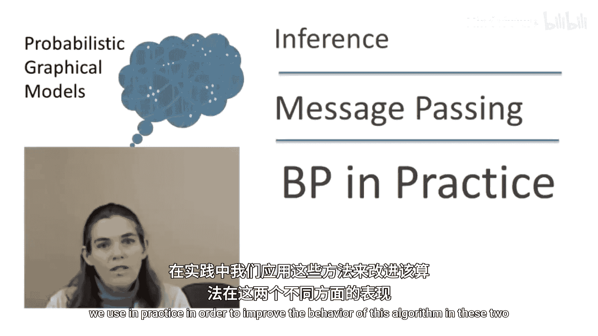
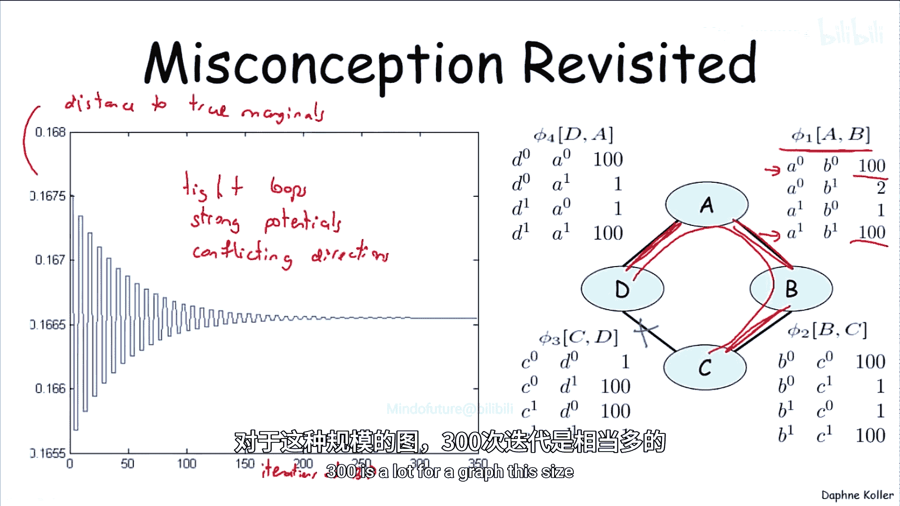
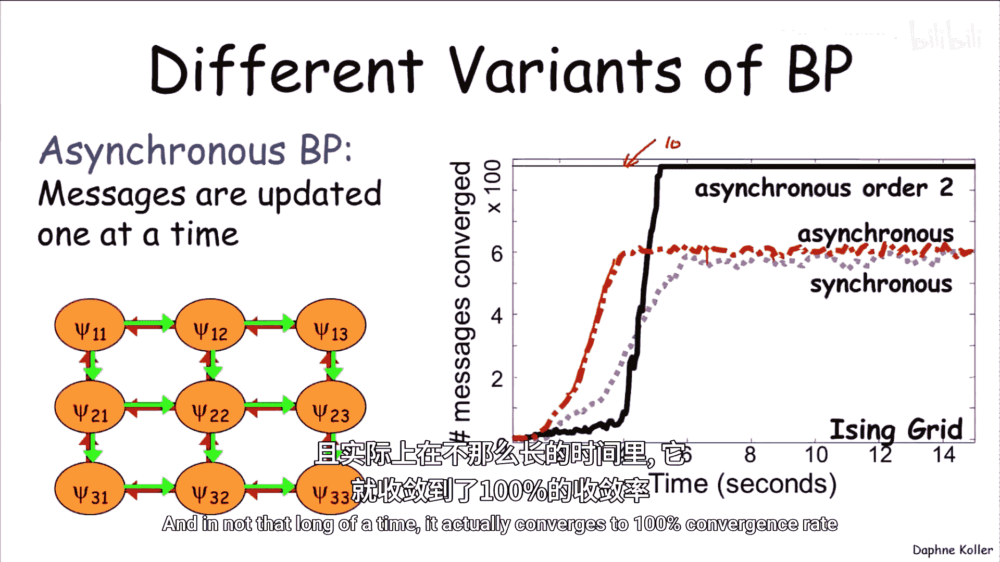
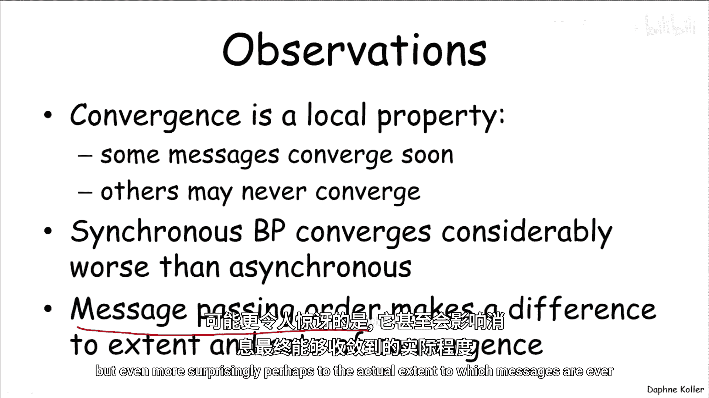
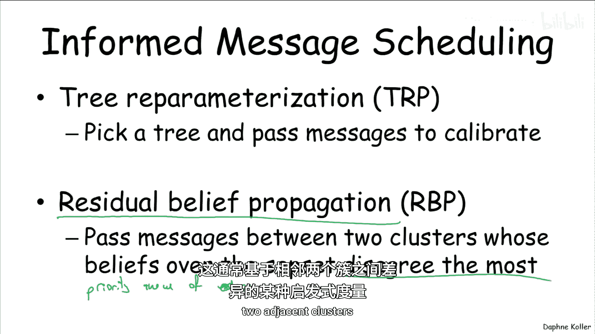
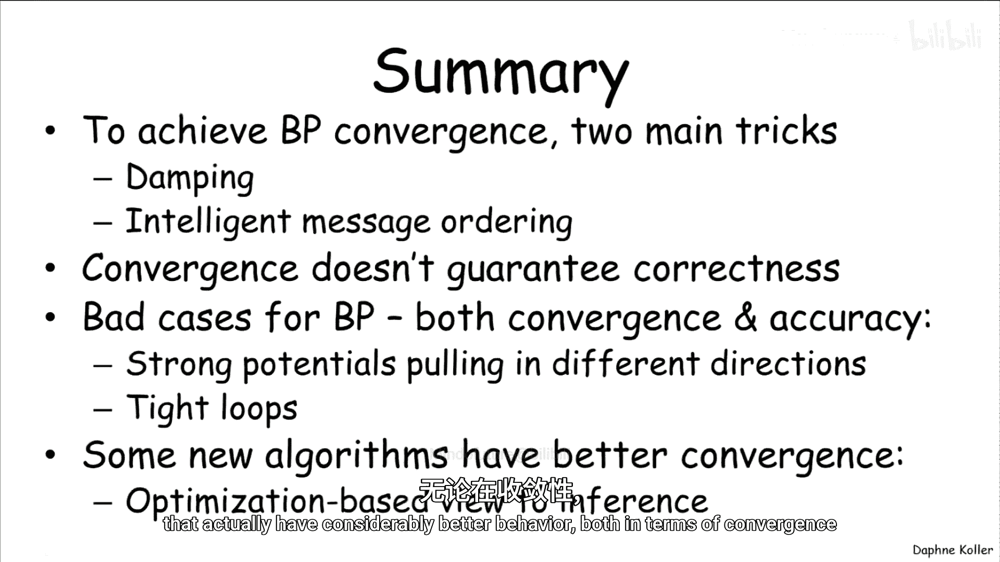

# 014：实践中的置信传播 🧠

在本节课中，我们将要学习置信传播算法在通用聚类图上的实际应用。我们将探讨该算法可能遇到的收敛性和准确性问题，并介绍实践中用于改善其性能的几种关键技巧。

上一节我们介绍了置信传播算法的基本概念，本节中我们来看看它在实际运行中可能遇到的问题。

## 收敛性与准确性问题

置信传播算法在通用聚类图上运行时，是一个迭代算法，其中消息根据先前的消息定义。该算法可能不收敛，即使收敛，也可能无法得到正确答案。现在我们将讨论这些问题有多严重，以及实践中用于改善算法在这两方面表现的一些技巧。

为了获得直观理解，让我们回顾一下误解示例。这个例子并非原始误解示例，而是我们修改了势函数 `Phi_1(A,B)`，使其值更大，从而让A和B之间达成一致的“推力”更强。在这个例子中，我们可以看到置信传播算法出现了明显的振荡行为。

X轴是迭代次数，Y轴是某种距离真实分布（真实边缘概率）的度量。为什么会出现如此强烈的振荡？让我们看看这些势函数的作用。这里的势函数推动A和B达成一致。当消息传递时，A和B想要一致，B和D也想要一致，B和C想要一致，但C和D却非常想要不一致。因此，当消息传递时，你会从两边得到相互冲突的消息。例如，在C这边，它被推动与D不一致；另一方面，当你沿着环路走一圈时，实际上又促使C与D一致。这种在环路或循环上的冲突，导致了消息从一边或另一边传递时产生振荡行为。

这种特定的配置——紧密的环路、强大的势函数和冲突的方向——可能是置信传播算法表现最差的场景。在这种情况下，无论是收敛性还是获得结果的准确性，它都可能表现不佳。

在这个例子中，算法最终确实收敛了，但可以看到它花费了大约300次迭代。对于这种规模的图来说，300次是很多的。有些情况下，即使运行到500次迭代也完全没有收敛。也许运行10,000次会收敛，但这很难说。那么，我们如何改善网络的收敛性和准确性呢？

## 应避免的做法：同步置信传播

首先，让我们看看不应该做什么。最重要的一点是避免使用一种称为**同步置信传播**的算法变体。在同步置信传播中，所有消息被并行更新。所有处理器（或聚类）同时启动，查看所有传入消息，并一次性计算所有传出消息。

从实现简单性和并行化能力的角度来看，这是一个很好的算法，因为你可以为每个聚类分配一个处理器，它们并行工作且彼此之间没有依赖。

不幸的是，同步置信传播实际上并不是一个非常好的算法。下图显示了已收敛消息数量随时间变化的函数。你可以看到，随着时间的推移有一定改善，然后它会在某个已收敛消息数量上趋于平稳。

相比之下，让我们看看**异步置信传播**的行为，其中消息一次更新一个。请注意，这个算法规定得不够明确，因为我们没有指定更新的顺序，稍后会回到这个问题。但仅仅通过以异步方式传递消息这一简单优点，行为就得到了改善，无论是在消息收敛的速度上，还是在已收敛消息的数量上。

这里使用的消息传递顺序并不是特别好。下图展示了一个更好的消息传递顺序。它需要稍长一点的时间来确保某些消息收敛，但请注意，最终在不算太长的时间内，它实际上实现了100%的收敛。

以下是关于此事的一些重要观察：
*   收敛性是置信传播中的一个局部属性。有些消息收敛得相当快，而有些可能永远不收敛。当算法运行一段时间后，有些消息仍未收敛时，人们通常会直接停止算法，并接受当前结果。
*   同步置信传播的收敛性比异步置信传播差得多，这就是为什么目前很少有人实际使用同步置信传播。
*   如果我们使用异步置信传播，消息传递的顺序不仅会影响收敛速度，甚至可能更令人惊讶地影响实际收敛的消息范围。

## 如何选择消息传递顺序？

有几种不同的调度算法，我将介绍两种比较流行的。

第一种称为**树再参数化**。它的做法是选择一棵树，然后以与团树算法中相同的方式在该树中传递消息，以“校准”那棵树，同时保持所有其他消息固定。例如，我们可能从校准红色的树开始，这意味着我按这个方向传递消息，然后朝另一个方向传递，同时保持所有其他消息固定。接着我选择另一棵树，比如蓝色的树，并校准它。我继续这样做，挑选一棵树，运行并校准它。需要满足的约束是：首先，我的树必须覆盖所有边，否则我会遗漏某些需要传递的消息；其次，虽然不是硬性约束，但如果树更大（即选择尽可能覆盖图的大部分而不包含环路的生成树），往往会提高性能。

第二种消息调度算法称为**残差置信传播**。它的做法是尝试寻找“好”的消息，即那些高价值、影响大的消息。它会寻找两个信念差异很大的聚类，如果它们差异大，意味着传递该消息可能会对接收聚类产生较大影响。因此，算法维护一个基于预估影响大小（例如相邻聚类间差异的某种启发式度量）排序的边优先级队列，并总是从队列顶部选取消息进行传递。

## 改善收敛性的另一个技巧：平滑（阻尼）

另一个用于改善置信传播算法收敛性的重要技巧称为**平滑**或**消息阻尼**。这是一种常用于减少基于定点方程（其中左边根据右边定义）的动态系统振荡的通用技巧。

在原始置信传播算法中，我们将 `delta_ij` 定义为其他 `delta` 的函数，我们已经看到这可能导致振荡行为。原始置信传播消息更新公式为：
`delta_i->j = f(other deltas)`

现在，我们将采用一种平滑版本，不让消息变化过于剧烈。我们将使用新旧消息的加权平均，其中权重为 `lambda`：
`delta_i->j_new = lambda * f(other deltas) + (1 - lambda) * delta_i->j_old`

事实证明，这同样可以抑制系统中的振荡，并增加其收敛的机会。

让我们看一些示例行为。下图显示了红色线代表的同步置信传播，以及已收敛消息的百分比。1代表完美收敛。我们可以看到同步算法在大约20%到25%的收敛消息处趋于平稳，这在实际中几乎无用，因为如果只有20%的消息收敛，那么剩余的消息意义不大。

绿色线代表**无平滑的异步**算法。我们可以看到，即使没有平滑，异步算法的性能也明显优于同步算法（我们甚至没有展示无平滑的同步算法，因为它会更差）。最后，蓝色线代表**带平滑的异步**算法。我们可以看到它在某个时间点实现了完美收敛。

你还可以查看单个消息或单个信念（边缘概率）的行为。下图仍然是一个伊辛网格（测试各种近似推理算法收敛性的标准设置）。这里的黑线是真实的边缘概率。你可以看到，同步置信传播基本上无限期地在其周围来回振荡，而异步置信传播则相当快地收敛，并且非常接近正确答案。

但并非总是如此。下图显示了同一模型中不同变量的情况，黑线同样是真实值。在这里我们可以看到，异步确实改善了收敛性，但收敛到的答案并不完全正确。在实践中，根据一开始提到的所有因素（环路的紧密程度、势函数的强度或峰值程度），你会看到这两种行为，这些因素将决定有多少因子具有这种振荡行为以及答案的错误程度。

## 总结

本节课中我们一起学习了改善置信传播算法实际应用的几种方法。

总结一下，实现BP收敛有两个主要技巧：**阻尼（平滑）** 和**智能消息传递**。使用这些技巧通常更容易获得收敛性，但收敛性并不保证正确性。对这两者都有负面影响的糟糕情况是：强大的势函数将你拉向不同方向，以及紧密的环路。

最后需要指出的是，还有一些新算法在这两方面（收敛性和结果准确性）都有显著更好的行为，虽然我们没有时间深入探讨所有这些主题。