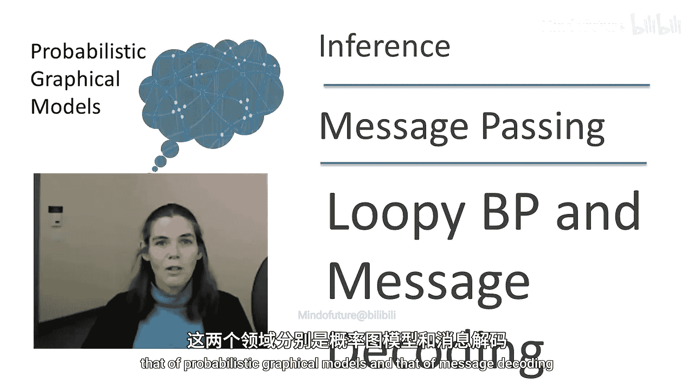
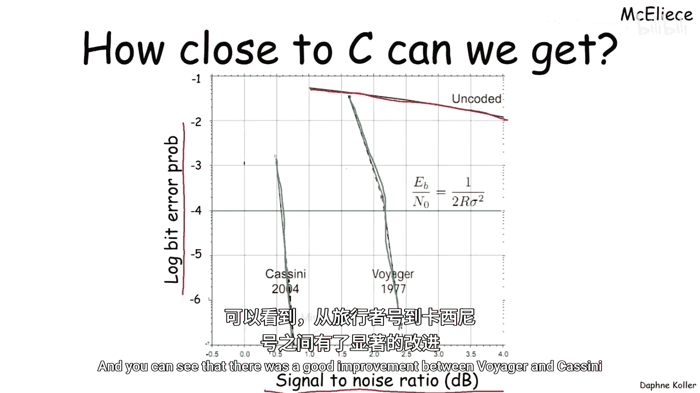
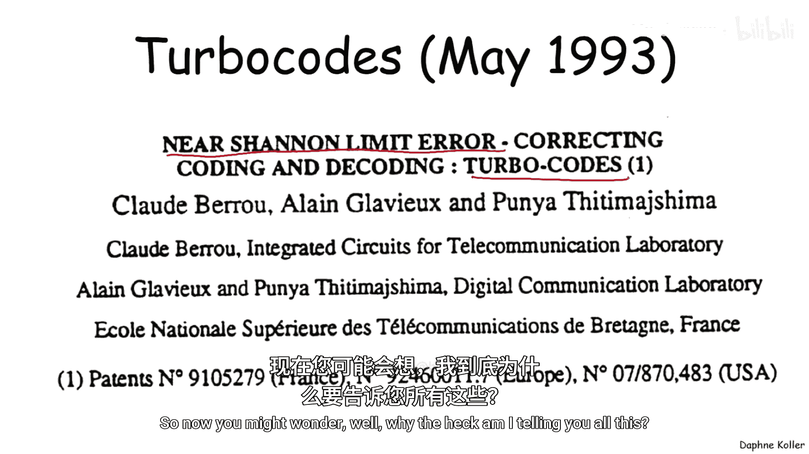
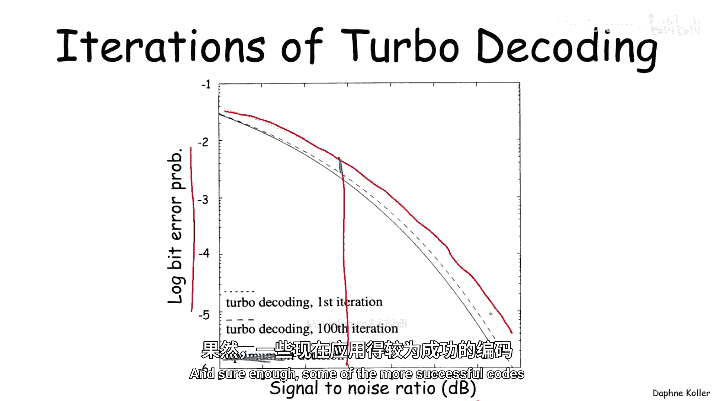
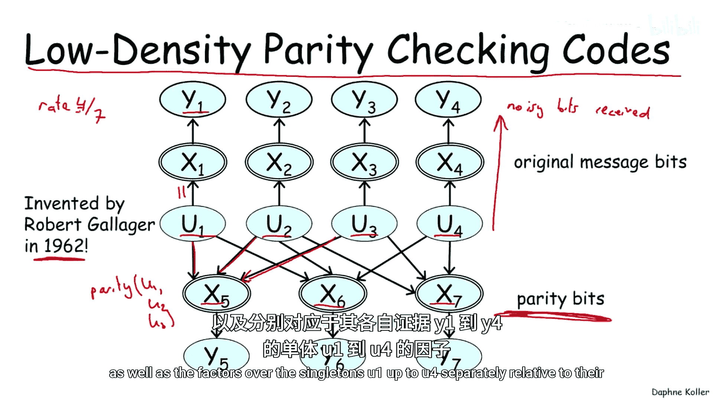
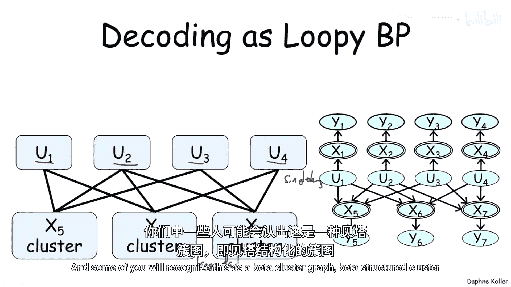
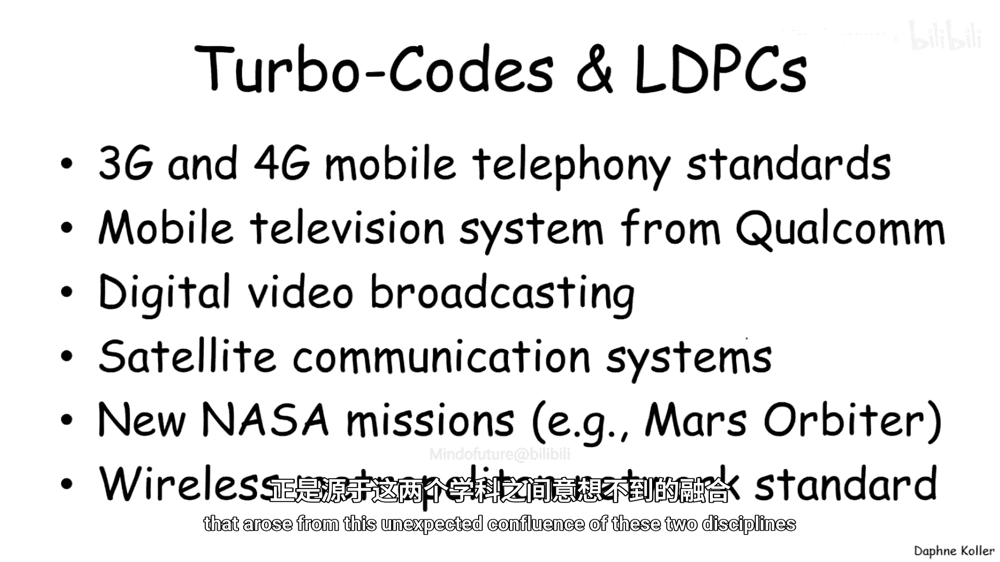
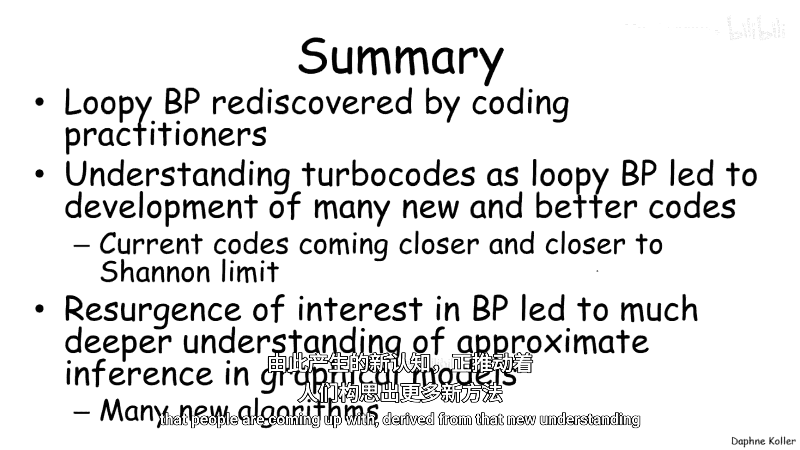

# 概率图模型：2：环状置信传播与消息解码 📡

在本节课中，我们将探讨概率图模型领域一个引人入胜的故事：环状置信传播算法与噪声信道消息解码问题之间的联系。这个相对较新的发现对两个领域都产生了深远影响。

## 消息解码问题概述

想象一下，我们需要通过一个噪声信道发送 K 个比特。如果直接发送这些比特，接收端将无法从接收到的噪声比特中准确还原原始信息，因为我们不知道哪些比特被破坏了。

为了解决这个问题，人们发展了编码理论。K 个比特通过一个编码器，生成 N 个比特（通常 N > K）。这些比特被实际传输，接收端得到一组噪声比特 Y₁ 到 Yₙ。解码的目标是得到比特 V₁ 到 Vₖ，使其尽可能接近甚至完全等同于原始发送的比特 U₁ 到 Uₖ。

这种编码的**码率**定义为 **R = k / n**，即 n 个传输比特中承载了 k 比特的实际信息。

**比特错误率**是衡量解码准确性的指标，定义为解码比特与原始比特不同的平均概率。

## 信道类型与信道容量

不同的信道具有不同的噪声特性。以下是几种重要的信道模型：

*   **二进制对称信道**：发送0时，以概率0.9收到0，以概率0.1收到1；发送1时，以概率0.9收到1，以概率0.1收到0。错误是对称的。
*   **二进制擦除信道**：比特不会被篡改，但可能被“擦除”（丢失）。接收端知道哪些比特丢失了（用“？”表示），这比不知道比特是否被篡改的情况更有利。
*   **高斯信道**：叠加在信号上的噪声是模拟的高斯噪声。

信息论学者为这些信道定义了**信道容量**，它代表了理论上信道能无错误传输信息的最大速率。例如，二进制对称信道的容量略高于0.5，而二进制擦除信道的容量等于其正确接收概率（如0.9），这表明“知道错误位置”的信道容量更高。

## 香农定理与香农极限

香农在其著名的**香农定理**中，建立了信道容量与比特错误概率之间的关系，明确划分了**可达区域**与**不可达区域**。

*   **可达区域**：理论上可以构造出编码方案，实现在该区域内任意一点的性能（特定的码率和比特错误率组合）。
*   **不可达区域**：无论编码方案多么巧妙，都无法实现该区域内的性能。

信道容量之所以称为“容量”，正是因为它是这个性能边界的关键标度。逼近这个理论边界（香农极限）成为了编码领域的核心目标。

## 编码性能的演进与Turbo码革命

在20世纪90年代中期之前，实际编码方案（如旅行者号、卡西尼号任务使用的编码）的性能距离香农极限仍有相当差距。

1993年，Berrou等人发表的论文《接近香农极限的纠错编码》引发了革命。他们提出的**Turbo码**性能远超当时所有已知编码，逼近了香农极限，以至于最初无人相信。

那么，Turbo码的魔力何在？这与概率图模型有何关联？

## Turbo码与概率推断

本质上，解码是一个**概率推断问题**：我们需要计算在给定接收到的噪声证据 **Y** 的条件下，原始信息比特 **U** 的后验概率分布 **P(U | Y)**。

Turbo码并未直接精确求解这个推断问题，而是采用了一种**迭代方法**：
1.  使用两个编码器对原始比特进行编码。
2.  两个对应的解码器分别处理接收到的噪声比特。
3.  每个解码器基于自己的证据计算比特的后验概率，并将其传递给另一个解码器，作为对方新的**先验**信息。
4.  这个过程不断迭代，直到收敛。

令人惊讶的是，这种看似启发式的迭代算法，其性能非常接近最优的比特决策。

## 与环状置信传播的联系

后续的研究（如McEliece, MacKay, Frey等人）揭示，Turbo码的解码算法实际上是在运行一种**环状置信传播**的变体。

每个解码器在其内部的可处理网络上进行精确推断，然后将计算出的“信念”（即后验概率）作为消息传递给另一个解码器。这正是**LBP算法中因子（或团）之间传递消息 `δ_{i→j}`** 的过程。

这一认识在两个领域引发了革命：

1.  **对概率图模型领域的革命**：在Turbo码成功之前，环状置信传播因其在环状图上缺乏收敛性和正确性保证而被忽视。Turbo码的巨大成功促使人们重新审视LBP，引发了大量关于其何时、为何有效的研究，并催生了诸多改进算法。
2.  **对编码领域的革命**：既然解码可以视为在特定图结构上运行LBP，那么就可以设计更多适合LBP的编码方案。其中最成功的一类是**低密度奇偶校验码**。

## 低密度奇偶校验码

LDPC码实际上由Gallager在1962年发明，但因精确推断计算复杂而被长期搁置。借助LBP进行解码的思路使其重获新生。

在LDPC码中，发送的比特包括原始信息比特和**奇偶校验比特**。校验比特是信息比特子集的奇偶和（模2加），用于检错和纠错。

例如，发送4个信息比特 (U₁, U₂, U₃, U₄) 和3个校验比特：
*   X₅ = U₁ ⊕ U₂ ⊕ U₃
*   X₆ = U₁ ⊕ U₂ ⊕ U₄
*   X₇ = U₂ ⊕ U₃ ⊕ U₄

码率 R = 4/7。

这种结构天然地对应一个**因子图**或**团图**：
*   **变量节点**：代表每个信息比特 Uᵢ。
*   **因子节点**：代表每个奇偶校验约束（连接相关的变量节点）。
*   **证据**：来自信道的噪声观测 Yᵢ。

在这个图上运行**环状置信传播**，就是LDPC码的解码过程。消息在变量节点和因子节点之间迭代传递，逐步逼近比特的后验概率。

## 总结与应用

本节课我们一起学习了环状置信传播与消息解码之间深刻而互惠的联系。

*   **核心联系**：Turbo码等现代高性能解码算法，本质上是**在特定因子图上运行环状置信传播**，以近似求解后验概率 `P(U | Y)`。
*   **双向影响**：
    *   编码理论的成功实践**复兴并验证了**概率图模型中的LBP算法。
    *   概率图模型的视角**启发并催生**了（如LDPC码）等一系列逼近香农极限的新型编码方案。
*   **广泛应用**：基于LBP的解码技术已成为当今数字通信的基石，广泛应用于数字视频广播、移动通信、卫星传输、无线网络等诸多领域。

可以说，这是概率图模型最普遍和成功的应用之一，源于两个学科意想不到的融合。