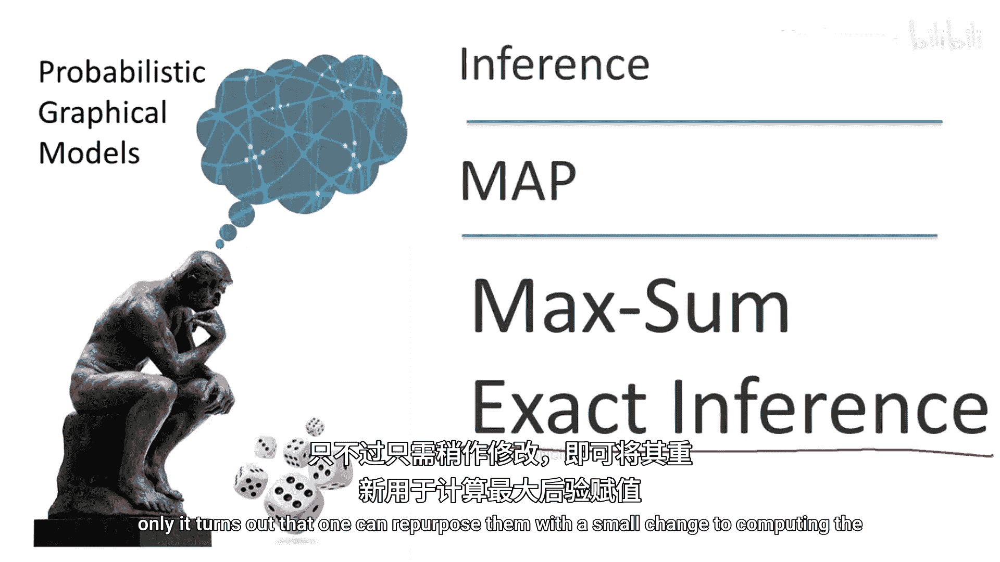
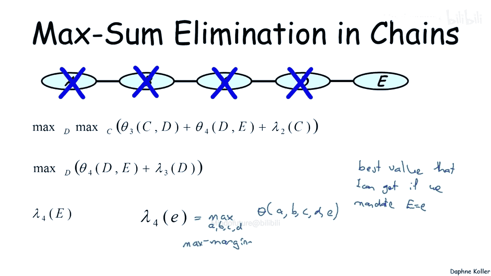
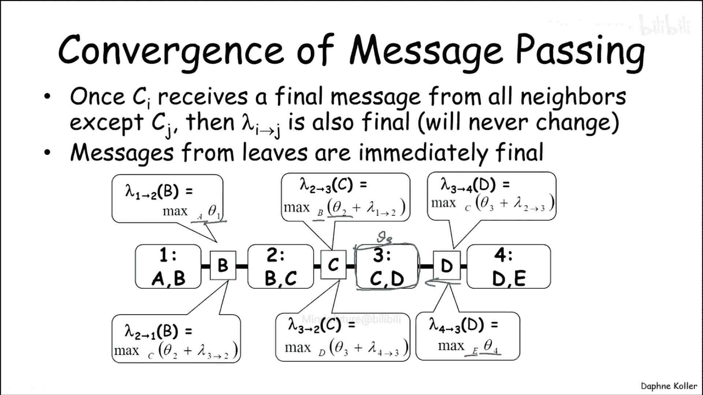
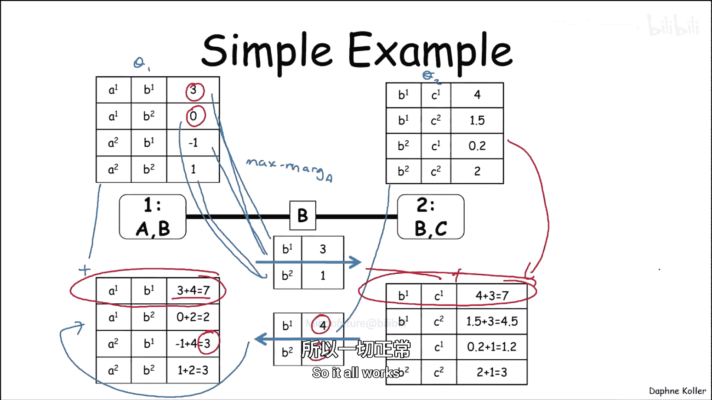
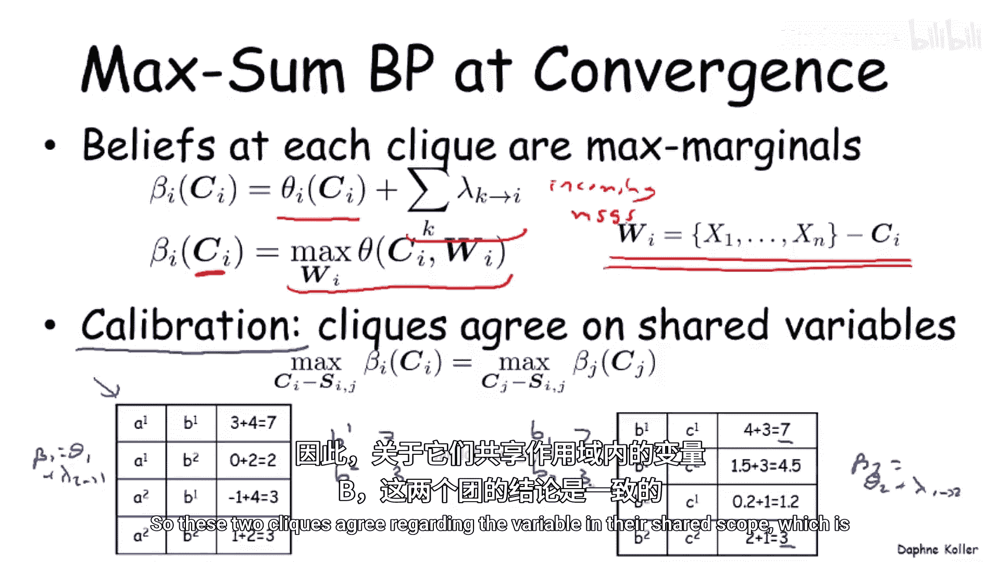
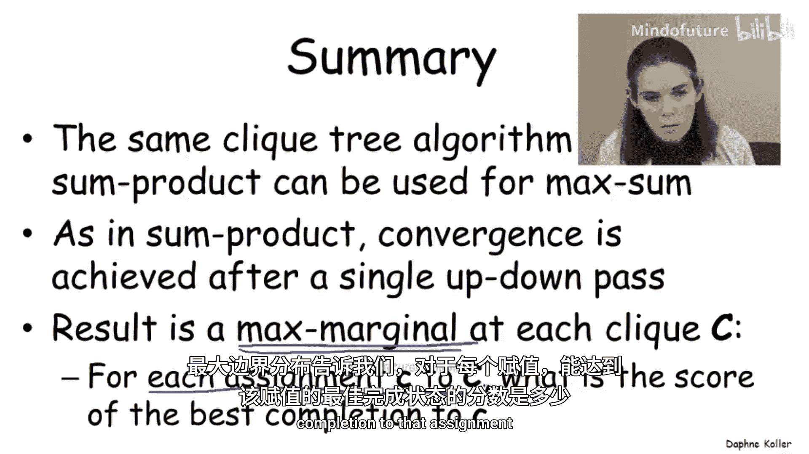

# 016：最大和消息传递

在本节课中，我们将学习如何将用于计算边缘概率的精确推理算法，改造为求解最大后验概率（MAP）问题的算法。我们将看到，通过一个关键的数学变换，可以将因子乘积问题转化为求和问题，并在此基础上构建“最大和”消息传递算法。

## 概述：从边缘概率到最大后验概率

到目前为止，我们的讨论主要集中在为计算图模型中的边缘概率问题构建算法。然而，一个完全不同但同样重要的推理问题是：寻找一个具有最高概率的、连贯的联合赋值，即最大后验概率（MAP）赋值。

我们已经知道，不能简单地通过求解边缘概率问题，然后为每个变量选择概率最高的赋值来得到MAP赋值。因此，我们需要一套不同的算法来解决MAP问题。现在，我们将讨论其中的第一种算法，它本质上遵循了与精确边缘概率推理相同的思路，只需稍作修改即可用于计算MAP赋值。

## 将乘积转化为求和

为了使算法生效，我们需要做的第一个操作是将乘积转化为求和。我们观察到，我们的分布 **P** 正比于一系列因子的乘积：

\[
P(\mathbf{x}) \propto \prod_k \phi_k(\mathbf{x}_k)
\]

如果我们试图找到这个特定乘积的 **argmax**，它也可以被表述为对数求和表达式的 **argmax**：

\[
\arg\max_{\mathbf{x}} \prod_k \phi_k(\mathbf{x}_k) = \arg\max_{\mathbf{x}} \sum_k \log \phi_k(\mathbf{x}_k)
\]

其中，每个 **θ_k** 是势函数 **φ_k** 的对数。这基本上等同于将表示因子的表格中的每个条目转换为其对数，从而得到一个因子求和表达式，而不是因子乘积。

这样做有很好的理由：首先，求和比乘积更容易处理；其次，当乘以许多非常小的数字时，会出现数值下溢问题，而将其转换为求和则在数值上是一个更稳健的算法实现。

现在，我们考虑上面写出的问题，即寻找一个我们称之为 **θ(x1, ..., xn)** 的表达式的 **argmax**，它被定义为这些 **θ_k** 在较小作用域上的因子之和。

## 链式结构中的最大和变量消除

现在我们已经将问题简化为求一个求和表达式的最大值，接下来我们将回到链式结构的简单示例，并思考如何在链中执行最大和变量消除。这个过程看起来几乎与我们之前讨论的和积算法完全相同。

假设我们现在要做的只是找到表达式 **θ(A, B, C, D)** 的最大值。就像在和积算法中一样，我们可以将最大化操作分解为对 A、B、C、D 的逐个最大化。

我们可能不太习惯接下来要展示的这种操作，但同样有效的是，因为 **θ2**、**θ3** 或 **θ4** 都不依赖于 A，我们可以将它们加到对 **θ1(A,B)** 求最大值之后的结果上。

这将给我一个因子，看起来像 **max_A θ1(A,B)**。我将其称为 **λ1(B)**，因为请注意，这不是一个常数，而是一个依赖于 B 的函数。对于 B 的不同取值，将有不同的 A 使表达式最大化，也会有不同的最大值。因此，**λ1(B)** 就是 **max_A θ1(A,B)**。

这个过程有效地从表达式中消除了变量 A，并给了我一个少了一个变量的最大化问题，只剩下 B、C、D 和 E。

## 因子操作：求和与最大化

就像在和积算法的背景下一样，我们可以将所有操作视为对因子的操作，而不仅仅是将其视为表达式。因此，之前我们定义了因子乘积和因子边缘化等操作，现在我们可以定义因子求和与因子最大化等类似操作。

*   **因子求和**：一个非常直观的操作，执行我们在这里所做的操作。如果我们想定义因子乘积中 (A1, B1, C1) 这一行，我们将把来自 (A1, B1) 的条目 3 和来自 (B1, C1) 的条目 4 相加，得到 7。我们可以类似地定义因子求和中的所有其他条目。
*   **因子最大化**：与我们边缘化一个因子的方式相同，这是一种“最大边缘化”。它的作用是：例如，如果我想消除 B，我有这两行（比如 A1, B1, C1 和 A1, B2, C1），它们仅在 B 上不同。那么我的新条目 (A1, C1) 将是这两行条目的最大值，在本例中是 7。类似地，对于 (A1, C2)，我将得到 4.5、2 和 4.5 的最大值，即 4.5。这是边缘化的另一种形式，我使用最大化操作而不是求和操作来移除变量 B。

## 最大和变量消除算法

现在我们已经定义了这两种操作，我们可以回到链式结构，将最大和变量消除定义为一组因子操作，其中我依次消除 A、B 等。

例如，在如上一步消除了 A 之后，我现在可以通过注意到唯一依赖于 B 的因子是 **θ2(B,C)** 和 **λ1(B)** 来执行完全相同的操作。其他两个因子可以移到最大化操作之外。

这将给我一个关于 B 的最大化操作，其因子是 **θ2(B,C)** 和从上一步消除中得到的 **λ1(B)** 这两个因子的和。这将给我一个新的因子 **λ2(C)**，该过程以与和积变量消除完全相同的方式继续。

这就是算法的基本过程。

## 最大边缘化与团树算法

现在让我们思考一下，在这个执行过程结束时，我们得到的最终因子是什么。在得到 **λ2** 和 **λ3** 之后，我们得到 **λ4(E)**。对于给定的值 **e**，**λ4(e)** 是什么？它是通过对 **θ(A,B,C,D,E)** 关于 A、B、C、D 最大化得到的。因此，这是在强制 **E = e** 的条件下，我能得到的最佳可能赋值（即最佳分值）。这是一个因子，它为 E 的每个可能取值 **e** 给出了该分值。这被称为 **最大边缘化**。

就像我们将和积变量消除用于定义团树算法一样，我们可以对最大积或最大和算法做完全相同的事情，使用完全相同的数据结构。

这里我们将使用完全相同的团树，我们有团 AB、BC 和 DE。我们将像往常一样，利用族保持性质将势函数分配给适当的团。

现在让我们看看消息是如何在这个团树架构中传递的。最初，团 AB 将定义消息 **λ12**，这是通过关于 **θ1** 最大化 A 得到的，结果得到的关于 B 的消息被传递给团 2。团 2 可以接收该消息，将其与自己的因子 **θ2** 相乘（在最大和中是相加），得到消息 **λ23**。同样的事情发生在团 3 将消息传递给团 4 时（在这种情况下作用域是 D）。因此，消息传递过程完全相同，只是使用最大和操作代替了和积操作。

我们同样可以在另一个方向上传递消息，例如从 4 到 3（作用域 D），从 3 到 2，从 2 到 1。在和积团树背景下成立的所有性质在这里也成立。

首先请注意，例如，一旦消息 **λ12** 被发送，它就永远不会再改变，它被一劳永逸地定义了。**λ23** 一旦接收到消息 **λ12**，它也就稳定下来，永远不会改变。**λ34** 也是如此。因此，我们可以进行一次从左到右的传递来计算所有从左到右的消息，并进行一次类似的从右到左的传递来计算所有从右到左的消息。一旦完成，它们就都收敛了。

其次要注意的是这个团的值是什么。我们可以看到，当我最终从两边获得所有消息时，我已经整合了 **θ1**、**θ2**、存储在团本身的 **θ3**，以及从右侧消息传入的 **θ4**，并最大化消除了所有变量 A、B 和 E。因此，我剩下的是关于团 3 的一个因子，它是网络中所有因子之和关于 A、B 和 E 的最大值。

总结一下，一旦团 i 从除邻居 j 之外的所有邻居接收到最终消息，那么该消息也是最终的，永远不会改变。并且所有叶节点的消息都是立即最终的。因此，我们有一个在两次传递后收敛的算法，并在每个团处给出正确的最大边缘化。

## 算法验证与校准性质

让我们举一个简单的例子来说服自己这个算法做的是正确的事情。我现在看一个只有 A、B、C 的简单网络，有两个因子：**θ1(A,B)** 和 **θ2(B,C)**。

首先，我们构建整体的 **θ**，即 **θ1** 和 **θ2** 的和。通过查看计算出的数字，我们看到 MAP 赋值是 (A1, B1, C1)，值为 7。

现在看看在这个非常简单的两个团的团树上会发生的消息传递过程。**θ1** 分配给团 1，**θ2** 分配给团 2。让我们看看传递的两条消息。

AB 向 BC 传递一条消息，该消息是关于变量 A 的最大边缘化。我们可以看到，对于 B1，我们在 3 和 -1 之间取最大值，得到 3；对于 B2，我们在 0 和 1 之间取最大值，得到 1。

完全相同的过程给了我们从左到右传递的这条消息，其中我最大边缘化了 C，得到了这个消息。

现在，这两个团各自接收其消息（注意这里立即收敛了，因为每个方向只有一条消息要传递）。因此，我在这里得到的是这个因子加上传入消息的和。例如，对于第一行 (A1, B1)，我从这里得到 3，从那里得到 4，所以 3+4=7。对于 (A1, B2)，我从这里得到 0，从那里得到 2，所以 0+2=2。

我可以执行完全相同的操作来得到右侧的这个因子，通过将这个和那个相加，我得到这里的这个因子。你会注意到，神奇的是，每个因子中单独的 MAP 赋值分别是左边的 (A1, B1) 和右边的 (B1, C1)。因此，我在这里得到的是与 (A1, B1) 一致的最可能赋值，而在这里得到的是与 (B1, C1) 一致的最可能赋值。

如果你回去检查这个大表格，你可以确信这不仅对 (A1, B1) 成立。例如，如果你看 (A2, B1)，你会发现你在这里得到的值 3，是与 (A2, B1) 一致的最可能赋值的分值。确实，我们在这里得到的值是 3，所以一切正常。

## 收敛后的结果与校准

那么，关于这个算法一旦收敛，我们能说些什么呢？重要的是，我们可以在每个团计算信念，这些信念精确地代表了该团的最大边缘化。

我们如何计算这些信念？与和积算法类似，我们查看分配给该团的因子 **θ_i**，并将传入的消息加给它（记住，在和积中我们是相乘，因为那时是做乘积而不是求和）。

这个信念编码了什么？这个信念正是最大边缘化。具体来说，对于给定团 **C_i** 的任何赋值，我们可以查看该赋值的最佳可能补全的分值，这就是该团信念的值。

它是关于所有未分配给该团的变量 **W_i** 的最大化。

拥有最大边缘化的一个重要结果是，我们在这里也得到了一个校准性质。团必须在它们共享的变量上达成一致。

为了理解这一点，让我们看看简单两团示例中的这两个团，以及我们为团 1 和团 2 计算的信念。校准性质告诉我们，例如，如果我们看这个团关于变量 B 的含义，这个团告诉我们，B1 的最佳可能补全的分值是 7，B2 的最佳可能补全的分值是 3。这个团，如果我们看它，告诉我们 B1 的最佳可能补全的分值也是 7，B2 的最佳可能补全的分值也是 3。因此，这两个团在它们共享的作用域变量 B 上达成了一致。

## 总结

本节课中，我们一起学习了如何将用于求解边缘概率的和积消息传递算法，改造为用于求解最大后验概率（MAP）的最大和消息传递算法。

总结来说，我们可以在最大和的背景下应用与和积完全相同的团树算法。消息以相同的方式传递，团树以相同的方式构建。唯一的区别是消息传递操作使用最大和操作，而不是和积操作。

与和积算法完全一样，收敛在单次向上和向下传递后实现。其结果是在每个团处获得一组信念，这些信念代表了该团的最大边缘化。作为提醒，最大边缘化告诉我们，对于每个赋值，该赋值的最佳可能补全的分值是多少。