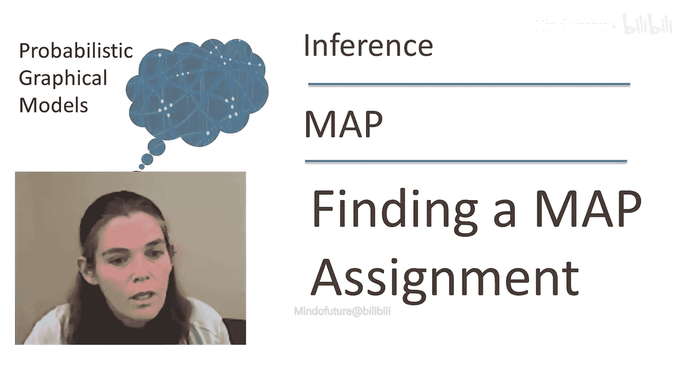

# 017：从校准团树解码最大后验概率赋值 🧩

在本节课中，我们将要学习如何从一个已经校准的团树中，解码出具体的最大后验概率赋值。上一节我们介绍了执行最大和消息传递的算法，本节中我们来看看如何利用该算法的输出来构建一个实际的赋值。

## 概述

最大和消息传递算法可以计算出每个团的最大边缘概率。然而，仅凭这些最大边缘概率，我们并不能直接得到一个全局一致的最大后验概率赋值。本节将探讨如何从校准后的团树中解码出这样的赋值，并处理赋值不唯一的情况。

## 唯一MAP赋值的情况

如果最大后验概率赋值是唯一的，那么解码过程非常简单。

在之前展示的例子中，赋值 `A1, B1, C1` 是唯一的MAP赋值。我们看到，在团1中，`A1 B1` 是最大化赋值；在团2中，`B1 C1` 是最大化赋值。由于校准性质，所有团的选择必须一致。这意味着，无论我们从哪个团中选取变量 `B` 的值，结果都将是相同的。

因此，当MAP赋值唯一时，我们只需在每个团中选择其对应的最大化赋值，即可组合出全局的MAP赋值。

## 非唯一MAP赋值的情况

如果最大后验概率赋值不唯一，解码过程会变得复杂，因为我们在某些团中可能面临多个选择。

考虑一个校准收敛后的团树示例。假设我们有两个团：

*   在第一个团（包含变量A和B）中，赋值 `A1, B1` 和 `A2, B2` 都具有最大值2。
*   在第二个团（包含变量B和C）中，赋值 `B1, C1` 和 `B2, C2` 都具有最大值2。

此时，我们不能独立地为每个团选择一个赋值。例如，如果我们为第一个团选择 `A1, B1`，为第二个团选择 `B2, C2`，那么变量 `B` 的值就产生了冲突（`B1` vs `B2`）。直觉上，`C2` 与 `B2` 相匹配，而非 `B1`，因此赋值 `A1, B1, C2` 并不是一个好的MAP赋值。

我们需要选择的是 `A1, B1` 和 `B1, C1`，这样才能保证全局一致性。由此可见，任意的平局决胜可能无法产生一个有效的MAP赋值。

## 解决方案

主要有两种方法来解决非唯一MAP赋值的问题。

### 方法一：扰动因子

第一种方法是稍微调整问题本身，以使MAP赋值变得唯一。

具体做法是，为所有因子添加一个微小的随机扰动。在概率上，这几乎可以保证产生一个唯一的MAP赋值。一旦赋值唯一，我们就可以使用前面所述的简单解码方法。

### 方法二：顺序赋值解码

第二种方法是使用一个按顺序构建MAP赋值的程序，逐个团地进行选择。

以下是该过程的步骤：
1.  从第一个团（例如AB团）开始，在它的最大化赋值集合中任选一个（例如 `A1, B1`）。
2.  移动到下一个相邻的团（例如BC团）。此时，我们必须考虑已固定变量（这里是 `B=1`）的约束。
3.  在第二个团的所有最大化赋值中，只选择那些与已固定变量值一致的赋值（即选择包含 `B=1` 的赋值，如 `B1, C1`）。
4.  重复此过程，沿着团树依次进行，每次选择都与之前已做的选择保持一致。

这种算法的复杂度与最初校准团树的复杂度基本相同，因此不会带来额外的计算负担。

## 总结

本节课中我们一起学习了如何从校准后的团树中解码最大后验概率赋值。我们了解到，当MAP赋值唯一时，解码是直接的。当赋值不唯一时，我们可以通过向因子添加微小扰动来强制其唯一性，或者采用一种按顺序、保持一致的赋值选择算法。这两种方法在实践中都被广泛用于从校准团树中解码MAP赋值。