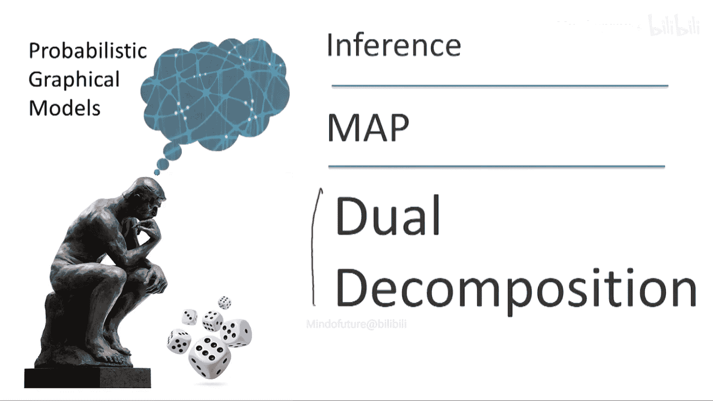
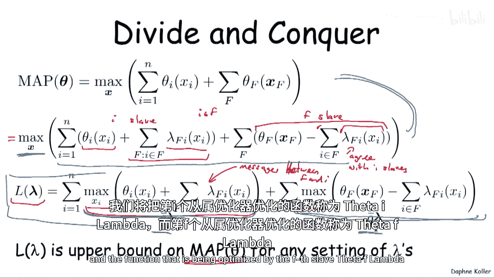
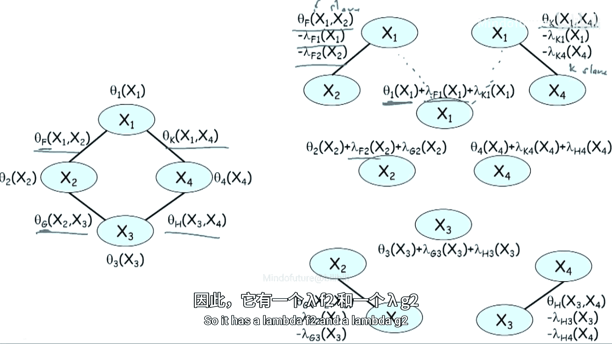
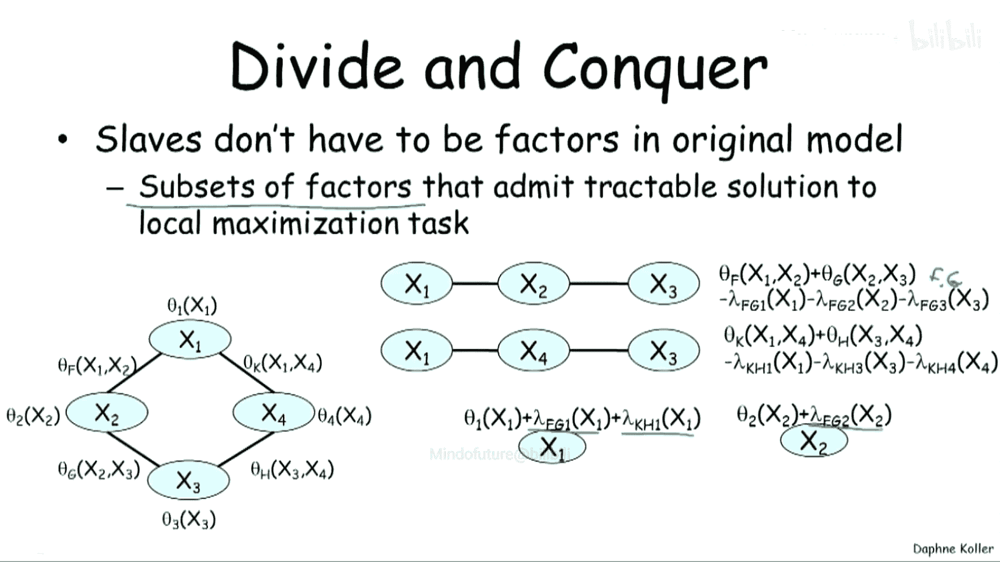
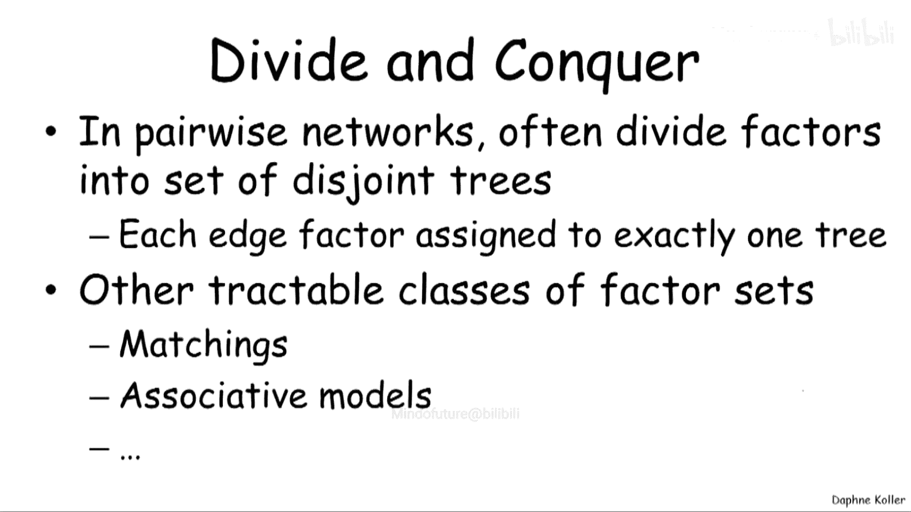

# 概率图模型：2：对偶分解直觉理解 🧩

在本节课中，我们将学习一种用于解决MAP（最大后验概率）推理问题的通用算法——对偶分解。我们将看到如何将复杂的优化问题分解为多个可独立求解的“子问题”，并通过引入“惩罚项”来协调这些子问题的解，使其最终达成一致。

---

## 问题定义与背景

我们之前定义了MAP推理问题，即在一个概率图模型中找到概率最高的变量赋值。我们讨论了一些特定类别的模型，对于这些模型，MAP问题是可高效求解的。一类是树宽足够低的模型，可以使用变量消除或团树算法等技术。我们还讨论了其他一些可以进行高效推理的特殊模型类别。

现在，我们将讨论一种通用算法，它可以用于解决**任何**MAP问题。当然，需要记住MAP问题是NP难问题，因此我们无法得到一个适用于所有问题的完全多项式时间算法。我们将要讨论的这类方法被称为**对偶分解**。它源于将MAP推理问题日益视为一个优化问题的观点，并建立在优化理论领域的技术之上。

---

## 问题重构

首先，让我们以一种便于分析的方式重新表述问题。这只是一种便利的转换。我们假设要优化的MAP问题（我们已将其重新表述为最大和问题，而非最大积问题）由两种不同类型的因子之和组成：

*   **单变量因子**：作用域为单个变量 \(X_i\)。
*   **多变量因子**：作用域为多个变量。

显然，我们可以将单变量因子合并到包含该变量的某个更大的因子中。但事实证明，将它们保留在模型中会带来便利，原因稍后会变得清晰。

因此，我们的目标是找到最高概率赋值 \(x\) 的值（暂时先讨论如何找到这个值，稍后再讨论如何找到具体的赋值）。我们试图找到使以下总和最大化的 \(x\)：

\[
\max_x \left[ \sum_i \theta_i(x_i) + \sum_f \theta_f(x_f) \right]
\]

---

## 分解与协调的直觉

我们可以做一件事（虽然这是错误的，但我们可以尝试）：忘记我们正在尝试进行一个联合赋值。相反，我们戴上“眼罩”分别考虑每个问题。我们将单独找到优化每个因子 \(\theta_i(x_i)\) 的 \(x_i\)，并对更大的因子做同样的事情。

当然，这将是一个非常糟糕的解决方案，因为优化一个 \(\theta_i\) 的 \(x_i\) 将与包含 \(x_i\) 的某个更大因子所选择的 \(x_i\) 完全不一致。你将得到一个完全不连贯的“联合”赋值——它根本不是联合赋值，而是一堆互不相同的赋值。

对偶分解所做的，就是尝试进行类似的分而治之，但它会以一种试图**迫使这些局部决策问题彼此达成一致**的方式来进行。

---

## 引入惩罚项

那么，我们如何做到这一点呢？我们将通过引入一组**成本**（或惩罚项）来实现。这些成本将驱动每个局部问题，希望最终能与其他局部问题所做的决策达成一致。

回到我们的表达式，我们现在要做的是（这实际上是一个等式）：

\[
\max_x \left[ \sum_i \theta_i(x_i) + \sum_f \theta_f(x_f) \right] = \max_x \left[ \sum_i \left( \theta_i(x_i) + \sum_{f: i \in \text{Scope}(f)} \lambda_{f \to i}(x_i) \right) + \sum_f \left( \theta_f(x_f) - \sum_{i \in \text{Scope}(f)} \lambda_{f \to i}(x_i) \right) \right]
\]

让我们确认这个表达式确实等于第一行。原因在于，对于每个在因子 \(f\) 作用域内的变量 \(i\)，我在这里添加了一项 \(\lambda_{f \to i}(x_i)\)，又在这里减去了相同的表达式。因此，它们相互抵消了。

到目前为止，我们保持了等式。但现在，我要真正让每个“智能体”做出自己的决定。之前，最外层还有一个最大化操作。现在，我要让每个智能体查看它所拥有的那一小部分因子（包括为了与其他智能体达成一致而引入的惩罚项），然后各自进行独立的优化。

你可以将这些惩罚项视为 \(f\) 和 \(i\) 之间传递的**消息**，是它们沟通的方式：\(f\) 告诉 \(i\) 它认为应该做什么，同时 \(i\) 也告诉 \(f\)。

---

## 对偶函数与上界

这里有一个重要的点：上面这个函数，我们称之为 \(L(\lambda)\)，请注意它只是 \(\lambda\) 的函数，而不再是 \(x\) 的函数，因为我们已经对 \(x\) 进行了最大化。根据惩罚参数 \(\lambda\) 的选择，你会得到这个函数的不同值。

对于任何 \(\lambda\) 值，这个函数 \(L(\lambda)\) 都是原始MAP目标值 \(\text{MAP}(\theta)\) 的一个**上界**。

让我们理解一下为什么。我们已经看到上面这一行实际上等于原始目标。在这里，我强制使用**同一个** \(x\) 来最大化整个表达式。而在这里，我让每一项分别进行优化。这给了我更多的自由度，因为在这里，\(i\) 可以选择一个 \(x_i\)，而 \(f\) 可以选择另一个 \(x_f\)。由于所有智能体都选择相同赋值的情况，是这里优化问题可以考虑的赋值之一，因此这里能获得的总价值，通常只会**高于**我强制它们全部一致时能获得的价值。一般来说，我对优化空间施加的约束越多，我能获得的价值就越低。

引入一些记号，我们将在后续演示中使用：

*   变量 \(i\) 的“智能体”（称为**从属问题**或**子问题**）优化的函数记为 \(\theta_i^\lambda(x_i)\)。
*   因子 \(f\) 的“智能体”优化的函数记为 \(\theta_f^\lambda(x_f)\)。

---

## 具体示例：四变量环

让我们举一个例子让这一切更具体，因为刚才的讨论有些抽象。回到我们的四变量环示例，我们有变量 \(x_1, x_2, x_3, x_4\)，以及四个成对势函数，这次我们用字母表示以避免索引混淆：\(\theta_F(x_1, x_2)\)， \(\theta_G(x_2, x_3)\)， \(\theta_H(x_3, x_4)\)， \(\theta_K(x_1, x_4)\)。

现在，分解将如何在这里工作？我们暂时假设将按照边（即原始因子）进行分解。

以下是每个“从属问题”的优化问题：

*   **因子从属问题（例如 \(F\)）**：优化 \(\theta_F(x_1, x_2) - \lambda_{F \to 1}(x_1) - \lambda_{F \to 2}(x_2)\)。它有自己的势函数，以及两个惩罚项，试图让它与 \(x_1\) 和 \(x_2\) 的变量从属问题达成一致。
*   **变量从属问题（例如 \(x_1\)）**：优化 \(\theta_1(x_1) + \lambda_{F \to 1}(x_1) + \lambda_{K \to 1}(x_1)\)。它有自己的单变量势函数，以及来自包含它的因子（\(F\) 和 \(K\)）的惩罚项，这些项试图让它与这些因子从属问题达成一致。

其他因子（\(G, H, K\)）和变量（\(x_2, x_3, x_4\)）的从属问题结构类似。

---

## 构建从属问题的通用原则

在上一个示例中，我们是在一个非常简单的场景下进行的，即按照模型原始规范中的因子来分解。但情况并非必须如此。事实上，我们需要满足的唯一约束是：**每个从属问题必须被定义为一组因子的子集，并且这个子集本身要允许高效的精确求解**（即可独立高效优化）。

例如，回到四变量环网络，我们可以引入两个更大的从属问题，而不是四个小的（\(F, G, H, K\)）：
1.  一个从属问题对应 \(F\) 和 \(G\) 的组合（\(FG\) 从属问题）。
2.  另一个从属问题对应 \(H\) 和 \(K\) 的组合（\(HK\) 从属问题）。

在这种情况下，我们仍然有代表单个变量的 \(x_1, x_2, x_3, x_4\) 从属问题。现在，\(FG\) 从属问题需要与 \(x_1, x_2, x_3\) 的变量从属问题达成一致，因此它有三个对应的 \(\lambda\) 惩罚项。\(HK\) 从属问题类似，需要与 \(x_1, x_3, x_4\) 达成一致。对于变量从属问题，例如 \(x_1\)，它需要与 \(FG\) 和 \(HK\) 两个从属问题都达成一致，因此它有两项惩罚。而 \(x_2\) 只出现在 \(FG\) 从属问题中，因此只有一项惩罚。

---

## 如何选择从属问题分解

在成对网络中，我们通常的做法是将因子集划分为一组**不相交的树**。这正是我在上一张幻灯片中展示的：我们将其划分为一棵包含 \(F, G\) 的树和另一棵包含 \(H, K\) 的树。它们是**不相交**的，意味着每个边因子恰好被分配给一棵树。因为它们是树，我们知道如何使用变量消除或团树算法等技术高效地优化它们。

但我们也讨论过，还有其他类别的因子允许高效推理，例如匹配问题、或我们称之为“关联/规则/超模”的模型等。所有这些都属于可高效求解的类别。我们可以将一大堆符合某个高效类别的因子组合在一起，形成一个从属问题。

---

## 总结

在本节课中，我们一起学习了**对偶分解**算法的核心直觉。我们了解到：
1.  MAP推理问题可以重构为一个带惩罚项的优化问题。
2.  通过将原问题分解为多个可独立高效求解的“从属问题”，我们可以并行处理。
3.  引入的**惩罚项（\(\lambda\)）** 充当了协调消息，迫使不同从属问题的解趋向一致。
4.  我们定义了一个**对偶函数 \(L(\lambda)\)**，它对于任何 \(\lambda\) 都是原始MAP目标值的上界。
5.  从属问题的构建原则是：每个子问题本身必须是可高效精确求解的模型（如树、匹配等）。

对偶分解的威力在于其通用性，它将寻找最优赋值的问题，转化为寻找最优协调参数 \(\lambda\) 以收紧上界的问题。在后续课程中，我们将探讨如何实际地优化这些 \(\lambda\) 参数。