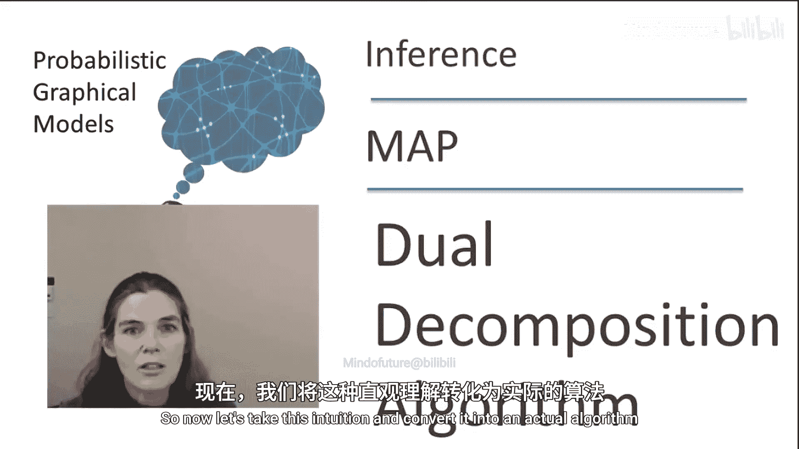
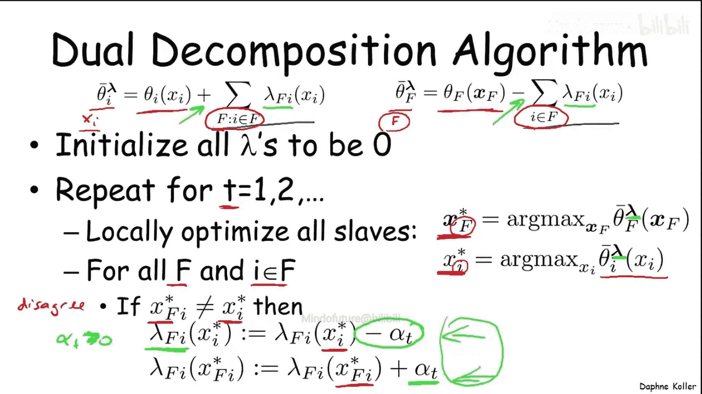
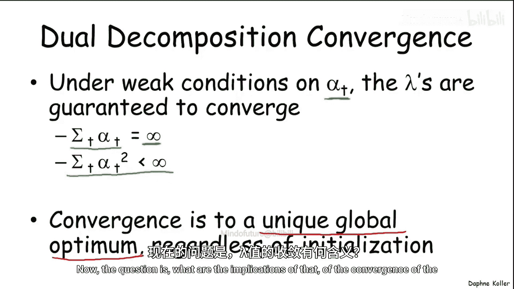
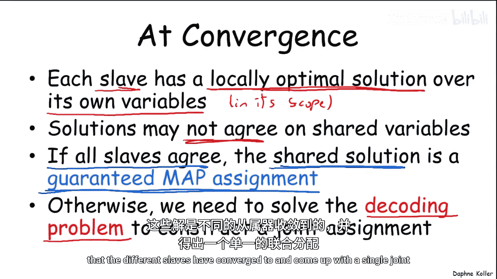
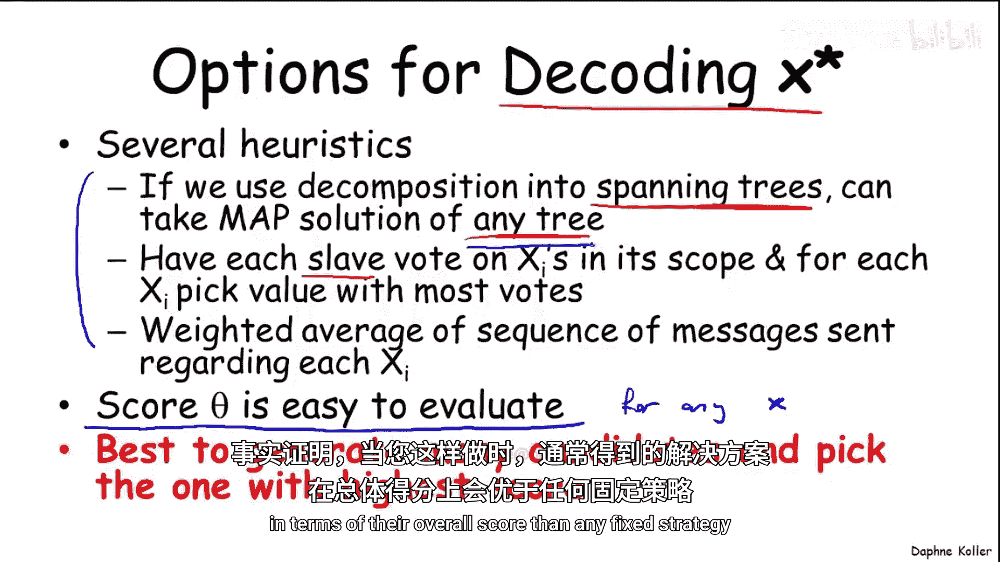
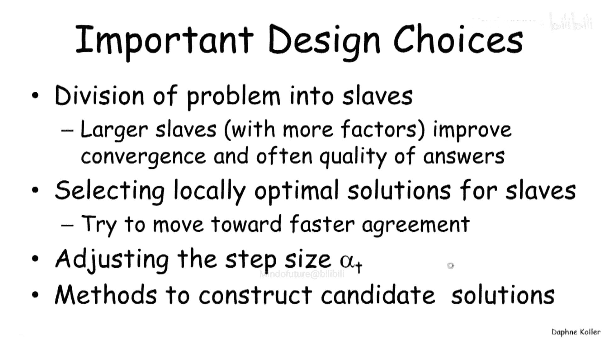
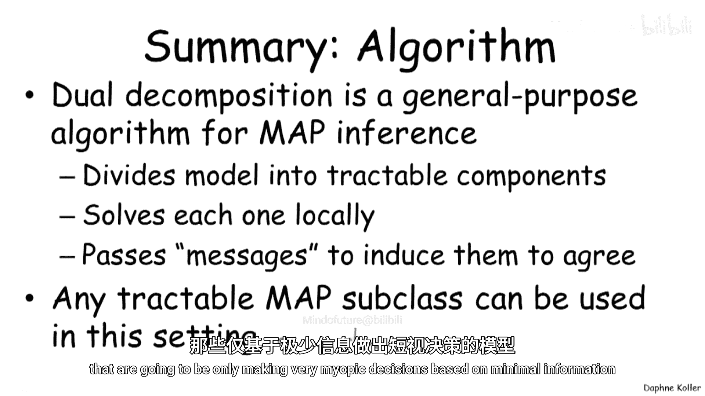
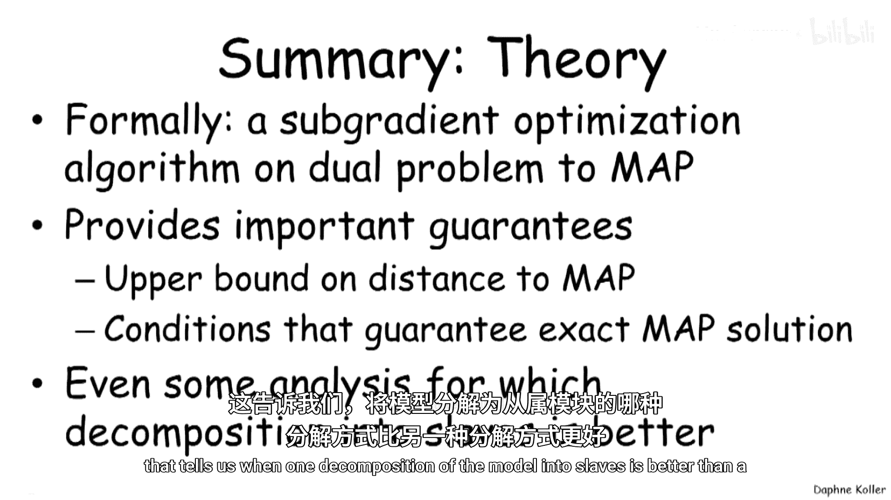
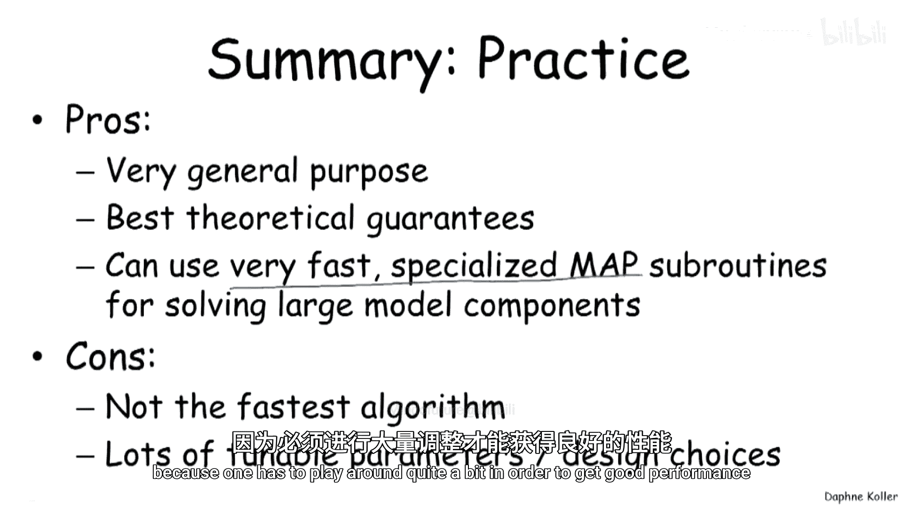

# 概率图模型2：推理：P20：对偶分解算法

在本节课中，我们将学习对偶分解算法的具体实现步骤。上一节我们介绍了该算法的基本直觉，本节中我们来看看如何将这种直觉转化为一个实际的算法。

## 算法概述

对偶分解算法将一个复杂的优化目标分解为多个独立的“从属”子问题，并通过在这些子问题之间传递信息，促使它们就最终的MAP赋值达成一致。

## 算法初始化

每个从属问题都有自己的目标函数。对于变量 `Xi` 对应的从属问题，其目标函数包含其自身的局部目标项。对于因子 `F` 对应的从属问题，其目标函数也包含其自身的局部目标项。

此外，我们为每个从属问题引入一组“激励”项，这些项会修改其目标函数，以促使它与其他从属问题达成一致。具体来说，我们希望变量 `Xi` 的从属问题与包含 `Xi` 的因子 `F` 的从属问题达成一致，反之亦然。

算法开始时，将所有激励项 `λ` 初始化为零。此时，每个从属问题仅基于其自身的局部目标做出决策。

## 迭代过程

随着算法演进，激励项会发生变化。以下是每次迭代 `t` 的步骤：

1.  **从属问题优化**：每个从属问题优化其当前的目标函数。
    *   变量 `Xi` 的从属问题优化 `θ_i_hat(λ)`，得到其最优赋值 `x_i_star`。
    *   因子 `F` 的从属问题优化 `θ_F_hat(λ)`，得到其最优赋值 `x_F_star`。

2.  **处理分歧与更新激励**：检查每个因子 `F` 与其作用域内的每个变量 `I` 的赋值是否一致。
    *   如果存在分歧（即 `x_F_star` 中 `Xi` 的赋值与 `x_i_star` 不同），则需要调整激励函数。
    *   对于激励项 `λ_{F,i}`，我们进行如下更新：
        *   对于变量 `Xi` 从属问题选择的赋值 `x_i_star`，其激励值减少 `α_t`。
        *   对于因子 `F` 从属问题选择的赋值 `x_F_star`，其激励值增加 `α_t`。
    *   这种更新会使变量从属问题和因子从属问题的偏好朝相反方向移动，从而促使它们在未来迭代中达成一致。

## 收敛性

在参数 `α_t` 满足一定较弱条件下，激励项 `λ` 保证会收敛。这些条件是：
*   `α_t` 需要足够大，使得其影响能累积：`∑_t α_t = ∞`。
*   `α_t` 需要足够小，以确保最终收敛：`∑_t α_t^2 < ∞`。

可以证明，无论初始化如何，`λ` 都会收敛到一个唯一的全局最优值。

## 收敛后的处理

当算法收敛时，每个从属问题都得到了其作用域内变量的局部最优解。但这并不总是足够。

以下是收敛后可能遇到的情况及处理方法：

*   **情况一：所有从属问题达成一致**
    *   如果所有从属问题在其共享变量上的赋值都一致，那么这个一致的联合赋值就是原问题的**保证的MAP赋值**。问题已解决。

*   **情况二：从属问题未达成一致**
    *   如果从属问题未能在共享变量上达成一致，我们就面临一个**解码问题**：需要将不同从属问题收敛到的不同解组合成一个单一的联合赋值。

## 解码问题的解决方案

有多种启发式方法可以解决解码问题，虽然没有特别强的性能保证，但在实践中通常效果良好。

以下是几种常见方法：

*   **方法一：选取单一从属问题的解**
    *   如果分解方式使得某个从属问题（如一个生成树）覆盖了所有变量，可以直接采用该从属问题的MAP解作为全局赋值。

*   **方法二：多数投票**
    *   让每个从属问题对其作用域内的每个变量 `Xi` 的赋值进行“投票”，然后对每个变量采用得票最多的赋值。

*   **方法三：加权平均**
    *   对算法迭代过程中传递的关于每个 `Xi` 的信息序列进行某种加权平均。

*   **方法四：评估并选择最优**
    *   一个关键观察是，对于任何赋值 `x`，其得分函数 `θ(x)` 很容易计算。因此，可以生成多个候选解（例如，使用多个不同的分解或解码策略），计算每个解的 `θ(x)`，然后选择得分最高的那个。实践证明，这种方法通常能得到比任何固定策略更好的解。

## 最优性保证与停止准则

对偶分解算法提供了一个重要的理论保证：对于任何 `λ`，函数 `L(λ)` 是真实MAP赋值得分的**上界**。

这意味着，对于任何候选解 `x`，其得分 `θ(x)` 满足：
`θ(x) ≤ MAP_score ≤ L(λ)`

虽然我们不知道真实的 `MAP_score`，但我们可以计算 `θ(x)` 和 `L(λ)`。它们的差值 `L(λ) - θ(x)` 给出了当前候选解与真实最优解之间差距的上限。如果这个差值足够小，我们就可以满意地停止迭代，即使不能保证找到了精确的最优解。

## 算法设计选择

在实现对偶分解时，有几个重要的设计选择：

1.  **问题分解为从属问题的方式**
    *   包含更多因子、规模更大的从属问题优化起来更昂贵，但通常能改善收敛性，并使解更接近真实MAP赋值。

2.  **从属问题局部最优解的选择**
    *   一个从属问题可能有多个同等最优的赋值。选择哪个赋值会影响与其他从属问题达成一致的速度。

3.  **步长 `α_t` 的调整策略**
    *   如何调整步长以在快速收敛和保证收敛之间取得平衡。存在一些保证收敛的硬性规则（通常较慢），以及一些在实践中效果更好、同样保证收敛的巧妙规则，这是一个活跃的研究领域。

4.  **解码策略的选择**
    *   如前所述，当从属问题未达成一致时，需要选择一种启发式解码方法。

## 算法总结

本节课中我们一起学习了对偶分解算法的完整流程。

对偶分解是一种通用的MAP推理算法，其核心思想是将模型分解为可处理的组件（从属问题）。每个从属问题在本地求解，然后通过传递 `λ` 消息来促使它们达成一致。任何可处理的MAP子类都可以用作从属问题，这使得算法可以处理大型、结构丰富的组件。

该算法有坚实的理论支撑（本质上是对MAP问题的对偶问题进行次梯度优化），提供了到最优解距离的上界，并明确了达成一致即找到精确解的条件。

在实践中，该算法优缺点并存：
*   **优点**：通用性强；提供较好的收敛性理论保证；能利用快速、专门的MAP子程序处理大型组件。
*   **缺点**：通常不是最快的算法；包含大量可调参数和设计选择，在实践中需要较多调试才能获得良好性能。