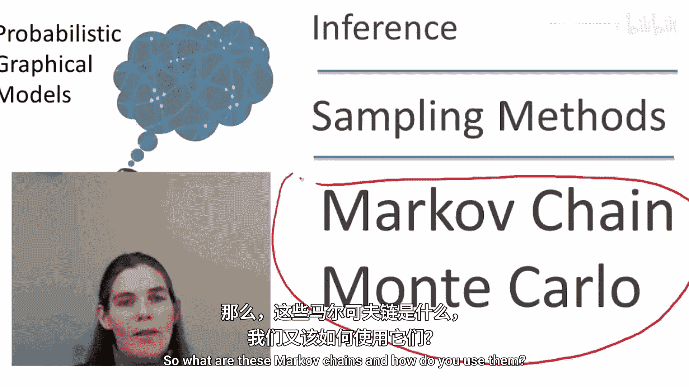
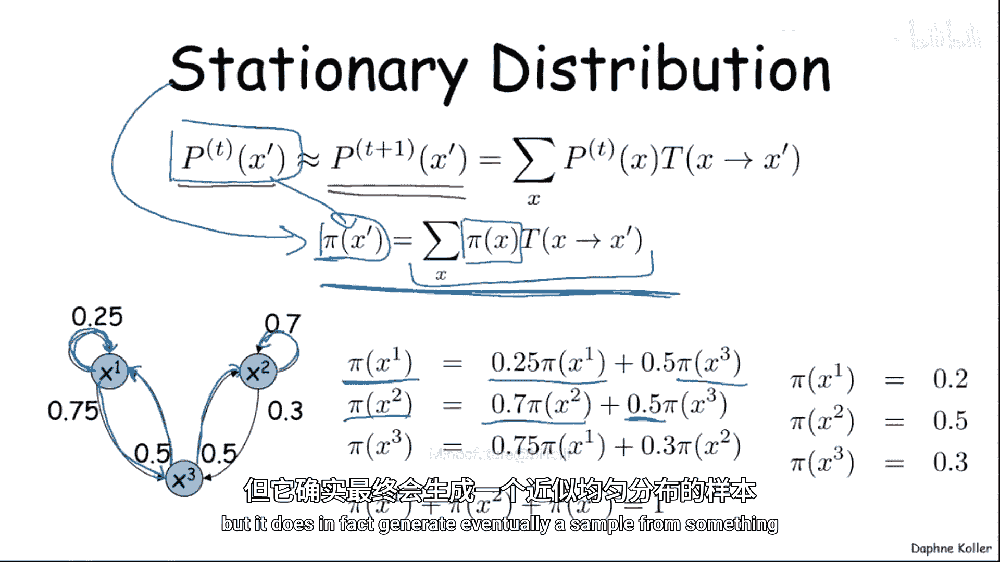
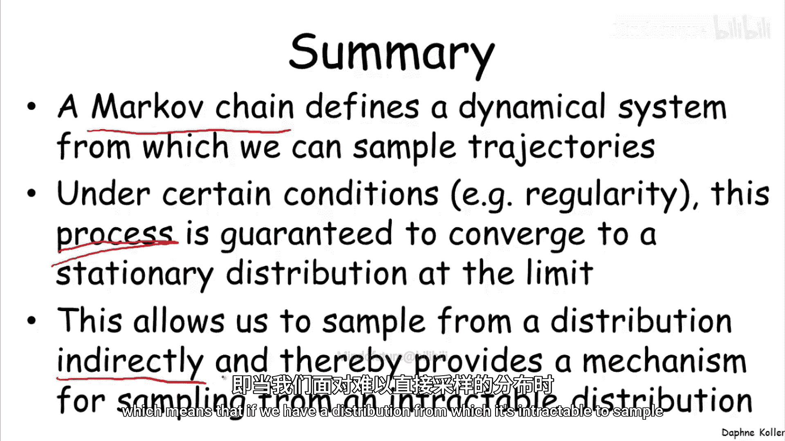

# 概率图形模型：2：马尔可夫链蒙特卡洛方法概述

在本节课中，我们将要学习一类非常强大且在实践中广泛应用的采样方法——马尔可夫链蒙特卡洛方法。这类方法允许我们设计一个迭代的采样过程，通过一系列步骤，从我们难以直接采样的目标分布中生成样本。

## 马尔可夫链蒙特卡洛：2.1：什么是马尔可夫链？

上一节我们介绍了MCMC方法的总体目标。本节中，我们来看看其核心工具——马尔可夫链。

马尔可夫链是一种从难以直接采样的分布 **P** 中进行采样的方法。例如，当我们想从一个包含证据的贝叶斯网络或一个马尔可夫网络中采样时，通常没有直接的方法。马尔可夫链为我们提供了一种通用机制。

马尔可夫链定义了一个迭代过程：最初生成的样本并非来自分布 **P**，但随着过程的进行，生成的样本会越来越接近来自 **P** 的样本。

一个马尔可夫链定义在一个状态空间上，我们用 **x** 来表示状态。下图展示了一个简单的状态空间示例：

马尔可夫链定义了一个概率转移模型。给定当前处于状态 **x**，该模型定义了转移到另一个状态 **x‘** 的概率。这是一个概率分布，满足以下公式：

对于任意 **x**，所有可能转移到的状态 **x‘** 的概率之和为1。

在示例中，一只“蚱蜢”从状态0开始。它有0.25的概率向右移动，0.25的概率向左移动，0.5的概率停留在原地。这个概率分布在链的大部分状态中重复，除了两端的状态（例如在-4时，向左移动会“撞墙”，因此停留的概率变为0.75）。

我们可以模拟这个随机过程：蚱蜢从状态0开始，每一步根据概率选择向左、向右或停留。

## 马尔可夫链蒙特卡洛：2.2：时间动态与平稳分布

理解了马尔可夫链的基本构成后，我们来分析其随时间演化的行为。

我们可以问：在时间步 **T+1**，状态为 **x‘** 的概率是多少？这可以通过一个递推关系得到，该关系依赖于时间步 **T** 的状态分布。

如果我们已经计算了蚱蜢在时间 **T** 可能处于各个状态 **x** 的概率分布 **P(x)**，那么到达 **x‘** 的概率就是：对所有可能的 **x**，求和 **P(x) \* T(x -> x‘)**，其中 **T** 是转移概率。这给出了一个联合分布，然后对时间 **T** 的状态 **x** 进行边缘化，就得到了 **T+1** 时刻的分布。

回到蚱蜢例子，我们可以模拟这个过程。下图展示了前三步的演化：

对于许多马尔可夫链（稍后会描述条件），随着过程演化，概率分布会逐渐“均衡化”。这意味着在时间 **T** 处于状态 **x‘** 的概率，与在时间 **T+1** 处于 **x‘** 的概率几乎相同。这个极限分布被称为**平稳分布**，通常用 **π** 表示。

平稳分布满足以下方程：
**π(x‘) = Σ_x [ π(x) \* T(x -> x‘) ]**
即，从平稳分布出发，经过一次转移后，得到的分布仍然是它本身。

这个概念实际上是谷歌PageRank算法的核心：它计算的是在网络中进行随机游走时，最终到达某个网页的概率。

## 马尔可夫链蒙特卡洛：2.3：计算平稳分布示例

为了具体理解平稳分布，让我们看一个简单的三状态马尔可夫链例子。

例如，从状态1，有0.75的概率去状态2，0.25的概率留在状态1。我们可以为平稳分布 **π** 写出方程。

以下是平稳分布需要满足的方程组：
*   **π(x1) = 0.25 \* π(x1) + 0.5 \* π(x3)**
*   **π(x2) = 0.75 \* π(x1) + 0.5 \* π(x3)**
*   **π(x3) = 0.5 \* π(x2)**

这个方程组本身是欠定的（因为所有 **π** 同时乘以一个常数仍是解），但我们可以加上概率分布必须归一化的约束：**π(x1) + π(x2) + π(x3) = 1**。

解这个线性方程组，可以得到唯一的平稳分布。可以验证，对于之前的蚱蜢例子，其平稳分布是均匀分布。

## 马尔可夫链蒙特卡洛：2.4：收敛条件——正则性

并非所有马尔可夫链都会收敛到一个平稳分布。一个保证收敛的充分条件是**正则性**。

一个马尔可夫链是正则的，如果满足以下条件：
存在一个整数 **K**，使得对于**每一对**状态 **(x, x‘)**，在恰好 **K** 步内从 **x** 转移到 **x‘** 的概率大于0。

注意量词的顺序：先确定一个 **K**，然后要求所有状态对都满足。这个条件保证了无论从哪个初始状态开始，马尔可夫链都会收敛到**唯一**的平稳分布。

直接检查这个条件可能比较困难。实践中常用的一个充分条件是：
1.  每对状态 **x** 和 **x‘** 都通过一条概率大于0的路径相连。
2.  每个状态都有自转移概率（即可以停留在原地）。

如果满足这两个条件，我们可以取 **K** 为状态图（以状态为节点，以正概率转移为边）的直径（最远两状态间的距离）。那么，对于任何状态对，我们都可以在少于或等于 **K** 步内到达目标状态，不足的步数用自转移填补，从而恰好用 **K** 步到达。这就保证了正则性。因此，人们通常通过添加自转移来保证链的正则性。

---

本节课中我们一起学习了马尔可夫链蒙特卡洛方法的基础——马尔可夫链。我们定义了马尔可夫链及其状态空间和转移模型，分析了其时间动态并引入了关键的**平稳分布**概念。通过示例，我们看到了如何计算平稳分布。最后，我们探讨了保证马尔可夫链收敛到唯一平稳分布的**正则性**条件及其充分判断方法。这为我们提供了一种通用的、间接从复杂分布中采样的强大框架。