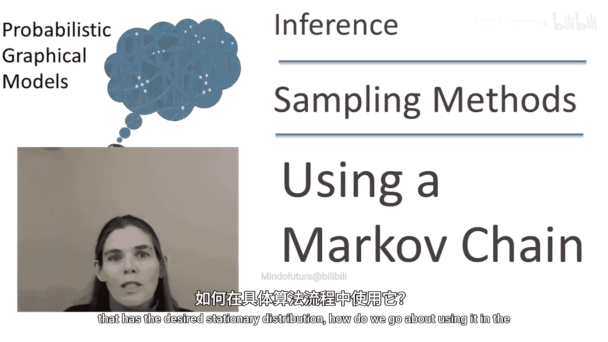
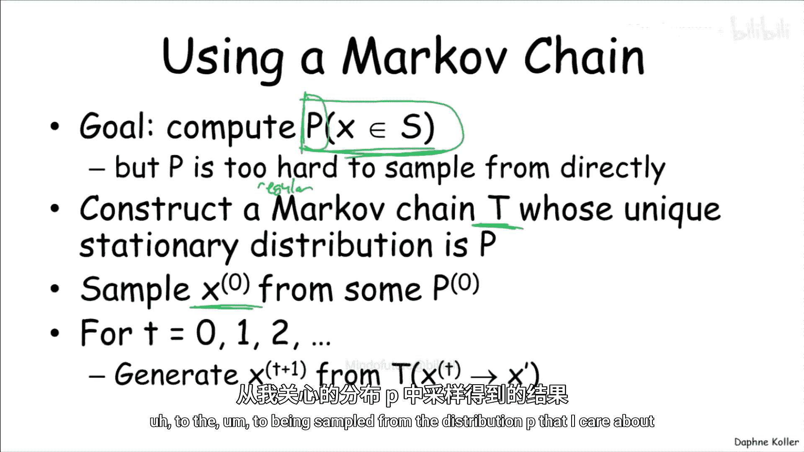

# 023：使用马尔可夫链

在本节课中，我们将学习如何在实际算法中使用马尔可夫链，从难以直接采样的分布中生成样本。我们将探讨如何判断马尔可夫链是否已经“混合”，以及如何有效地利用生成的样本进行概率计算。

---

## 马尔可夫链的使用流程

上一节我们介绍了马尔可夫链的概念，它允许我们从难以处理的分布中生成样本。本节中，我们来看看如何在一个具体的算法流程中使用它。

假设我们的目标是计算与某个分布 **P** 相关的概率，但由于某些原因，我们无法直接从 **P** 中采样。此时，我们可以使用马尔可夫链来解决这个问题。

首先，我们构造一个马尔可夫链 **T**，其唯一的平稳分布是 **P**。通常，这需要是一个正则马尔可夫链。然后，我们从这个分布生成样本。具体步骤如下：

1.  从某个任意的初始分布 **P0** 中采样初始状态 **X0**。
2.  由于 **P0** 与 **P** 不同，我们不能直接使用初始样本来估计与 **P** 相关的事件。
3.  因此，我们开始沿着链“行走”，根据转移模型采样 **X_{t+1}**。
4.  因为链会收敛到平稳分布，最终我们将得到一个非常接近从目标分布 **P** 中采样的样本。

然而，这里存在一个关键问题：我们需要“行走”多久，才能开始使用这些样本？我们不希望使用初始阶段的样本，因为它们离 **P** 还很远。我们需要等待链足够接近其平稳分布，这个状态被称为 **混合**。

混合是指 **P_t**（时间 **t** 的分布）足够接近 **π**（平稳分布）。此时，我们可以认为样本质量足够好，可以开始收集。

---

## 如何判断链是否混合？

判断一个链是否已经混合，通常没有简单的答案。这是马尔可夫链方法中一个棘手的部分。

一般来说，你无法真正证明一个链已经混合。但在某些情况下，你可以证明它**没有**混合。如果你运行了大量测试，并且没有证据表明链未混合，那么你可能会假设它实际上已经混合了。

那么，如何判断链**没有**混合呢？你可以计算**链内统计量**。

以下是具体方法：

*   在链的一次运行中，观察不同的“窗口”。
*   比较这些窗口之间的各种统计量，例如到达某个特定状态的概率。
*   如果不同窗口的统计量相近，那么链可能已经达到了某种收敛状态。

然而，这种方法并不完全可靠。例如，如果概率空间存在两个高概率但难以相互到达的区域，而链只在其中一个区域游走，那么即使链未混合，单个运行窗口内的统计量也可能看起来相似。

更可靠的评估标准是：**在不同空间区域初始化多个链的运行**，然后比较这些不同运行之间的统计量。这样，如果一个链运行在一个区域，另一个链运行在另一个区域，统计量的差异就能表明混合尚未发生。

---

## 评估混合的统计量示例

以下是评估混合时可能用到的具体统计量示例。

**1. 样本的对数概率**

计算样本的对数概率（或未归一化的对数概率，我们稍后会讨论）。然后比较不同链运行的结果。

*   **示例一**：一条链从任意状态初始化，另一条从高概率状态初始化。如果两条链的对数概率值最终趋于一致，则可能已经混合。
*   **示例二**：如果两条链的对数概率值始终相差甚远，则显然没有混合，需要运行更长时间。

**2. 状态子集的概率**

在链运行一段时间后（假设混合可能已经发生），我们选择一个“窗口”，计算某个统计量，例如状态 **X3** 等于特定值（如2）的概率。

然后，我们从不同初始化的链运行中计算这个统计量，并进行散点图比较。

*   如果散点图中的点大部分聚集在对角线附近，表明两条链给出了相似的估计，可能已经混合。
*   如果许多点远离对角线（例如，一个运行中概率很高，另一个中概率为零），则表明没有混合。

如果对许多统计量进行测试，结果都倾向于“可能已混合”，那么我们就有理由相信混合已经发生。

---

## 如何使用混合后的样本？

一旦确定链已经混合，我们就可以开始收集样本。这里有一个重要的观察：**一旦链混合，所有后续样本都来自平稳分布**。也就是说，如果 **X_t** 来自 **π**，那么 **X_{t+1}**, **X_{t+2}** 等也都来自 **π**。

因此，我们可以使用混合后收集的**每一个**样本，因为它们都来自正确的分布。事实上，有论文证明，使用每一个样本比每隔一百个样本收集一次效果更好。

你可能会问：如果所有样本都来自正确分布，为什么有些论文建议每隔很多步才收集一个样本？这是因为，**时间上相邻的样本是相关的**。即使 **X_t** 和 **X_{t+1** 都来自 **π**，**X_{t+1** 通常也与 **X_t** 非常接近。因此，你得到的不是两个独立的样本，而是两个高度相关的样本。

认识到这一点很重要：即使你收集了1000个样本，也不意味着你拥有1000个独立同分布样本的信息量。因此，你不能直接应用那些假设样本独立同分布的误差界。

尽管如此，使用这些相关样本仍然比不使用要好。这里存在一个双重困境：**混合越慢的链，其样本间的相关性也往往越强**。因此，一个“不好”的链在两方面都表现不佳：需要更长时间混合，且收集的样本因相关性而信息量较低。

---

## 算法总结与影响

以下是使用马尔可夫链进行近似推理的完整算法步骤及其影响总结。

**算法步骤：**

1.  **并行运行 C 条链**。
2.  为每条链从一个任意分布中采样一个初始状态。
3.  **重复以下步骤，直到确信混合已发生**：
    *   对每条链，根据转移模型生成下一个样本（随机游走）。
    *   比较不同链之间窗口统计量（如前所述），以判断是否混合。
4.  初始化一个空的样本集合。
5.  **重复以下步骤，直到收集到足够样本**：
    *   从每条链中生成一个样本，并将其加入样本集合。
6.  使用收集到的样本计算任何你关心的期望值，无论是示性函数还是更复杂的函数。

**方法的影响总结：**

*   **优点**：
    *   马尔可夫链是一类非常通用的方法，适用于一般概率模型（不限于概率图模型）的近似推理。
    *   通常易于实现，因为局部采样步骤往往很直接。
    *   当生成足够多、远离初始分布的样本时，具有良好的理论性质。
*   **缺点**：
    *   **大量可调参数和设计选择**：混合时间多长？测量哪些统计量？统计量多接近才算混合？收集多少样本？评估混合的窗口多大？这些选择都会影响结果，使得在实践中运行MCMC方法需要进行大量精细的调整。
    *   **收敛可能很慢**：设计出具有良好混合性质的链非常困难。
    *   **难以判断是否有效**：很难确定链是否真的混合了，以及样本之间的相关性是否足够低，从而能对目标量做出可靠的估计。

---

本节课中，我们一起学习了如何将马尔可夫链应用于实际推理算法。我们探讨了判断链是否“混合”的方法，理解了混合后样本的相关性问题，并总结了马尔可夫链蒙特卡洛方法的完整流程及其优缺点。掌握这些是有效应用MCMC进行近似推理的关键。