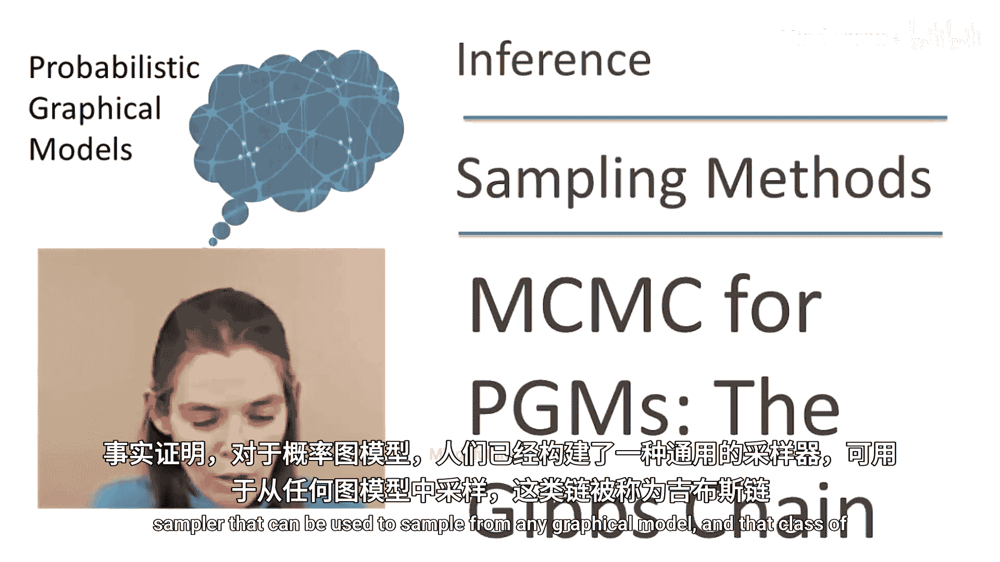
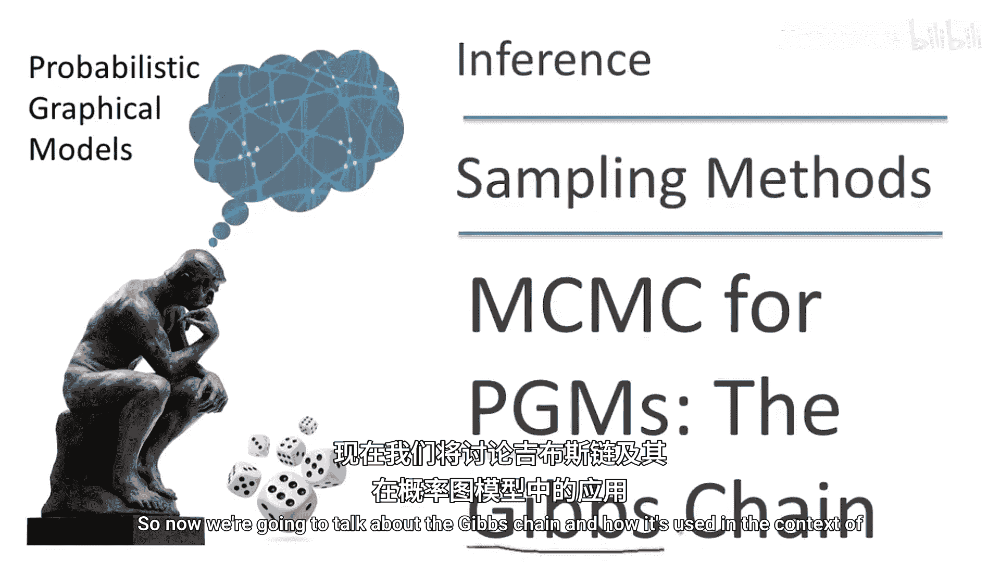
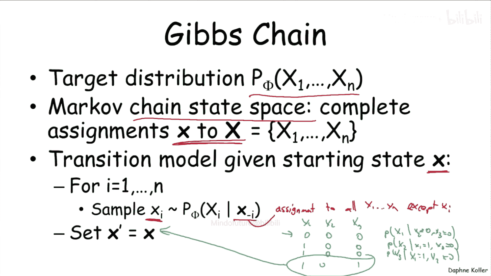
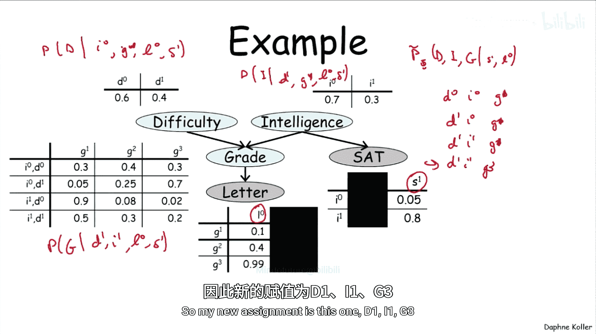
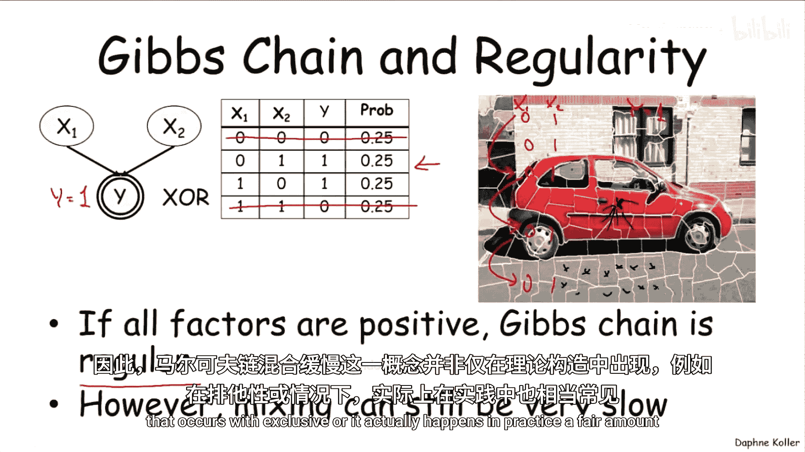
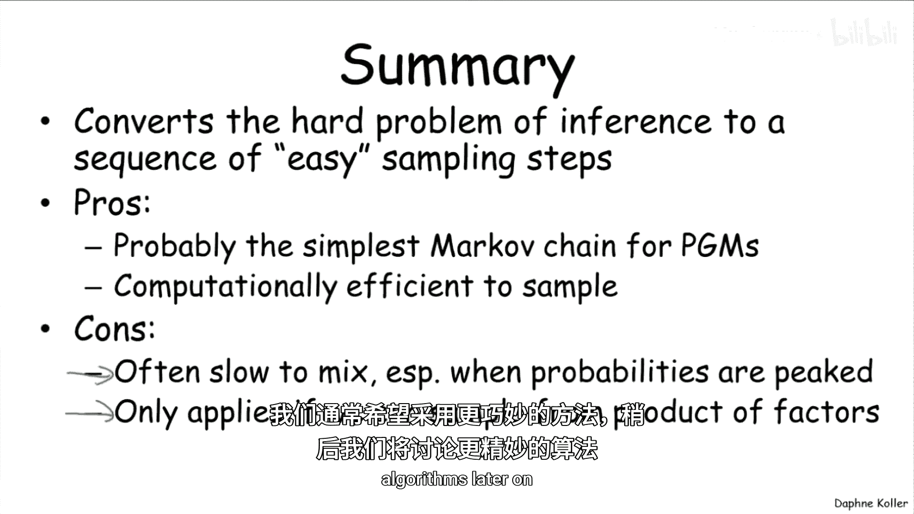

# 概率图模型：2.5：吉布斯抽样 🎲



在本节课中，我们将学习一种用于从概率图模型中抽样的通用方法——吉布斯抽样。我们将了解其工作原理、具体步骤、优缺点以及在实际应用中的局限性。



---

## 概述

上一节我们介绍了马尔可夫链及其收敛到平稳分布的条件。本节中，我们将探讨如何构建一个特定的马尔可夫链（吉布斯链），用于从任意概率图模型中抽样。我们将看到，吉布斯抽样通过一系列简单的条件抽样步骤，将复杂的联合分布抽样问题转化为更易处理的子问题。

## 吉布斯链的定义

我们的目标分布是吉布斯分布 **P_Φ(x₁, …, x_n)**。这个分布可以来自无向图模型的因子乘积，也可以来自给定证据后，由贝叶斯网络化简得到的因子集。接下来的讨论对因子集 **Φ** 的来源（有向或无向模型）不做区分。

吉布斯链的状态空间是变量集 **X** 的所有可能完整赋值 **x** 的集合。这是一个指数级大的空间。吉布斯链本身是一个简单易懂的马尔可夫链，其运行方式如下：



假设我们有一个起始状态 **x⁽ᵗ⁾**。我们将按照某个任意顺序，依次处理每个变量 **Xᵢ**。对于每个变量，我们从给定其他所有变量当前值的条件分布中，为该变量抽样一个新值。

我们用符号 **x_¬ᵢ** 表示除 **Xᵢ** 外所有变量的赋值。例如，对于三个变量 **X₁, X₂, X₃**，我们会依次：
1.  从 **P(X₁ | x₂, x₃)** 中抽样 **X₁**。
2.  从 **P(X₂ | x₁, x₃)** 中抽样 **X₂**。
3.  从 **P(X₃ | x₁, x₂)** 中抽样 **X₃**。

当所有变量都被（可能地）更新后，我们就得到了一个新的状态 **x⁽ᵗ⁺¹⁾**。这便完成了吉布斯链的一步转移。



## 具体示例

让我们在一个具体的图模型——学生网络——中演示这个过程。假设我们观察到证据：**L = l⁰** 和 **S = s¹**。现在，我们需要从后验分布 **P̃_Φ(D, I, G | l⁰, s¹)** 中抽样。

我们从一个任意初始赋值开始，例如 **{D⁰, I⁰, G¹}**。然后依次进行条件抽样：

1.  抽样 **D**：从 **P(D | I⁰, G¹, l⁰, s¹)** 中为 **D** 抽样，假设得到 **D¹**。新状态为 **{D¹, I⁰, G¹}**。
2.  抽样 **I**：从 **P(I | D¹, G¹, l⁰, s¹)** 中为 **I** 抽样，假设得到 **I¹**。新状态为 **{D¹, I¹, G¹}**。
3.  抽样 **G**：从 **P(G | D¹, I¹, l⁰, s¹)** 中为 **G** 抽样，假设得到 **G³**。新状态为 **{D¹, I¹, G³}**。

这样，我们就完成了一步吉布斯抽样，得到了一个新的样本 **{D¹, I¹, G³}**。

## 条件抽样的高效计算

你可能会问，计算条件概率 **P(Xᵢ | x_¬ᵢ)** 本身不也很难吗？实际上，在图模型背景下，这个计算可以被大大简化。

条件分布 **P(Xᵢ | x_¬ᵢ)** 可以写成一个比值：
```
P(Xᵢ | x_¬ᵢ) = P̃_Φ(Xᵢ, x_¬ᵢ) / ∑_{x‘ᵢ} P̃_Φ(x‘ᵢ, x_¬ᵢ)
```
由于 **P̃_Φ** 是未归一化的因子乘积，其归一化常数 **Z** 在分子分母中会相互抵消。因此，我们只需要计算两个未归一化测度的比值。

关键在于，分子 **P̃_Φ(Xᵢ, x_¬ᵢ)** 是涉及所有变量的因子乘积。但当我们固定 **x_¬ᵢ** 后，许多因子变成了常数。实际上，**P(Xᵢ | x_¬ᵢ)** 正比于所有**作用域包含 Xᵢ 的因子**的乘积。

考虑一个马尔可夫网络示例，其因子为 **φ₁(A,B), φ₂(B,C), φ₃(C,D), φ₄(A,D)**。要计算 **P(A | b, c, d)**，我们有：
```
P(A | b, c, d) ∝ φ₁(A, b) * φ₄(A, d)
```
可以看到，最终我们只需要计算与变量 **A** 直接相连的因子（即其马尔可夫毯中的因子）的乘积。对于大型图模型，这带来了巨大的计算节省，因为每次抽样只需要考虑目标变量及其邻接变量。

## 吉布斯链的性质与局限性

吉布斯链是否总是具有我们期望的性质（如收敛到唯一的平稳分布）呢？答案是否定的。

一个经典的例子是“异或”网络。假设 **Y = X₁ ⊕ X₂**，且我们观察到 **Y = 1**。如果我们从状态 **{X₁=0, X₂=1}** 开始吉布斯抽样：
*   抽样 **X₁**：给定 **X₂=1, Y=1**，**X₁** 只能为 0。
*   抽样 **X₂**：给定 **X₁=0, Y=1**，**X₂** 只能为 1。
因此，链将永远停留在状态 **{0, 1}**，无法访问另一个同样合理的状态 **{1, 0}**。这是一个**非混合链**的例子。

另一方面，如果模型中所有因子的条目都为正（即没有零概率），则可以证明吉布斯链是正则的，从而保证收敛。但“正则”是一个很弱的条件，它只保证“最终”收敛，而不保证在合理时间内收敛。

例如，在图像分割任务中，如果相邻超像素之间有很强的关联势函数，且初始赋值整体错误（如将道路误标为水域），那么吉布斯抽样可能会陷入局部模式，因为每个像素都被其邻居的强约束“锁定”，导致链混合极其缓慢。

## 总结



本节课中，我们一起学习了吉布斯抽样。以下是其核心要点：

**优点：**
*   **原理简单**：它将复杂的联合分布抽样转化为一系列单变量的条件抽样。
*   **计算高效**：每一步条件抽样只涉及目标变量及其邻接变量（马尔可夫毯），计算成本低。

**缺点与局限：**
*   **混合缓慢**：当变量间存在强相关性或概率分布呈尖峰状时，链的混合速度可能非常慢。
*   **适用性限制**：它要求我们能够从条件分布（即相关因子的乘积）中高效抽样。这对于离散模型通常可行，但对于连续变量或连接稠密的模型可能不适用。



因此，尽管吉布斯抽样是概率图模型中最简单直观的MCMC方法之一，但在实际应用中，我们常常需要更巧妙的算法来应对其混合缓慢的问题。我们将在后续课程中探讨这些更高级的算法。