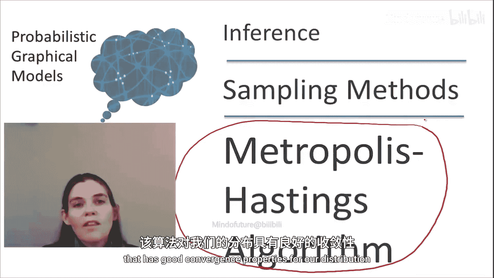
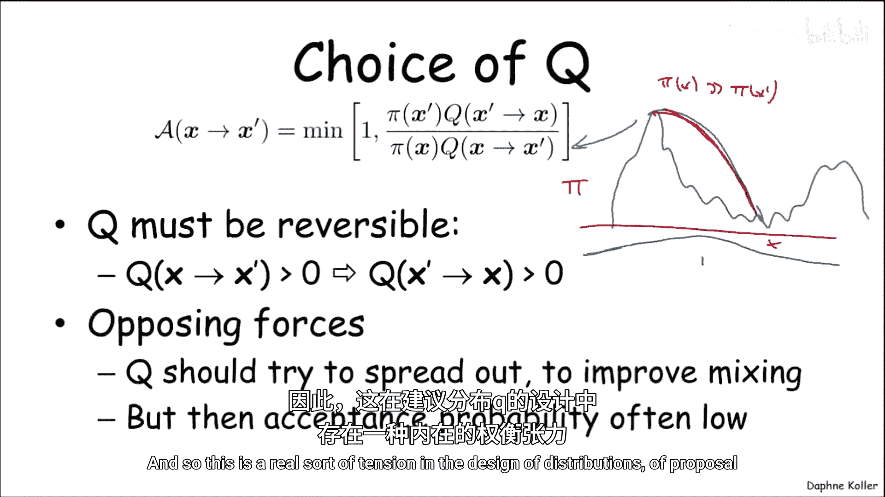
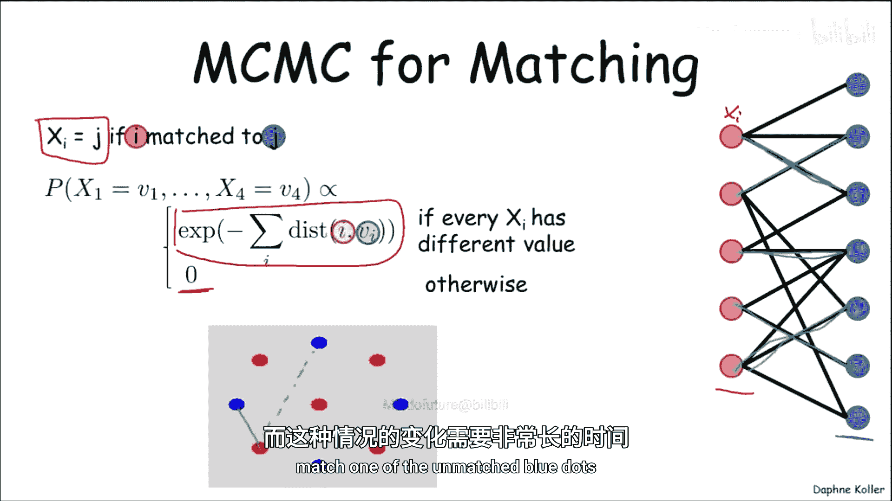
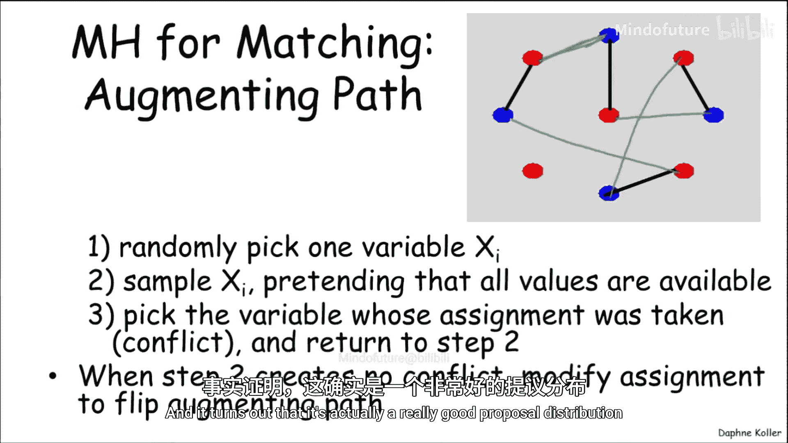
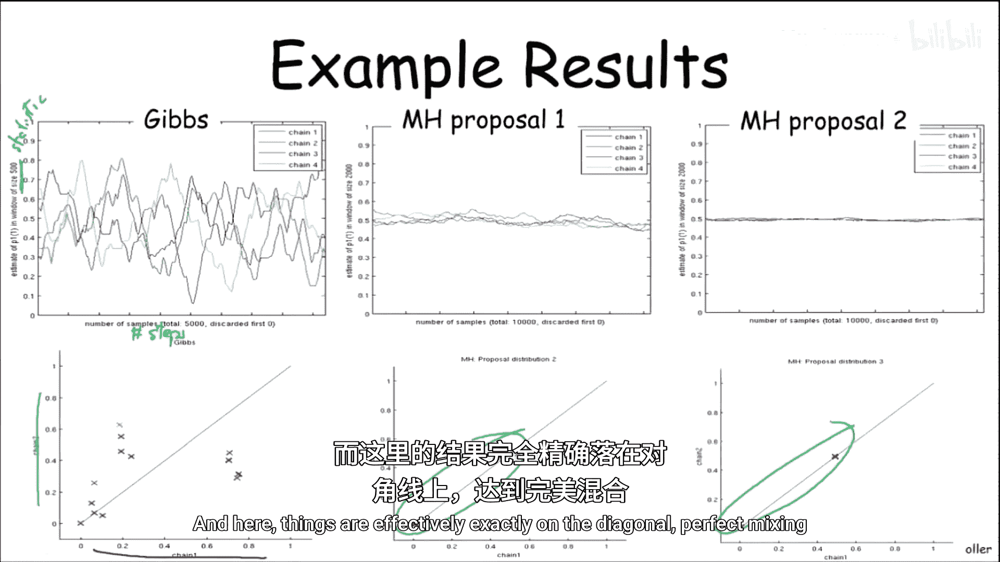
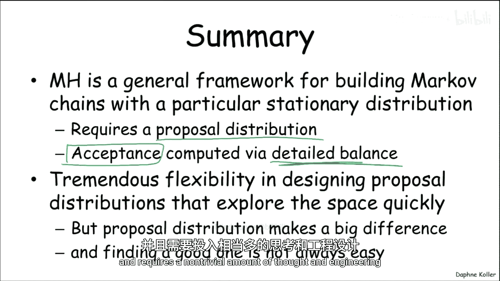

# 025：梅特罗波利斯-黑斯廷斯算法

在本节课中，我们将学习梅特罗波利斯-黑斯廷斯算法。这是一种通用的马尔可夫链蒙特卡洛方法，用于从难以直接采样的分布中生成样本。我们将了解其核心思想——可逆链与细致平衡方程，并学习如何通过设计“提议分布”来构建具有期望平稳分布的马尔可夫链。

## 马尔可夫链蒙特卡洛与可逆链

上一节我们介绍了马尔可夫链蒙特卡洛采样的基本概念。它为解决从复杂分布中采样的问题提供了一个通用框架。然而，这个框架留下了一个关键问题：如何设计一个具有我们期望的平稳分布的马尔可夫链？吉布斯链是图模型背景下的一个通用解决方案，但它对某些类型的图模型收敛速度较慢。那么，如果遇到吉布斯链收敛性不佳的图模型，我们该如何设计马尔可夫链呢？

事实证明，存在一类通用的方法，称为**梅特罗波利斯-黑斯廷斯算法**。该算法为我们提供了一种通用方法来设计具有期望平稳分布的马尔可夫链。实际上，对于给定的平稳分布，我们可以构建一系列不同的马尔可夫链，它们以不同方式探索状态空间，然后从中选择或构建一个对我们的分布具有良好收敛性质的链。

梅特罗波利斯-黑斯廷斯方法背后的关键见解是**可逆链**的概念。

那么，链可逆意味着什么？

想象我们有一个具有特定平稳分布 **π** 的链。我们将考虑两个不同的实验。在第一个实验中，我们根据概率分布 **π** 在状态空间中选取一个点，然后根据链定义的转移模型 **T**，从我们选取的状态出发随机选择一条边。在第二个实验中，我们完全重复这个过程，再次根据 **π** 选取一个点，并根据 **T** 选择一条出边。

如果一个链是可逆的，那么在上述过程中，沿着红色边（从状态 **i** 到 **j**）的概率，恰好等于在另一个方向上沿着绿色边（从状态 **j** 到 **i**）的概率。也就是说，先选取 **i** 然后转移到 **j** 的概率，等于先选取 **j** 然后转移到 **i** 的概率。

用数学符号表示，这告诉我们：
**π(x) * T(x → x') = π(x') * T(x' → x)**

这个方程被称为**细致平衡方程**。并非所有马尔可夫链都满足这个性质。但事实证明，可逆马尔可夫链具有优雅的性质，使得我们可以构造它们以获得特定的平稳分布。

具体来说，我们可以证明（这个证明并不困难）：如果细致平衡方程成立，并且 **T** 是一个正则马尔可夫链，那么 **T** 有唯一的平稳分布（根据正则性可知），并且这个平稳分布就是 **π**。

让我们来证明这一点。证明过程非常简洁。

我们从细致平衡方程开始：
**π(x) * T(x → x') = π(x') * T(x' → x)**

现在，我们对等式两边关于 **x** 求和。由于两边相等，求和后仍然相等：
**∑_x [π(x) * T(x → x')] = ∑_x [π(x') * T(x' → x)]**

观察右边，**π(x')** 不依赖于求和变量 **x**，因此可以提到求和符号外面：
**∑_x [π(x) * T(x → x')] = π(x') * ∑_x [T(x' → x)]**

因为 **T** 是从 **x'** 出发的转移概率分布，其所有出边的概率之和必然等于 1：
**∑_x [T(x' → x)] = 1**

因此，我们得到：
**∑_x [π(x) * T(x → x')] = π(x')**

这正是平稳分布 **π** 的定义。所以，这个简洁的证明表明，一个相对于特定分布 **π** 可逆的链，必然以 **π** 为其平稳分布。

为什么这个定义比底部那个涉及对整个（通常是指数级大的）空间求和的平稳分布定义更有用？因为细致平衡方程更具建设性，它允许我们构造 **T** 以匹配 **π**。这正是梅特罗波利斯-黑斯廷斯算法背后的思想。

## 梅特罗波利斯-黑斯廷斯算法设计

那么，梅特罗波利斯-黑斯廷斯链是如何工作的呢？

它从一个**提议分布 Q** 开始。这个分布 **Q** 可以在状态空间中自由“漫游”，不像吉布斯链那样只进行局部小步移动。**Q** 可以提议移动到状态空间中非常遥远的部分。当然，仅凭 **Q** 本身，其平稳分布与我们关心的目标平稳分布 **π** 毫无关系。

因此，我们需要一个“评判者”。评判者的作用是：当提议分布 **Q** 提出一个移动建议时，它决定是否“接受”这个提议。评判者会说：“你想从 **x** 移动到 **x'**？好吧，我以多大的概率允许你这么做？”这个概率就是**接受概率 A**。对于每一对状态 **(x, x')**，**A(x → x')** 是一个二元随机变量的接受概率。

这就产生了以下过程（我们尚未说明如何选择 **Q** 或 **A**，先理解过程）：
在每一个状态 **x**，我们从提议分布 **Q(x → ·)** 中采样一个潜在的后继状态 **x'**。我们有一个移动到 **x'** 的提议（用虚线表示）。然后，评判者决定是否接受这个提议。如果提议被接受，我们就实际执行这个转移；如果提议被拒绝，我们就停留在原地。

这会产生什么样的转移模型 **T**？有两种情况：
1.  如果 **x' ≠ x**，即提议移动到另一个状态。那么，转移到 **x'** 的唯一机会是：首先提议移动到 **x'**，并且这个提议被接受。因此，转移概率为：
    **T(x → x') = Q(x → x') * A(x → x')**
2.  如果 **x' = x**，即停留在原地。这有两种可能：要么提议留在 **x** 并被接受（我们通常假设提议留在原地总是被接受），要么从 **x** 提议移动到其他状态 **x''**，但该提议被拒绝。因此，转移概率为：
    **T(x → x) = Q(x → x) + ∑_{x'' ≠ x} [Q(x → x'') * (1 - A(x → x''))]**

这样就定义了一个马尔可夫链。但如上所述，没有理由期望它具有特定的平稳分布。

现在，我们引入细致平衡方程的直觉，并利用它来构造一个具有我们所需性质的接受概率 **A**。

我们的目标是：给定一个提议分布 **Q**，我们想要选择 **A**，使得细致平衡方程成立。如果对于 **(Q, π)** 细致平衡成立，那么就能保证整个过程具有正确的平稳分布。

我们考虑 **x ≠ x'** 的情况（当 **x = x'** 时，等式显然成立）。我们希望以下等式成立：
**π(x) * T(x → x') = π(x') * T(x' → x)**

代入 **T** 的表达式：
**π(x) * [Q(x → x') * A(x → x')] = π(x') * [Q(x' → x) * A(x' → x)]**

现在，我们将两个接受概率移到等式一边，其他项移到另一边，得到对接受概率比率的约束：
**A(x → x') / A(x' → x) = [π(x') * Q(x' → x)] / [π(x) * Q(x → x')]**

我们定义这个比率为 **ρ**。不失一般性，我们假设 **ρ ≤ 1**（如果大于1，我们可以交换 **x** 和 **x'** 的角色）。

现在我们需要选择 **A(x → x')** 和 **A(x' → x)** 的值以满足这个等式。一个简单的方法是取两者中较小的那个（我们假设是分子对应的那个），并令：
**A(x → x') = ρ**
**A(x' → x) = 1**

这立即满足了约束条件。当然，我们也可以选择其他值（例如，都设为 **ρ/2** 和 **1/2**），但那样会降低提议被接受的概率，导致链移动得更慢，因为停留在原地的次数会更多。因此，我们选择的是在满足比率约束条件下可能的最大接受概率。

将其整合为一个通用公式，我们得到接受概率的表达式：
**A(x → x') = min( 1, [π(x') * Q(x' → x)] / [π(x) * Q(x → x')] )**

如果你仔细看这个公式，会发现它对 **A(x → x')** 和 **A(x' → x)** 都能给出正确的值。

## 提议分布 Q 的选择与挑战

这告诉我们如何根据给定的 **Q** 来选择 **A**。接下来的问题是：如何选择 **Q**？这通常是最具挑战性的部分。

选择 **Q** 是一门艺术，在许多应用中并不容易。但在思考如何选择之前，让我们先看看 **Q** 必须满足的一些条件。

从 **A** 的表达式可以看出，它涉及一个比率。要保证这个比率有定义，分母不能为零。因此，**Q** 必须满足一个可逆性条件：如果 **Q(x → x') > 0**，那么 **Q(x' → x) > 0**，反之亦然。这保证了比率总是良定义的。

这个条件对 **Q** 的设计造成了一种张力。
*   **一方面**，我们希望 **Q** 非常“宽广”。如果你在当前状态，你希望 **Q** 能提议移动到非常遥远的地方，因为移动得越远，在状态空间中探索得越快。你不希望像吉布斯链那样只停留在当前赋值附近，你希望快速移动，这能改善混合速度。
*   **另一方面**，如果提议分布非常宽广，你可能会从一个 **π** 值较低的区域移动到一个 **π** 值非常高的区域（或者相反）。想象状态空间 **X** 上 **π** 的“高度”分布。如果你移动得很远，很容易陷入 **π(x)** 远大于 **π(x')** 的情况。看看这对接受概率意味着什么：接受概率 **A(x → x')** 会变得非常低。这反过来又会导致混合速度变慢，因为你虽然尝试了全局性的移动，但很少被接受。

因此，在设计提议分布 **Q** 时，需要在“探索广度”和“接受概率”之间取得平衡。

## 示例：匹配问题

让我们看一个马尔可夫链的例子，其中提议分布的选择会产生巨大影响。这是一个匹配问题，也可以表述为一个图模型。

假设我们有一组红点和一组蓝点，我们希望将红点与蓝点进行匹配。每条边（连接红点和蓝点）都有一个权重，表示这个红点与该蓝点匹配的“满意度”。这在很多问题中都很常见，例如将传感器读数匹配到跟踪目标，或将一幅图像的特征匹配到另一幅图像。

将匹配问题表述为图模型的一种方式是：每个红点是一个变量 **X_i**，每个蓝点代表一个可能的值。**X_i = j** 表示将第 **i** 个红点匹配到第 **j** 个蓝点。

我们可以定义一个概率分布：首先，它必须是一个合法匹配（即每个红点匹配到不同的蓝点），否则概率为零。对于合法匹配，其概率与匹配中所有边权重的指数和成正比：**P(assignment) ∝ exp( sum of qualities of matched edges )**。在这个例子中，我们可以将边的质量直观地视为距离，红点更倾向于匹配距离近的蓝点。

如果在这个模型上运行吉布斯采样，过程会非常缓慢。例如，选取一个红点变量，尝试为它分配一个新的蓝点值。由于大多数蓝点可能已经被其他红点匹配，那些导致冲突的赋值概率为零（不可能）。因此，红点只能匹配到当前未被匹配的蓝点，这使得状态变化非常缓慢。

## 梅特罗波利斯-黑斯廷斯解决方案

现在，我们看看如何使用梅特罗波利斯-黑斯廷斯算法，并设计一个不同的提议分布来解决这个问题。这种方法称为“增广路径”提议分布。

假设这是当前的匹配。我们按以下方式构造一个提议：
1.  随机选择一个变量（红点），比如 **X_i**。
2.  忽略当前匹配，为它“提议”一个新的蓝点值（可以随机选择，概率与距离等有关）。假设我们为它提议了蓝点 **B_j**，而 **B_j** 当前正被另一个红点 **X_k** 匹配。
3.  现在，红点 **X_k** 失去了它的伙伴，所以它也需要一个新的蓝点。我们为 **X_k** 提议一个新的蓝点值。
4.  这个过程继续，直到我们最终为一个“空闲”的蓝点（当前未被任何红点匹配）提议了一个匹配，或者我们形成了一个环。
5.  最终，我们得到了一条由交替的“当前边”和“提议边”组成的路径或环（称为交替路径或交替环）。通过将这条路径上的所有边从“当前”状态切换到“提议”状态，我们得到了一个新的合法匹配。这就是我们的提议。

通过一些数值计算，可以得出这个提议分布的接受概率。事实证明，这是一个非常好的提议分布。

## 性能比较

让我们比较一下不同方法的性能。

如果只应用吉布斯采样，可以看到四条不同颜色的链（代表四个独立的运行）。X轴是步数，Y轴是某个用于衡量混合情况的统计量（例如，第一个红点匹配到第一个蓝点的概率）。可以看到，链中存在大量的长程波动，概率随时间变化缓慢，表明链需要很长时间才能从一个区域移动到另一个区域。

相比之下，使用刚才描述的增广路径提议分布的梅特罗波利斯-黑斯廷斯算法则完全不同。概率曲线几乎完全平坦，四条链几乎重合，随时间窗口的变化非常小。

甚至还有一种更好的提议分布（对增广路径稍作修改），它能实现几乎完美的混合。

如果我们查看用于评估混合的另一个指标（例如，比较不同链对同一统计量的估计），可以看到吉布斯链的估计非常嘈杂，不同链给出的估计差异很大。而第一个梅特罗波利斯-黑斯廷斯算法的估计几乎落在对角线上（表示一致），更好的那个算法则完全落在对角线上，实现了完美混合。

## 总结

本节课中我们一起学习了梅特罗波利斯-黑斯廷斯算法。这是一个非常通用的框架，用于构建具有特定平稳分布的马尔可夫链。

它要求你提出一个**提议分布 Q**，并且这个分布需要满足一定的条件（正反方向概率均不为零）才能有效。一旦给出了这样的提议分布，**细致平衡方程**这个简洁的公式就能告诉我们如何构造**接受概率 A**，以确保获得正确的平稳分布。

这非常强大，因为它赋予了我们巨大的灵活性来设计提议分布，从而快速探索状态空间并移动到遥远的区域。然而，正如我们所看到的，选择提议分布是一个关键的设计点，对性能有巨大影响。这更像是一门艺术而非精确的科学，通常需要大量的思考和工程实践。