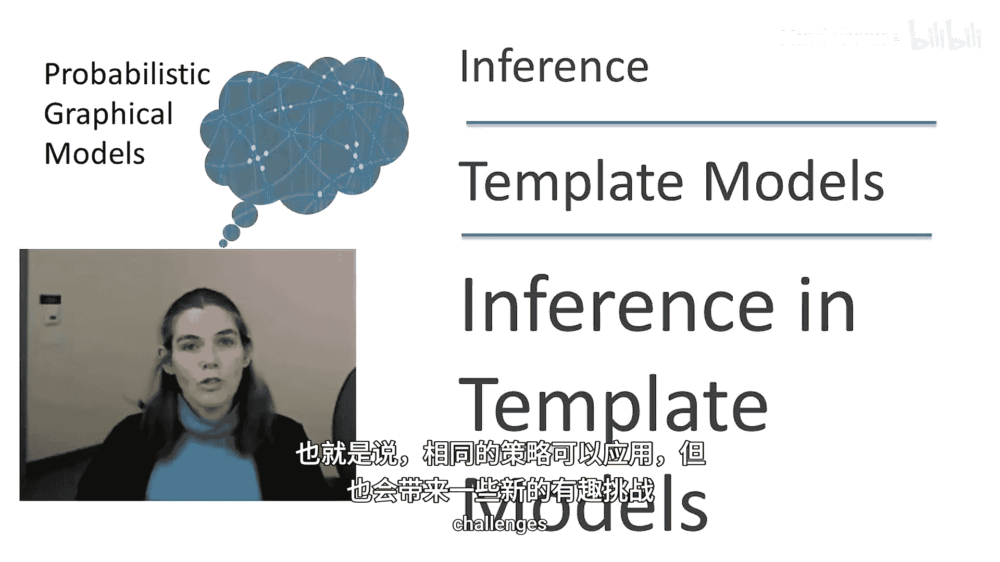
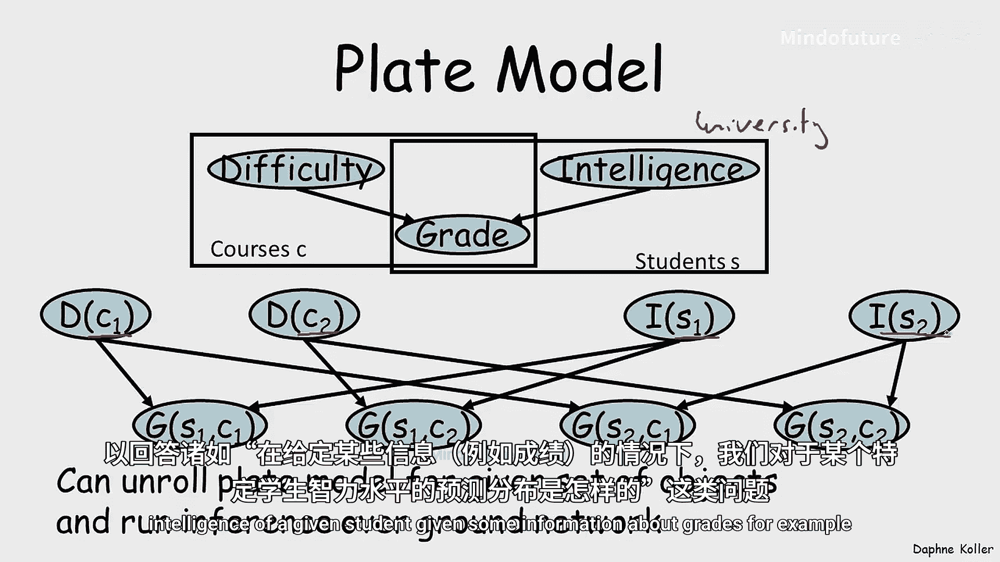
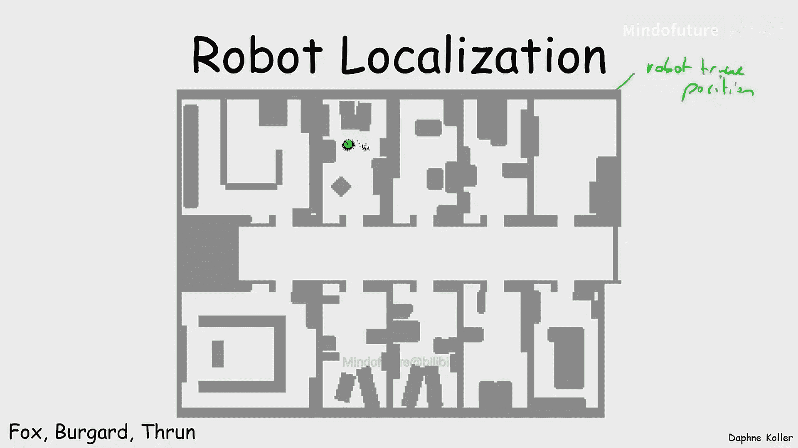
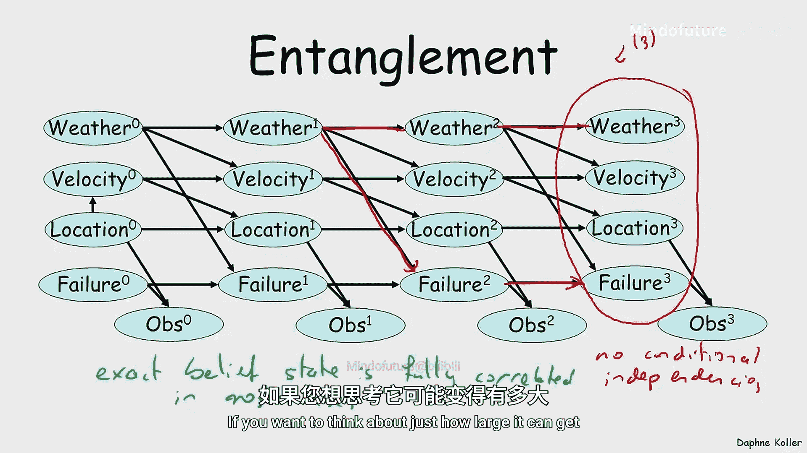
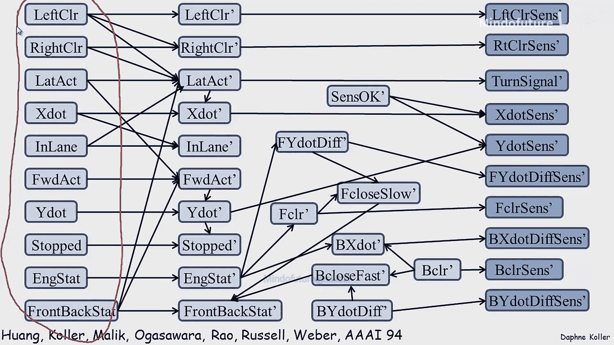
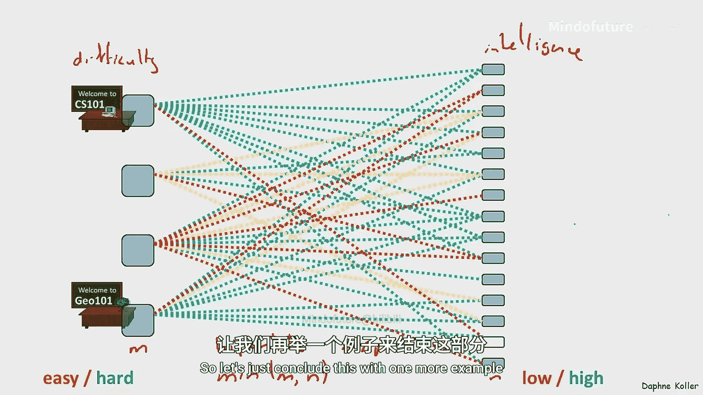
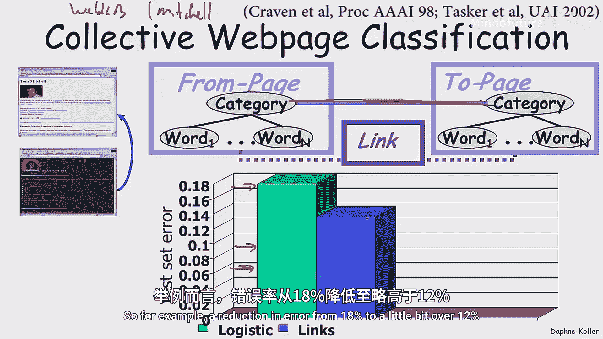
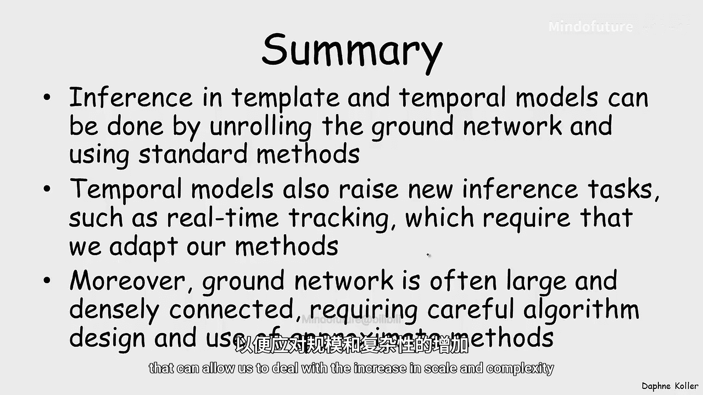

# 026：时序模型中的推断

在本节课中，我们将要学习如何将之前讨论的推断策略应用于基于模板的模型，例如动态贝叶斯网络和盘模型。我们将探讨这些策略的适用性，以及由这些模型结构带来的新挑战和计算问题。

## 概述

在之前的几节课中，我们讨论了许多不同的推断策略，以及它们如何应用于各种图模型。一个自然的问题是，这些相同的策略能否应用于我们之前定义的基于模板的模型？这些模型通过动态贝叶斯网络、盘模型或其他使用重复结构的表示法来定义。我们将看到，答案是既肯定又否定的。相同的策略可以应用，但也会出现一些有趣的新挑战。

## 动态贝叶斯网络与盘模型的推断

首先，让我们回顾一下动态贝叶斯网络是如何定义的。动态贝叶斯网络使用一个初始时间零分布（通常是一个贝叶斯网络）和一个定义转移模型的2-TBN来指定。我们可以将这两个部分组合起来，展开或“接地”成一个贝叶斯网络。一旦完成，这个接地网络就和其他任何贝叶斯网络一样。因此，我们为回答任何贝叶斯网络查询而开发的任何推断技术都可以在此上下文中使用。

具体来说，一旦我们为给定的轨迹长度展开DBN，我们就可以在接地网络上运行你喜欢的推断算法，来回答诸如“给定某些证据（例如到时间2的观测或整个序列的观测），汽车在时间2的位置是什么？”之类的问题。

同样的情况也适用于盘模型。以我们之前讨论的大学示例中的简单盘模型为例，其中有学生、课程和成绩。我们可以展开该网络，生成一个接地网络。这个展开的网络再次成为一个普通的贝叶斯网络，因此我们可以对该网络运行推断，以回答诸如“给定某些成绩信息，我们对特定学生智力的预测分布是什么？”等问题。

## 时序模型中的新挑战：信念状态跟踪

然而，这些基于模板的模型带来了一些困难或新的维度，其中一个重要方面是它们引入了新的问题。这在时序模型的背景下尤其明显，我们常常对所谓的“信念状态跟踪”感兴趣，即随着系统演化，持续跟踪其状态。

从某种意义上说，这只是一个传统的概率推断任务，因为它对应于询问：给定智能体到时间T为止获得的观测，我们在时间T的状态概率分布是什么？这里的 `O_{1:T}` 是 `O_1, O_2, ..., O_T` 的简写。这是一个可以在展开网络上使用标准概率推断技术来回答的推断任务。

但是，如果我们想要在长轨迹过程中跟踪这个概率分布，而不必维护一个可能无限大的网络并持续在其上运行推断，就存在一个需要解决的挑战。

幸运的是，事实证明，我们可以以一种动态的方式做到这一点，而无需在任何时间点都跟踪巨大的展开网络。这直接源于图模型的马尔可夫性质。

具体来说，我们将通过一个两阶段过程来实现。首先，我们计算 `σ_{t+1}^•`。这里的点表示，虽然这是时间 `t+1` 状态的一个分布，但它没有考虑时间 `t+1` 的观测。其定义如下：

`σ_{t+1}^• = P(S_{t+1} | o_{1:t})`

现在，我们可以对这个概率表达式进行相当直接的操作。首先，我们在条件条的右侧引入 `S_t` 并对其求和：

`σ_{t+1}^• = Σ_{s_t} P(S_{t+1} | s_t, o_{1:t}) * P(s_t | o_{1:t})`

接下来，我们应用由图模型结构产生的独立性。具体来说，给定时间 `t` 的状态，时间 `t+1` 的状态独立于之前发生的一切。这允许我们使用条件独立性来简化表达式：

`σ_{t+1}^• = Σ_{s_t} P(S_{t+1} | s_t) * σ_t`

这里，`P(S_{t+1} | s_t)` 就是我们的转移模型，而第二项 `P(s_t | o_{1:t})` 正是我们之前计算并试图跟踪的信念状态 `σ_t`。这使我们能够从 `σ_t` 生成 `σ_{t+1}^•`。

第二步是考虑时间 `t+1` 的观测模型。我们来看这涉及什么。现在我们有了上一张幻灯片定义的 `σ_{t+1}^•`，我们想用新的观测 `o_{t+1}` 来条件化它，从而推导出信念状态 `σ_{t+1}`。

`σ_{t+1} = P(S_{t+1} | o_{1:t+1})`

我们应用贝叶斯规则来重新表述：

`σ_{t+1} = (P(o_{t+1} | S_{t+1}, o_{1:t}) * P(S_{t+1} | o_{1:t})) / P(o_{t+1} | o_{1:t})`

`σ_{t+1} = (P(o_{t+1} | S_{t+1}) * σ_{t+1}^•) / P(o_{t+1} | o_{1:t})`

这是一个贝叶斯规则的直接应用。我们可以再次检查这个表达式中的每一项。分子中的第一项是给定状态的观测概率，根据条件独立性，过去的观测可以移除。第二项正是我们刚刚计算的 `σ_{t+1}^•`。这样就得到了上面的表达式，它很容易处理，因为分子中的每一项要么是我们模型的一部分（观测模型），要么是我们之前计算过的 `σ_{t+1}^•`。分母是一个归一化常数，可以通过计算分子然后归一化来得到。

## 机器人定位示例

回到我们之前见过的例子，让我们看看机器人定位。这是一个我们已经讨论过的模型。现在，让我们看看这在信念状态跟踪问题的实际背景下如何体现。

在一个场景中，绿色圆圈代表机器人的真实位置，这对机器人是未知的，因为机器人正试图定位自己。蓝色线条是机器人在过程中每个点获得的声纳观测读数。返回的声纳读数长度大致对应于机器人与墙壁的距离，但这里存在一些噪声。例如，有时声纳似乎穿过了墙壁，尽管它本应给出更近的读数。红色圆点可视化地表示了机器人对自己位置的信念。初始阶段，这是一个均匀的概率分布，因为机器人不知道自己在哪。随着时间的推移，分布会变得越来越集中，因为机器人对自己可能位置的信念状态变得越来越确定。

我们可以看到，随着机器人获得越来越多的观测，其信念分布变得越来越集中。由于对称性，机器人起初不确定自己在走廊的哪一侧，因此分布有两个峰值。但当机器人走进一个房间后，它发现这个房间与底部的房间不同。最终，机器人几乎确定地定位了自己，因为只有一个位置与其在整个轨迹中接收到的观测一致。

## 计算问题与纠缠

与这些基于模板的模型相关的第二个挑战是计算问题。我们当然可以生成一个展开的贝叶斯网络，并使用标准推断技术计算任何变量子集的后验。但是，能够从一个相当小的模板生成这些非常大的概率图模型的一个后果是，我们确实可以生成非常大的模型，而大型概率图模型可能会带来新的推断挑战，即如何将推断扩展到那种规模的模型。

具体来说，如果我们看一下由展开的DBN产生的展开模型，并回想一下我们之前关于特定概率图模型的概率推断复杂性的分析，我们会记得，例如，如果我们想在这个展开的网络上运行精确推断（比如团树推断），并且希望团树中时间零变量在一部分，而未来某个时间T的变量在另一个团中，那么分离这些变量所需的最小子集必须包含所有持久变量（即那些在时间 `t` 到 `t+1` 之间存在边的变量）。因此，这可能会给精确推断带来巨大的计算成本，尤其是当我们有大量持久变量时。

理解这一点的另一种方式是通过“纠缠”的概念。如果我们的目标是维护时间3变量的信念状态，并思考如何在不维护时间3变量的完整显式联合分布的情况下做到这一点，我们很快意识到我们别无选择，因为时间3的变量之间没有条件独立性。虽然它们在时间片内没有直接连接，但它们之间存在活跃迹，例如：天气时间3 -> 天气时间2 -> 故障时间2 -> 故障时间3。这意味着，当只考虑时间3的变量时，给定时间3的任何其他变量，它们彼此之间并不是条件独立的。这种纠缠过程在动态贝叶斯网络中跟踪信念状态的过程中发生得非常迅速，最终意味着，如果你想维护精确的信念状态，在大多数情况下它将是完全相关的。

## 盘模型中的计算问题

类似的计算问题也出现在盘模型中。以我们展开的学生示例盘模型为例，左边是课程难度，右边是学生智力，中间是成绩。我们讨论过这种二分马尔可夫随机场的计算复杂性。一般来说，假设成绩关联相当密集，对于精确推断，我们预期的最低成本是左边变量数 `M` 和右边变量数 `N` 的最小值，即 `min(M, N)`。假设大学有相当多的课程和更多的学生，这很快就会变得难以处理，从而产生了对近似推断方法的需求。

## 近似推断的成功案例

尽管如此，近似推断方法可以非常成功。让我们用一个无向模板模型的例子来结束这部分内容。这里的任务是将网页分类到不同的类别中。虽然可以使用标准的机器学习技术根据网页包含的单词单独对网页进行分类，但事实证明，通过考虑网页之间的连接（即链接页面类别之间的无向边），可以显著提高性能。例如，从数据中学习到的模型显示，学生很可能链接到教师，教师链接到学生的可能性较小，教师链接到其他教师的可能性更小。这为我们提供了相互链接的网页标签之间相关性的信息，从而带来了性能上的显著提升，例如将错误率从18%降低到略高于12%。

## 总结

本节课中，我们一起学习了在时序模型中进行推断的方法。原则上，可以通过展开接地网络并使用标准推断方法来完成。然而，时序模型特别提出了新的推断任务，例如实时信念状态跟踪，这需要我们的方法进行一定的调整。此外，另一个复杂性来源是，通过展开这些模型得到的接地网络通常非常大，有时连接非常密集，需要仔细设计算法方法并使用近似方法，以应对规模增加带来的复杂性。