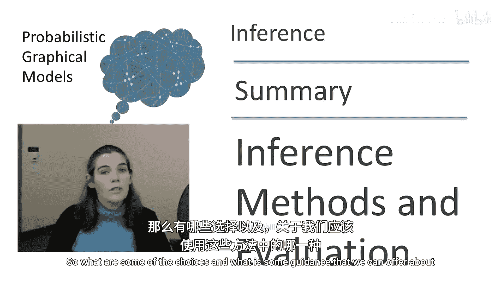
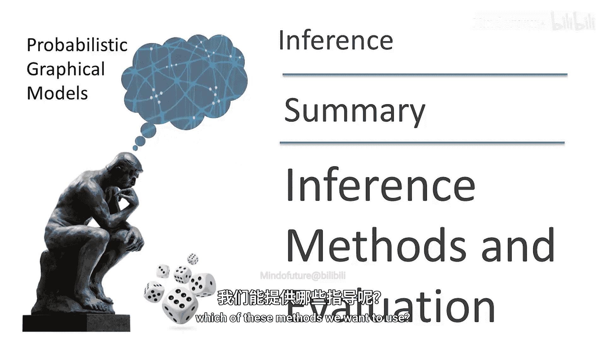
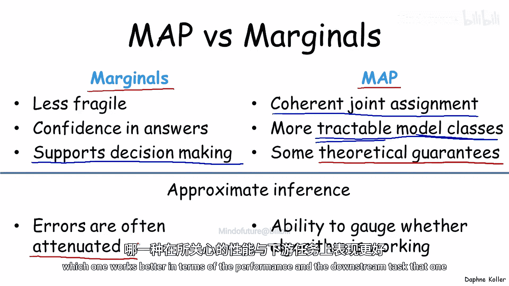
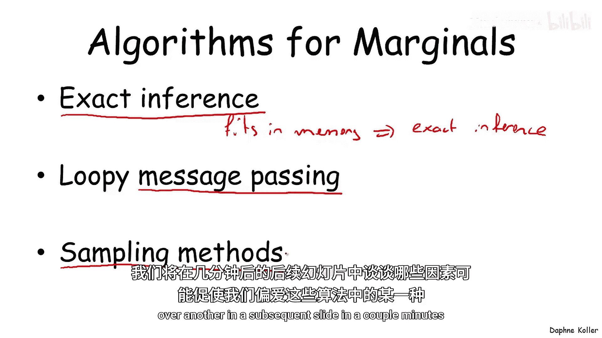
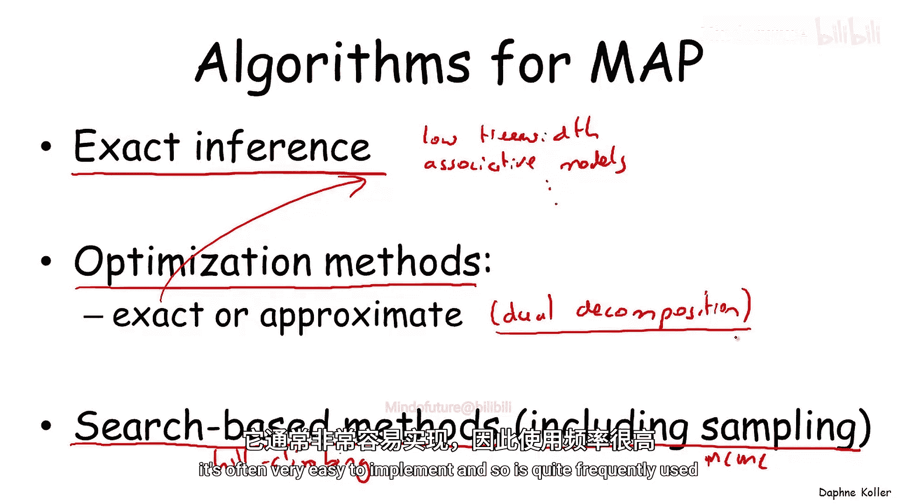
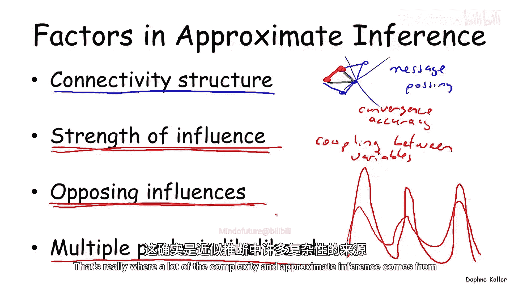
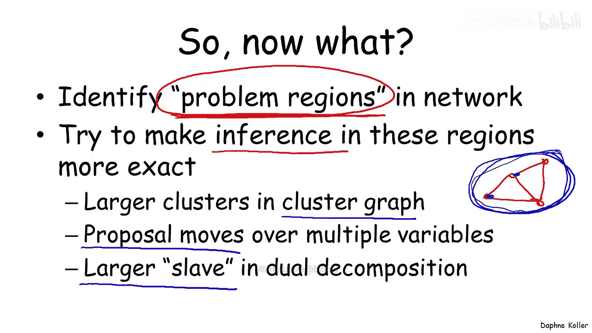

# 概率图模型：2.7：推断方法总结与选择指南 📊

在本节课中，我们将总结本单元所学的各种推断方法，并探讨如何根据具体任务和模型特性，在精确推断与近似推断、边缘概率计算与最大后验概率计算之间做出合理选择。

---

## 2.7.1：任务选择：边缘概率 vs. 最大后验概率 🎯

我们首先需要回答的问题是：哪个任务更适合我们的问题？是计算边缘概率，还是计算最大后验概率分配？这两种选择在应用场景上存在不同的权衡。

计算边缘概率通常是一种更稳健的方式，因为我们并非只选择一个单一的假设，而是计算一系列不同选项的概率分布。例如，我们可以观察最佳选项的概率是仅比次优选项高一点，还是高出很多，这为我们判断推断结果的鲁棒性提供了指导。同时，计算出的概率也为决策支持提供了基础，例如在与效用模型结合时。

另一方面，最大后验概率计算适用于另一类场景。例如，在语音识别或图像分割问题中，获得一个整体上连贯的联合赋值，有时比获得推理问题中各个独立部分（如单个像素或音素）的最佳答案更为重要。因此，连贯性这一概念有时至关重要，值得以牺牲一定的鲁棒性为代价。

从计算角度看，最大后验概率问题存在一系列比计算边缘概率更易处理的模型类别。因此，出于计算效率的考虑，我们有时会选择使用最大后验概率解决方案。此外，特别是在使用近似推断时，最大后验概率分配通常能为我们提供关于答案接近正确程度的理论保证，例如在对偶分解算法中。而对于计算边缘概率的近似推断，则难以获得类似水平的置信度。

然而，在运行近似推断时，这两类问题又存在不同的权衡。在计算边缘概率时，近似推断算法因其“软”赋值特性，误差往往会被削弱，推断中某一部分的不准确性通常不会显著传播到模型的其他部分，因此在计算边缘概率时，近似推断通常能提供更稳健的答案。另一方面，在最大后验概率方面，我们至少可以在许多情况下（例如在对偶分解等算法中）通过观察算法得到的赋值质量来评估算法是否有效。因此，权衡点再次不同。在一些应用中，人们实际上会尝试两种方法，看看哪种在下游任务中表现更好。

---

## 2.7.2：边缘概率推断算法概览 🔍

上一节我们讨论了任务选择，本节中我们来看看有哪些具体的算法可用于边缘概率推断。

以下是本课程讨论过的边缘概率推断算法：
*   **精确推断**：例如变量消除和团树算法。总的来说，如果问题规模足够小，使得精确推断在内存和团规模方面可行，那么使用精确推断可能是最佳选择。这种方式遇到的问题较少，如果内存允许，速度通常会非常快。
*   **近似推断**：如果无法进行精确推断，我们讨论了不同类型的近似算法。其中包括在图结构上进行消息传递的一系列算法（循环信念传播是其中较常见但不是唯一的一种），以及从分布中采样的抽样方法类别。

这些是不同的算法类别，坦率地说，通常很难提前判断哪种算法对给定的模型类别效果更好。我们将在后续的幻灯片中简要讨论可能使一种算法优于另一种的因素。

---

## 2.7.3：最大后验概率推断算法概览 🗺️

接下来，我们转向最大后验概率推断的算法。

同样，我们拥有执行精确推断的算法，并且在这种情况下，其适用范围实际上比计算边缘概率更广。除了树宽较低（这是边缘概率算法有效的类别）的情况外，我们还看到了其他例子，例如具有关联势函数或规则势函数的模型，以及多种其他情况。再次强调，如果可以执行精确推断，这通常是最佳选择，如果问题是可处理的，它通常会提供最佳性能。

其次是基于优化的方法类别。这些方法可以是精确的（这使其归入上一类别），但更多时候我们会发现自己需要使用某种近似方法，例如我们讨论过的对偶分解算法。正如我们所说，这些方法通常至少能够估计我们算法相对于最优答案的性能，即使我们无法达到最优答案。

最后，还有在空间上进行搜索的一系列算法。这可以是简单的爬山搜索（这是标准搜索方法的直接应用），但也相当常见的是使用某种抽样方法，如马尔可夫链蒙特卡洛抽样，来探索空间中的一系列不同赋值，然后从中选择具有最高对数概率的赋值。这是一种非常常用的技术，它可能无法提供从优化方法中获得的那种保证，但通常非常容易实现，因此使用相当频繁。

---

## 2.7.4：近似推断的挑战与考量 ⚠️

如果我们不得不求助于使用近似推断，那么有哪些问题可能会使情况复杂化，或者可能使一种算法优于另一种呢？

第一个复杂因素与连接结构有关，即模型的连接密集程度。总的来说，模型连接越密集，对消息传递算法越不利。消息传递算法不喜欢密集连接的模型，因为消息在非常短的循环中传播，这可能导致收敛性问题以及精度不足。

抽样方法受连接结构的影响较小。

第二个复杂因素是影响的强度，即相互连接的节点在偏好某些值组合方面的耦合紧密程度。一般来说，影响越强，对两类算法都越困难，因为它会在变量之间产生更强的耦合，这可能使消息传递算法和抽样算法都复杂化。例如，对于朴素的吉布斯抽样，这使得从当前配置转移到不同配置变得非常困难。

当影响朝不同方向作用时，影响强度会成为一个更严重的问题。例如，如果在一个循环中，一条路径倾向于让这些变量采用一种配置，而另一条路径试图让它们采用不同的配置组合（就像我们在误解网络示例中看到的那样，一条路径希望一对变量取值一致，另一条则希望它们不一致），这确实会给两类方法带来严重问题。我认为，这近似推断困难的核心在于似然函数的形状。如果似然函数有多个峰值，这会使大多数近似算法变得困难，而这些峰值越尖锐，情况就越复杂。多个峰值正是由方向相反的强影响产生的，因此这确实是近似推断中许多复杂性的来源。

---

## 2.7.5：应对挑战模型的策略 🛠️

那么，假设我们有一个存在上述问题的模型，我们该如何应对呢？

首先，是审视网络并识别问题区域，即那些紧密耦合且可能受到相反影响的变量子集。然后，我们尝试思考如何使这些问题区域中的推断更加精确。例如，如果我们有一个紧密耦合且可能存在相反影响的区域，我们如何防止我们的近似推断算法陷入该区域给出不精确答案或不收敛的陷阱？

以下是一些策略：
*   **对于团图方法**：我们可以将整个问题区域放入一个团中。这在计算方面会带来一些成本，因为我们必须处理更大的团，但就性能改进而言，这可能是非常值得的。
*   **对于抽样方法**：我们可以考虑对多个变量进行联合提议移动。也就是说，不是抽样单个变量，我们可以使用成本稍高的抽样程序对整个块进行抽样。同样，就算法的整体性能而言，这最终可能是非常值得的。
*   **对于最大后验概率问题**：我们可以将这整组变量放入一个单独的“从属问题”中。这同样会在计算方面带来一些成本，但可以显著改善算法的收敛性。

因此，当我们面对一个不易被传统推断技术解决的复杂模型时，推断的设计往往需要一些技巧。我们需要深入研究我们的模型，思考如何处理其不同部分，以及哪种推断方法最适合处理这些不同部分。我们经常发现，对于复杂模型，通过组合不同的推断算法可以获得最佳性能，其中一些部分使用精确推断（例如在近似推断方法，如抽样或信念传播的背景下处理这些较大的块）。因此，需要针对这些更具挑战性的模型，创造性地思考推断问题。

---

## 总结 📝

本节课中我们一起学习了如何为概率图模型选择合适的推断方法。我们比较了计算边缘概率和最大后验概率的不同考量，回顾了各自的精确与近似算法类别，并深入探讨了影响近似推断性能的关键因素（如连接密度和影响强度）。最后，我们学习了应对复杂模型挑战的策略，即识别问题区域并组合使用不同的推断技术。推断方法的选择需要根据具体任务、模型特性和计算资源进行综合权衡，有时甚至需要创造性地组合多种方法以达到最佳效果。