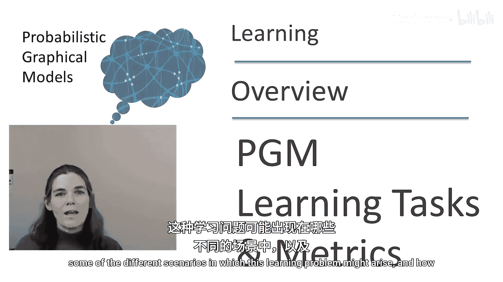
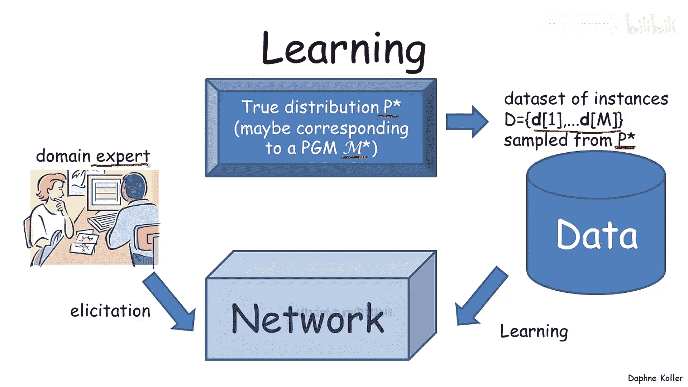
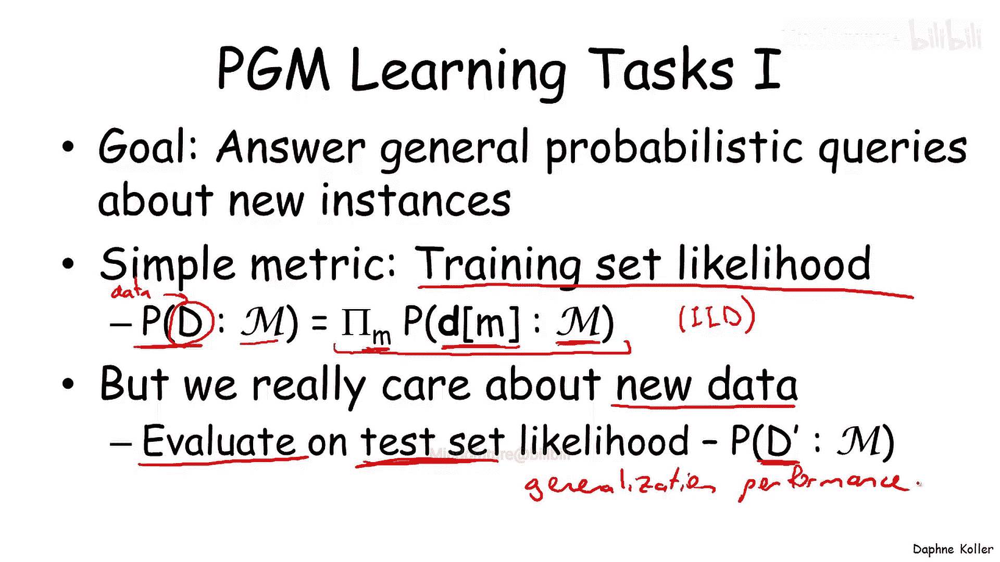
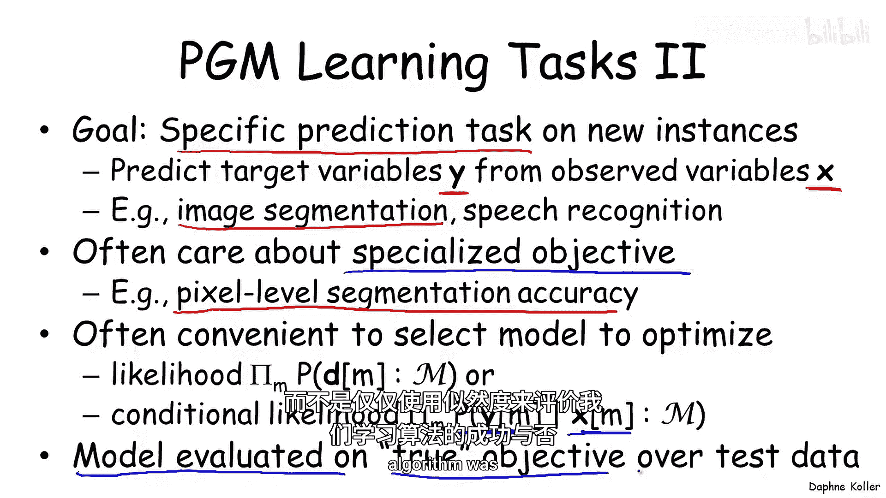
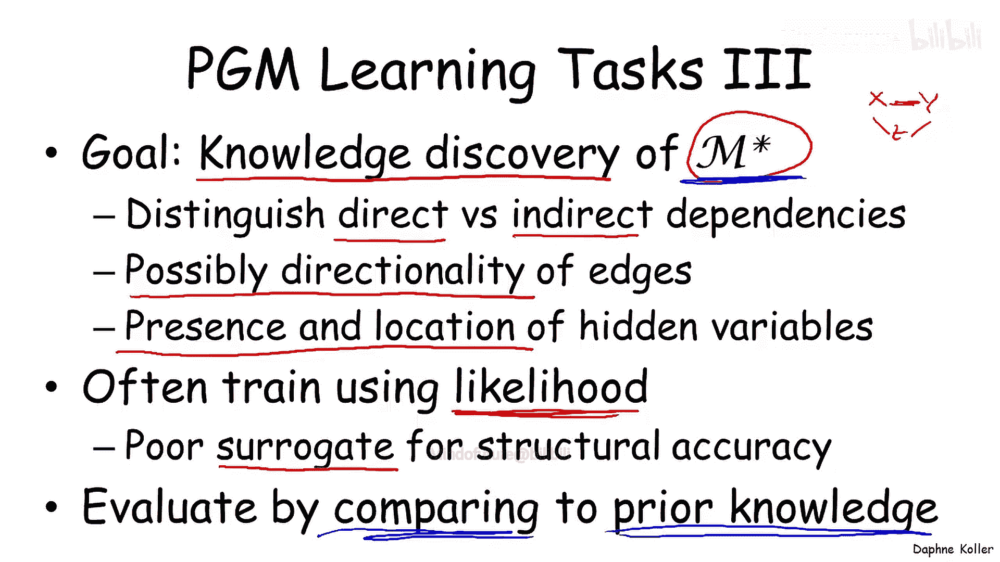
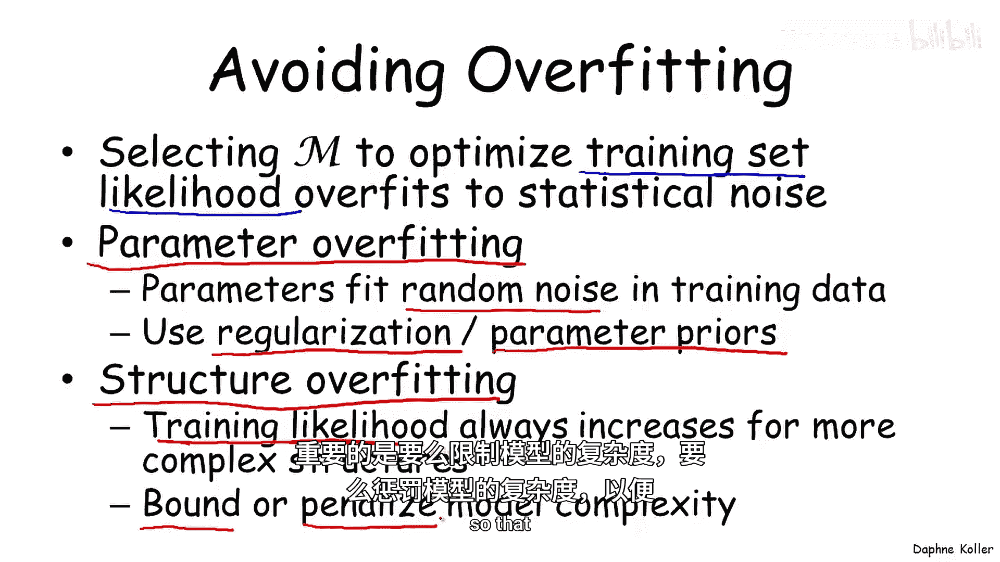
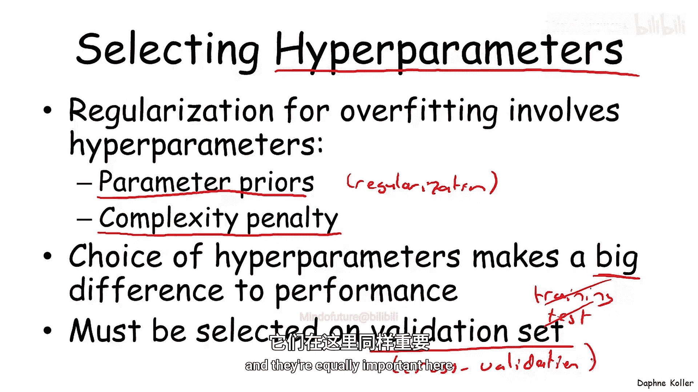
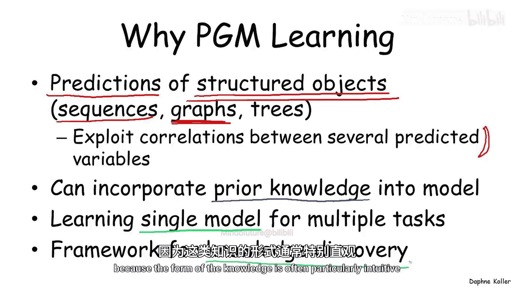

# 概率图模型：3.1：学习概述

在本节课中，我们将学习概率图模型的最后一个重要模块：如何从数据中学习一个概率图模型。在深入具体的学习算法细节之前，我们先探讨一下为何要从数据中学习概率图模型、可能遇到的不同学习场景，以及如何评估学习算法的结果。

## 学习问题的设定

我们假设存在一个真实的分布，通常记为 **P***。在许多情况下（尽管并非总是如此），我们可能假设 **P*** 实际上是由某个概率图模型 **M*** 生成的。这个假设允许我们讨论学习到的模型与生成分布的真实模型 **M*** 之间的差异。

从这个分布 **P*** 中，我们获得一个包含 M 个实例的数据集 **D** = {**D**1, ..., **D**M}。我们假设这些实例是从分布 **P*** 中采样得到的。

除了数据，我们可能还拥有一定程度的领域专业知识，可以将一些先验知识融入模型中。事实上，与许多其他不易融入先验知识的学习算法相比，能够融入先验知识是概率图模型学习的一个优势。

结合专家知识和数据学习，我们最终可以得到一个网络，用于查看或用于不同目的。

## 贝叶斯网络中的学习场景

为了使概念更具体，让我们看看贝叶斯网络中的不同学习场景。马尔可夫网络中的问题看起来非常相似。

以下是几种主要场景：

*   **已知结构，数据完整**：我们假设网络结构是已知且正确的。输入数据干净完整，每个实例中所有变量都有观测值。我们的目标是学习该网络的条件概率分布。
*   **未知结构，数据完整**：我们拥有相同类型的完整数据集，但初始网络没有边。我们需要推断边的连接结构以及条件概率分布。
*   **已知结构，数据不完整**：此时，训练数据中有些变量未被观测到。正如我们将看到的，这会显著地使学习问题复杂化。
*   **未知结构，数据不完整**：这是最具挑战性的场景，我们既不知道结构，数据也不完整。
*   **含隐变量的学习**：我们可能遇到一种情况，我们知道变量 X1、X2 和 Y，但最终学习到的模型除了包含 X1、X2 和 Y，还包含一个额外的隐变量 H。我们可能事先不知道 H 的存在，也没有观测到它的任何值，但我们希望学习一个包含 H 的模型。

## 学习概率图模型的目的

现在，让我们思考学习概率图模型的原因。

**1. 用于概率推理的模型**

最明显的原因是我们需要一个模型，可以像使用手动构建的模型一样，用于回答概率查询。无论是条件概率查询还是关于新实例的最大后验概率查询。

**2. 用于特定预测任务的模型**

一个相关但略有不同的学习任务是，当我们关心一个特定的预测问题时。例如，我们可能特别关心根据一组观测变量 **X** 来预测一组目标变量 **Y**。图像分割（**X** 是像素，**Y** 是类别标签）和语音识别（**X** 是声学信号，**Y** 是音素序列）都是此类例子。

尽管在这种情况下，我们通常关心一个专门的目标（如像素级分割准确率或词准确率），但出于算法和数学上的便利，我们常常选择优化似然或条件似然来训练模型。虽然似然并不总是我们真正关心目标的完美替代品，但它数学上方便处理，因此常被使用。然而，重要的是要在测试数据上根据真实目标评估模型性能，而不仅仅是使用似然作为学习算法成功与否的评估标准。

**3. 用于知识发现**

第三种使用概率图模型学习的场景在性质上相当不同。在这种情况下，我们可能不关心将模型用于任何特定的推理任务，而是关心推断结构本身。也就是说，我们的目标是知识发现或结构发现，试图尽可能接近真实的生成模型 **M***。

使用概率图模型学习进行此任务可以帮助我们区分直接依赖和间接依赖。例如，如果我们看到数据中 X 和 Y 相关，我们想推断这是否对应于它们之间的直接概率交互，还是通过第三个变量 Z 产生的。在某些情况下，学习贝叶斯网络时，我们可能能够推断边的方向性，从而获得关于因果关系的直觉。在其他情况下，学习包含隐变量的模型时，这些隐变量的存在、位置以及其值分配给不同实例的方式，都能为我们提供大量关于领域结构的信息。

在许多情况下（尽管并非总是），我们通过使用基于似然的目标进行训练来解决这个学习问题。我们知道这对于结构准确性来说不是一个特别好的替代品，但从数学和算法的角度来看，它是一个非常方便的优化目标，因此常在实践中使用。然而，重要的是不要使用似然（即使是测试集似然）作为评估模型性能的唯一目标。在许多情况下，评估需要通过与我们已知的关于真实模型 **M*** 的有限先验知识进行比较来完成。

## 评估与过拟合

**训练集似然与过拟合**

我们之前提到，训练集似然倾向于使模型过拟合。这是一个普遍的观察结果：当你选择模型 **M** 以优化训练集似然时，它往往会严重地过拟合统计噪声，即生成训练集时发生的随机波动。

过拟合以几种不同的方式发生：
1.  **参数层面的过拟合**：参数拟合了训练数据中的随机噪声。这可以通过使用正则化或参数先验来避免。
2.  **结构层面的过拟合**：可以证明，如果我们优化训练集似然，复杂的结构总是胜出。也就是说，我们总是倾向于选择模型允许的最复杂结构。因此，如果我们试图拟合结构，重要的是要么限制模型复杂度，要么惩罚模型复杂度，以免学习到毫无理由的、极其复杂的模型。

**超参数选择**

我们讨论的所有这些不同选择（如参数先验、正则化强度、复杂度界限或惩罚）都称为**超参数**。我们需要在实际应用学习算法之前选择这些超参数，而这个选择通常对学习算法的性能有巨大影响。

如何选择超参数？
*   **在训练集上选择**：这是一个糟糕的想法，因为训练集上的最优做法是最大化复杂度，这会使超参数选择变得无效。
*   **在测试集上选择**：这也是一个糟糕的想法，因为这会使我们的性能评估过于乐观，因为我们根据测试集性能优化了这些重要参数。

正确的策略是使用一个**验证集**，这是一个独立于训练集和测试集的数据集。另一种变体是在训练集上使用**交叉验证**，迭代地将训练集分割为训练部分和验证部分，用于选择超参数。这些概念在其他学习算法的背景下也很常见，在这里同样重要。

## 为何选择概率图模型学习

最后，让我们讨论何时应该使用概率图模型学习，而不是通用的机器学习算法。

1.  **预测结构化对象**：概率图模型学习在我们试图预测的不是单个输出变量（如二元结果），而是结构化对象时特别有用。例如，标记整个序列（如语音识别或自然语言处理中的序列标注），或标记整个图（如图像分割中标记所有像素网格）。这允许我们利用多个预测变量之间的相关性，通常能显著提高性能。
2.  **融入先验知识**：概率图模型允许我们以一种许多其他算法难以实现的方式，将先验知识融入模型。
3.  **单一模型，多种用途**：我们可以学习一个单一的概率图模型，用于多种不同的任务和回答不同类型的查询，而传统学习算法通常学习一个特定的 X->Y 映射。
4.  **直观的知识发现**：虽然其他学习算法也可用于知识发现，但在概率图模型的背景下尤其有用，因为其知识形式通常特别直观。

## 总结

在本节课中，我们一起学习了概率图模型学习的基本概述。我们首先定义了学习问题的设定，即从真实分布 **P*** 生成的数据中学习模型。接着，我们探讨了贝叶斯网络中的几种主要学习场景：已知/未知结构、数据完整/不完整以及含隐变量的学习。

然后，我们分析了学习概率图模型的三个主要目的：用于通用概率推理、用于特定预测任务以及用于知识发现。我们强调了评估模型时使用测试集和验证集的重要性，以避免过拟合，并讨论了超参数选择的关键策略。

最后，我们总结了概率图模型学习相较于通用机器学习算法的独特优势，包括处理结构化预测、融入先验知识、单一模型多用途以及提供直观的知识发现形式。这些概念为我们后续深入具体的学习算法奠定了坚实的基础。

