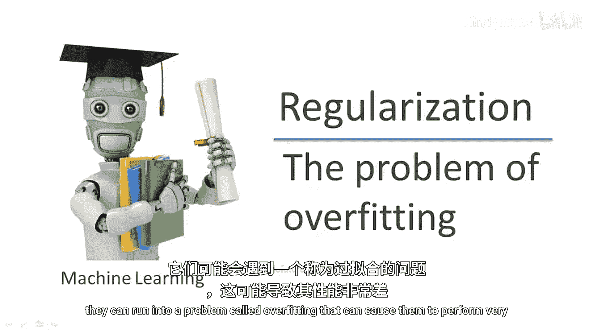
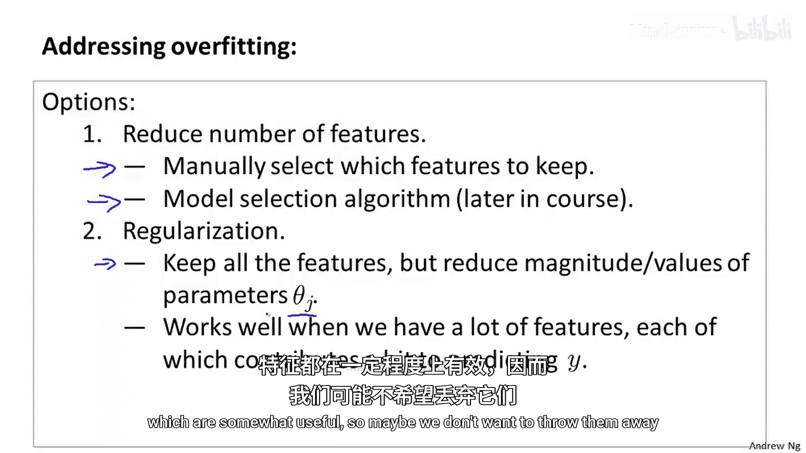
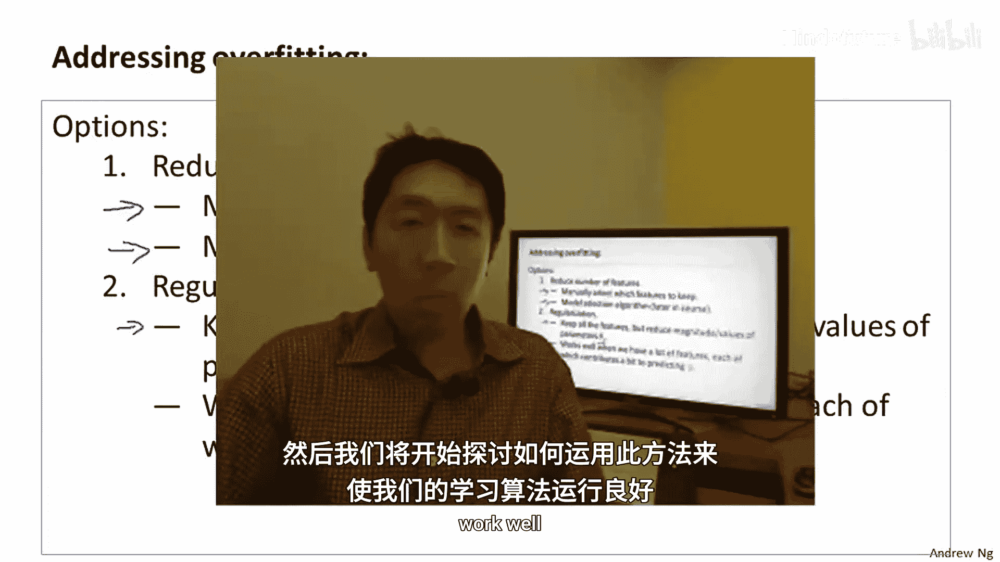

# 002：正则化-过拟合问题

在本节课中，我们将要学习机器学习中的一个核心问题——过拟合。我们将探讨什么是过拟合，它如何影响线性回归和逻辑回归等算法的性能，并初步了解解决过拟合问题的两种主要方法。

## 什么是过拟合？

上一节我们提到了学习算法可能遇到的性能问题。本节中，我们来看看一个具体且常见的问题：过拟合。

让我们继续使用线性回归预测房价的例子，其中我们希望通过房屋大小来预测价格。

我们可以用线性函数来拟合这些数据。如果这样做，可能会得到一条直线。但这并不是一个很好的模型。观察数据可以发现，随着房屋面积增大，房价的增长趋势似乎会逐渐平缓。因此，这个算法对训练数据的拟合并不好。我们称这个问题为**欠拟合**。

另一个描述此问题的术语是，该算法具有**高偏差**。这两个术语大致意味着算法甚至不能很好地拟合训练数据。“偏差”是一个历史或技术术语，其核心思想是：如果算法坚持用直线拟合数据，就好像它有一个非常强烈的先入之见或偏见，认为房价会随面积线性变化。尽管有相反的数据证据，这种偏见仍导致它拟合出一条直线，最终对数据的拟合效果很差。

在中间情况下，我们可以用二次函数来拟合数据。对于这个数据集，拟合二次函数可能会得到一条曲线，效果相当不错。

另一个极端情况是，如果我们用一个四次多项式来拟合数据。这里有5个参数 `θ0` 到 `θ4`。利用这些参数，我们实际上可以拟合出一条穿过所有五个训练样本的曲线。我们可能会得到一条看起来上下波动非常剧烈的曲线。一方面，这似乎对训练集拟合得非常好，因为它穿过了所有数据点。但这仍然是一条非常曲折的曲线，我们并不认为这是预测房价的好模型。

这个问题我们称之为**过拟合**。

另一个描述此问题的术语是，该算法具有**高方差**。“高方差”是另一个历史或技术术语，其直观理解是：如果我们拟合如此高阶的多项式，那么假设函数几乎可以拟合任何函数。可能的假设空间太大、太易变，而我们没有足够的数据来约束它以得到一个好的假设。这就是过拟合。在中间情况下并没有特定的名称，但二次多项式函数似乎恰好适合拟合这些数据。

简单回顾一下，当特征过多时，就会出现过拟合问题。此时，学习到的假设可能对训练集拟合得非常好，以至于成本函数可能非常接近0甚至正好为0。但最终可能会得到一条过度拟合训练集的曲线，以至于无法很好地推广到新样本，即无法很好地预测新房屋的价格。这里的“推广”指的是假设函数对于训练集中未见过的新样本（新数据、新房屋）的应用能力。

以上我们看了线性回归中的过拟合案例。类似的情况也适用于逻辑回归。

这是一个有两个特征 `x1` 和 `x2` 的逻辑回归例子。我们可以用一个简单的假设来拟合逻辑回归，例如 `hθ(x) = g(θ0 + θ1*x1 + θ2*x2)`，其中 `g` 是S型函数。如果这样做，最终会得到一个试图用直线分隔正负样本的假设。这看起来并不是一个很好的拟合。因此，这又是一个欠拟合或假设具有高偏差的例子。

相反，如果在特征中加入二次项，那么可能会得到一个看起来更像这样的决策边界。这是一个对数据相当好的拟合，可能是在这个训练集上能得到的最好结果之一。

最后，在另一个极端，如果拟合一个非常高阶的多项式，生成许多高阶多项式项和特征，那么逻辑回归可能会扭曲自身，非常努力地寻找一个决策边界，以极尽所能地拟合每一个训练样本。如果特征 `x1` 和 `x2` 用于预测肿瘤是恶性还是良性，这看起来并不是一个用于预测的好假设。因此，这又是一个过拟合、假设具有高方差且不太可能很好推广到新样本的例子。

在后续课程中，当我们讨论调试和诊断学习算法可能出错的地方时，会提供具体的工具来识别何时发生过拟合以及何时发生欠拟合。

但现在，让我们讨论一下，如果认为发生过拟合，我们可以采取什么措施来解决它？

## 如何解决过拟合问题？

在之前的例子中，我们有一维或二维数据，因此可以直接绘制假设函数图，观察发生了什么，并选择合适次数的多项式。例如，在房价预测的例子中，我们可以绘制假设函数图，看到它拟合了一条非常曲折、到处波动的曲线，然后可以用这样的图表来选择合适次数的多项式。

因此，绘制假设函数图可能是决定使用多少次多项式的一种方法，但这并不总是有效。事实上，更多时候我们可能面临的学习问题是拥有大量特征，而不仅仅是选择多项式次数的问题。当我们有如此多的特征时，绘制数据和可视化以决定保留或舍弃哪些特征也变得困难得多。

具体来说，如果我们试图预测房价，有时我们可能拥有大量不同的特征。所有这些特征似乎可能都有用。但是，如果我们有很多特征而训练数据很少，那么过拟合就可能成为一个问题。

为了解决过拟合，我们主要有两个选择。

以下是第一种选择：

*   **减少特征数量**：我们可以手动检查特征列表，尝试决定哪些是更重要的特征，从而决定应该保留哪些特征，舍弃哪些特征。在本课程后面，我们还将讨论模型选择算法，这些算法可以自动决定保留和舍弃哪些特征。减少特征数量的想法可以很好地工作并减少过拟合，当我们讨论模型选择时，会更深入地探讨这一点。但缺点是，舍弃一些特征的同时，也舍弃了关于问题的一些信息。例如，也许所有这些特征实际上对预测房价都有用，所以我们可能并不想丢弃我们的信息或特征。

上一节我们介绍了通过减少特征数量来对抗过拟合。本节中，我们来看看第二种选择：正则化。

以下是第二种选择：

*   **正则化**：在这种方法中，我们将保留所有特征，但会减小参数 `θj` 的大小或数值。当我们有很多特征，且每个特征都对预测 `y` 值有一点贡献时（就像我们在房价预测例子中看到的那样，我们可能有很多特征，每个特征都有点用），这种方法效果很好。因此，也许我们不想丢弃它们。

这从很高的层面描述了正则化的思想。我意识到所有这些细节可能对你来说还不完全清楚，但在下一个视频中，我们将开始精确地阐述如何应用正则化以及正则化的确切含义，然后我们将开始弄清楚如何使用它来使学习算法运行良好并避免过拟合。

## 总结

本节课中，我们一起学习了机器学习中的过拟合问题。我们了解到，当模型过于复杂（例如使用高阶多项式）时，可能会过度拟合训练数据中的噪声和细节，导致在新数据上表现不佳，即泛化能力差。相反，过于简单的模型则会导致欠拟合。为了解决过拟合，我们初步探讨了两种主要策略：一是减少特征数量以简化模型，二是通过正则化技术来约束模型参数的大小，从而在保留所有特征的同时控制模型复杂度。在接下来的课程中，我们将深入探讨正则化的具体实现。