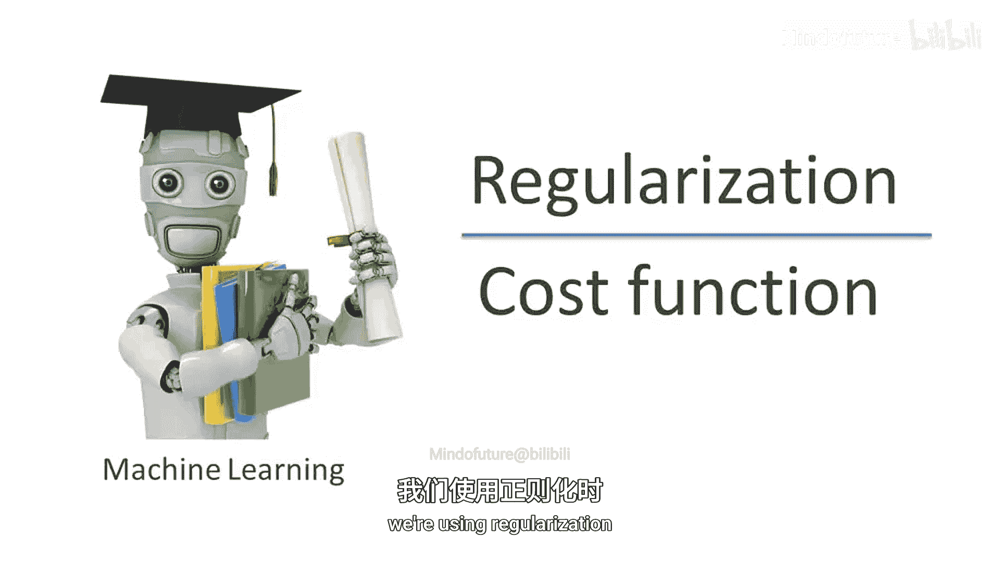
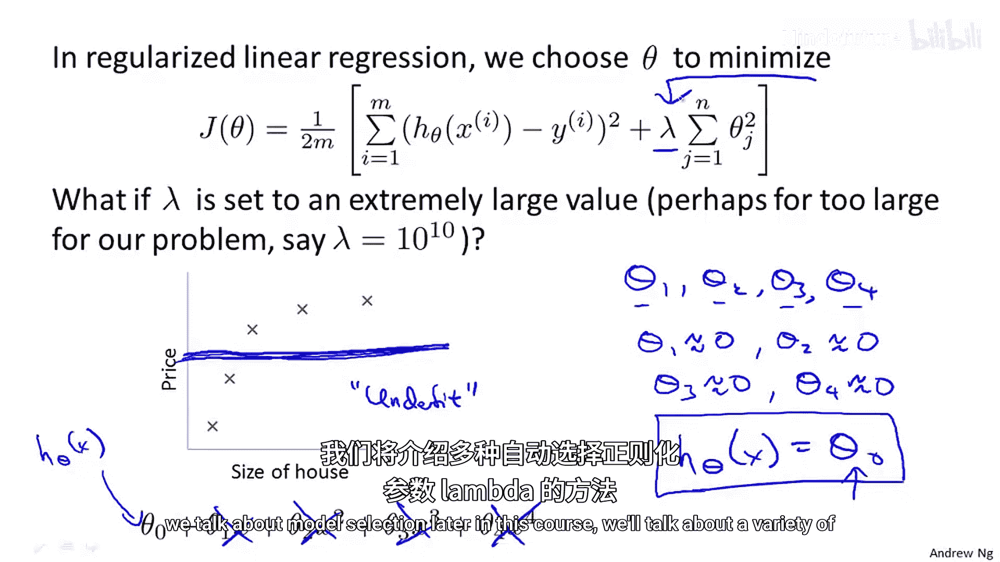
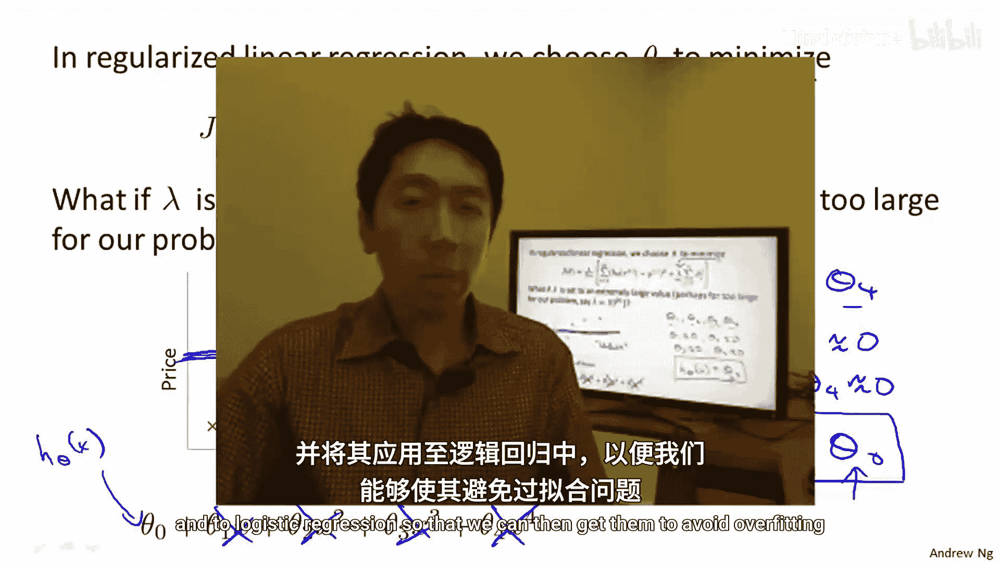

# 003：正则化代价函数



在本节课中，我们将学习正则化的核心概念与工作原理。正则化是一种用于防止机器学习模型过拟合的技术，它通过修改代价函数来约束模型参数的大小，从而获得更简单、泛化能力更强的模型。


---

## 正则化的直观理解 🧠

上一节我们介绍了过拟合问题，即模型在训练集上表现很好，但在新数据上表现不佳。本节中我们来看看正则化如何帮助我们解决这个问题。

通过幻灯片上的手绘示例，我们可以部分理解正则化的直觉。但更好的方式是亲自实现它，并在编程练习中观察其效果。

假设我们用一个二次函数拟合数据，效果很好。但如果使用一个高阶多项式，可能会得到一条非常曲折的曲线，它在训练集上拟合得很好，但实际上是过拟合，泛化能力差。

考虑以下情况：假设我们惩罚参数 `θ₃` 和 `θ₄`，使它们变得非常小。具体来说，我们在原有的平方误差代价函数基础上，添加两项惩罚项：`+ 1000 * θ₃² + 1000 * θ₄²`。

为了使这个新的代价函数最小化，`θ₃` 和 `θ₄` 必须非常小，否则惩罚项会很大。因此，在最小化过程中，`θ₃` 和 `θ₄` 会趋近于0。这相当于去掉了模型中的这两个高阶项。结果，我们基本上得到了一个二次函数，它对数据的拟合更好，也更简单。

在这个例子中，我们惩罚了两个较大的参数值。更一般地，正则化的核心思想是：**参数值较小通常对应于更简单的假设**。更简单的假设通常更平滑，因此也更不容易过拟合。

虽然“小参数对应简单假设”的推理可能目前还不完全清晰，但通过 `θ₃` 和 `θ₄` 的例子，希望能给你一些直观感受。

---

## 正则化的通用方法 🔧

在房价预测的例子中，我们可能有100个特征（如面积、卧室数量、楼层数等）。与多项式例子不同，我们无法预先知道哪些特征（对应哪些参数）是不重要的。

因此，在正则化中，我们不会只挑选个别参数进行惩罚，而是修改代价函数，使其惩罚**所有**参数（通常不包括 `θ₀`）。

以下是修改后的线性回归正则化代价函数：

```math
J(θ) = \frac{1}{2m} \left[ \sum_{i=1}^{m} (h_θ(x^{(i)}) - y^{(i)})^2 + \lambda \sum_{j=1}^{n} θ_j^2 \right]
```

其中：
*   第一项是原来的均方误差代价。
*   第二项是**正则化项**，它惩罚所有参数 `θ₁` 到 `θₙ` 的平方和。
*   `λ` 称为**正则化参数**。

`λ` 控制着两个目标之间的权衡：
1.  **拟合训练数据**：由第一项体现，我们希望模型能很好地拟合训练集。
2.  **保持参数较小**：由第二项体现，我们希望得到一个更简单的模型，避免过拟合。

对于房价预测，即使我们使用了所有高阶多项式特征，只要在目标函数中加入了正则化项，我们最终可能得到一条像洋红色曲线那样更平滑、更简单的函数，它对数据的假设更好。

---

## 正则化参数 λ 的影响 ⚖️

在正则化线性回归中，正则化参数 `λ` 的选择至关重要。

*   **如果 `λ` 设置得非常大**：参数 `θ₁` 到 `θₙ` 会受到极大的惩罚，导致它们都趋近于0。这相当于模型变成了 `h_θ(x) = θ₀`，即一条水平的直线。这种模型无法拟合数据，称为**欠拟合**或**高偏差**。它对于数据有太强（且错误）的先入之见。
*   **如果 `λ` 设置得当**：可以在很好地拟合数据和保持模型简单之间取得平衡，从而获得良好的泛化性能。
*   **如果 `λ = 0`**：则正则化项消失，模型变回原来的普通最小二乘回归，可能出现过拟合。

因此，为了使正则化效果良好，需要谨慎选择 `λ` 的值。在本课程后续关于模型选择的部分，我们将讨论自动选择正则化参数 `λ` 的各种方法。

---

## 总结 📝



本节课中我们一起学习了正则化的核心思想。正则化通过向代价函数中添加一个惩罚项（通常是参数平方和）来约束模型参数的大小，从而倾向于选择更简单的模型，以对抗过拟合。正则化参数 `λ` 控制着模型复杂度和拟合程度之间的权衡。选择适当的 `λ` 是获得一个泛化性能良好模型的关键。



在接下来的课程中，我们将把这些思想具体应用到线性回归和逻辑回归中，使它们能够避免过拟合问题。