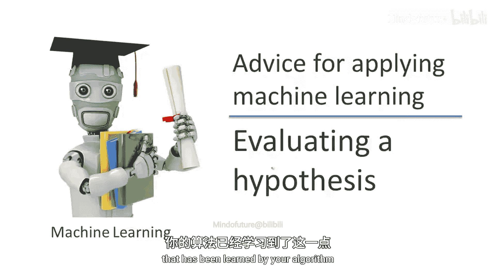
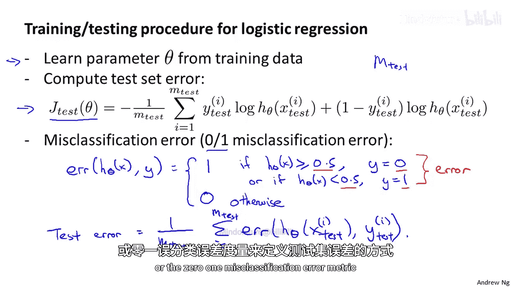
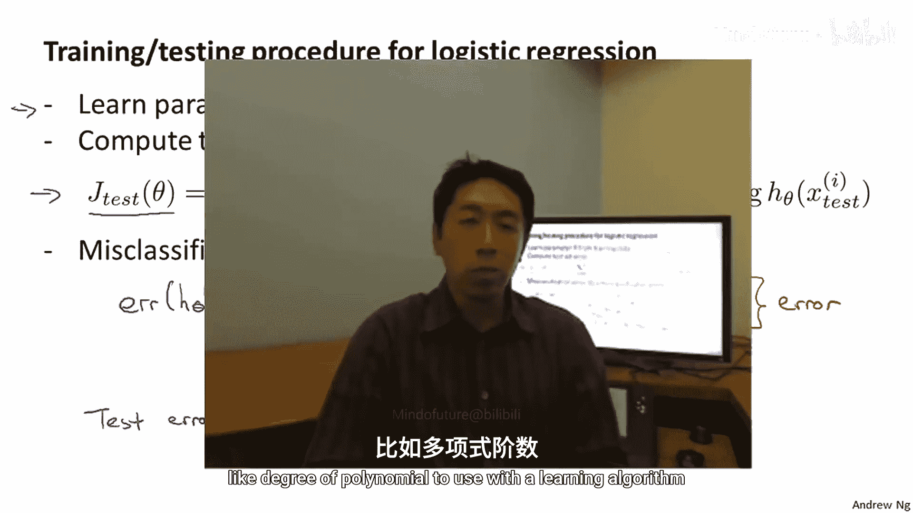

# 概率图形模型3：学习：P04：评估假设

在本节课中，我们将学习如何评估一个由算法学习得到的假设。理解如何正确评估模型是机器学习中的关键一步，它直接关系到我们能否判断模型的好坏以及后续的改进方向。在后续课程中，我们将以此为基础，探讨如何防止过拟合与欠拟合的问题。

## 训练误差的局限性

当我们拟合学习算法的参数时，通常会选择那些能最小化训练误差的参数。你可能会认为获得一个非常低的训练误差值是一件好事。

然而，我们已经知道，仅仅因为一个假设具有较低的训练误差，并不意味着它必然是一个好的假设。我们已经见过假设如何出现过拟合的例子，从而导致模型无法泛化到训练集之外的新样本。

## 评估假设的挑战

在这个简单的例子中，我们可以绘制假设函数 `H(x)` 的图像来观察发生了什么。但在一般情况下，对于特征数量多于一个的问题，或者像这样具有大量特征的问题，绘制假设函数的样子变得困难甚至不可能。

因此，我们需要其他方法来评估一个假设。

## 标准评估方法：训练集与测试集

评估学习到的假设的标准方法如下。假设我们有一个数据集，这里我展示了10个训练样本，但通常我们可能有几十、几百甚至几千个训练样本。

为了确保能够评估我们的假设，我们要做的是将拥有的数据分成两部分：第一部分将作为我们通常的训练集，第二部分将作为我们的测试集。

一个典型的数据分割比例是大约 **70%** 的数据用于训练集，**30%** 的数据用于测试集，训练集占比更大。

如果我们有一个数据集，我们可能只将大约70%的数据分配给我们的训练集（这里 `M` 照常表示训练样本的数量），剩余的数据则被分配为我们的测试集。这里我将使用符号 `M_test` 来表示测试样本的数量。

一般来说，下标 `test` 表示来自我的测试集的样本。因此，`(x1_test, y1_test)` 是我的第一个测试样本。

最后一个细节：虽然这里我画得好像前70%去了训练集，后30%去了测试集，但如果数据有任何排序，实际上最好将数据的随机70%发送到训练集，随机30%发送到测试集。所以，如果你的数据已经是随机排序的，你可以直接取前70%和后30%。但如果你的数据没有随机排序，最好在将前70%作为训练集、后30%作为测试集之前，先随机打乱或重新排序训练集中的样本。

## 训练与测试流程

以下是一个相当典型的训练和测试学习算法（例如线性回归）的流程：

1.  **从训练集学习参数**：首先，你从训练集学习参数 `θ`，即最小化通常的训练误差目标函数 `J(θ)`。这里的 `J(θ)` 仅使用你所有数据中的那70%（即训练数据）来定义。
2.  **计算测试误差**：然后，你计算测试误差，我将其表示为 `J_test`。具体做法是，取你从训练集学习到的参数 `θ`，代入以下公式计算测试集误差：

    `J_test(θ) = (1/(2 * M_test)) * Σ (h_θ(x_test^(i)) - y_test^(i))^2`

    这基本上是在你的测试集上测量的**平均平方误差**。这和你预期的差不多：用参数为 `θ` 的假设运行每一个测试样本，然后测量你的假设在 `M_test` 个测试样本上的平方误差。

当然，这是使用线性回归和平方误差度量时的测试集误差定义。

## 分类问题的评估

如果我们处理的是分类问题，比如使用逻辑回归呢？在这种情况下，训练和测试逻辑回归的过程非常相似。

首先，我们从训练数据（即前70%的数据）中学习参数 `θ`。然后，我们如下计算测试误差：

`J_test(θ) = (-1/M_test) * Σ [ y_test^(i) * log(h_θ(x_test^(i))) + (1 - y_test^(i)) * log(1 - h_θ(x_test^(i))) ]`

这与我们一直用于逻辑回归的目标函数相同，只是现在它是用我们的 `M_test` 个测试样本来定义的。

虽然 `J_test` 的这个定义是完全合理的，但有时存在另一种更容易解释的测试集度量标准，即**误分类误差**，也称为 **0/1 误分类误差**（0/1表示你要么正确分类一个样本，要么错误分类）。

让我来定义一下。我将预测 `h_θ(x)` 在给定标签 `y` 时的误差定义如下：

`error(h_θ(x), y) = 1， 如果 (h_θ(x) ≥ 0.5 且 y=0) 或 (h_θ(x) < 0.5 且 y=1)`

`error(h_θ(x), y) = 0， 其他情况（即分类正确）`

这两种情况基本上对应于你的假设在阈值为0.5时错误标记了样本：要么假设认为它更可能是1，但实际是0；要么假设认为它更可能是0，但实际标签是1。

然后，我们可以使用误分类误差度量来定义测试误差：

`J_test(θ) = (1/M_test) * Σ error(h_θ(x_test^(i)), y_test^(i))`

这只是我写出的一种方式，表示这**正是我的假设在我的测试集中错误标记的样本比例**。这就是使用0/1误分类误差度量时的测试集误差定义。

## 总结

本节课中，我们一起学习了评估学习算法所得假设的标准方法。核心在于将数据集分割为**训练集**和**测试集**，通常按 **70/30** 的比例。我们首先在训练集上学习模型参数，然后在未见过的测试集上计算误差来评估模型的泛化能力。对于回归问题，常用**均方误差**；对于分类问题，除了类似逻辑回归的损失函数，更直观的评估指标是**误分类误差率**，它直接反映了模型分类错误的样本比例。

正确评估假设是模型选择和改进的基石。在下一节中，我们将运用这些思想来帮助我们做诸如为学习算法选择多项式次数等特征，或选择学习算法的正则化参数等决策。