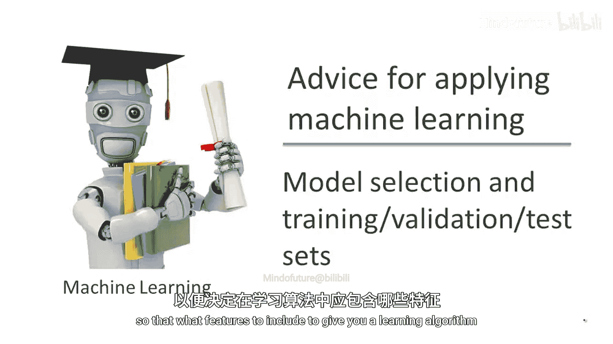
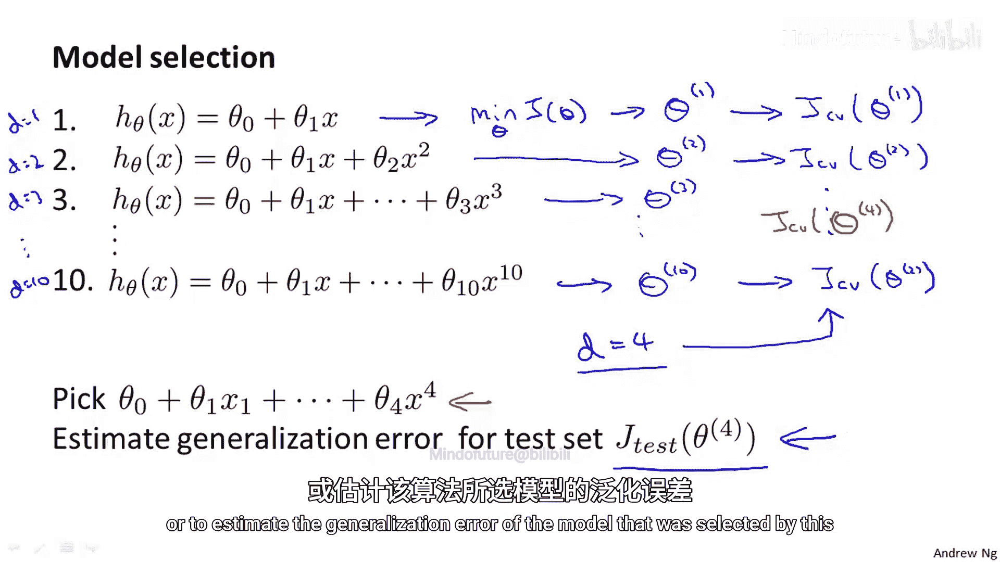
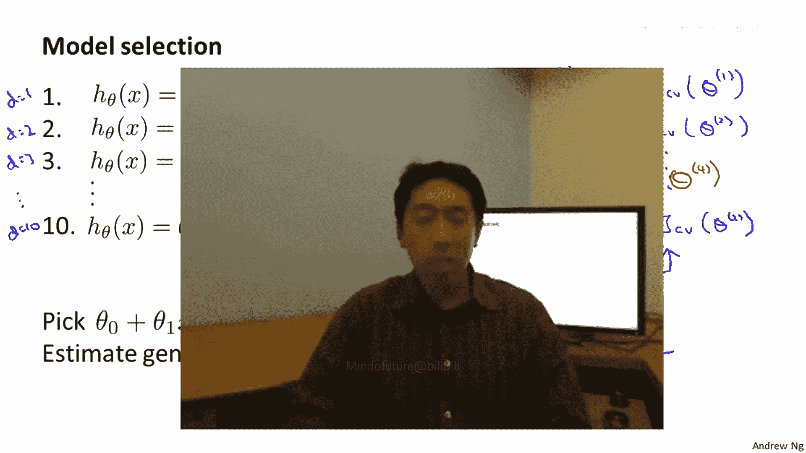

# 概率图形模型3：学习：P05：模型选择与训练-验证-测试集

在本节课中，我们将要学习如何解决模型选择问题，例如选择多项式的阶数或正则化参数。我们将介绍如何将数据集划分为训练集、验证集和测试集，并利用验证集进行模型选择，从而获得对模型泛化能力的可靠估计。

## 过拟合与泛化误差

上一节我们介绍了过拟合的概念。一个模型在训练集上表现良好，并不意味着它是一个好的假设。更普遍的原则是，一旦参数在某个数据集（例如训练集）上拟合，那么在该数据集上测量的假设误差（例如训练误差）不太可能是实际泛化误差的良好估计。泛化误差衡量的是假设在未见过的数据上的表现。

## 模型选择问题

现在，让我们考虑模型选择问题。假设你想决定用几阶多项式来拟合数据，或者选择学习算法的正则化参数λ。这被称为模型选择问题。在我们的讨论中，我们将不仅介绍如何将数据拆分为训练集和测试集，还会介绍如何拆分为训练集、验证集和测试集。

## 数据集划分方法

为了解决模型选择中的偏差问题，我们通常将数据集划分为三个部分，而不是两个。

以下是三个部分及其典型划分比例：

*   **训练集**：用于拟合模型参数。通常占总数据的60%。
*   **验证集**：用于模型选择和调整超参数。通常占总数据的20%。
*   **测试集**：用于最终评估所选模型的泛化性能。通常占总数据的20%。

我们用 `m_train`、`m_cv`、`m_test` 分别表示各集合的样本数量。验证集样本记为 `(x_cv^(i), y_cv^(i))`。

相应地，我们可以定义三种误差：

*   **训练误差**：`J_train(θ)`，在训练集上计算。
*   **验证误差**：`J_cv(θ)`，在验证集上计算。
*   **测试误差**：`J_test(θ)`，在测试集上计算。

## 使用验证集进行模型选择

上一节我们介绍了数据集划分，本节中我们来看看如何具体使用验证集进行模型选择。

假设我们需要在10个不同阶数的多项式模型（从1阶到10阶）中选择一个。参数 `d` 代表多项式的阶数。

以下是使用验证集进行模型选择的步骤：

1.  对于每个候选模型（`d = 1, 2, ..., 10`），使用训练集最小化代价函数，得到对应的参数向量 `θ^(1), θ^(2), ..., θ^(10)`。
2.  使用验证集计算每个假设的验证误差：`J_cv(θ^(1)), J_cv(θ^(2)), ..., J_cv(θ^(10))`。
3.  选择验证误差最小的模型。例如，假设4阶多项式（`d=4`）的验证误差最低，则我们选择该模型。
4.  最后，使用**测试集**来评估所选模型（`d=4`，参数为 `θ^(4)`）的泛化误差，即计算 `J_test(θ^(4))`。

通过这个方法，我们使用验证集来拟合超参数 `d`，而测试集则被完整地保留下来，用于提供对最终模型泛化性能的无偏估计。

## 关于实践的建议

需要指出的是，在当前的机器学习实践中，有些人会直接使用测试集进行模型选择，然后用同一个测试集报告误差。这种做法不是好的实践。虽然如果你有一个非常庞大的测试集，这可能不是一个特别糟糕的做法，但大多数机器学习从业者建议不要这样做。更好的做法是拥有独立的训练集、验证集和测试集。尽管有时你会看到有人只使用训练集和测试集，但如果可能，我建议你不要这样做。

## 总结

本节课中我们一起学习了模型选择的核心方法。我们了解到，直接使用测试集进行模型选择会导致对泛化误差的乐观估计。为了解决这个问题，我们将数据集划分为训练集、验证集和测试集。我们使用训练集来拟合模型参数，使用验证集来选择最佳模型（或调整超参数），最后使用测试集来获得对最终模型泛化能力的可靠、无偏的评估。这是确保机器学习模型评估结果可信的关键步骤。