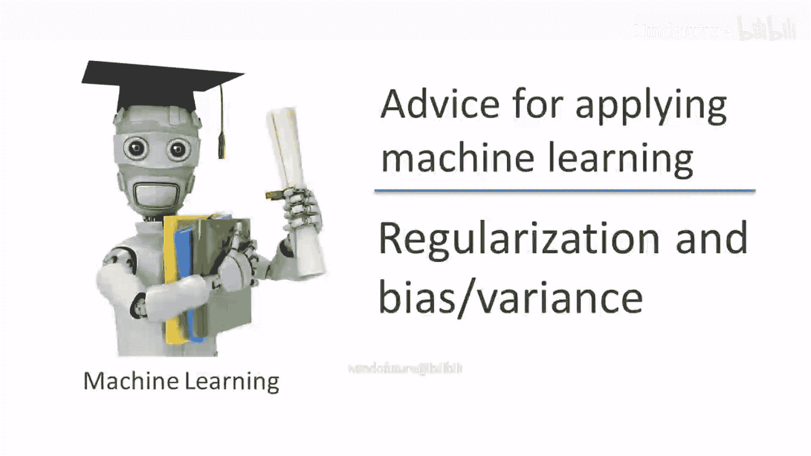
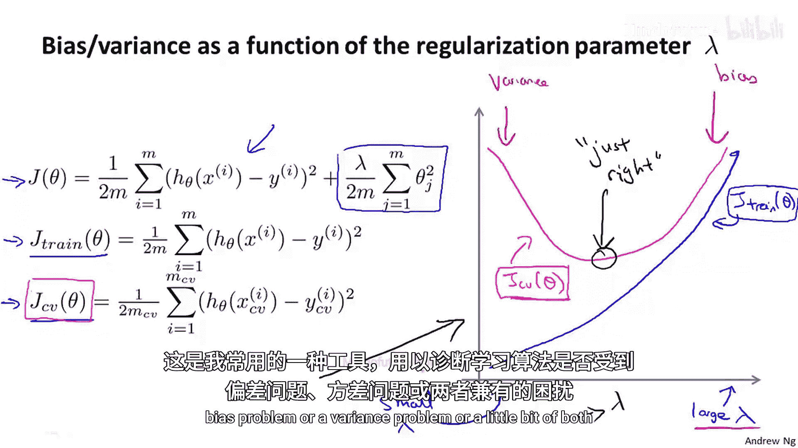

# 007：正则化与偏差方差

在本节课中，我们将深入探讨正则化如何影响学习算法的偏差与方差。我们将学习如何自动选择最佳的正则化参数 λ，并理解训练误差与交叉验证误差随 λ 变化的关系。

## 正则化对偏差与方差的影响

上一节我们介绍了正则化可以防止过拟合。本节中，我们来看看正则化如何影响学习算法的偏差和方差。

假设我们正在拟合一个高阶多项式，如上图所示。为了防止过拟合，我们使用如下所示的正则化项，即添加一个惩罚项来保持参数值较小。通常，正则化项从 j=1 求和到 n，而不是从 j=0 开始。

让我们考虑三种情况。

以下是三种不同的正则化参数 λ 取值情况：

1.  **λ 值非常大**（例如 λ = 10,000）：在这种情况下，所有参数 θ1, θ2, θ3 等都将受到严重惩罚，最终大多数参数值会接近于零。假设函数 h(x) 将大致等于 θ0，结果是一条近似平坦的直线。这种假设具有**高偏差**，会严重**欠拟合**数据集。
2.  **λ 值非常小**（例如 λ = 0）：在这种情况下，由于我们拟合的是高阶多项式，且几乎没有正则化，我们最终会陷入**高方差**的**过拟合**状态。
3.  **λ 值适中**：只有当 λ 取值既不太大也不太小，我们才能得到能合理拟合数据的参数 θ。

## 自动选择正则化参数 λ

那么，我们如何自动为正则化参数 λ 选择一个好的值呢？重申一下，这是我们的模型和学习算法的目标函数（使用正则化时）。

让我定义 J_train(θ) 为**不包含**正则化项的优化目标。之前在不使用正则化时，我将 J_train(θ) 定义为与成本函数 J(θ) 相同。但在使用正则化时，我们将 J_train（训练集误差）定义为训练集上的平方误差和（或平均平方误差），**不考虑**正则化项。类似地，交叉验证集误差 J_CV 和测试集误差 J_test 也按此定义，即它们在各自数据集上的平均平方误差（不含正则化项）。

**公式**：
`J_train(θ) = (1/(2m)) * Σ (h_θ(x^(i)) - y^(i))^2` （对训练集求和）

以下是自动选择 λ 的步骤：

1.  设定一个 λ 值的尝试范围。例如，可以尝试 λ = 0, 0.01, 0.02, 0.04, 0.08, ... , 10.24。通常按 2 的倍数递增，这大约会得到 12 个不同的 λ 值。
2.  对于这 12 个 λ 值中的每一个，分别最小化成本函数 J(θ)，得到对应的参数向量 θ。我们将其记为 θ¹, θ², ..., θ¹²。
3.  使用交叉验证集评估所有这些假设（即这些不同的 θ）。计算每个参数向量在交叉验证集上的平均平方误差。
4.  选择在交叉验证集上误差最小的那个模型对应的 λ 值。假设我们选择了 θ⁵。
5.  最后，为了报告模型在未知数据上的表现，我们使用独立的测试集来评估选定的参数 θ⁵，得到测试集误差。

## 训练误差与交叉验证误差随 λ 的变化

为了更好地理解训练误差和交叉验证误差如何随正则化参数 λ 变化，我们来绘制 J_train 和 J_CV 的曲线图。

*   当 **λ 很小**时，我们使用的正则化很少，过拟合的风险较高（高方差区域）。此时，模型可以相对较好地拟合训练集，所以 **J_train 会很小**。但由于过拟合，模型在交叉验证集上表现不佳，所以 **J_CV 会很大**。
*   当 **λ 很大**时，我们面临高偏差问题，可能连训练集都拟合不好（欠拟合）。因此，**J_train 会很大**。同时，由于欠拟合，模型在交叉验证集上表现也很差，所以 **J_CV 也很大**。

因此，J_train(θ) 倾向于随着 λ 的增加而增加，因为大的 λ 对应高偏差，可能无法很好地拟合训练集。而小的 λ 对应可以自由地用高阶多项式拟合数据。

交叉验证误差 J_CV(θ) 的曲线通常呈 U 形：
*   在右侧（λ 大），处于偏差主导区域，交叉验证误差高。
*   在左侧（λ 小），处于方差主导区域（过拟合），交叉验证误差也高。
*   在中间某个适中的 λ 值处，交叉验证误差达到最小，这个 λ 值通常效果最好。

在实际数据集上，得到的曲线可能比这里展示的理想化曲线更杂乱、更有噪声，但通常能观察到这种大致的趋势。通过观察交叉验证误差的曲线图，我们可以手动或自动地选择使交叉验证误差最小的 λ 值。绘制这样的图表有助于我更好地理解情况，并验证是否为正则化参数 λ 选择了一个好的值。

## 总结

本节课中，我们一起学习了正则化对学习算法偏差和方差的影响。我们了解到：
*   过大的 λ 会导致高偏差（欠拟合）。
*   过小的 λ 会导致高方差（过拟合）。
*   适中的 λ 才能取得良好的平衡。

我们还掌握了通过在一系列 λ 值上训练模型，并使用交叉验证集选择最佳 λ 的自动选择方法。最后，我们分析了训练误差和交叉验证误差随 λ 变化的典型曲线，这有助于诊断和选择最佳的正则化强度。

在接下来的视频中，我们将基于所有这些关于偏差和方差的见解，构建一个称为“学习曲线”的诊断工具，用于判断学习算法是存在偏差问题、方差问题，还是两者兼有。