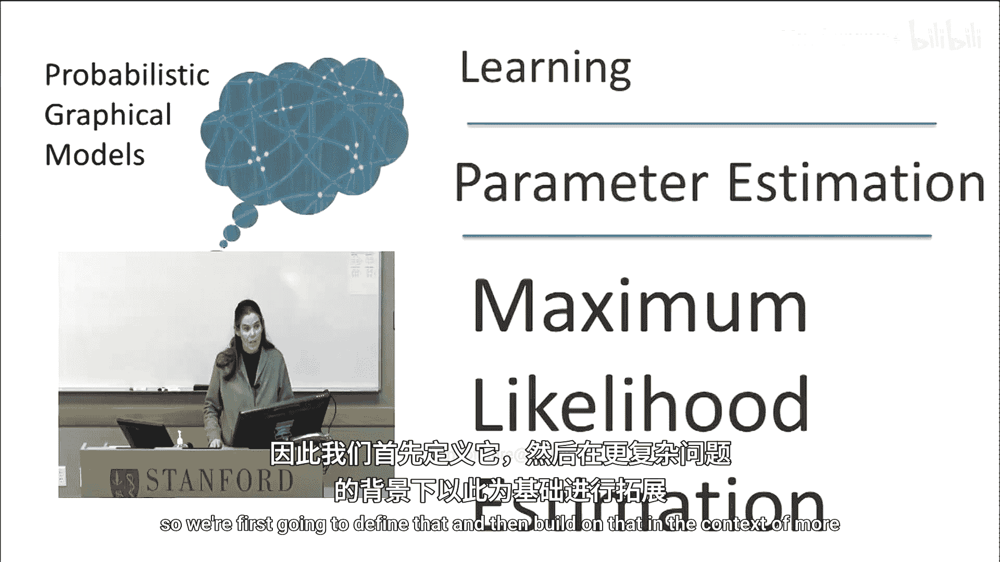
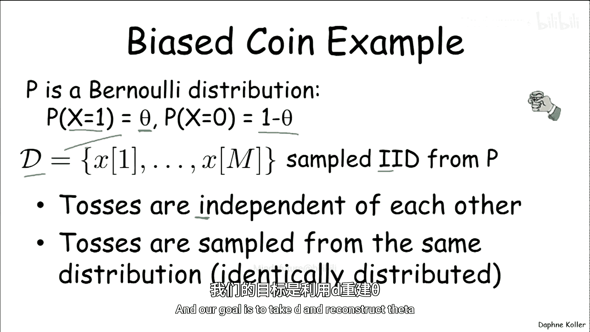
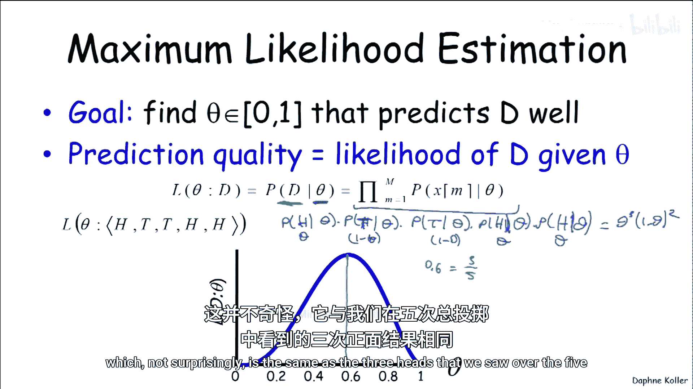
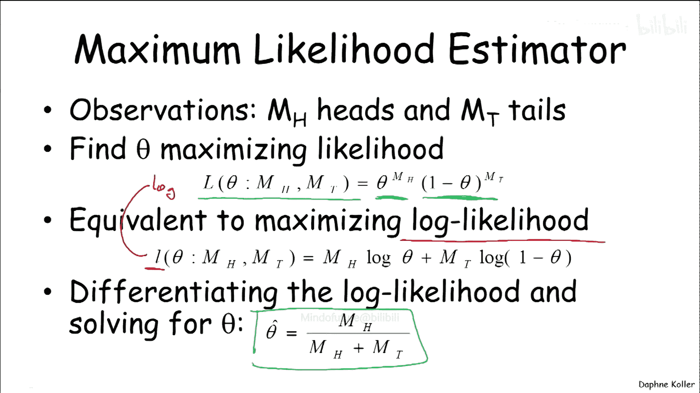
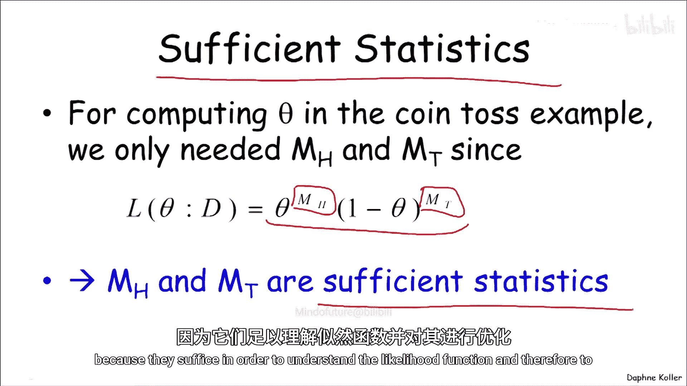
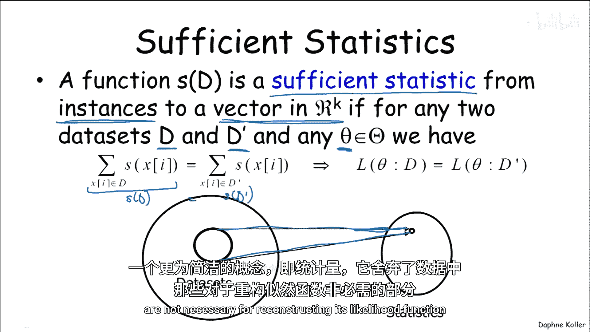
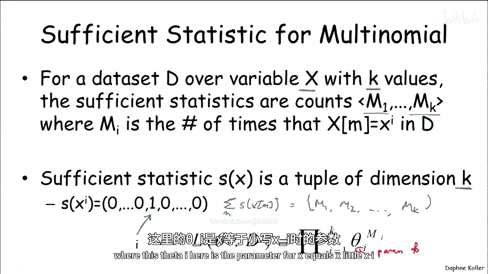
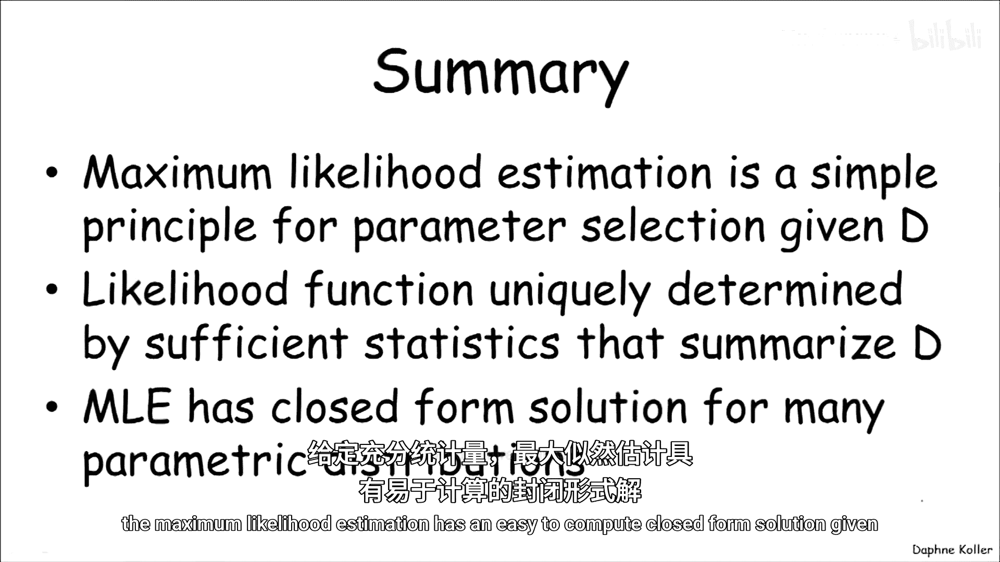

# 008：最大似然估计基础 🎯

在本节中，我们将学习参数估计中最核心的构件——最大似然估计。我们将从一个最简单的学习问题开始，即估计一组参数，并在此基础上构建更复杂问题的解决方案。

## 从最简单的学习问题开始

我们从一个最简单的学习问题开始讨论，即估计一组参数。参数估计的关键构件被称为最大似然估计。我们首先将定义它，然后在更复杂问题的背景下进行构建。

让我们回到最简单的学习问题：我们从一个有偏的硬币生成数据，这是一个伯努利分布。变量X取值为1的概率由某个参数θ定义，因此取值为0的概率是1-θ。

假设我们获得了一个数据集D，它包含许多实例x₁到x_M，这些实例是从分布P中独立同分布采样得到的。

让我们回顾一下独立同分布的含义。第一个“独立”意味着每次抛掷彼此独立。“同分布”意味着它们都从同一个分布P中采样。我们的目标是利用这些数据来重建参数θ。

## 将问题建模为概率图模型

让我们将其视为一个概率图模型。事实上，这是我们之前在讨论盘模型时见过的概率图模型。

这里我们有一个参数θ，以及同一实验的一堆重复样本，即这些x变量。它们从θ独立采样。如果我们将其视为一个图模型，我们可以看到每个X都依赖于θ，并且在已知θ的条件下，它们彼此条件独立。因此，给定θ，它们是独立同分布的。

如果将其视为图模型，它需要有条件概率分布。对于第m次抛掷，给定θ的条件概率分布是：X取值为x₁的概率是θ，取值为x₀的概率是1-θ。这是一个完全合法的条件概率分布，其父节点是θ。θ是X变量的父节点，它是一个连续变量，但我们之前处理过这类变量。

## 定义最大似然估计的目标

既然我们已经将其指定为概率图模型，现在可以回过头来思考最大似然估计如何工作。

目标是找到一个参数θ（在区间[0,1]内），它能很好地预测数据集D。特定参数θ的质量取决于它预测D的好坏程度，也可以视为给定特定θ值时数据的似然性。

让我们尝试理解这意味着什么。我们可以问：给定一个特定的θ值，我们观测到的数据集D的概率是多少？

由于在给定θ的条件下，抛掷或实例X_i是条件独立的，我们可以将其写为所有M个实例的概率乘积。

现在，让我们在一个具体示例的背景下思考这个问题。假设我们抛掷这枚硬币五次，得到三次正面和两次反面（或三个1和两个0）。

如果我们实际写下这个概率函数的样子，我们可以看到它将是：给定θ得到正面的概率，乘以给定θ得到反面的概率，再乘以得到正面的概率，再乘以另一个正面的概率。第一个正面给定θ的概率是θ，反面的概率是1-θ，然后是1-θ，θ，θ。最终结果是θ³(1-θ)²。

这正是此处绘制的函数。现在，如果我们寻找能最好预测数据的θ，我们只需将其定义为最大化此函数的θ。从最大值向下画一条线，我们可以看到该函数在θ=0.6处达到最大，这并不奇怪，它等于我们观测到的五次抛掷中三次正面的比例。

## 推广到一般情况

让我们将其推广。假设在这个背景下我们观测到M_H次正面和M_T次反面，我们想要找到使似然函数最大化的θ。正如在简单示例中一样，这个似然函数将包含θ出现M_H次和(1-θ)出现M_T次。这将给我们一个似然函数，其形式与上一行看到的类似。

如果我们思考如何最大化这样的函数，通常采取以下步骤：首先，考虑对数似然（用小写L表示）比考虑似然本身更方便，它只是上述表达式的对数。这样做的好处是将乘积转化为求和，从而得到一个更简单的优化目标，但其最大值完全相同。

现在，我们可以继续采用最大化此类函数的标准方法：对对数似然函数求导，并求解θ。这将给出一个最优解，正如我们所期望的那样，它是正面次数占总抛掷次数的比例。这就是对数似然函数的最大值，因此也是似然函数的最大值。

## 充分统计量的概念

在最大似然估计的背景下，一个重要的概念是充分统计量。这个概念在我们进一步展开时也很重要。

在抛硬币的例子中，我们计算θ时，将似然函数定义为此形式。注意，这个表达式不关心正面和反面出现的顺序，它只关心正面的次数和反面的次数。这足以定义似然函数，因此也足以最大化似然函数。

在这种情况下，M_H和M_T就是这个特定估计问题中所谓的充分统计量，因为它们足以理解似然函数并对其进行优化。

更一般地说，数据的函数是一个充分统计量，如果它是一个从实例到R^k中某个向量的函数，并且满足以下性质：对于任意两个数据集D和D‘，以及任何可能的参数θ，如果S(D)等于S(D‘)，那么这两个数据集的似然函数是相同的。

S(D)是什么？S(D)是所有实例的充分统计量之和。我们试图做的是查看一堆数据集，并使用一个更小、更紧凑的概念来总结数据集，即统计量，它丢弃了数据中对于重建其似然函数不必要的方面。

## 多项分布的例子

让我们看一个多项分布的例子，这是我们之前伯努利例子的推广。假设我们有一组变量X的测量值，X可以取k个可能的值。

在这种情况下，充分统计量就像之前一样：之前我们有正面次数和反面次数，这里我们有每个k值出现的次数，即M₁, M₂, ..., M_k。例如，如果你在寻找一个六面骰子的充分统计量，你将得到M₁到M₆，分别代表骰子出现1到6的次数。

那么，在这种情况下充分统计量函数是什么？它是一个k维元组，包含不同值的计数，即变量不同值的数量。对于值x_i，其充分统计量是一个向量，其中只有第i个位置是1，其他位置都是0。如果我们对所有数据实例的S(x_m)求和，你将得到一个向量，只有当第m个数据实例出现该特定值时，你才会得到1的贡献。因此，结果将是[M₁, M₂, ..., M_k]。

这是一个充分统计量，因为似然函数可以重构为θ_i^{M_i}的乘积，其中这里的θ_i是参数P(X = x_i)。

## 高斯分布的例子

让我们看一个不同的例子：高斯分布的充分统计量。提醒一下，这是一个一维高斯分布，有两个参数：μ（均值）和σ²（方差）。它可以写成我们之前见过的形式。

我们可以用以下方式重写指数部分：基本上展开指数中的二次项，最终得到一个似然函数，其指数部分包含-x²乘以一项，加上x乘以一项，再减去一个常数项。现在可以看出，高斯分布的充分统计量是x²、x和1。因为当我们对多个x的出现计算P(x)的乘积时，最终会对不同数据案例的x²求和，对不同数据案例的x求和，而这一项就是数据案例的数量。

因此，数据集D的S将是：对所有m的x_m²求和，对所有m的x_m求和，以及数据案例的数量N。由此，我们可以重建似然函数。

## 如何进行最大似然估计

正如我们讨论过的，我们希望选择θ以最大化似然函数。如果我们直接优化前面幻灯片中多项分布的函数，最大似然估计结果非常简单：对于值x，其估计就是数据中x出现的比例。这同样是一个非常自然的估计。

对于高斯分布，我们最终得到以下最大似然估计：均值是经验均值（即所有数据案例的平均值），标准差是经验标准差。

## 总结

本节课中我们一起学习了最大似然估计。最大似然估计是一个非常简单的基本原则，用于在给定数据集D的情况下从一组参数中进行选择。

我们可以通过用充分统计量总结数据集来计算最大似然估计，充分统计量通常比原始数据D简洁得多，这为我们提供了一种计算高效的方式来总结数据集以进行估计。

事实证明，对于我们关心的许多参数分布，给定充分统计量后，最大似然估计具有易于计算的闭式解。