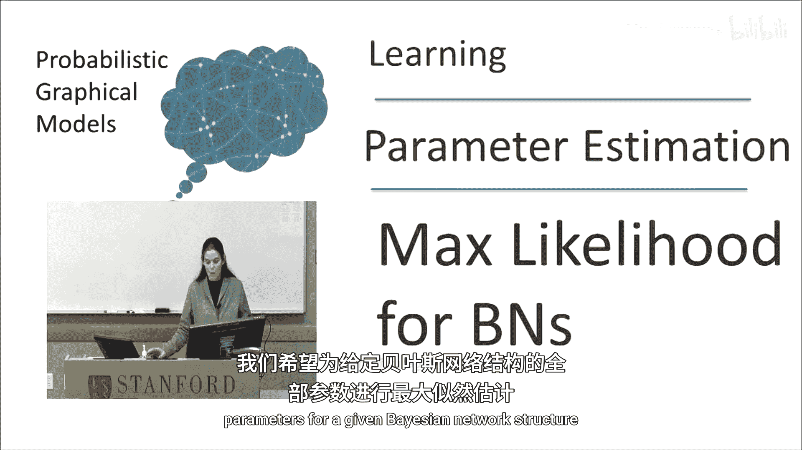
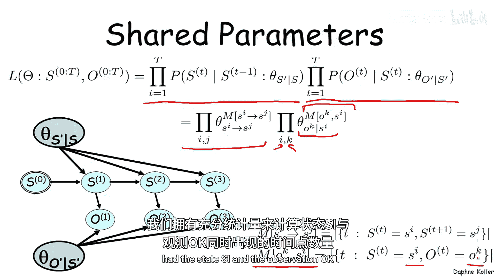
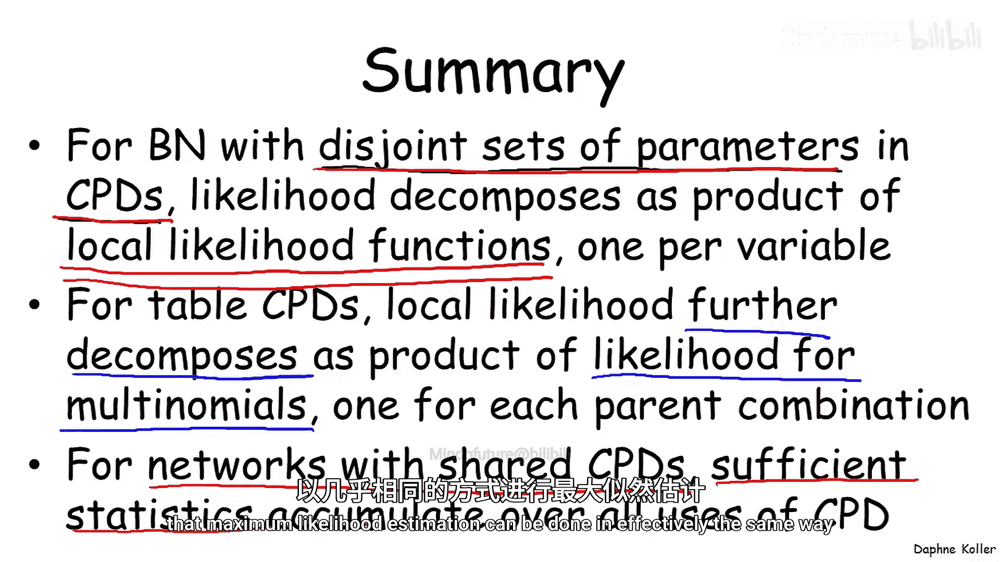
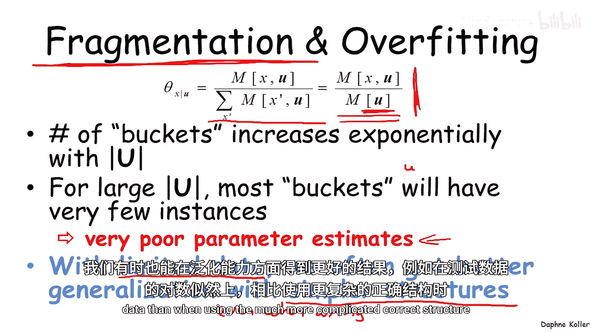

# 009：贝叶斯网络的最大似然估计 🎯

在本节课中，我们将学习如何对贝叶斯网络中的所有参数进行最大似然估计。我们将从单一参数的情况扩展到更复杂的网络结构，并探讨参数共享和数据碎片化等重要概念。

---

## 从单一参数到完整网络

上一节我们介绍了单一参数的最大似然估计原理。本节中，我们来看看如何对一个给定结构的贝叶斯网络中的所有参数进行最大似然估计。

考虑一个通用的贝叶斯网络，其变量不一定是二值的。参数集包括：
*   所有变量 `X` 的取值对应的参数 `θ_x`。
*   所有父节点 `X` 和子节点 `Y` 的取值对应的条件参数 `θ_y|x`。

这就是通用情况下，表格条件概率分布对贝叶斯网络的参数化。

---

## 似然函数的分解

现在思考参数集 `θ` 的似然函数。似然函数是给定参数下数据的概率，由于数据独立同分布，它可以分解为所有数据实例 `(x^m, y^m)` 相对于参数 `θ` 的概率乘积。

对于贝叶斯网络，我们可以利用链式法则将这个联合概率分解。在这个简单例子中，就是父节点 `X` 的概率乘以给定 `X` 时 `Y` 的条件概率。

通过重新排列乘积顺序，我们可以将似然函数分解为两个“局部似然”函数的乘积：
*   一个仅依赖于参数 `θ_x` 的变量 `X` 的似然。
*   一个仅依赖于参数 `θ_y|x` 的变量 `Y` 给定其父节点 `X` 的似然。

更一般地，对于一组变量 `X1` 到 `Xn`，我们可以重复这个过程。利用贝叶斯网络的链式法则，将每个数据实例的概率分解为每个变量 `Xi` 给定其父节点 `Ui` 的概率乘积。通过交换乘积顺序，我们再次得到一系列项的乘积，每一项被称为变量 `Xi` 的局部似然。

如果我们假设不同的条件概率分布不共享参数，那么每个条件概率分布都可以被独立地估计。这意味着我们可以通过优化这个局部似然项，来独立于其他变量地优化变量 `Xi` 的参数。

---

## 表格条件概率分布的进一步分解

对于表格条件概率分布，局部似然可以进一步分解。以下是分解步骤：

我们将数据实例按照变量 `X` 及其父节点 `U` 的具体取值 `(x, u)` 划分到不同的“桶”中。对于每一个取值组合 `(x, u)`，我们收集所有满足该组合的数据实例 `m`。

对于这些实例，概率 `P(X^m = x | U^m = u)` 就是条件概率分布中对应的条目 `θ_x|u`。因此，局部似然函数变成了所有可能 `(x, u)` 组合的乘积，其中每个参数 `θ_x|u` 被提升到其在数据中出现次数 `M[x,u]` 的幂次。

于是，最大似然估计的结果正如我们所料：
**公式：** `θ̂_x|u = M[x,u] / M[u]`
其中 `M[u]` 是父节点取值为 `u` 的总次数。

---

## 具有共享参数的模型：以隐马尔可夫模型为例

现在考虑参数共享模型的最大似然估计。我们首先在一个马尔可夫链的背景下分析，然后扩展到隐马尔可夫模型。

对于一个仅包含状态变量 `S` 的马尔可夫链，其似然函数在马尔可夫假设下，可以分解为从时间 `1` 到 `T` 的状态转移概率的乘积。

我们可以进一步按特定的状态对 `(Si, Sj)` 来重组这个乘积。关键点在于，由于模型的时间不变性，从 `Si` 转移到 `Sj` 的概率在任何时间点都是相同的参数 `θ_Si->Sj`。

因此，似然函数最终变为所有状态转移参数 `θ_Si->Sj` 的乘积，每个参数被提升到其充分统计量——即数据中观察到从 `Si` 转移到 `Sj` 的次数 `M[Si->Sj]`——的幂次。

此时，参数 `θ_Si->Sj` 的最大似然估计为：
**公式：** `θ̂_Si->Sj = M[Si->Sj] / Σ_k M[Si->Sk]`

现在将其扩展到隐马尔可夫模型。除了与之前相同的状态转移似然项，我们还增加了观测似然项，即每个时间点给定状态 `S_t` 下观测到 `O_t` 的概率。

采用相同的重组过程，我们得到两个部分的乘积：
1.  状态转移部分：`∏_ij (θ_Si->Sj)^(M[Si->Sj])`
2.  观测发射部分：`∏_ik (θ_O=k|S=i)^(M[S=i, O=k])`

这里新增的充分统计量 `M[S=i, O=k]` 统计了在相同时间点，状态为 `i` 且观测为 `k` 的次数。

---

## 核心要点总结

本节课中我们一起学习了贝叶斯网络最大似然估计的核心思想和方法。

以下是主要结论：

*   **似然函数分解**：对于条件概率分布参数互不重叠的贝叶斯网络，其似然函数可分解为每个变量对应的**局部似然函数**的乘积。这使得我们可以分别优化每个变量。
*   **表格条件概率分布的分解**：当使用表格条件概率分布时，局部似然可进一步分解为每个父节点取值组合对应的多项分布的似然乘积。这允许我们像估计单一多项分布参数一样，独立地估计每一个条件概率分布条目。
*   **共享参数的处理**：对于具有共享条件概率分布的模型（如隐马尔可夫模型），我们只需在所有使用该分布的地方**累积充分统计量**，然后以相同的方式进行最大似然估计。

---

## 一个重要问题：数据碎片化

从最大似然估计的形式 `θ̂_x|u = M[x,u] / M[u]` 中，我们可以观察到一个重要现象，这在应用时需要谨记。

当父节点的数量增加时，可能的父节点取值组合 `u` 的数量会呈指数级增长。这意味着我们需要将数据划分到的“桶”的数量急剧增加。

其后果是，大多数“桶”（即大多数父节点取值组合 `u`）中只会分配到极少甚至为零的数据实例。此时，基于 `M[u]` 进行的任何参数估计都将是不可靠的。当父节点很多时，大多数多项分布参数的估计质量都会很差。

这个概念被称为**数据碎片化**。它带来了一个重要启示：**当数据量有限，相对于模型复杂度（维度）不足时，使用更简单的模型结构（即使它做出了错误的独立性假设，即删除了本应存在的边）有时能在测试数据的对数似然等指标上，获得比使用更复杂但正确的结构更好的泛化性能。** 这是因为简单模型参数更少，每个参数能从更多数据中学习，从而得到更稳健的估计。