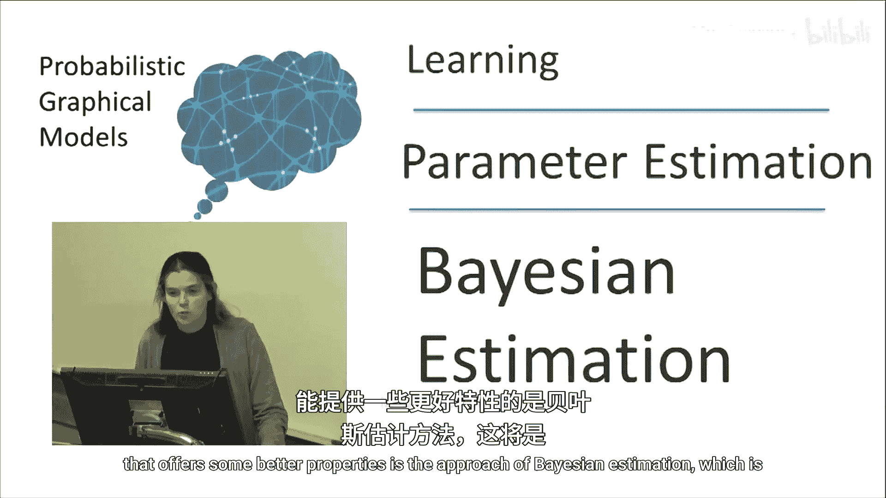
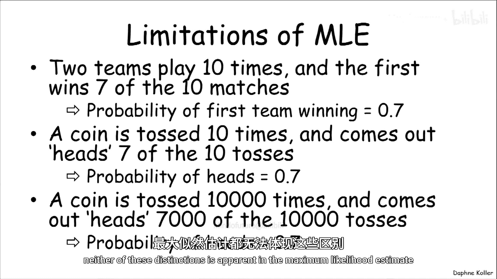
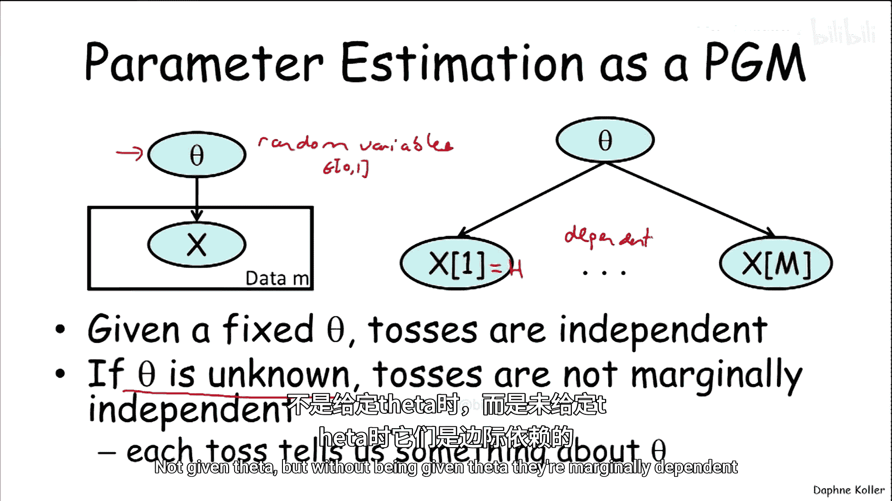
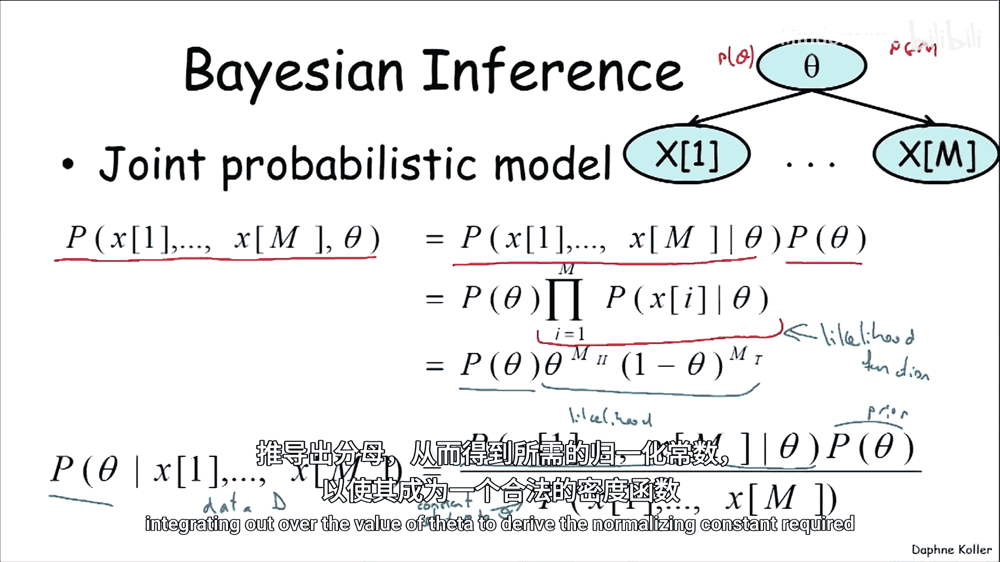
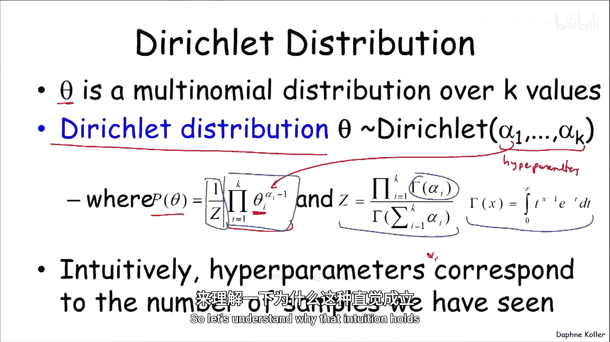
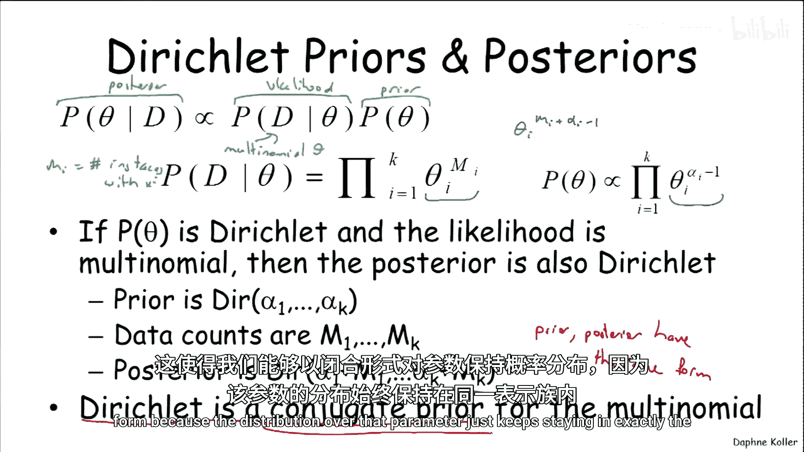
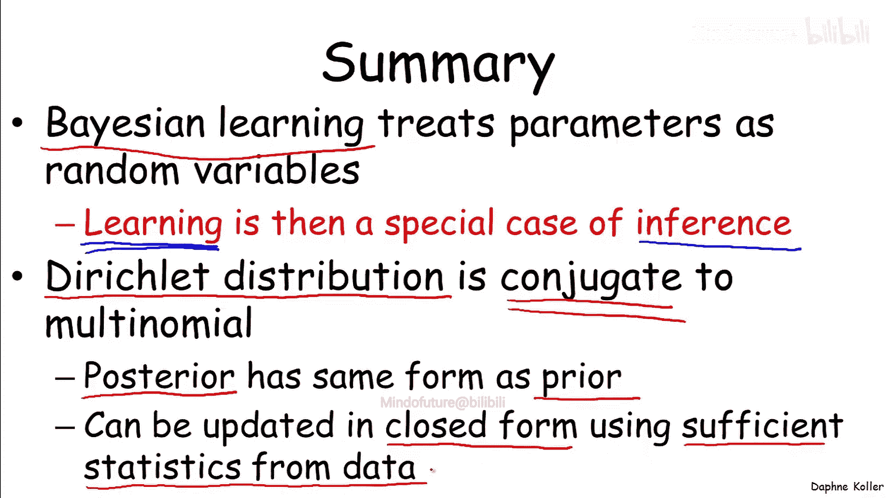

# 010：贝叶斯估计

在本节课中，我们将要学习参数估计的另一种方法——贝叶斯估计。我们将探讨它如何克服最大似然估计的某些局限性，并理解其核心概念与计算过程。

## 概述

上一节我们介绍了最大似然估计，它试图优化给定参数下数据的似然性。本节我们将讨论一种提供更好特性的替代方法——贝叶斯估计。

## 最大似然估计的局限性

首先，我们需要理解为什么最大似然估计并不完美。

考虑以下两个场景。在第一个场景中，两支球队比赛了10次，第一支球队赢了7场。如果我们使用最大似然估计，第一支球队获胜的概率是0.7，这看起来是一个合理的预测。

在第二个场景中，我们从口袋里拿出一枚硬币，抛掷10次，其中7次正面朝上。最大似然估计会得出完全相同的估计值，即下一次抛掷出现正面的概率也是0.7。然而，仅基于这10次抛掷的结果做出这样的推断似乎不那么合理。

为了进一步阐述这个场景，想象我们拿着同一枚硬币，耐心地抛掷了10，000次，并且确实有7，000次正面朝上。此时正面的概率仍然是0.7，但相比之前只有10次抛掷的情况，这个推断现在可能更可信。

最大似然估计完全没有能力区分这三种场景：一种是熟悉的情况（如两支球队比赛），另一种是不熟悉的事件（如抛硬币）；以及抛硬币10次与抛硬币10，000次之间的区别。这些区别在最大似然估计中都不明显。

## 贝叶斯估计框架

为了提供一个替代的形式化方法，我们将回到将参数估计视为概率图模型的观点。

在这个模型中，我们有参数 θ，数据依赖于参数 θ。但与之前只试图找出最可能的 θ 值不同，现在我们将采用一种截然不同的方法：我们假设 θ 本身是一个随机变量。它是一个连续值随机变量，在抛硬币的例子中，其取值范围在 [0,1] 之间。这是贝叶斯形式化的核心：任何我们不确定的事物，都应被视为一个随机变量，我们对其维持一个概率分布，并随着数据的获取而更新。

### 与最大似然估计的对比

让我们理解这种观点与最大似然估计观点的区别。

和以前一样，给定 θ，抛掷结果是独立的。但现在我们明确将 θ 视为随机变量，如果 θ 未知，那么抛掷结果在边际上就不是独立的。例如，如果我们观察到 x1 等于正面，这会告诉我们一些关于参数的信息，会增加我们相信参数偏向正面而非反面的概率，从而会改变我们对其他硬币抛掷结果的概率估计。因此，在未给定 θ 的情况下，硬币抛掷结果是边际依赖的。

这实际上给了我们一个关于所有硬币抛掷结果和参数的联合概率模型。使用我们在此绘制的概率图模型，我们可以通过该贝叶斯网络的链式法则分解这个概率分布。

我们得到 P(θ)，这是网络根节点的参数先验分布，然后是给定 θ 下 x 的概率。由于网络结构，给定 θ 时它们是条件独立的。因此，我们可以将其分解为 θ 的先验乘以各个数据点在给定 θ 下的概率的乘积。

后面这部分正是我们之前熟悉的似然函数，即给定参数下数据的概率。在抛硬币的例子中，我们已经知道其形式为：`θ^(正面次数) * (1-θ)^(反面次数)`。

但现在我们多了一个项：P(θ)，即我们从 θ 的先验分布中得到的概率。现在，由于我们有了先验分布，实际上也有了联合分布，我们可以继续计算给定数据集 D 后，参数 θ 的后验分布。

在观察了 M 次硬币抛掷的结果后，我对参数有了一个新的概率分布。通过简单的贝叶斯规则应用，后验分布等于似然函数乘以先验分布，再除以数据的概率。重要的是，正如在其他贝叶斯规则应用中一样，分母是一个归一化常数。

这里的“常数”是相对于 θ 而言的。这意味着如果我知道如何计算分子，我可以通过对 θ 的值进行积分来推导分母，从而得到使这个密度函数合法的归一化常数。

## 狄利克雷分布

当我们的参数描述了一个在 K 个不同值上的多项分布（例如参数 θ）时，最常用的参数分布是所谓的**狄利克雷分布**。

狄利克雷分布由一组称为**超参数**的 α1 到 αK 来刻画。这是为了与实际参数 θ 区分开来。

使用这些超参数定义的概率分布是 θ 的一个密度函数 P(θ)，其形式如下。让我们先看依赖于参数 θ 的这部分。我们看到，对于多项分布中的每个条目 θ_i，我们有一个形式为 `θ_i^(α_i - 1)` 的表达式，其中 α_i 是相关的超参数。

为了使这是一个合法的密度函数，我们还需要一个归一化常数（配分函数），其形式如下（我们暂时不深入讨论），它是这些伽马函数之比的比值。伽马函数由以下积分定义。目前，我们不需要担心这个，因为我们现在真正关心的是内部表达式的形式，知道它需要被归一化以产生密度。

直观上，这些超参数 α 对应于我们迄今为止看到的样本数量。让我们理解为什么这种直觉成立。

## 狄利克雷分布示例

但在深入之前，让我们看几个狄利克雷分布的例子。这是一个特殊情况，即随机变量只有两个值，所以它实际上是伯努利随机变量的分布。在这种情况下，狄利克雷通常被称为 Beta 分布，但 Beta 分布只是具有两个参数的狄利克雷分布。

这里有几个狄利克雷（Beta）分布的例子。绿色线是 Dir(2,2)，我们注意到它在中间有一个峰值，这对应于参数围绕中心值 0.5 的更强信念。当我们转到 Dir(5,5) 时，峰值变得更大。随着我们获得的数据量及其混合比例的变化，这个分布会向左或向右移动。随着数据越来越多，分布变得越来越尖锐。

粗略地说，α_正面 和 α_反面 之间的混合比例决定了峰值的位置，而 α 的总和决定了分布的尖锐程度。

## 后验分布计算

现在我们对狄利克雷分布有了一些了解，让我们看看在获得数据后它是如何更新的。

考虑一个情况，我们有一个先验分布，假设是狄利克雷分布。我们有一个从多项分布导出的数据集 D 的似然函数。现在我们想计算在观察到数据 D 后，参数 θ 的后验分布 P(θ|D)。

似然函数我们之前已经见过，对于具有 M_i 个取值为 x_i 的实例的数据集，其形式为：`∏_i θ_i^(M_i)`。

先验具有狄利克雷分布的形式，带有相关的超参数 α_i。

观察这一点很重要：似然函数中的 θ_i 项和先验中的 θ_i 项具有完全相同的指数形式。因此，当将似然函数与先验相乘时，你可以合并同类项（那些以 θ_i 为底的指数项），最终得到的后验分布看起来也完全像一个狄利克雷分布，因为它将具有形式：`∏_i θ_i^(M_i + α_i - 1)`。

所以，如果我们的先验是 Dir(α1, ..., αK)，数据计数为 M1, ..., MK，那么后验分布就简单地是一个具有超参数 (α1 + M1, ..., αK + MK) 的狄利克雷分布。

这再次表明，狄利克雷分布的超参数代表了我们所见到的计数。如果先验地，我们看到 X 的计数是 α_i，现在我们又看到了额外的 M_i 次计数，那么在后验中，我们对于该特定事件的总计数就是 α_i + M_i。

## 共轭先验

从形式的角度来看，这是一个有用的术语：先验和后验具有相同形式的情况被称为**共轭**。因此，在这种情况下，狄利克雷分布是多项分布的共轭先验，因为如果我们有狄利克雷先验和多项似然，我们会得到狄利克雷后验。

事实证明，许多参数族都有一个很好的共轭先验，它允许我们以封闭形式维护参数上的概率分布，因为该参数的分布始终保持在同一表示族中（在此例中是狄利克雷族）。

## 总结

本节课中我们一起学习了贝叶斯学习的框架。

贝叶斯学习将参数视为随机变量（连续值随机变量），这使我们能够将学习问题重新表述为一个简单的推断问题。我们所做的是获取随机变量上的分布，并使用证据（即观察到的训练数据）来更新它。

具体来说，在离散随机变量的背景下，我们有多项分布作为似然函数，狄利克雷分布作为先验。我们遇到了这种非常优雅的情况：狄利克雷先验与多项分布是共轭的，这意味着后验与先验具有相同的形式。

这反过来又允许我们以封闭形式保持参数的分布，并且在我们不断更新它的过程中，其形式始终保持不变。该更新过程使用数据的充分统计量，通常以非常高效的形式进行。

