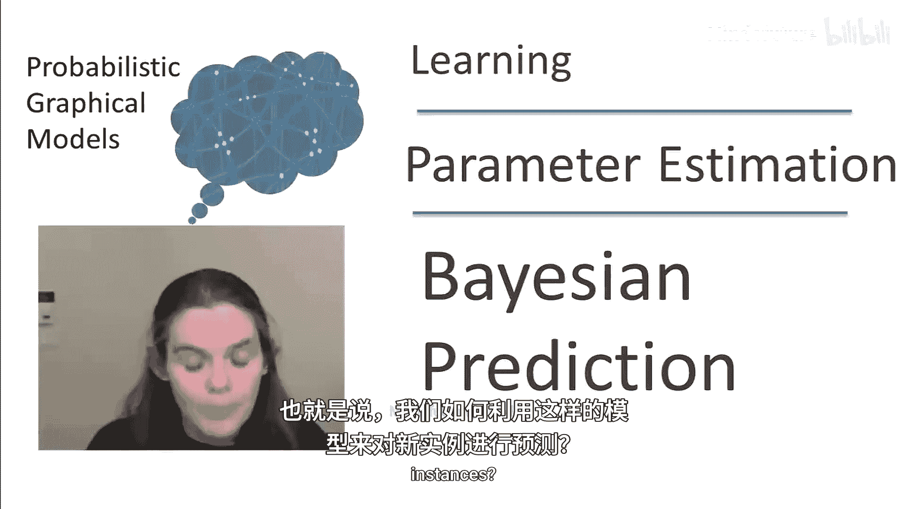
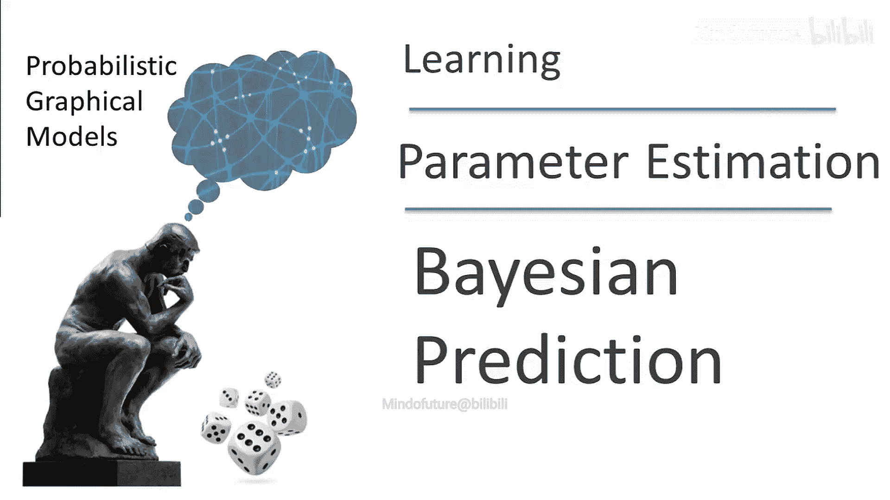
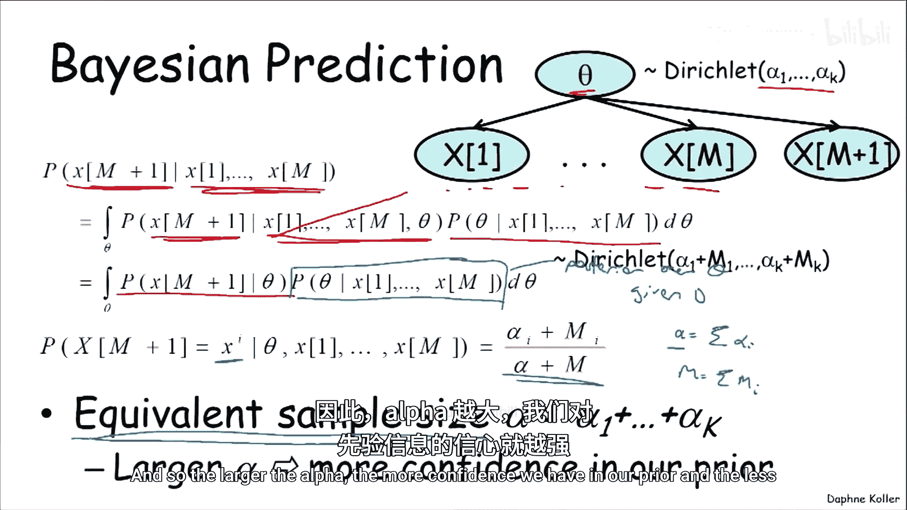
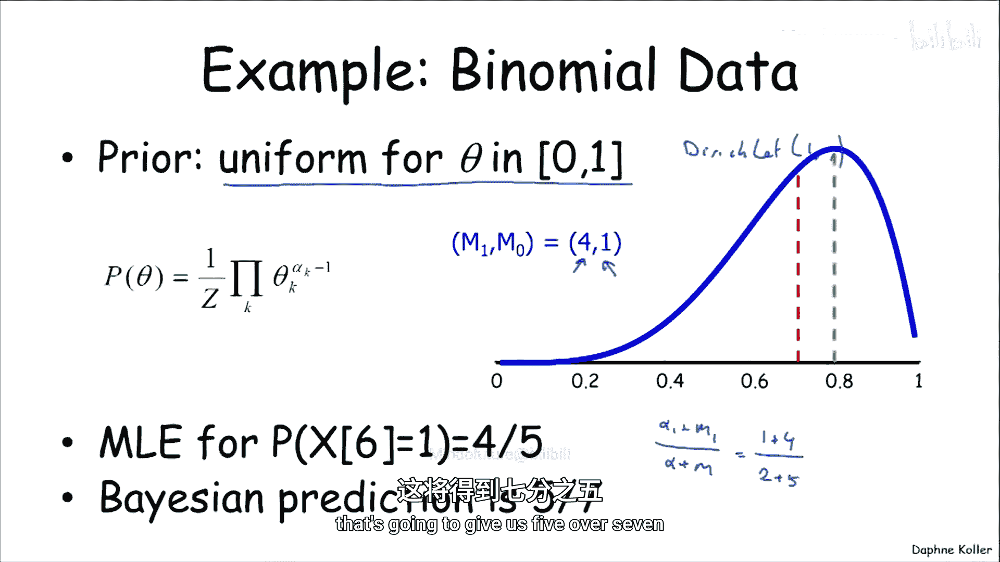
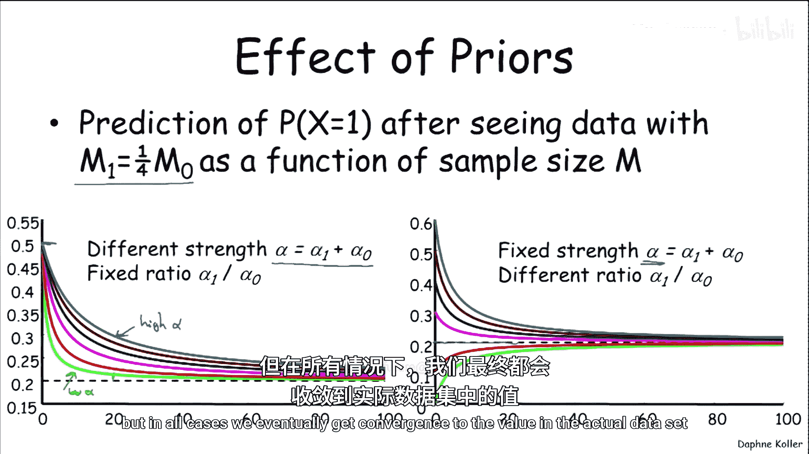
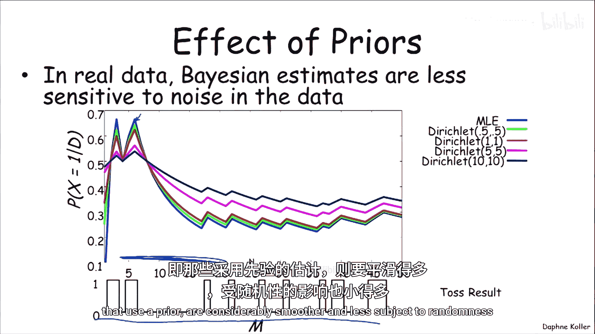
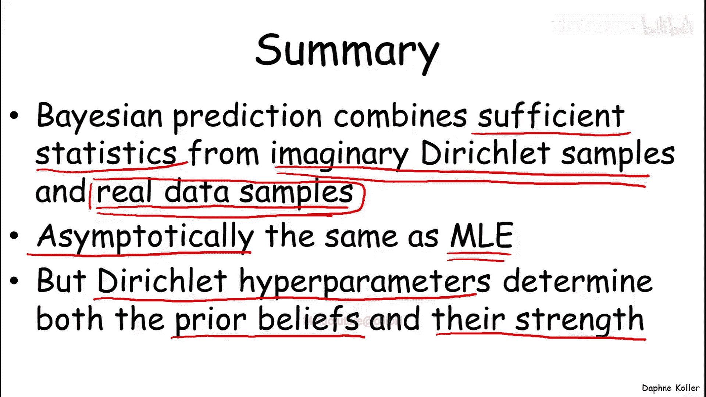

# 概率图形模型3：学习：P11：贝叶斯预测



在本节课中，我们将要学习贝叶斯预测。我们将探讨如何在拥有参数分布（如狄利克雷分布）的模型中进行预测，理解先验信念如何影响预测，并观察随着数据量的增加，预测如何收敛到最大似然估计的结果。



## 概述

上一节我们定义了贝叶斯估计的概念，即在参数上有一个先验分布，并随着新数据的积累持续维护参数的后验分布。本节中，我们来看看如何利用这种包含参数分布的模型来对新实例进行预测。

## 使用参数分布进行预测

假设我们有一个模型，其参数θ服从一个具有特定超参数集的狄利克雷分布。如果我们想对依赖于参数θ的变量X的值进行预测，这本质上就变成了一个概率推断问题。

变量X取某个特定值`x_i`的概率，等于给定参数θ时X取该值的概率，乘以θ的先验分布，然后对θ的所有可能值进行积分（即边缘化）。

用公式表示如下：

```
P(X = x_i) = ∫ P(X = x_i | θ) * P(θ) dθ
```

对于狄利克雷-多项式模型，这个积分的结果是一个简洁的表达式：

```
P(X = x_i) = α_i / Σ_j α_j
```

其中，`α_i`是狄利克雷分布的超参数。这个结果非常直观：对新实例的预测值，就是对应于该结果的超参数`α_i`占所有超参数总和的比例。这再次印证了超参数可以被视为“伪计数”的直观理解。

## 贝叶斯预测的动态过程

现在，我们把上述结果与数据积累的过程结合起来，看看贝叶斯预测如何随数据量的增长而变化。

假设参数θ初始服从超参数为`α`的狄利克雷分布。我们已经观测到M个数据实例`X_1, ..., X_M`，现在想要预测第M+1个数据实例。

我们要求解的是条件概率`P(X_{M+1} | X_1, ..., X_M)`。通过引入参数θ并利用条件独立性，我们可以将其推导为：

```
P(X_{M+1} | X_1, ..., X_M) = ∫ P(X_{M+1} | θ) * P(θ | X_1, ..., X_M) dθ
```

其中，`P(θ | X_1, ..., X_M)`正是给定前M个数据后θ的后验分布。正如前一节所示，这个后验分布本身也是一个狄利克雷分布，其超参数更新为`α_i + M_i`，其中`M_i`是观测到结果`i`的次数。

因此，对新实例`X_{M+1}`的预测公式变为：

```
P(X_{M+1} = x_i | X_1, ..., X_M) = (α_i + M_i) / (α + M)
```

这里，`α = Σ_i α_i`，`M = Σ_i M_i`。



### 等效样本量的作用

参数`α`（所有超参数`α_i`之和）被称为**等效样本量**。它代表了在接收到真实数据`X_1, ..., X_M`之前，我们想象中的先验样本数量。

`α`的大小决定了先验信念的强度：
*   **`α`较大**：表示我们对先验有很强的信心，真实数据需要更多才能将我们的估计从先验值“拉”开。
*   **`α`较小**：表示先验信念较弱，即使数据量不大，我们的估计也会迅速接近数据中观察到的经验频率。

## 示例：伯努利试验预测



让我们通过一个简单的伯努利试验（如抛硬币）例子来具体理解。

*   **先验**：我们选择一个均匀先验，即认为正面概率θ在[0,1]上均匀分布。这对应于一个超参数为`α = [1, 1]`的狄利克雷分布。
*   **数据**：我们观测到5次抛掷，结果是4次正面(`M_1=4`)，1次反面(`M_0=1`)。
*   **预测下一次抛掷**：
    *   **最大似然估计**：直接使用观测频率，预测正面概率为 `4/5 = 0.8`。
    *   **贝叶斯估计**：使用公式 `(α_1 + M_1) / (α + M) = (1+4)/(2+5) = 5/7 ≈ 0.714`。

可以看到，贝叶斯估计的结果（0.714）被先验（0.5）“拉”向了中间，不像最大似然估计（0.8）那样完全依赖少量数据。

### 可视化影响

以下是不同条件下预测值随数据量增加而变化趋势的定性描述：

**1. 固定数据比例，改变先验强度(`α`)**：
假设观测数据中正反面的比例固定为1:4。
*   当`α`较小时（先验弱），只需少量数据，预测值就会迅速接近数据中的经验比例（0.2）。
*   当`α`较大时（先验强），需要更多的数据才能将预测值从先验值（0.5）“拉”向经验比例（0.2）。

**2. 固定先验强度(`α`)，改变先验均值**：
假设等效样本量`α`固定。
*   我们从不同的先验均值（例如，认为正面概率是0.8或0.2）开始。
*   随着数据积累，所有预测最终都会收敛到数据中的经验比例（0.2）。
*   初始先验离经验比例越远，收敛所需的数据量就越大。



## 贝叶斯预测的优势：平滑性与鲁棒性

从实用角度看，贝叶斯估计提供了一种**平滑性**。数据的随机波动不会像在最大似然估计中那样引起预测值的剧烈跳跃，尤其是在数据量较少的阶段。

例如，在抛硬币实验中，最大似然估计的预测线（蓝色）在数据量少时会围绕真实值大幅上下波动。而使用了先验的贝叶斯估计预测线则平滑得多，对随机噪声不那么敏感。这使得贝叶斯方法在**数据稀疏**的情况下具有更好的**泛化能力**和**鲁棒性**。



## 总结

本节课中我们一起学习了贝叶斯预测的核心思想。

贝叶斯预测结合了两种“充分统计量”：
1.  来自**真实数据**的统计量（`M_i`）。
2.  来自构成先验分布的**想象样本**的统计量（超参数`α_i`）。

预测新实例时，贝叶斯方法有效地结合了这两者：`P(next instance) ∝ α_i + M_i`。

随着数据量无限增加（渐近极限），真实数据项`M`将占据主导地位，先验的贡献会变得微不足道。因此，在极限情况下，贝叶斯预测会收敛到与最大似然估计相同的结果。

然而，在学习的早期阶段，即数据量还很少的时候，先验信念会产生相当显著的影响。狄利克雷超参数`α`不仅决定了我们初始的信念，也决定了这些信念的强度——即需要多少数据才能让经验分布的影响力超过先验。



最重要的是，正如我们在简单例子中看到的，这种贝叶斯学习范式在数据稀疏的情况下，因其平滑性和结合先验知识的能力，通常比单纯依赖数据频率的方法具有更强的鲁棒性和更好的泛化性能。