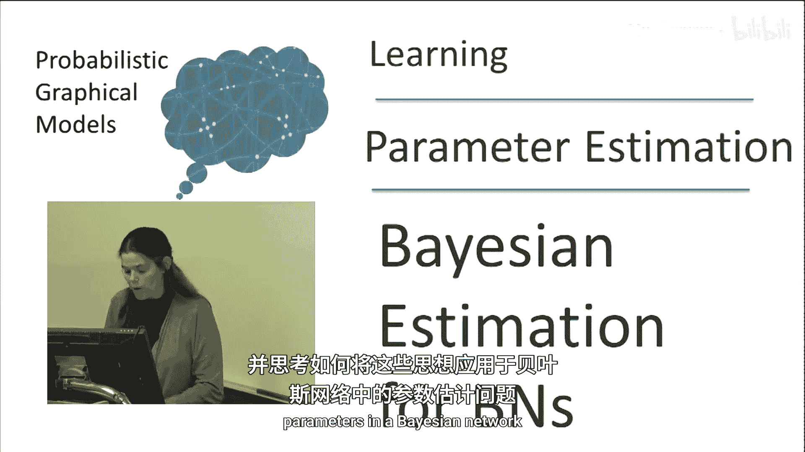
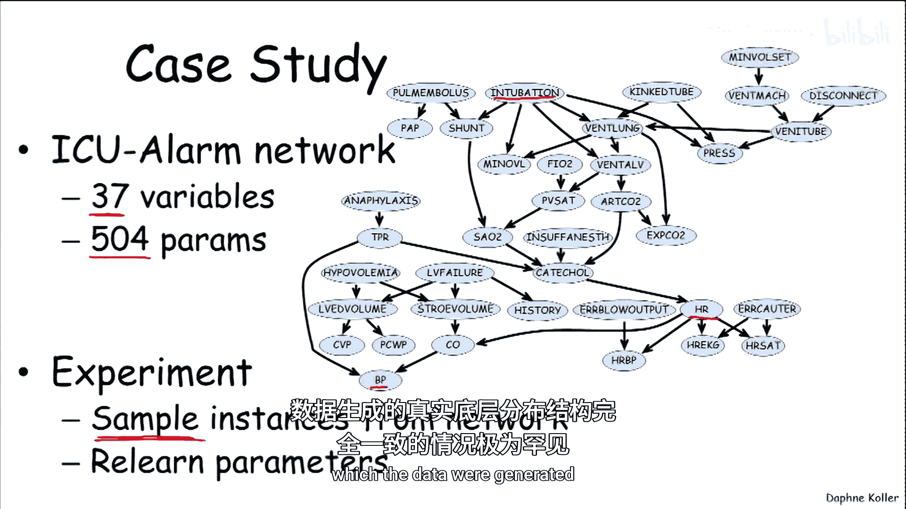
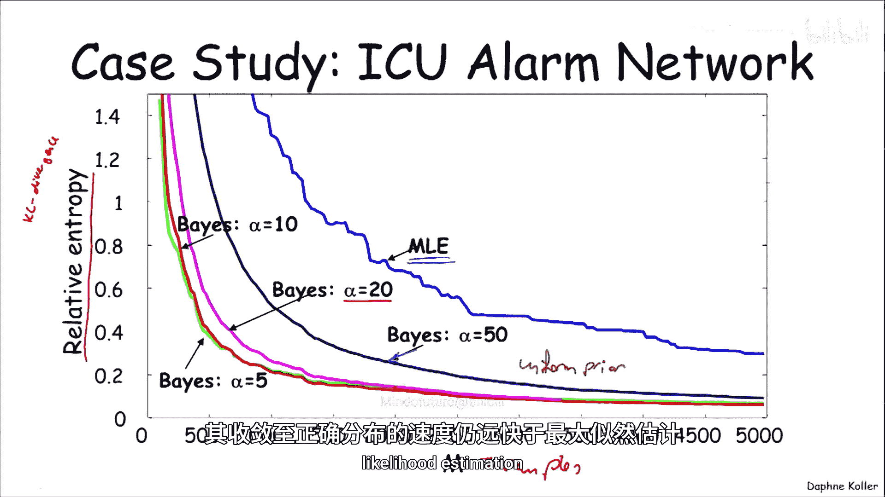
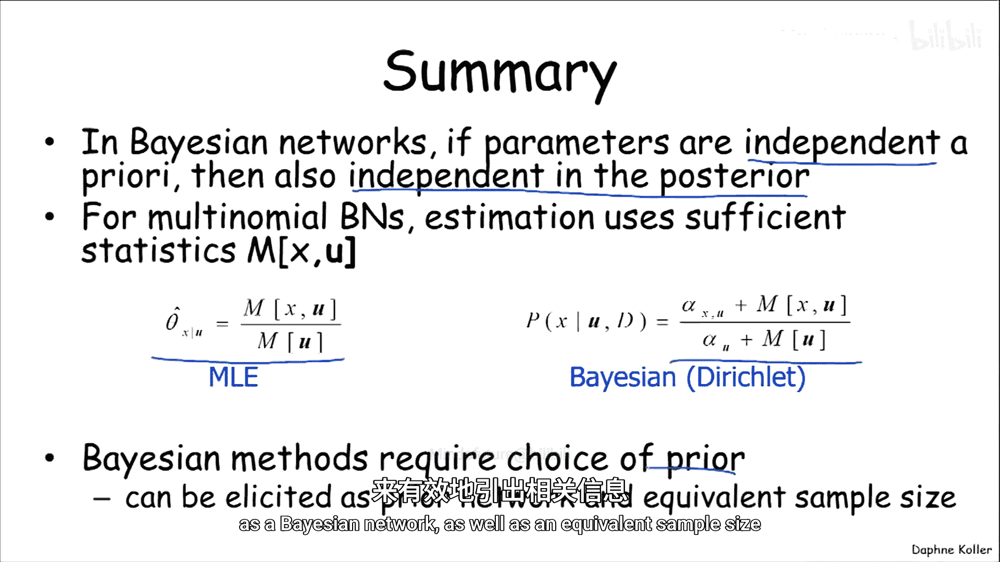

# 概率图模型：3：贝叶斯网络的贝叶斯估计 📊

在本节课中，我们将学习如何将贝叶斯估计的思想应用于贝叶斯网络的参数估计问题。我们将看到，在特定假设下，参数的后验分布可以分解为独立部分的乘积，这使得计算变得高效。我们还将探讨如何为网络中的所有参数设置先验分布。

## 从单变量到贝叶斯网络 🔄

上一节我们介绍了单变量（如多项式随机变量）的贝叶斯估计。现在，我们将回到概率图模型的世界，思考如何将这些思想应用于估计贝叶斯网络中的参数。

让我们再次画出表示贝叶斯网络中贝叶斯估计的概率图模型。与单变量情况类似，我们将把定义参数的随机变量显式地注入到模型中。这里我们有两个随机变量：**θ_X**（代表X的条件概率分布CPD）和 **θ_Y|X**（代表给定X时Y的CPD）。请注意，每个变量实际上都是向量值，因为每个CPD中都会有多个实际数值，但我们在图中用单个圆圈表示。

## 从图模型中读取结论 🔍

现在，我们可以观察这个网络并得出一些重要结论。

第一个重要结论是：**在给定参数的情况下，实例（即X，Y数据对）是相互独立的**。我们可以通过注意到，如果以 **θ_X** 和 **θ_Y|X** 为条件，那么X，Y数据对之间就变得相互独立（d-分离），因此条件独立性是图模型结构的直接结果。

第二个可以从图中直接读取的性质是：**θ_X 和 θ_Y|X 是边缘独立的**。因此，我们所有参数的先验可以写成每个CPD先验的乘积：
`P(θ) = ∏_i P(θ_{X_i})`，其中 i 遍历网络中的随机变量。

由此，通过写出图模型并观察表达式的含义，可以得出：**在给定完整数据的情况下，参数θ的后验也是独立的**。原因是完整数据“分离”了两个CPD的参数。例如，在这个网络中，如果我们观测到所有变量，可以看到 **θ_X** 和 **θ_Y|X** 之间没有有效路径（例如，X2阻断了从 **θ_X** 到 **θ_Y|X** 的路径）。

因此，后验分布可以分解：
`P(θ_X, θ_Y|X | D) = P(θ_X | D) * P(θ_Y|X | D)`
这意味着，就像最大似然估计可以将估计问题分解为分别估计每个CPD一样，我们在这里也可以做同样的事情，只不过现在使用的是贝叶斯估计。我们不是为CPD选择一个单一的参数设置，而是分别计算这些独立的后验，然后将它们组合成一个完整的后验。

## 表格CPD的进一步分解 📋

对于表格形式的CPD，我们可以进行更精细的分解。考虑一个简单情况，X是二值随机变量。那么CPD P(Y|X) 包含两个多项式：一个对应 `Y|X=1`，另一个对应 `Y|X=0`。

在这个模型中，我们假设先验中 **θ_Y|X=1** 和 **θ_Y|X=0** 是独立的（图中没有边连接它们，所以它们是边缘独立的）。可以证明，**在后验中它们也是独立的**。这一点证明起来稍微复杂一些，因为即使给定完整数据，图中也存在一个通过观测变量Y激活的有效V型结构路径。但如果我们回顾之前关于上下文特定独立性（特别是多路复用器CPD）的例子，可以推导出它们在后验中确实是条件独立的。

因此，后验可以再次写成乘积形式：
`P(θ_X, θ_Y|X=1, θ_Y|X=0 | D) = P(θ_X | D) * P(θ_Y|X=1 | D) * P(θ_Y|X=0 | D)`

## 推广到一般贝叶斯网络 🌐

我们可以将此推广到一般的贝叶斯网络。假设我们有一个具有表格CPD的贝叶斯网络，其参数形式为 **θ_X|u**，其中 u 是父变量 U 的某个取值。

如果对每个这样的多项式参数，我们都指定一个具有适当超参数 α 的狄利克雷先验，那么结合单变量多项式的后验分析，我们可以证明：**后验分布也是一个狄利克雷分布**，其超参数等于先验超参数加上数据中关于该子节点与其父节点特定组合的充分统计量（计数）。

具体公式如下：对于代表子节点值 `x` 和父节点取值 `u` 的多项式条目，其后验超参数为：
`α_{x|u}^{posterior} = α_{x|u}^{prior} + M[x, u]`
其中 `M[x, u]` 是数据中 `X=x` 且其父节点 `U=u` 的实例数量。

## 先验的来源与设定 🧭

既然我们知道了如何用数据更新先验以形成后验，接下来让我们思考先验从何而来。为贝叶斯网络中所有节点构建先验看起来可能令人望而生畏。

然而，存在一种通用方案，它既简单又具有良好的理论性质。该方案如下：

1.  定义一个**先验贝叶斯网络**，它具有一组参数 **θ⁰**。
2.  定义一个**等效样本大小 α**，它将应用于网络中的所有节点。
3.  为了指定超参数 **α_{x|u}**（对于赋值 `X=x` 和 `U=u`），我们只需计算在这个参数化先验网络 `P_θ⁰` 中 `X=x` 且 `U=u` 的概率，然后乘以等效样本大小 α：
    `α_{x|u} = α * P_θ⁰(x, u)`

在许多情况下，我们可以直接让 **θ⁰** 是均匀分布参数，这使得计算非常简单。这提供了一种简单、连贯的方式来同时指定所有超参数。

让我们看一个例子。假设我们有一个先验网络 `X → Y`，并且我们假设 X 和 Y 上的均匀分布，即 **θ⁰** 是均匀的。

现在，考虑我们实际想要估计参数的网络结构 `X → Y`（X和Y都是二值的）。那么：
*   **θ_X** 的先验是超参数为 `[α/2, α/2]` 的狄利克雷分布（因为均匀分布下 `P(X=0)=P(X=1)=1/2`）。
*   **θ_Y|X=0** 的先验是超参数为 `α * P_θ⁰(x=0, y)` 的狄利克雷分布。在均匀分布下，`P(x=0, y=0) = P(x=0, y=1) = 1/4`，所以超参数为 `[α/4, α/4]`。**θ_Y|X=1** 同理。

这种设定是合理的：它告诉我们，我们“看到”的X的样本数与Y的样本数在概念上是相关的（通过α联系），只是Y的样本需要根据X的取值进行划分。

## 贝叶斯估计的效果：一个示例 📉

让我们通过一个伪真实世界的例子，看看使用贝叶斯估计的效果。这里使用的是一个真实的“ICU警报网络”，用于监测重症监护室中的患者。该网络有37个变量，共504个参数。

我们没有真实数据，但可以从这个已知网络中采样实例，然后假装不知道其真实参数，尝试通过从样本中学习来恢复参数。这是一个比现实更干净的学习场景，因为数据恰好来自我们试图学习的网络结构本身。

上图展示了学习效果。X轴是样本数量，Y轴是学习到的分布与真实分布之间的距离（使用相对熵/KL散度，数值越小表示越接近）。

*   **蓝色线**对应**最大似然估计**。我们可以看到它非常锯齿状（波动大），并且始终高于其他所有线。即使有高达5000个数据点，它仍未接近真实分布。
*   **其他彩色线**对应**贝叶斯估计**（使用均匀先验网络，但不同的等效样本大小α）。
    *   绿色线（α=5）和橙色线（α=10）几乎重合，且远低于最大似然估计线。
    *   随着先验强度增加（α=50，深蓝色线），开始时性能稍差，但到了约2000个数据点，其表现已经接近α=5的情况。即使α=50这样较强的先验，其收敛到正确分布的速度也远快于最大似然估计。

这个例子表明，贝叶斯估计，即使是使用简单的均匀先验，也能通过结合先验知识，在数据量有限时提供更稳定、更准确的估计，并更快地收敛。

## 总结 📝

本节课中，我们一起学习了贝叶斯网络中的贝叶斯参数估计。

1.  **核心分解**：如果我们假设参数先验独立，那么它们在给定完整数据后的后验也独立。这使得我们可以将复杂的后验分布维护为单个参数后验的乘积，大大简化了计算。
2.  **计算方法**：对于多项式贝叶斯网络，我们可以使用与最大似然估计相同的充分统计量（即子节点值与父节点取值的计数）进行贝叶斯估计。
    *   最大似然估计公式：`θ_{x|u}^{MLE} = M[x, u] / M[u]`
    *   贝叶斯估计公式：`θ_{x|u}^{Bayesian} = (α_{x|u} + M[x, u]) / (∑_x‘ α_{x’|u} + M[u])`
    两者形式相似，但贝叶斯估计在分子分母中加入了先验超参数 α。
3.  **先验设定**：我们介绍了一种有效的先验获取方法，即通过指定一个先验贝叶斯网络分布和一个等效样本大小 α，来一致地生成所有必需的超参数。

通过结合先验知识与观测数据，贝叶斯估计为我们提供了一种在数据稀疏时更稳健、在数据充足时能快速收敛的参数学习框架。

